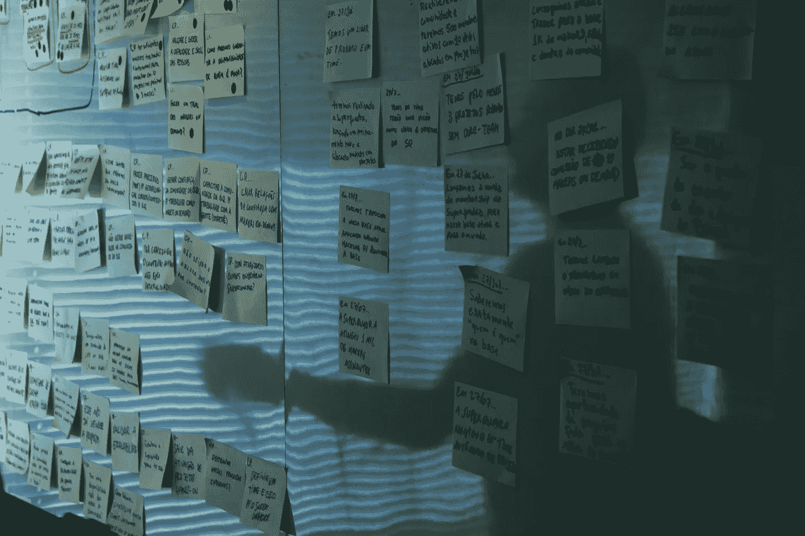
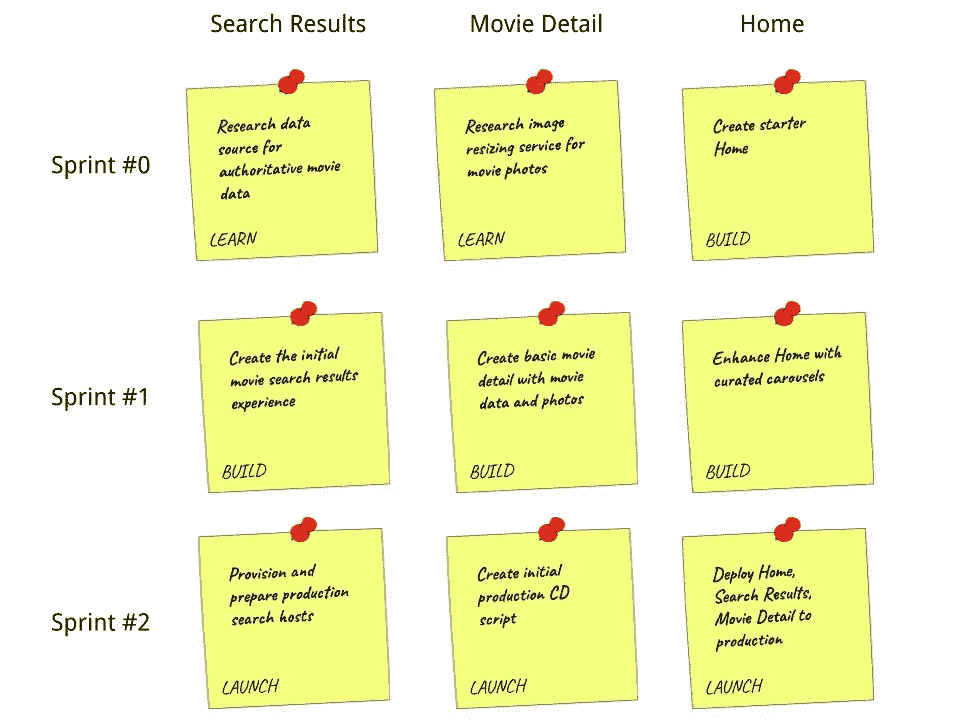

# 有效的敏捷:你把你的故事分类了吗？

> 原文：<https://betterprogramming.pub/effective-agile-do-you-categorize-your-stories-daad236f0f12>

## 用一个简单的分类模型来组织你的故事可以帮助你的团队保持专注并看到更大的画面

由 [Startaê Team](https://unsplash.com/@startaeteam?utm_source=unsplash&utm_medium=referral&utm_content=creditCopyText) 在 [Unsplash](https://unsplash.com/s/photos/post-it?utm_source=unsplash&utm_medium=referral&utm_content=creditCopyText) 上拍摄的照片

想象一下。

你正在参加团队的冲刺计划会议。产品经理正在解释要构建的下一个特性。这相当复杂，有许多关于技术做一些“神奇”行为的假设。在问完必须澄清的问题后，团队和你开始创造故事，扑克规划，并分配给个人。冲刺板是光荣的，充满了大量的故事。你准备好建造了，对吗？或者你准备好躲避刚刚确定的大量工作了吗？

如果你一直在实践敏捷，这应该是一个熟悉的场景。这是一个可行的脚本，但我建议对管理有时令人生畏的工作量进行改进——对您的故事应用分类模型。

# 什么是分类模型？

故事分类模型是一种组织方案，可以帮助您的团队理解故事的一般目的以及它在产品开发或软件开发生命周期中的关系。我使用了一个“学习、构建和启动”的故事模型，稍后我将对此进行更详细的解释。

如果你应用一个故事模型，你会意识到一些好处。

1.  **心理组织**——你的故事被组织成几个简单的类别，而不是一个大桶。你减少了高密度、高容量冲刺板带来的认知超负荷。
2.  专注 —你的工作范围更窄，每个故事都被正确分类，这有助于提高专注度。每次冲刺你都会获得“小胜利”,而不是希望在多次冲刺后出现“大胜利”。
3.  **减少阻碍因素** —您可以通过暴露已知和未知的未知因素的分类模型来消除或减少大量阻碍因素。没有阻碍，你的发展是不间断的和最佳的。

# “学习、构建、启动”

我使用一个基本的故事分类模型“学习、构建、发布”如果一个故事的主要活动是研究、原型或设计，我会将其归入“学习”类别。我给“建筑”类分配故事，惊喜吧，建筑材料。我将“启动”类别用于关注为成功部署准备系统的故事。

我想你可能想知道为什么这个基本的分类是有效的。它的简单就是它的力量。我见过团队使用“让我们先为这个做一个学习故事”这样的短语，帮助他们将更大、更复杂的故事分解成更小的故事。我还观察到团队习惯性地为预构建的必要条件创建“学习故事”,例如获得访问内部服务的凭证，以及与产品经理一起处理分析需求。

当团队在 sprint 规划期间考虑创建“学习故事”时，他们就不那么受阻了。如果他们首先开始故事的构建部分，他们就消除了可能出现的障碍。

我喜欢团队在接近发布产品时切换到发布模式。我们确定了 CI/CD 设置、操作控制面板、操作手册和主机配置等案例。当我将故事明确归类为“发布故事”时，团队知道我们正在切换到发布模式。

# 例子

我用一个假想的电影移动应用程序来说明我如何使用我的分类模型。下面是一个 sprint 板，包括房屋建筑、搜索结果和电影细节屏幕。

在第一个 sprint，Sprint #0 中，有几个学习故事，用于研究从哪里获取电影数据和调整图像大小服务。还有一个简单的主屏幕链接其他屏幕的构建故事。

使用故事分类模型的简单示例

在我们完成第一个 sprint 中的学习故事之后，我们可以构建搜索结果和电影细节屏幕。构建它们的工程师应该会有更少的障碍，因为他们已经在 sprint 之前研究了构建中更具挑战性的方面。在这个冲刺阶段，主屏幕可以包含更多内容，继续它的构建故事。

最后的冲刺是发射模式。将电影应用的第一次迭代发布到利益相关者和初始客户手中有三个故事。sprint 有 CI/CD 设置和主机配置的故事，以及实际的部署。

需要指出的一个细节是，分类模型交错排列了故事。在一个 sprint 中，您可以学习即将到来的 sprint 的构建，同时从以前的 sprint 学习中学习构建。如果您能够以正确的时间间隔计划工作，您的团队就能够以最佳的速度进行构建。

对你的故事进行分类是一个简单的改变，你可以对你的 sprint 计划进行改变，使你的团队更加有效。本着敏捷的精神，我鼓励你尝试一下。您可以使用我描述的模型，或者提出最适合您团队的模型。快乐大厦！