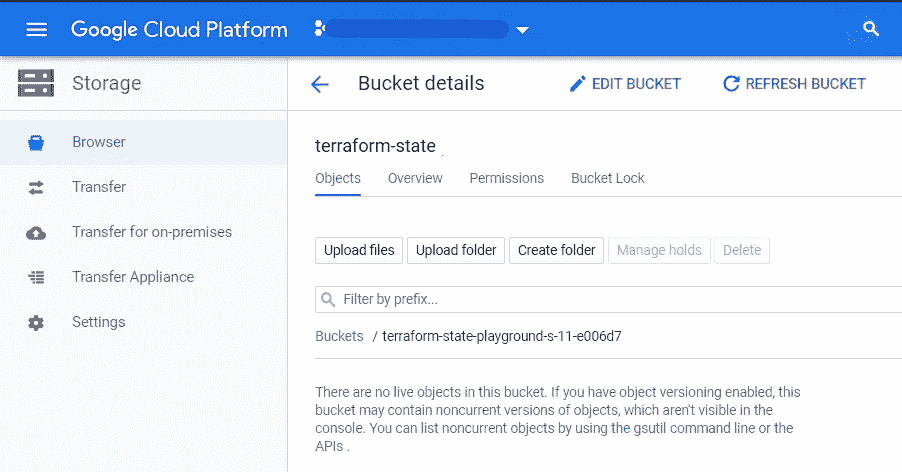
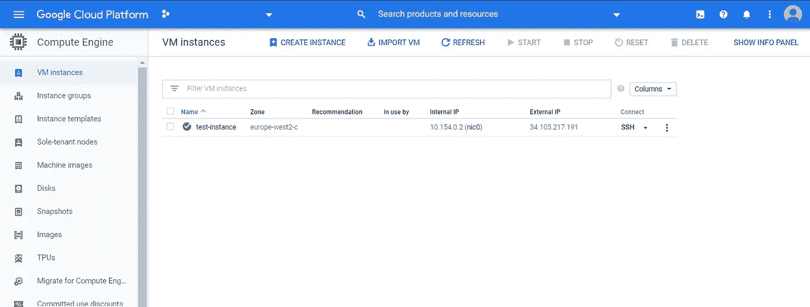
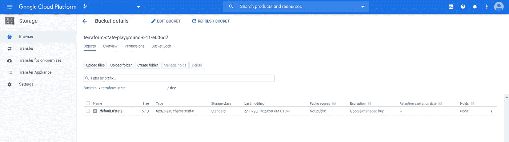

# 管理地形状态的有效方法

> 原文：<https://betterprogramming.pub/effective-ways-of-managing-your-terraform-state-44bc53043d5>

## 您的团队与远程状态后端的协作


由[安妮·斯普拉特](https://unsplash.com/@anniespratt?utm_source=unsplash&utm_medium=referral&utm_content=creditCopyText)在 [Unsplash](/collections/10474921/home-office?utm_source=unsplash&utm_medium=referral&utm_content=creditCopyText) 上拍摄

Terraform 是最流行的基础设施代码(IaC)工具之一。它不仅是最活跃的开源项目之一，而且也是最前沿的，每当 AWS 发布新服务时，Terraform 甚至在 AWS 的 CloudFormation 之前就已经准备好了资源。

Terraform 是一款*声明式* IaC 软件。这意味着管理员声明他们需要什么样的基础架构，而不是担心编写脚本来提供这些基础架构的细节。这使得 Terraform 非常容易学习和管理。

它非常灵活，支持多个云提供商。它可以扩展到任何云提供商都可以创建自己的提供商插件并发布给用户。然后，用户可以使用 HashiCorp 配置语言(HCL)脚本来模板化他们的基础架构部署，并以前所未有的方式自动化基础架构。

# Terraform 是如何工作的？

由于 Terraform 是一个声明性的 IaC 工具，它需要存储和维护一个状态。这对于理解预期配置和实际配置之间的差异是必要的。有人可能会说 Terraform 可能会查询云服务以匹配预期的设置，但这里有一个问题。

*   Terraform 如何知道有人从它以前应用的模板中删除了一个配置？
*   Terraform 如何理解一个云资源是否依赖于另一个云资源？例如，如果您在 EC2 实例上指定了一个 S3 存储桶的显式依赖关系，Terraform 需要知道它不能在不删除 EC2 实例的情况下删除 S3 存储桶。
*   如果多人在更改一个配置，Terraform 如何理解之前应用的是哪一个，如何跟踪不同的版本？可能会有两个人想要在团队中同时应用变更的情况。Terraform 锁定状态，因此一次只有一个人可以更改状态。
*   Terraform 状态也有助于提高性能，因为它充当所应用配置的本地版本，并且有助于加速计划。`terraform plan`在后台运行刷新 Terraform 您可以使用`--refresh=false`参数跳过这一步。

# 管理地形状态

有两种类型的 Terraform 状态后端—本地后端和远程后端。

本地后端是默认的 Terraform 配置，其中 Terraform 使用本地磁盘将状态配置存储在一个`terraform.tfstate`文件中。如果您是管理基础设施的唯一管理员，您不需要太担心状态，因为您可以使用本地系统作为状态后端。

如果有多人管理同一个基础设施，远程后端是绝对必要的。在这种情况下，您需要共享状态——因为您可能最终会取代对方的位置，并且随着人员数量的增加，复杂性会成倍增加。

这并不意味着如果你是一个独立的管理员，你就不应该使用远程后端。它允许将您的状态存储在一个安全的位置，比如一个 S3 桶，状态文件在这个桶中被加密。它也允许你通过互联网连接访问你的地形状态。您将 Terraform 配置存储在 git repo 中，并将状态存储在远程后端。

远程后端有两种形式。

*   标准:一个标准的后端提供了一个共享的位置来存储状态，并可能锁定状态。标准后端包括 AWS S3、谷歌云存储、Azure Blob 存储、Artifactory 等等。
*   **增强:**增强的远程后端提供了标准后端和远程操作。它们是 Terraform 云和 Terraform Enterprise。这些提供了一个远程平台计划，并申请更多的合作。

让我们看一个实际例子来更好地理解标准远程后端。

# 先决条件

让我们使用 GCS 桶，因为它是最简单的设置之一。在本练习中，您需要具备以下条件:

*   系统上安装的 Terraform 0.12
*   对 Google 云存储桶的读/写访问权限
*   具有创建 Google 计算引擎实例所需权限的服务帐户，以及它的 JSON 密钥。更多详细信息，请参考“[设置您的云环境](https://medium.com/better-programming/how-to-terraform-with-jenkins-and-slack-on-googles-cloud-platform-56c5e8b3aeeb#f1cb)”。

# 设置后端

对于这个例子，让我们从创建 GCE 实例的简单 Terraform 配置开始。

克隆此存储库

```
git clone [https://github.com/bharatmicrosystems/terraform-gce-instance-remote-state.git](https://github.com/bharatmicrosystems/terraform-gce-instance-remote-state.git)
cd terraform-gce-instance-remote-state
```

检查`provider.tf`文件。

这是一个简单的提供者文件，它使用 Google provider 并指定一个项目、区域和 service-account-credentials JSON 文件作为变量。

检查`instance.tf`文件

`instance.tf`文件在默认网络和子网中创建一个 GCE 实例，其 ACL 作用域为`storage-rw`。

检查`backend.tf`文件。

`backend.tf`文件声明了一个 GCS bucket 作为后端，并在配置中提供了`bucket`、`prefix`和`credentials`。

可选的`prefix`是 bucket 内部的 GCS 前缀。如果指定了，Terraform 会将状态存储为`<prefix>/<workspace>.tfstate`。如果不指定前缀，它将状态文件存储在 GCS bucket 的根级别。

您的用例可能需要其他可选属性。更多详情，请参考哈希公司官方文档[此处](https://www.terraform.io/docs/backends/types/gcs.html)。

请注意，您需要将值硬编码到后端配置中，因为您不能在初始化阶段传递变量。

用适当的变量值更新`terraform.tfvars`文件，例如:

让我们从一个全新的桶开始。



如你所见，这个桶里还没有东西。

# 应用更改

初始化地形的时间到了。

对，现在后端被初始化，提供者被下载。

让我们执行计划。

```
$ terraform plan
```

并且计划输出一个要添加的实例。

通过运行以下命令来应用计划:

```
$ terraform apply
```

您将看到`terraform apply`成功运行。

如果我们检查 GCE 控制台，我们会看到 Terraform 已经创建了一个实例。



该检查 GCS 桶了。



恭喜你！`default.tfstate`文件存在于`dev`文件夹中。

由于 GCS 对静态文件进行加密，这比将文件存储在本地系统中要安全得多。

# 结论

感谢阅读！我希望你喜欢这篇文章。

Terraform 为一个偏远的州提供了许多其他的选择，而且这些选择还在增加。在撰写本文时，有 14 种不同的远程后端选项，因此您可以根据最适合您的体系结构进行选择。