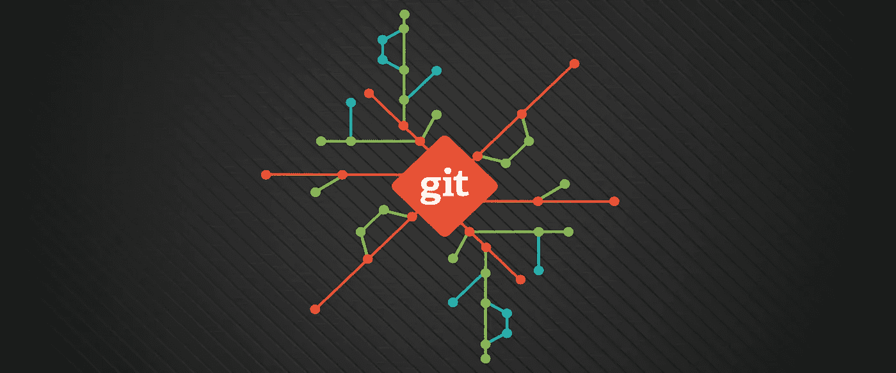
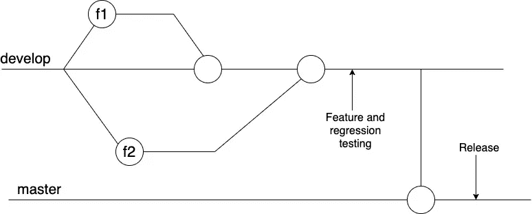
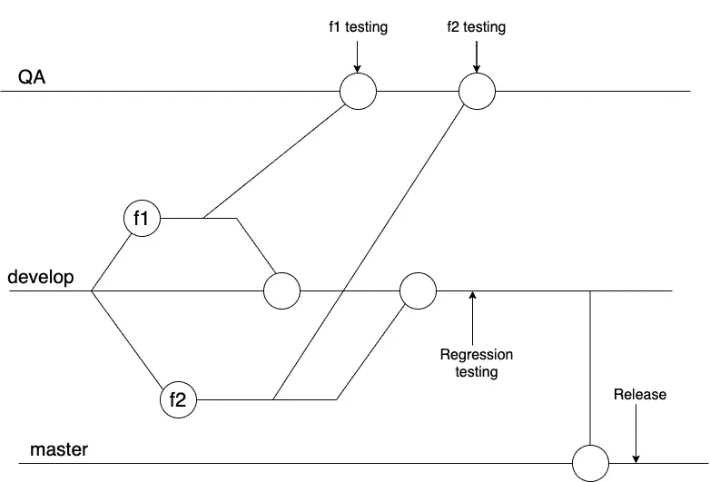

# 每个开发人员都应该知道的高效 Git 分支策略

> 原文：<https://betterprogramming.pub/efficient-git-branching-strategy-every-developer-should-know-f1034b1ba041>

## 完成的代码应该放在哪里？我们应该从哪里释放？

照片来自 [ITNEXT](https://itnext.io/become-a-git-pro-in-just-one-blog-a-thorough-guide-to-git-architecture-and-command-line-interface-93fbe9bdb395) 。

你的基地分支应该是`master`、`develop`，还是别的？让我们看一个你可能不熟悉的 git 分支策略。

# 什么是分支策略？

*   应该从哪个分支剪切特征分支？
*   代码完成后，您应该在哪个分支中为代码审查和测试提出一个 **MR** (合并请求)/ **PR** (拉请求)？
*   在完成测试和评审之后，这个特性分支应该合并到哪个分支中？

# 为什么重要？

*   从中剪切特征分支的分支应该是生产稳定的。
*   您不应该将有问题的/未测试的代码合并到生产分支(它将上线)。
*   在将您的代码合并到产品中时，您应该会遇到最小的合并冲突。

分支策略的目的是提高代码稳定性、开发人员的生产率，并避免不必要的冲突。

我不会涵盖所有类型的分支策略，但我会列出最常用的最佳策略。

将使用`master`、`develop`和`feature`分支。

# 掌握

*   我们可以称之为生产部门。经过充分测试的稳定代码就在这里。
*   这是上一个版本应该离开的分支，下一个版本也应该离开。
*   我们可以有发布这个分支的管道(也就是说，每当这个分支遇到一个新的合并时，管道会自动地将软件构建并部署到我们的生产服务器上)。
*   它应该只接受来自`develop`分支的合并。

# 发展

*   低于主级别的分支。
*   开始开发一个特性的开发人员从这个树枝上剪下一个新的树枝。
*   在开发/测试/代码审查完成后，他们将向同一个分支提交一个 MR，因为这是将在下一个版本中发布的分支。
*   在发布的时候，一个合并从这个分支到`master`分支。而`master`就是被释放的那个。

# 特征

*   从`develop`分出的一个分支，用于下一个版本中计划的功能。
*   通常，一个单独的开发人员在一个`feature`分支上工作。

拥有这三种类型的分支可以避免不必要的冲突，并提高团队的生产力。

# 质量保证测试

但是我们忽略了一件事:QA 测试。

QA 测试应该在哪个分支上进行？换句话说，应该将哪个分支部署到 QA 环境中？

最简单的方法是从 dev 分支**获得一个 QA 环境(**即 QA 服务器将通过从`develop`分支触发的构建来部署)。和 QA 签准后，可以将 MR/PR 提交给主分支机构。

两分支策略。

## 赞成的意见

*   在发布之前，每个变更都可以通过一次构建/部署进行测试(例如，可以一次完成所有特性的单个特性测试)。
*   后特性测试，这个分支最好进行回归测试，因为这个分支中的变化是为下一个版本计划的。

## 骗局

*   如果其中一个`feature`分支的变更有 bug，那么 QA 测试就会被阻塞，会浪费整个团队的带宽。

# 解决方法

## 第一种解决方案

等待功能所有者解决问题。将其合并到`develop`分支，重新部署到 QA，并恢复测试。但是这是不可行的，因为我们不确定修复一个特定的 bug 需要多少时间。

*   此外，QA 带宽正在被浪费。
*   发布阻止程序，以防没有该功能也能发布。
*   多个来回，以防 QA 在不同的特性中发现 bug。

## 第二种解决方案

恢复该特性的更改并继续测试。这种方法对于整个团队的生产力来说更好，但是对于特性所有者来说可能是痛苦的。如果他们恢复更改，将创建一个新的提交，恢复该分支中的所有更改。如果他们试图在修复后将其合并回来，git 将只考虑新的修复提交合并到`develop`，因为旧的提交已经在`develop`的提交历史中了。

为了解决这个问题，开发人员需要恢复恢复提交。

## 第三种解决方案

第三种也是最简单的方法是强制将`master`推到`develop`，重新合并其他的`feature`分支，并重新部署 QA。

第二种方式是我推荐的方式，关注整个团队的生产力。

## 最佳方法

我们可以用下面的方法来解决这个问题:为了测试的目的，再增加一个 QA 分支。QA 最好用`develop`更新。

因此，在这种情况下会增加一个额外的步骤，整个生命周期如下:

*   从`develop`上剪下一根树枝。
*   后期开发和开发测试，将 PR/MR 提交给 QA 进行代码审查。
*   后期代码评审，合并到 QA 分支。
*   QA 进行功能测试，签署后，您提交 MR/PR 进行开发。
*   进行第二轮评审(为了理智起见)或者让你的分支直接合并到`develop`，因为它已经被评审和测试过了。
*   每当`develop`发布就绪时(即所有的特性分支都被合并)，QA 触发一个构建来进行回归测试。这个构建可以在已经配置好的 QA 环境中运行。

三分支策略。

## 这种方法的好处

尽管这种方法看起来与前面的方法相似，并且添加一个额外的分支看起来没有好处，但它将有助于提高生产率，如下所示:

*   您可以从 QA 分支进行特性测试，从稳定的`develop`分支进行回归，合并当前版本中计划的所有特性。
*   `develop`会一直稳定，任何开发者都可以在任何时间点砍掉他们的`feature`分支。
*   你不会滥发`develop`分支的提交历史。
*   如果 QA 面临任何`feature`分支的问题，那么您可以修复它，如果该特性独立于其他特性，则无需恢复就可以推送。
*   修补程序:在任何产品问题的情况下，从`master`切下一个分支，修复它，然后发布。

# 结论

感谢 [Jashan Preet Singh](https://medium.com/u/eca81dc58b9e?source=post_page-----f1034b1ba041--------------------------------) 对本文的贡献。
感谢阅读。编码快乐！