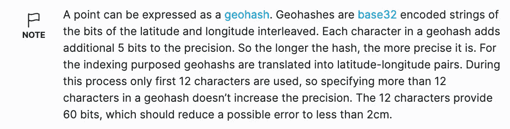
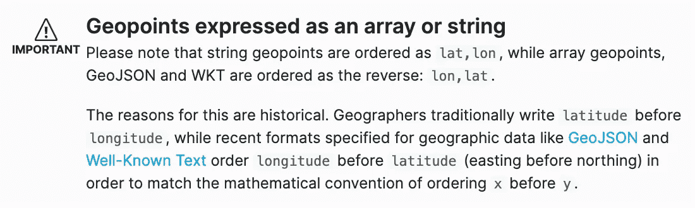

# 弹性搜索中按距离有效排序地理点

> 原文：<https://betterprogramming.pub/efficiently-sort-geo-points-by-distance-in-elasticsearch-b5c04c09bf24>

## 查询地理距离

照片由 [Z](https://unsplash.com/es/@dead____artist?utm_source=unsplash&utm_medium=referral&utm_content=creditCopyText) 在 [Unsplash](https://unsplash.com/s/photos/distance-map?utm_source=unsplash&utm_medium=referral&utm_content=creditCopyText) 拍摄

在搜索中有很多计算两点间距离的用例。如果你正在处理地理数据，不管你从事什么行业，这是必然会出现的。然后你可能需要在排序这些点的时候考虑距离，因为…为什么不呢？

这里有几种不同的方法可以做到这一点。虽然我试图尽可能详细地解释一切，但我假设您对 Elasticsearch 及其基本查询有一个初学者的理解。

# 树立我们的榜样

对于这个例子，让我们假设我们是一家食品配送创业公司。可能是像 Uber Eats 或者 DoorDash 之类的。

我们有一个移动应用程序，用户可以在其中输入他们的搜索词(即《中餐》)。然后，我们的应用程序会列出所有包含该术语的机构，按照它们在我们的数据库中找到的随机顺序排列。

我们可能在数据库中保存了每个机构的纬度和经度。

如果没有，那么我们可能会计算每个机构的`[geohash](https://medium.com/@bkawk/geohashing-20b282fc9655)`并保存下来。

然而，为了充分利用 ES 的地理查询，我们应该将这些值转换成`[geopoints](https://www.elastic.co/guide/en/elasticsearch/reference/current/geo-point.html)`。

# 使用地理点字段

方便的是，Elasticsearch 允许你上传你保存的任何格式的地理点:纬度/经度对象，地理散列，字符串，字符串数组，WKT 点原语等。看一看:

这里有几点需要注意。

首先，`location`是一个任意的名字，我们可以随意称呼我们的地理点域。

其次，在上传任何文档之前，我们需要[声明](https://www.elastic.co/guide/en/elasticsearch/reference/current/mapping.html) `[location](https://www.elastic.co/guide/en/elasticsearch/reference/current/mapping.html)` [字段的类型](https://www.elastic.co/guide/en/elasticsearch/reference/current/mapping.html)。这是因为，除非我们明确告诉 Elasticsearch】是一个地理点，否则它会将其解释为文本。类似地，它会考虑`[-71.34, 41.12]`一组数字。

从`geopoint`文档中，让我指出两个非常重要的注意事项:

对于那些对 Elasticsearch 非常陌生的人来说:Elasticsearch 中的“索引、文档和字段”[相当于 SQL 数据库的](https://www.elastic.co/guide/en/elasticsearch/reference/current/_mapping_concepts_across_sql_and_elasticsearch.html)“表、行和列”。

每个字段都有一种类型(或“映射”)，这很重要，因为每种类型的数据都需要以特定的方式存储，以便进行快速搜索。Elasticsearch 可以在您上传新文档时动态生成映射，但有时最好显式声明它们。

对于我们的例子，让我们创建一个名为`establishments`的简单索引。

❗小心不要打错:是`geo_point`，不是`geopoint`。让我们也设置一些样本数据:

这是我们在纽约皇后区的地图，上面有我们的八个机构(蓝色)和我们的假设客户(橙色):

美国纽约皇后区的景色。这里我们可以看到 8 个机构(蓝色)和 1 个客户(橙色)。

# 建立最大距离

我们的第一个任务是建立客户和我们将从查询中返回的机构之间的最大距离。换句话说，我们应该只在客户的某个半径范围内搜索机构。我将把检索客户坐标的次要任务留给您，但我们肯定需要它们。

对此实际上有一个简单的`[geo_distance](https://www.elastic.co/guide/en/elasticsearch/reference/current/query-dsl-geo-distance-query.html)`查询:

我们可以使用各种单位来确定半径:英里、码、英尺、英寸、米、公里、厘米、毫米，甚至海里。我们还可以用各种方式格式化我们的`location`对象，就像我们第一次创建文档时一样。

这是我们查询的结果:

换句话说，只有 1 号、2 号、6 号和 7 号机构在我们客户 1 公里半径内。

# 按距离对结果进行排序

但是，如果你仔细看看上面的地图，你会注意到机构 2 实际上离客户最近，所以我们的结果不是按距离排序的。默认情况下，Elasticsearch 按照每个文档的`_score`字段中的[相关性分数](https://levelup.gitconnected.com/the-beginners-guide-to-search-relevance-with-elasticsearch-e7ee61f0695f)对结果进行排序。

但是，您会注意到，在上面的查询中，所有的机构都返回了相同的相关性分数。当每个文档都同样“相关”时，它们的顺序通常是随机的。但是，为什么分数是一样的呢？

这是因为`geo_distance`查询是一种是非类型的事情。机构要么在半径范围内，要么不在。所有四个机构在半径内“相等”,因此它们都具有相同的分数。

验证这一点的一种方法是在运行查询时使用`explain: true`参数:

`[explain](https://www.elastic.co/guide/en/elasticsearch/reference/current/search-explain.html)` [参数](https://www.elastic.co/guide/en/elasticsearch/reference/current/search-explain.html) r 给每个文档附加一个说明，说明该文档分数是如何计算的。对于上面的查询，请注意每个文档都有相同的解释，因此得分也相同。

# 选项 1:如果你需要距离来影响分数

然而，许多弹性搜索查询都是经过精心构建的，因此第一个结果与用户最相关。这可能意味着优先考虑其名称和描述包含确切关键字的机构，或最新的机构，或具有最高评级或最多评论的机构。

在我们的案例中，我们希望优先考虑离客户最近的地方。这就是`[distance_feature](https://www.elastic.co/guide/en/elasticsearch/reference/current/query-dsl-distance-feature-query.html)`查询的目的:

这些是我们得到的结果，现在以不同的顺序排列(2，1，7，6)。请注意，相关性分数不再相同。

向查询添加一个`explain: true`参数，并查看第一个结果的`explanation`字段。现在有两个分别计算的查询(商业机构在客户 1 公里的半径内吗？这家店离客户有多近？)，文档的最终得分(1.7851406)是每个查询返回的得分之和(1 + 0.78514063)。

`distance_feature`的计算比`geo_distance`的计算稍微复杂一点，但是仍然简单易懂:

在上面的分数说明中，你会发现每个建筑都有一个`distance`物体。但是这是一种非常迂回的获取两点间距离的方法。我不推荐它，有几个原因:

*   每次调整查询时,`explanation`字段的形状都会改变，这使得从那里检索距离成为一个非常不可靠的操作。
*   除了`distance`字段之外,`explanation`字段还存储了很多信息，所以您将用尽资源向客户端返回不必要的数据。
*   从语义上来说，这并不是`explanation`字段的用途。是调试工具，不是查询。

还有其他几种方法可以做到这一点。

# 选项 2:如果您需要实际距离

我们可以使用脚本在运行时生成一个新的`distance`字段。公平的警告:脚本查询通常比内置查询更昂贵，但是如果需要的话可以优化。如果可以，尽量避免过早优化；Elasticsearch 真的非常快。

`arcDistance`函数内置于 Elasticsearch 并返回以米为单位的距离。我们的结果现在告诉我们每个机构离客户有多远:

# 选项 3:如果你需要的是距离而不是分数

对于分数不重要的情况，还有第三种选择。`sort`查询将按照广告的方式执行，并按照给定的标准对结果进行排序。在我们的案例中，这个标准可以是客户和机构之间的距离。

这些是结果。注意，顺序仍然与上面的查询相同(2，1，7，6)，但是每个文档的相关性分数现在是`null`。另一方面，由于我们没有使用脚本，这个搜索可能会比上一个更快。

就是这样！感谢您的阅读，如果您对如何在 Elasticsearch 中计算和排序距离有任何其他想法，请告诉我。