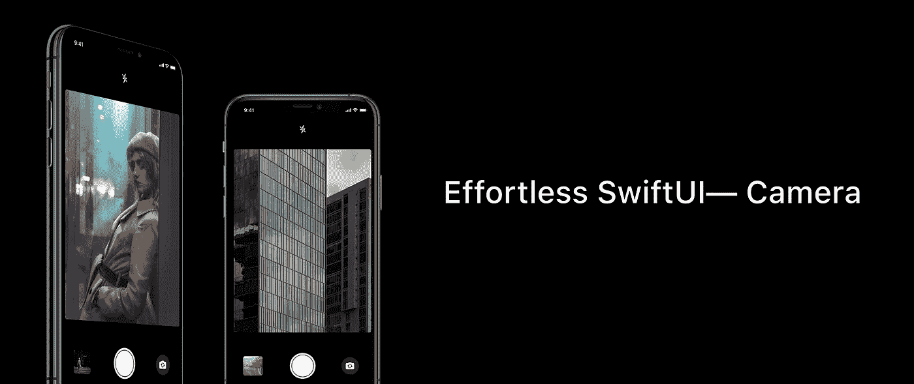
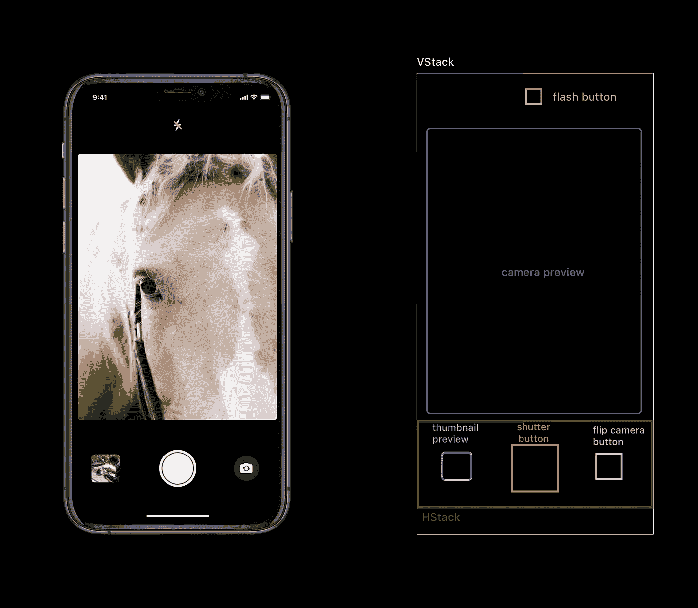

# 如何用 SwiftUI 构建相机 App

> 原文：<https://betterprogramming.pub/effortless-swiftui-camera-d7a74abde37e>

## *毫不费力的 SwiftUI 相机教程*

最终项目 UI(图片来源:作者；来自 Unsplash 的取景器图像)

这是我的名为轻松 SwiftUI 的新系列的第一篇文章。

SwiftUI 已经被证明是一个非常棒的新框架，可以快速可靠地构建和设计应用程序。尽管如此，它仍处于起步阶段，苹果需要为其他框架集成添加更多支持，就像它最近在 SwiftUI 2.0 中使用苹果按钮登录一样。在本教程中，我们将学习如何将 [AVFoundation](https://developer.apple.com/av-foundation/) 的`AVCameraSession`与 SwiftUI 集成，以便我们可以为需要使用我们设备摄像头的应用程序创建可重用、可扩展的现代组件。

# 我们开始吧

首先，让我们创建一个新项目。我把我的命名为 SwiftCamera，但是你可以随意命名你的。现在让我们从相机用户界面背后的大脑开始。

## 照相服务

相机服务将是负责使用所有 AVFoundation 类的组件，这些类需要连接到 iPhone 的相机并捕捉您一直等待的精彩镜头。因此，向您的项目添加一个新文件，并将其命名为`CameraService.swift`。确保它是一个类，并使其成为`NSObject`的子类。

**属性。**让我们从使我们的相机服务工作的主要属性开始。我就一一列举，详细说明它们的用法。

首先让我们从用户界面将与之对话的对象开始，这些对象标有`Published` 属性包装器。

1.  `flashMode`:告诉观察者闪光灯是开着还是关着。
2.  `shouldShowAlertView`:告诉观察者 UI 是否应该显示警告视图。
3.  `shouldShowSpinner`:告诉观察者 UI 是否应该显示一个微调按钮，指示正在处理捕获的照片。
4.  `willCapturePhoto`:告诉观察者照片即将被拍摄。非常适合在捕捉镜头前闪烁屏幕或播放动画。
5.  `isCameraButtonDisabled`:不言自明。我们从设置为`false`的值开始，一旦我们成功配置了摄像机会话，我们就将该值设置为`true`。
6.  `isCameraUnavailable`:不言自明。我们从设置为`false`的值开始，一旦我们成功配置了摄像机会话，我们就会将该值设置为`true`。
7.  `photo`:照片输出。这种情况下的结构`Photo`非常简单。一旦照片被捕获和处理，观察者将获得一个新的值。

现在让我们继续处理两个公共属性和一些其他内部和私有属性，只有我们的服务会处理这些属性。

**隐私**。iOS 对隐私非常敏感，所以请确保在项目的`info.plist`文件中添加相机使用说明。一旦我们完成了，让我们创建我们的第一个函数，`checkForPermissions()`。

我们来看看这个函数。我们应该确定我们的应用程序当前的摄像头访问隐私配置。为此，AVFoundation 为我们提供了一个方便的函数，返回当前状态，`AVCaptureDevice.authorizationStatus(.video)`。然后，基于返回值，我们执行不同的操作。如果状态是授权的，就这样，我们成功返回。否则，如果状态未确定，我们暂停`sessionQueue`以便暂停任何即将完成的配置，并且我们请求用户允许使用摄像机。默认情况下，我们假设用户已经拒绝访问，所以我们用我们之前创建的便捷的 `AlertError`类型显示一个警告错误，并告诉 UI 禁用相机视图和捕获按钮。

**会话配置。这是必不可少的。要配置我们的捕获会话，首先我们要检查我们之前是否已经配置了它。如果是这样，我们返回；否则，我们通过在捕获会话中调用`beginConfiguration()`来锁定它，开始配置，我们将会话预设设置为 photo，然后开始捕获设备发现。一旦设置好捕捉设备，我们就连接我们的`photoCaptureOutput`并将其配置为`maxPhotoQualityPrioritization`设置为`quality`。一旦所有这些都完成了，我们通过在捕获会话中调用`commitConfiguration()`来提交更改。最后，让我们通过将`isConfigured`设置为`true`来存储配置状态。由于会话已成功配置，我们现在可以通过调用`start()`开始从设备捕获视频。**

**开始预览视频拍摄。**正确配置捕获会话后，我们就可以开始从摄像机接收视频预览帧了。为此，我们在捕获会话中调用`startRunning()`。但是首先我们需要检查配置结果状态是什么。如果配置失败，我们创建一个`AlertError`，并通过分配给`shouldShowAlertView`属性将其发布给观察者。如果配置成功，我们应该启用快门按钮，并通过将`isCameraButtonDisabled`和`isCameraUnavailable`改为 false 来告诉 UI 相机可用。

**停止预览视频拍摄。**视频捕获会话独立于声明依赖它的对象运行。这意味着，如果我们有一个带有摄像头预览的视图，并将其附加到我们的`CameraService`，然后我们关闭这个视图并取消初始化`CameraService`，摄像头捕获会话将继续运行。在 iOS14 上，这一点更加明显，因为我们可以在设备上看到绿点。因此，当我们退出视图或者不再需要运行这个资源时，我们需要停止捕获会话。为此，我们编写以下函数:

上面的函数采用一个可选的闭包作为完成处理程序来执行，以防我们将来需要它。

**在摄像机之间切换**。做到这一点非常容易。我们只需要在当前视频设备的基础上设置一个新的视频设备。首先，我们需要禁用快门按钮，这样配置过程就不会中断。然后，基于当前的视频捕获设备，我们设置一个新的位置，可以是前部或后部，使用这个新值，初始化一个设备发现会话，从中我们将选择一个具有我们感兴趣的位置的设备。一旦我们获得了正确的设备，我们就像一开始那样配置它。配置完成后，我们提交更改并启用快门按钮。

**变焦**。缩放是一个相当简单的任务:我们只需要在设备上设置缩放因子。我们将在下一个函数中获取一个带有所需缩放因子的参数，并配置视频设备。

## 捕捉照片

我们终于到了。如前所述，我们的`photoOutput`对象将负责捕捉实际的照片。因此，我们需要为每次拍摄照片配置一组设置，如闪光灯、曝光等设置。在那之后，我们需要在实际的照片捕捉之前做最后一件事，那就是在我们的`photoOutput`中设置`AVCapturePhotoCaptureDelegate`。为此，我们将创建一个新类。我给我的取名`PhotoCaptureProcessor`。这个对象将负责处理由`AVCapturePhotoCaptureDelegate`协议的方法声明的照片捕获过程的各种状态。

现在我们有了一个合适的对象来处理委托方法，这就是我们的`CameraService`类中实际的照片捕获函数。

## 视图模型

在进入 SwiftUI 的 UI 设计之前，我们需要一个关键的组件来使这个应用程序可组合和可重用，也就是说，要将 UI 与我们的`CameraService`链接起来。在本教程中，我们将使用 MVVM 作为我们的设计模式的选择，所以每个视图需要一个模型。对于我们的`CameraView`，我们将创建一个`CameraViewModel`。这个对象将负责使用`CameraService`，配置它并代表 UI 调用它的所有方法，以及进行任何需要的数据格式化。

## 带有 SwiftUI 的 UI

好了，我们的相机应用程序背后的大脑已经足够了。现在让我们快速为我们的应用程序创建一个漂亮的视图。这个视图足够简单，可以做以下事情:

A.使用捕捉按钮捕捉照片

B.设置拍摄的闪光模式

C.设置缩放因子

D.在前置和后置摄像头之间切换

E.预览从摄像机捕获的视频

F.显示刚刚捕获的照片的小缩略图

好吧！让我们开始吧。首先，我们需要一种方法将`CameraService`捕获会话数据传递给 SwiftUI 中的视图。为此，我们需要创建一个符合`UIViewRepresentable`协议的特殊视图，如下所示。

**那么，这到底是怎么回事呢？**

1.  我们创建了一个 UIView 子类，它覆盖了 UIView 的层类型并将其设置为`AVCaptureVideoPreviewLayer`，然后我们创建了一个名为`videoPreviewLayer`的新 get-only 属性，它将 UIView 的层转换为`AVCaptureVideoPreviewLayer`。这样，我们可以在 SwiftUI 中使用这个新创建的视图`VideoPreviewView`，并使用`.frame()`视图修改器设置它的框架和大小，而不需要在`VideoPreviewView` init 中传递一个 CGRect 框架来手动修改视频预览层，就像我在社区中的其他解决方案中看到的那样。
2.  我们声明了对由`CameraService`提供的`AVCaptureSession`属性的依赖，并使用该会话将其设置为`AVCaptureViewPreviewLayer`的会话，这样视频预览层就可以输出摄像机正在捕捉的内容。
3.  `UIViewRepresentable`协议提供了两种方法，`makeUIView()`和`updateUIView()`。到目前为止，我们只需要`makeUIView()`返回我们的视图。这里我们将初始化刚刚创建的`VideoPreviewView`的一个实例，并添加一些配置。

现在转到 SwiftUI。创建一个新的 SwiftUI 视图并将其命名为`CameraView`。这里我们将声明一些东西:一个快门按钮，一个闪光灯按钮，一个预览缩略图，和一个相机的预览。

这是我们需要在 SwiftUI 中构建的 UI 结构。这是一个简单的用户界面。如果我们知道主要组件是垂直组织的，那么我们应该使用 VStack。对于底部区域，最好使用 HStack 来按住缩略图、快门按钮和翻转相机按钮。仅此而已。

UI 结构

现在是 SwiftUI 代码，以及将它连接到`CameraViewModel`并根据需要调用其功能所需的所有连线。

# 结论

相机应用在第一次尝试时总是有点棘手。这就是为什么我很高兴终于写了一篇相当长但完整的文章，讲述如何用 SwiftUI 制作一个基本的相机应用程序。

SwiftUI 是一个令人敬畏的现代框架，随着我们用它创建新的应用程序并在社区中推广它的使用，它肯定会在不久的将来被更多人采用。注意到 SwiftUI 迫使开发人员应用关注点分离原则也很重要，因为在本文中我们已经将`CameraService`从`CameraViewModel`和`CameraView`中分离出来，每个人都有自己的职责；这将允许我们在应用程序中构建可重用、可共享和可组合的组件。遵循这种做法不会有什么损失。

# 资源

如果你想看看这个项目的全部代码，你可以在这里找到:

[https://github.com/rorodriguez116/SwiftCamera](https://github.com/rorodriguez116/SwiftCamera)

我还制作了一个 SwiftPackage，将`CameraService`和`VideoPreviewView`与你喜欢的应用程序中的任何自定义用户界面集成在一起:

[https://github.com/rorodriguez116/Camera-SwiftUI](https://github.com/rorodriguez116/Camera-SwiftUI)