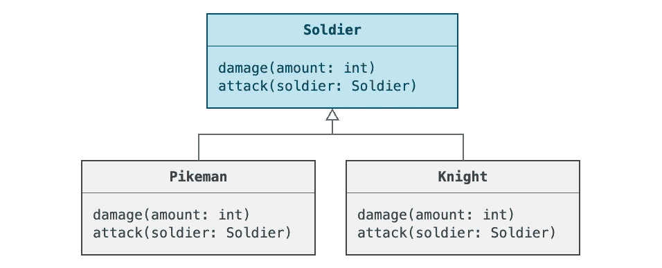
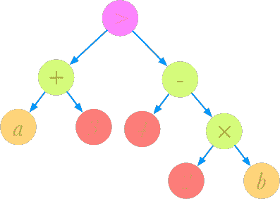
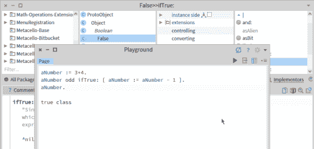
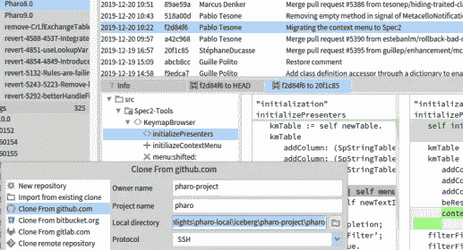
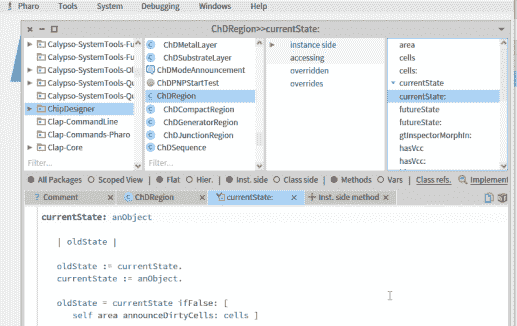

# 来自 8 种编程语言的 8 大理念

> 原文：<https://betterprogramming.pub/eight-big-ideas-from-eight-programming-languages-f3be5f6c9701>

## 八种不同编程语言的一些定义性特征和思想之旅


照片由[路易斯·戈麦斯](https://www.pexels.com/@luis-gomes-166706?utm_content=attributionCopyText&utm_medium=referral&utm_source=pexels)从 [Pexels](https://www.pexels.com/photo/blur-close-up-code-computer-546819/?utm_content=attributionCopyText&utm_medium=referral&utm_source=pexels) 拍摄

20 多年来，我一直喜欢尝试不同的编程语言。这是一次试图回忆那些经历的尝试——那些在每种语言中都非常突出的想法，或者那些我回想起来已经看到其重要性的想法。

这个列表非常主观。这是一个代表引起我注意的想法的特性列表。你总会发现有人认为其他一些特征或想法更突出或更重要，但这没关系。


# Zig —编译时间代码

在某些领域， [Zig](https://ziglang.org/) 尽管是静态类型的，但几乎表现为动态语言。对于静态类型语言，在编译完代码之前，不会运行任何代码。然而，在 Zig 中，您可以在编译时将数据标记为已知。如果编译器在编译时无法确定该值，则是编译错误。

另一方面，完全依赖于编译时已知值的代码被允许在编译时运行，而不是在运行时运行。看看这个简单的例子，它看起来很像用 C 语言调用`printf`:

```
print("number: {} string: {}", .{num, str});
```

在 C 中，这是一个有潜在风险的函数调用，因为在运行时，代码必须分析格式字符串以查看要读入多少个参数。但是，格式字符串可能与参数列表不匹配。事实上，这已经足够糟糕了，以至于现代 C 编译器将此视为特例，并在编译时进行验证。然而，这只是针对`printf`功能的一个特殊例外。

在 Zig，不需要特殊处理。格式字符串在编译时用特殊的`comptime`关键字标记为*已知*:

```
print(comptime format: []const u8, args: anytype)
```

这意味着，如果编译器发现它是未知的(例如，因为您从文件中读取该字符串)，那么将产生编译错误，并且您必须确保该格式字符串在编译时确实是已知的。

`num`和`str`变量的值在编译时可能未知，但它们的类型是已知的。这允许 Zig 执行`print`中的所有代码，它只依赖于格式字符串和参数的类型。

你可以想象这涉及到一堆循环和 if 语句，根据`num`和`str`变量的类型决定调用其他什么函数。在最终编译的函数中，这些代码都将消失，只剩下运行时要执行的代码。


# 朱莉娅——多重派遣

关于 Julia 有很多要说的，但是 Julia 有一个突出的特点，那就是一切都是建立在多重分派之上的。那是什么意思？在 Julia 术语中，可以有一个函数`fight`，但是一个函数有多个被称为*方法*的实现。因此，我们可以定义多个方法(不要与 OOP 混淆),例如:

```
fight(a::Archer,  b::Knight)
fight(a::Pikeman, b::Archer)
fight(a::Knight,  b::Knight)
```

与面向对象编程不同，所有的参数决定运行什么代码，而不仅仅是第一个特殊的参数，比如`this`或`self`。不，这不是函数重载，因为这个决定是在运行时做出的，而不是在编译时。编译时不需要知道`a`和`b`的类型。

这在类似游戏的事情上很重要。在编译的时候，你无法知道什么类型的士兵会在游戏中互相战斗。弓箭手打骑士还是枪兵，是玩家在运行时做出的动态决定。

您可以使用它来定义显示不同数据类型的不同方式。例如，Julia 中的所有数据类型都使用`show`函数来显示任何 IO 设备上的任何数据类型:

```
show(io::IO, x)
```

如果你不添加你自己的方法，默认情况下，它会简单地使用反射来发现你的对象`x`中的字段并显示它。但是您可以定义自己的自定义显示，比如说一个`Point`类型，使用:

```
show(io::IO, p::Point) = print(io, "($(p.x), $(p.y)")
```

对于另一个 IO 设备，以不同的方式表示该点也是可能的:

```
show(io::IOBuffer, p::Point) = print(io, "BufPoint($(p.x), $(p.y)")
```

如果没有多重分派，这种灵活性将很难实现。要么`Point`类型必须实现一些序列化接口，要么您必须修改一个`IO`基类及其子类来接受新的`Point`类型。


# Swift —可选

虽然 Swift 不是开创可选类型或 sum 类型的语言，也不是第一种让我接触到这一概念的语言，但它是我开始经常使用这一概念的第一种语言。苹果 Swift 文档中有一个解释这一概念的例子:

```
if let firstNumber = Int("4") {
    if let secondNumber = Int("42") {
        if firstNumber < secondNumber && secondNumber < 100 {
            print("\(firstNumber) < \(secondNumber) < 100")
        }
    }
}

// Prints "4 < 42 < 100"
```

将字符串`"4"`解析为整数`4`可能会失败。在 Swift 中，`Int`函数将返回一个`Int?`类型的值，这意味着它可以是一个整数或者一个`null`。类型`Int`只能是整数。像`Int?`和`String?`这样的类型不能直接使用，因为它们可能是`null`。它们必须以某种方式打开。这就是 Swift 中的`if let`语句的作用。

这是另一个等价的例子:

```
if let firstNumber = Int("4"), 
   let secondNumber = Int("42"), 
   firstNumber < secondNumber && secondNumber < 100 
{
    print("\(firstNumber) < \(secondNumber) < 100")
}

// Prints "4 < 42 < 100"
```

在[苹果文档](https://docs.swift.org/swift-book/LanguageGuide/TheBasics.html)中阅读更多相关内容。从 Objective-C 到 Swift，我惊讶地发现我可以从中捕捉到多少狡猾的小 bug。尤其是与 C++相比，我喜欢它简化了许多功能。我不再需要写大量的防御性代码来检查空指针。


# go-结构类型

在《T21 Go》中，大多数人会继续谈论编程的并发性有多棒。但是对我来说，结构打字有最大的吸引力。你们大多数人熟悉的就是所谓的[名义打字](https://en.wikipedia.org/wiki/Nominal_type_system)。这就是 C/C++、Java 和 C#中键入的工作方式。

这是一种非常类似于动态语言的鸭式输入，但是在编译时进行检查。Go 没有实现继承，但是可以用方法定义结构，也可以定义接口。



**枪兵**和**骑士**需要有士兵中定义的方法才能坚持**士兵**接口。

我可以定义一个函数`fight`，它接受一个类型为`Soldier`的参数，其中`Soldier`是一个带有方法列表的接口。然后，`fight`可以接受类型`Pikeman`或类型`Knight`的对象，只要它们都具有在`Soldier`接口中定义的所有方法。以下是 Go 中这种实现的一部分示例:

```
type Soldier interface {
    damage(amount int)
    attack(soldier Soldier)
}func fight(a Soldier, b Soldier) {
    a.attack(b)
    b.attack(a)
}
```

注意，在定义`Knight`时，我们没有指定它实现了`Soldier`接口；它只是通过实现它的方法:

```
type Knight struct {
    health int
}func (knight *Knight) damage(amount int) {
    knight.health -= amount
}func (knight *Knight) attack(soldier Soldier) {
    soldier.damage(4)
}
```

我们可以将`Knight`和`Pikeman`传递给一个需要`Soldier`类型的函数，Go 编译器会计算出这些接口在结构上匹配。

```
knight := Knight{12}
pikeman := Pikeman{8}fight(&knight, &pikeman)
```

例如，这类似于 Python 或 Ruby。他们不关心输入的确切类型，只要对象响应对它们的方法调用。Go 允许您这样做，但是是以类型安全的方式。如果接口类型和结构类型不匹配，就会出现编译错误。例如，如果我没有为`Pikeman`实现`damage`方法，我会得到以下错误:

```
cannot use &pikeman (type *Pikeman) as type Soldier in argument to fight:
    *Pikeman does not implement Soldier (missing damage method)
```

# 目标-C-类别

对于来自 C++背景的人来说，我非常喜欢 Objective-C 的一点就是分类。category 允许你在现有的类中添加任意数量的方法，而不用子类化它，这可以在单独的库中完成。

这有什么用？想象一下，你正在把一个表示复杂用户界面的对象图存储到磁盘上，你想重新创建它。您可以遍历这个对象图并调用方法`createUI`来为该对象创建相应的 UI 对象。

问题是:由模型对象组成的对象图不应该依赖 GUI 代码。您不希望将图形库链接到包含非 GUI 代码的库。

然而，对于类别，您可以向对象图中的每一个对象类型添加一个`createUI`方法。您可以为每种对象类型添加不同的代码。

这是一个优雅的解决方案，C++开发人员必须用，比如说，一个[访问者模式](https://en.wikipedia.org/wiki/Visitor_pattern)来解决。类别不再是 Objective-C 独有的。Swift 也提供了这一功能。由于 Swift 具有更规范的语法，因此展示一个类似于类别的 Swift 类扩展示例会很有用:

```
extension Int {
    func takeAway(value: Int) -> Int {
        return self-value
    }
}

let a = 10
let b = a.takeAway(value: 3)
print(b)
```

在这种情况下，我们用`takeAway`方法扩展了`Int`类型——这很没用，但这只是一个简单的例子。

关于如何在 Swift 中更优雅地实现 visitor 模式的更详细的解释，可以看看这个更[详细的解释](https://erik-engheim.medium.com/making-visitor-pattern-obsolete-using-swift-c16e49a2e52f)。它在 Objective-C 中同样适用。


# LISP —同象性

[LISP 编程](https://en.wikipedia.org/wiki/Lisp_(programming_language))语言及其衍生语言有一个特性叫做 [*同象性*](https://en.wikipedia.org/wiki/Homoiconicity) 让我着迷了很久，即使我不做 LISP 的常规编程。

这意味着代码以与数据相同的方式表示，因此可以以与数据相同的方式操作。

在 LISP 中，核心数据结构是一个链表。下面是一个包含一些元素的列表的简单示例:

```
(list 43 "hello" true 2.5 'c')
```

请注意，我在这里对布尔值和字符使用了熟悉的类似 C 的语法。LISP 将使用不同的语法。

链表由节点组成，每个节点可以指向另一个节点。它还有一个储存数据的单元格。但这也可以是指向另一个列表的指针。因此我们可以有列表的列表，这些列表也可以是列表的列表。

```
(list 34 (list "hello" true) (list 2.5 'c'))
```

人们可以用这种方式表达复杂的数据结构和树结构。如果你对编译器的工作原理有所了解，你就会知道当它解析代码时，会产生一个抽象的语法树。



表达式的抽象语法树:*a+3>4–2b*

当用 LISP 编码时，你是在直接创建这个抽象语法树，原则上你可以像任何其他代码一样重新排列和转换这样的代码树。

让我们举一个例子来说明 LISP 方法的普遍性。如果我们看一个用 C 语言编写的 Hello World 程序，那么代表这个程序的抽象语法树或数据结构就不会立即显现出来。

```
#include <stdio.h>

int main () {
    printf("hello, world\n");
    return 0;
}
```

然而，有一些带有 LISP 风格的 C 语言版本可以让你用 LISP 语法写这个程序(我们称之为 *s 表达式*)。

```
(import cstdio)

(def main (fn extern-c int (void)
  (printf "hello, world\n")))
```

让我们再举一个例子来说明这是如何工作的。

```
struct Point {
    int x;
    int y;
};
```

使用 LISP s 表达式，这变成:

```
(def Point (struct intern (
    (x int) 
    (y int)
)))
```

我要带着这个去哪里？为什么要用这样一种看起来丑陋和笨拙的语法写代码呢？有了这个语法，一切都完全规范化了。例如，在这个定义中，可以清楚地看到代码被定义为一个列表，其中前两个元素是`def`和`Point`。第三个元素是另一个列表，以元素`struct`和`internt`开始。它还有第三个元素，这是另一个包含结构中所有变量定义的列表。

好吧，那又怎样？那给了我什么？例如，您可以将这个 LISP 代码放在一个文件中，其他 LISP 代码可以将这个代码作为数据加载并转换它。它可以像任何其他链表一样遍历这段代码。它可以插入和替换元素。

但是在 LISP 中，你甚至不需要把它放在一个单独的文件中。使用引号，代码可以作为数据直接放在其他 LISP 代码中。例如，在 LISP 中，这意味着给变量`x`加 4。

```
(+ 4 x)
```

在普通的 LISP 中，您可以像这样用一个值来声明一个变量:

```
(defvar y 10)
```

然后用`setf`改变数值:

```
(setf y 5)
```

但是它不需要包含数字。我们可以在里面放任何东西，甚至是一列代码。但是我们如何避免代码被执行呢？如果我们这样做，我们只需在`y`中存储 7:

```
(setf y (+ 3 4))
```

我们可以做的是引用一个列表，它将一个表达式转换成常规的列表数据:

```
(setf y '(+ 3 4))
```

如果我使用 SBCL 这样的 LISP REPL 环境(交互式命令行),我们可以检查并评估它:

```
sbcl> y
=> (+ 3 4)

sbcl> (eval y)
=> 7
```

但是您可以自己动态地创建这样一个代码列表。函数的作用是:在列表的开头添加一个节点。

```
sbcl> (cons 3 '(5 8))
=> (3 5 8)
```

您可以用它来组合列表中的代码片段。例如，在下面的例子中，我们挑选出了`y`的第一个元素，即`+`操作符，然后我们将它添加到数字 4 和 5 的列表中。

```
sbcl> (cons (first y) '(4 5))
=> (+ 4 5)
```

我们可以评估我们创造的这个新表达式:

```
sbcl> (eval (cons (first y) '(4 5)))
=> 9
```

这显然是一个更大的话题，我只能触及表面。但关键是要表明，通过将任何代码放入 s 表达式中，您都可以轻松地转换和操作这些代码。因此，举例来说，您可以在常规 LISP 代码中使用我之前展示的 LISP 风格的 C 代码，并对该代码执行转换。然后，这些代码可以被输入到一个程序中，如 [C-Mera](https://github.com/kiselgra/c-mera) ，它会将 LISP 风格的 C 语言转换成可以编译的普通 C 代码。

这被顽皮狗公司用在了 Playstation 2 上，该公司制作了[面向游戏的汇编 LISP](https://en.wikipedia.org/wiki/Game_Oriented_Assembly_Lisp) 来创建 [Jak 和 Daxter 等游戏。](https://en.wikipedia.org/wiki/Jak_and_Daxter)基本上，这是用 LISP 语法包装 PS2 汇编代码，提供了用高级语言编写低级语言的机会。

这就是为什么 LISP 经常被认为是创造语言的语言。高度规则语法的另一个优点是，您可以使用特殊的 LISP 编辑器来导航树结构，而不是行和列。因此，键盘组合可以移动到语法树中的下一个兄弟，移动到父节点，或者移动到子节点。您可以选择所有子节点。


# Smalltalk —基于图像的开发

[Smalltalk](https://pharo.org/) 并不是第一个基于图像开发的语言。事实上，这是由 LISP 开创的。然而，Smalltalk 可能是最适合的语言，也是最强大的语言。

这当然回避了这个问题:什么是*基于图像的开发*？

不，这并不意味着你正在绘制图像来创建程序。相反，我们使用单词 *image* 来表示内存中数据的串行化。您可以将 Smalltalk 编程想象成 REPL 环境中的一个交互式会话。如果你已经编程了 JavaScript、Python、Ruby 或 Lua，你应该熟悉基于 REPL 的开发。你定义变量、函数等。在互动的环境中。

Smalltalk 更进了一步。您的代码没有保存在您可能偶尔在 REPL 环境中加载的某个单独的文件中。不，整个开发过程都发生在这个交互式环境中，整个过程都被转储到磁盘上。本质上，您没有需要管理的单独的文本文件。

相反，您可以将 Smalltalk 开发视为使用 IDE 操作对象数据库。但还有比这更疯狂的。整个交互环境本身是用 Smalltalk 编写的，并且是同一个环境的一部分。

它大致是这样工作的:在底部，有一个虚拟机(VM ),它加载一个映像，这个映像基本上是一个对象数据库。这个映像包含了整个 Smalltalk 开发环境本身。通过 IDE，它本身存在于 Smalltalk 映像中，您可以执行向该映像添加更多对象的操作。

下图来自一个叫做 [Pharo](https://pharo.org) 的 Smalltalk 的现代化身。它展示了一个典型的 Smalltalk 代码编辑器。在最左边，你有包裹。在包的旁边，有一个在所选包中定义的类的列表。接下来，你得到了方法的类别。最后，在最右边，你会看到这一类的方法。



Pharo IDE 中遍历类和方法的例子。如你所见，在 Smalltalk 中，甚至 True 和 False 都是类。

在下半部分，您可以看到该方法的代码。然而，重要的是要认识到这些代码是作为数据存储在类中的。它不存储在文本文件中。您不能再向下滚动查看下一个方法。每种方法都是独立的，因为它们是独立的实体。

那么这有什么意义呢？为什么重要？这种方法给了我们什么？

这意味着 Smalltalk IDE 拥有完整的、总是最新的、内存中的代码表示。这种表现就是 Smalltalk 对象。因此，您和 IDE 都可以遍历所有的类、对象和方法。正是它给了 Smalltalk IDEs 如此强大的重构工具。像重命名方法或移动方法这样的操作不像其他 ide 那样是文本替换操作。相反，它是一个对象操作。你操纵活着的物体。

因为整个开发环境是由类、方法和对象组成的，您可以从开发环境中浏览这些类、方法和对象，并且它们是实时存在的，所以您可以修改自己的开发环境并立即看到发生的变化。这意味着您可以改变行为并添加新功能。事实上，甚至编译器本身也是用 Smalltalk 编写的，所以你甚至可以改变你的类和方法的编译方式。

这意味着您第一次使用 Smalltalk 时，可能会有点困惑。例如，Pharo 从一个简单的启动程序开始，您可以选择要启动的图像。这是自然的。否则，我们将如何处理你搞砸了你的整个形象，因为这可能意味着你的整个开发环境不再工作？

幸运的是，Pharo 有很多工具可以保存图像、恢复图像、重置图像和执行版本控制。Smalltalk 中的版本控制很有趣，因为原则上没有文本文件。例如，你如何在 Smalltalk 中使用 Git 和 GitHub 呢？

在 Pharo 中，这是通过一个名为 Iceberg 的特殊 Git 管理器解决的，如下所示:



Iceberg 在 Pharo 中是用来和 Git 交互的。因为 Smalltalk 不是基于文件的，所以需要一个特殊的工具。

Iceberg 会将 Smalltalk 图像导出为 Git 可以处理的格式。这意味着类被转换成目录，每个方法被转换成一个单独的文件。这允许您使用 Iceberg 跟踪单个方法级别的代码变化。

认识到这只是一种导出格式很重要。您不能直接运行它。您使用 Iceberg 从 Git 导入更改。

基于图像的开发提供了许多有趣的机会。例如，您可以在调试会话过程中存储您的映像，然后重新加载您的 IDE 并从您停止的地方继续。



在调试会话过程中保存 IDE 状态的示例。稍后可以在同一位置继续调试。

您可以只将调试器的状态导出到单独的文件中。您可以将此附加到错误报告中，让其他开发人员从您停止的地方继续调试。


# Lua——一切都是哈希表

在 LISP 中，一切都是链表。在 Smalltalk 中，一切都是对象。Lua 在这方面有自己独特的见解。在 Lua 中，一切都围绕着作为主要数据结构的哈希表。

例如，Lua 中的数组只是一个散列表，其中的索引是整数。Lua 对任何事情都使用哈希表。名称空间只是包含函数、对象和其他哈希表的哈希表。

这些哈希表非常聪明。它们可以指向元哈希表，元哈希表在无限链中也可以有自己的元哈希表。

如果您试图在哈希表中查找一个项目，而它没有那个键，它将继续在其元哈希表中查找。如果那个表没有它，它将询问它的元哈希表，以此类推。

这可能会形成层级。几个散列表可以指向同一个元散列表。和元散列表的集合都可以指向另一个共享的元散列表。因此，我们可以创建一个层次树结构。

这可以用于许多目的。当您还没有定义一个值时，它提供了一种提供默认值的方法。Lua 最初是作为一种配置语言设计的，在这里你可以指定复杂的配置设置。

但是你可以更进一步。如果你愿意，你可以用它来定义一个面向对象的系统。假设我们用一个`width`和`height`字段定义一个矩形。

```
local rectangle = {width = 10, height = 20}
```

接下来，将一个 function 对象分配给`area`键，该键将一个矩形作为参数，并计算矩形的面积。

```
rectangle["area"] = function(rect)
  return rect["width"] * rect["height"]
end
```

但是这种形式有一个等价的语法 sugar 版本，可以这样写:

```
rectangle.area = function(self)
  return self.width * self.height
end
```

这是另一个等价形式:

```
function rectangle.area(self)
  return self.width * self.height
end
```

最后，如果我们使用`:`符号而不是`.`，那么我们就不必显式地将`self`写成第一个参数，即使它仍然是第一个参数:

```
function rectangle:area()
  return self.width * self.height
end
```

当访问`rectangle`散列表中的函数对象并调用它时，有一个简单的相似之处。以下两种形式是等效的:

```
rectangle.area(rectangle)
rectangle:area()
```

现在，不用给每个矩形分配一个`area`函数，你可以将每个矩形的所有函数分配给另一个哈希表；姑且称之为`Rectangle`。然后我们可以设置`rectangle`的元表，并且每隔一个矩形对象指向这个元表。这意味着当你调用`rectangle:area()`时，你实际上在元表上找到了`area`。瞧，我们得到了一个面向对象的系统，有继承和一切。

这里的部分吸引力在于 Lua 是一种非常小的语言。你可以在明信片上定义语法。然而，你有一个非常灵活和多才多艺的语言，有一些特点。

# 结束语

还有许多其他有趣的语言。虽然我过去喜欢使用 Ruby 和 Python，但我不能说它们一定提供了我以前没有见过的革命性的新东西。相反，它更多的是提供一套以前在其他地方探索过的新功能。例如，对我来说，Ruby 允许我以一种更务实的方式做很多你可以在 Smalltalk 中做的事情。当然，Ruby 没有基于图像的开发模型，但是它可以处理好的旧文件，并且可以像 bash 一样作为脚本运行。因此，您可以使用它来制作简单的 shell 工具。相比之下，Smalltalk 并不适合这样做。或者至少不是，当我第一次探索它的时候。

还有一些语言本身确实很新颖，比如 [Haskell](https://www.haskell.org) 、 [Rebol](https://en.wikipedia.org/wiki/Rebol) 和[fouth](https://en.wikipedia.org/wiki/Forth_(programming_language))，但我对它们的经验太少，无法一一评价。

但是我可以简单地提一下，Haskell 将类型系统和函数式编程提升到了一个新的层次。或者至少曾经是。现在有了更多的现代变体，比如 [Idris](https://www.idris-lang.org) 。

Forth 很有趣，因为它是一种基于堆栈的语言，提供了非常高级和低级的编程。对于习惯于普通编程语言的人来说，这些代码看起来很奇怪，但它可能是在只能访问汇编代码的新架构上实现的最快的语言。因此，许多微控制器系统通常安装有第四系统。