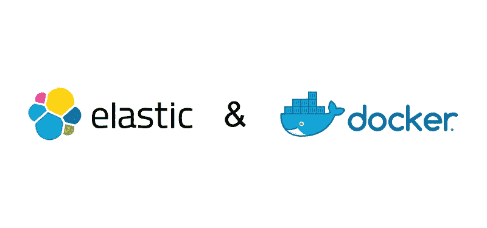

# 使用 Docker Compose 的 Elasticsearch 集群和 Kibana

> 原文：<https://betterprogramming.pub/elasticsearch-cluster-and-kibana-using-docker-compose-4f9c4d6c5470>



使用 [Docker](https://docs.docker.com/compose/) 为你的开发项目启动你的 [Elasticsearch](https://www.elastic.co/) 实验。

我使用 Docker Compose 创建了三个[节点](https://nodejs.org/)静态弹性搜索 7.5.1 集群。Docker Compose 还包括新的开源 [Kibana](https://www.elastic.co/products/kibana) 7.5.1，运行在 [NGINX](https://www.nginx.com/) 之后。

## 发布说明

*   [Elasticsearch 7.5.1 发行说明](https://www.elastic.co/guide/en/elasticsearch/reference/7.5/release-notes-7.5.1.html)

不建议在生产环境中使用该集群，但它为您提供了一个起点。

# GitHub 回购

[](https://github.com/maxyermayank/docker-compose-elasticsearch-kibana) [## maxyermayank/docker-compose-elastic search-ki Bana

### Docker-Compose-elasticsearch-kibana-Docker 为 elastic search 和 Kibana 编写

github.com](https://github.com/maxyermayank/docker-compose-elasticsearch-kibana) 

GitHub 存储库中包含的服务:

*   三节点弹性搜索版本 7.5.1。
*   基巴纳版本 7.5.1。
*   审计节拍版本 7.5.1。
*   公制节拍版本 7.5.1。
*   心跳版本 7.5.1。
*   包揍版本 7.5.1。
*   文件节拍版本 7.5.1。
*   APM 服务器版本 7.5.1。
*   APP 搜索 7.5.1 版本。
*   NGINX。

# 要求

*   18.05 号文件
*   docker-撰写 1.21

# 在守护模式下启动堆栈

```
docker-compose up -d
```

# 检查 Docker 撰写群集的状态

```
docker-compose ps -a
```

# 群集节点信息

```
curl [http://localhost:9200/_nodes?pretty=true](http://localhost:9200/_nodes?pretty=true)
```

# 访问基巴纳

```
[http://localhost:5601](http://localhost:5601)
```

# 通过 NGINX 访问 Kibana

```
[http://localhost:8080](http://localhost:8080)
```

# 访问弹性搜索

```
[http://localhost:9200](http://localhost:9200)
```

# 访问应用程序搜索

```
[http://localhost:3](http://localhost:9200)002
```

# 资源

[](https://medium.com/@maxy_ermayank/hands-on-elasticsearch-8fa59d8aebfc) [## 动手做弹性搜索

### 关于我:Oildex 的应用程序架构师，这是 Transzap Inc .的一项服务。

medium.com](https://medium.com/@maxy_ermayank/hands-on-elasticsearch-8fa59d8aebfc)  [## 弹性搜索资源

### 关于我:Oildex 的应用程序架构师，

medium.com](https://medium.com/@maxy_ermayank/elasticsearch-resources-27d24f01c1dc) 

希望这篇帖子对你有帮助。请在评论中告诉我你的想法。感谢阅读！