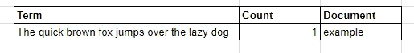
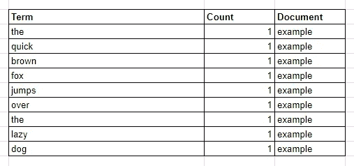

# 弹性搜索:文本与关键词

> 原文：<https://betterprogramming.pub/elasticsearch-text-vs-keyword-2ccb99ec72ae>

## 它们之间的差异以及它们的行为方式


卡斯帕·卡米尔·鲁宾在 [Unsplash](https://unsplash.com?utm_source=medium&utm_medium=referral) 上拍摄的照片

许多刚开始学习 Elasticsearch 的人经常混淆`Text`和`Keyword`字段数据类型。它们之间的区别很简单，但非常关键。在这篇文章中，我将谈论它们的区别，如何使用它们，它们如何工作，以及在两者之间使用哪一个。

# 差异

它们之间的关键区别在于，Elasticsearch 会在将`Text`存储到倒排索引之前对其进行分析，而不会分析`Keyword`类型。分析与否将影响它在被查询时的行为。

如果你刚开始学习 Elasticsearch，还不知道什么是倒排索引和分析器，我推荐你先看一本[elastic search 基础指南](https://codecurated.com/blog/basics-of-elasticsearch-for-developer/)。

# 如何使用它们

如果您将包含字符串的文档索引到 Elasticsearch，而之前没有定义到字段的映射，Elasticsearch 将创建一个包含`Text`和`Keyword`数据类型的动态映射。但是，即使它与动态映射一起工作，我建议您在根据用例索引任何文档之前定义一个映射设置，以节省空间和提高编写速度。

这些是`Text`和`Keyword`类型的映射设置的例子，注意我将使用一个名为“text-vs-keyword”的索引，这是我之前为这个例子创建的。

**关键字映射**

```
curl --request PUT \
  --url [http://localhost:9200/text-vs-keyword/_mapping](http://localhost:9200/text-vs-keyword/_mapping) \
  --header 'content-type: application/json' \
  --data '{
 "properties": {
  "keyword_field": {
   "type": "keyword"
  }
 }
}'
```

**文本映射**

```
curl --request PUT \
  --url [http://localhost:9200/text-vs-keyword/_mapping](http://localhost:9200/text-vs-keyword/_mapping) \
  --header 'content-type: application/json' \
  --data '{
 "properties": {
  "text_field": {
   "type": "text"
  }
 }
}'
```

**多领域**

```
curl --request PUT \
  --url [http://localhost:9200/text-vs-keyword/_mapping](http://localhost:9200/text-vs-keyword/_mapping) \
  --header 'content-type: application/json' \
  --data '{
 "properties": {
  "text_and_keyword_mapping": {
   "type": "text",
   "fields": {
    "keyword_type": {
     "type":"keyword"
    }
   }
  }
 }
}'
```

# 它们是如何工作的

在倒排索引中，这两种字段类型的索引是不同的。索引过程的不同会影响你对 Elasticsearch 的查询。

例如，让我们为一个文档编制索引:

```
curl --request POST \
  --url [http://localhost:9200/text-vs-keyword/_doc](http://localhost:9200/text-vs-keyword/_doc)/example \
  --header 'content-type: application/json' \
  --data '{
 "keyword_field":"The quick brown fox jumps over the lazy dog",
 "text_field":"The quick brown fox jumps over the lazy dog"
}'
```

在执行了上面的`curl`命令之后，如果您得到了索引中的所有文档，那么您应该得到:

```
[
      {
        "_index": "text-vs-keyword",
        "_type": "_doc",
        "_id": "example",
        "_score": 1.0,
        "_source": {
          "keyword_field": "The quick brown fox jumps over the lazy dog",
          "text_field": "The quick brown fox jumps over the lazy dog"
        }
      }
    ]
```

## 关键字

先说简单一点的，`Keyword`。Elasticsearch 不会分析`Keyword`数据类型，这意味着您索引的字符串将保持原样。

那么，在上面的例子中，字符串在倒排索引中会是什么样子呢？



倒排索引中的关键字示例

是的，你说得对，这和你写的完全一样。

## 文本

与`Keyword`字段数据类型不同，索引到 Elasticsearch 的字符串在存储到倒排索引之前将经过分析器处理。默认情况下，Elasticsearch 的标准分析器会拆分并降低我们索引的字符串。您可以在 [Elasticsearch 的文档](https://www.elastic.co/guide/en/elasticsearch/reference/7.9/analysis-standard-analyzer.html)中了解更多关于标准分析仪的信息。

Elasticsearch 有一个 API 来检查文本在分析过程后的样子，我们可以用它来试试:

```
curl --request POST \
  --url [http://localhost:9200/text-vs-keyword/_analyze](http://localhost:9200/text-vs-keyword/_analyze)?pretty \
  --header 'content-type: application/json' \
  --data '{
  "analyzer": "standard",
  "text": "The quick brown fox jumps over the lazy dog"
}'
```

因此，根据上面的响应，这是倒排索引对于`text_field`字段的外观



倒排索引中的示例文本

和`keyword`的只有一点点不同，对吗？但是您需要注意它在倒排索引中存储了什么，因为它将主要影响查询过程。

# 查询文本和关键字

现在我们已经了解了`text`和`keyword`在被索引时的行为，让我们了解一下它们在被查询时的行为。

首先，我们必须知道有两种类型的字符串查询:

*   匹配查询
*   术语查询

与`Text`和`Keyword`相同，`Match Query`和`Term Query`的区别在于`Match Query`中的查询会先被分析成术语，而`Term Query`中的查询不会。

查询 Elasticsearch 的工作原理是将被查询的词与倒排索引中的词进行匹配，被查询的词和倒排索引中的词必须完全相同，否则将无法匹配。这意味着索引和查询结果中经过分析的字符串和未经分析的字符串将产生非常不同的结果。

## 使用术语查询来查询关键字字段

因为字段数据类型和查询都不会被分析，所以它们需要完全相同才能产生结果。

如果我们尝试完全相同的查询:

```
curl --request POST \
  --url '[http://localhost:9200/text-vs-keyword/_doc/_search?size=0'](http://localhost:9200/text-vs-keyword/_doc/_search?size=0') \
  --header 'content-type: application/json' \
  --data '{
 "query": {
  "term": {
   "keyword_field": "The quick brown fox jumps over the lazy dog"
  }
 }
}'
```

Elasticsearch 将返回一个结果:

```
{
        "_index": "text-vs-keyword",
        "_type": "_doc",
        "_id": "example",
        "_score": 0.2876821,
        "_source": {
          "keyword_field": "The quick brown fox jumps over the lazy dog",
          "text_field": "The quick brown fox jumps over the lazy dog"
        }
      }
}
```

如果我们尝试一些不精确的东西，即使在倒排索引中有这个词:

```
curl --request POST \
  --url '[http://localhost:9200/text-vs-keyword/_doc/_search?size=0'](http://localhost:9200/text-vs-keyword/_doc/_search?size=0') \
  --header 'content-type: application/json' \
  --data '{
 "query": {
  "term": {
   "keyword_field": "The"
  }
 }
}'
```

它没有返回任何结果，因为查询中的术语与倒排索引中的任何术语都不匹配。

## 使用匹配查询查询关键字字段

让我们首先尝试用`Match Query`到`keyword_mapping`查询相同的字符串“快速的棕色狐狸跳过懒惰的狗”,看看会发生什么:

```
curl --request POST \
  --url [http://localhost:9200/text-vs-keyword/_doc/_search](http://localhost:9200/text-vs-keyword/_doc/_search) \
  --header 'content-type: application/json' \
  --data '{
 "query": {
  "match": {
   "keyword_field": "The quick brown fox jumps over the lazy dog"
  }
 }
}'
```

结果应该是:

```
{
 "_index": "text-vs-keyword",
 "_type": "_doc",
 "_id": "example",
 "_score": 0.2876821,
 "_source": {
  "keyword_field": "The quick brown fox jumps over the lazy dog",
  "text_field": "The quick brown fox jumps over the lazy dog"
 }
}
```

等等，它不应该产生任何结果，因为分析查询产生的术语与倒排索引中的“快速的棕色狐狸跳过懒惰的狗”不完全匹配，但是为什么它会产生结果呢？

没错，分析查询是因为我们使用了`Match Query`，但是 Elasticsearch 使用了`index-time`分析器，它被映射到`Keyword`字段数据类型，而不是标准分析器。由于使用`Keyword`字段数据类型映射的分析器是术语分析器，因此 Elasticsearch 在查询中没有改变任何内容。

现在，让我们用一个标准分析仪来试试:

```
curl --request POST \
  --url [http://localhost:9200/text-vs-keyword/_doc/_search](http://localhost:9200/text-vs-keyword/_doc/_search) \
  --header 'content-type: application/json' \
  --data '{
 "query": {
  "match": {
   "keyword_field": {
    "query": "The quick brown fox jumps over the lazy dog",
    "analyzer":"standard"
   }
  }
 }
}'
```

不会产生任何结果，因为它是按术语分析查询的，而且没有与倒排索引中的术语完全匹配的术语。

## 使用术语查询查询文本类型

文本类型的索引文档将有许多术语，正如我们在上一节中看到的。为了展示查询如何与倒排索引中的术语匹配，让我们尝试两个查询，第一个查询将整个句子发送给 Elasticsearch

```
curl --request POST \
  --url '[http://localhost:9200/text-vs-keyword/_doc/_search?pretty='](http://localhost:9200/text-vs-keyword/_doc/_search?pretty=') \
  --header 'content-type: application/json' \
  --data '{
 "query": {
  "term": {
   "text_field": "The quick brown fox jumps over the lazy dog"
  }
 }
}'
```

第二个只有“这个”

```
curl --request POST \
  --url '[http://localhost:9200/text-vs-keyword/_doc/_search?pretty='](http://localhost:9200/text-vs-keyword/_doc/_search?pretty=') \
  --header 'content-type: application/json' \
  --data '{
 "query": {
  "term": {
   "text_field": "The"
  }
 }
}'
```

两个查询都没有结果。

第一个查询没有产生结果，因为在倒排索引中，我们从来没有存储整个句子，索引过程只存储已经从文本中分块的术语。

第二个查询也没有结果。在索引的文档中有一个“the ”,但是记住分析器是小写的，所以在倒排索引中，它被存储为“The”

让我们用“the”再次尝试术语查询:

```
curl --request POST \
  --url '[http://localhost:9200/text-vs-keyword/_doc/_search?pretty='](http://localhost:9200/text-vs-keyword/_doc/_search?pretty=') \
  --header 'content-type: application/json' \
  --data '{
 "query": {
  "term": {
   "text_field": "the"
  }
 }
}'
```

没错。它产生一个结果，因为查询的“the”与倒排索引中的“the”完全匹配。

## 使用匹配查询查询文本类型

现在是用`Match Query`输入文本的时候了，因为它分析了两种类型，所以很容易让它们产生结果。让我们先尝试两个查询

第一个查询将把“The”发送给 Elasticsearch，我们知道使用`term query`不会产生任何结果，但是`match query`呢？

第二个查询将发送“LAZ 狗绊倒了快速的棕色狗”，一些单词在倒排索引中，一些没有，弹性搜索会从中产生任何结果吗？

```
curl --request POST \
  --url '[http://localhost:9200/text-vs-keyword/_doc/_search?pretty='](http://localhost:9200/text-vs-keyword/_doc/_search?pretty=') \
  --header 'content-type: application/json' \
  --data '{
 "query": {
  "match": {
   "text_field": "The"
  }
 }
}'curl --request POST \
  --url '[http://localhost:9200/text-vs-keyword/_doc/_search?pretty='](http://localhost:9200/text-vs-keyword/_doc/_search?pretty=') \
  --header 'content-type: application/json' \
  --data '{
 "query": {
  "match": {
   "text_field": "the LAZ dog tripped over th QUICK brown dog"
  }
 }
}'
```

没错。他们俩都产生了一个结果

```
{
        "_index": "text-vs-keyword",
        "_type": "_doc",
        "_id": "example",
        "_score": 0.39556286,
        "_source": {
          "keyword_field": "The quick brown fox jumps over the lazy dog",
          "text_field": "The quick brown fox jumps over the lazy dog"
        }
      }
```

第一个查询产生了一个结果，因为查询中的“the”经过分析后变成了与倒排索引中的“The”完全匹配的“The”。

第二个查询虽然不是所有的术语都在倒排索引中，但仍然会产生一个结果。Elasticsearch 将返回一个结果，即使查询的术语中只有一个与倒排索引中的术语完全匹配。

如果你注意结果，有一个`_score`字段。查询中有多少项与倒排索引中的项完全匹配是影响分数的因素之一，但是让我们把计算分数的工作留到以后再说。

# 何时使用一个或另一个

使用`keyword`字段数据类型，如果:

*   您想要精确匹配查询
*   你想让 Elasticsearch 像其他数据库一样工作
*   您希望将它用于通配符查询

在以下情况下使用文本字段数据类型:

*   您想创建一个自动完成功能
*   你想创建一个搜索系统

# 结论

理解`text`和`keyword`字段数据类型是如何工作的，这是你在 Elasticsearch 中想要学习的东西之一，区别看起来很简单，但却很重要。

您需要了解并选择适合您的用例的字段数据类型，如果您需要两种字段数据类型，则可以在创建映射时使用多字段功能。

最后，我希望这篇文章能帮助你学习 Elasticsearch，理解 Elasticsearch 中文本和关键字字段数据类型的区别。感谢阅读！