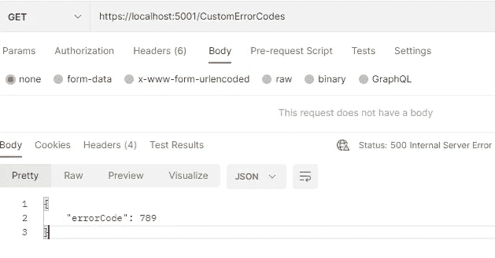
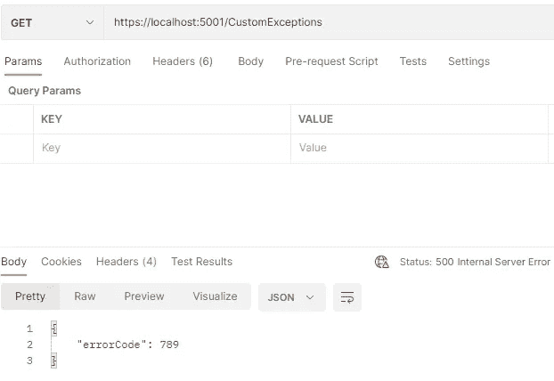

# Asp.Net Web Api 异常处理

> 原文：<https://betterprogramming.pub/elegan-handling-dependency-fails-9aef523e3b0f>

## 集中错误处理。网络应用

Polina Zimmerman 在 [Pexels](https://www.pexels.com/) 上拍摄的照片

Web 服务或 web APIs 是当今与 web 或移动应用程序通信的最常见方式之一。通常，服务依赖于其他服务、微服务或 API 来处理信息并将其返回给调用者，当这些依赖失败时，我们可能会向调用者返回一个错误。

虽然调用者不需要关于错误的任何技术细节，但返回一条信息是非常重要的，这条信息允许开发团队快速找出哪个依赖项失败了，并且在主体中返回自定义错误代码以及响应状态代码是实现这一点的好方法。

许多使用这种方法的应用程序将所有错误代码集中在一个类中，并在依赖失败时返回它们。这种方法很好，但是它强制改变错误代码类，总是包括一个新的依赖项，或者如果任何错误代码需要更新。

为了改善这种情况，我们可以使用[开闭原则](https://en.wikipedia.org/wiki/Open%E2%80%93closed_principle)，该原则规定实体应该对扩展开放，但对修改关闭。我们也可以使用 Robert c . Martin[在《干净的代码》一书中解释的“优先选择异常而不是返回错误代码”的建议](https://en.wikipedia.org/wiki/Robert_C._Martin)

在下一节中，我将详细描述如何实现一个集中错误处理的策略，然后如何使用上面介绍的内容来改进它。

## 错误列表类

通常，它是一个非常简单的类，就像这样。

错误代码. cs

## 自定义异常

从 Exception 继承并公开错误代码属性的简单类。

通用异常. cs

## 全局错误处理

创建一个新类，从`ExceptionFilterAttribute`继承，覆盖`OnException`方法，最后将它添加到`Startup`类中的`ConfigureService`方法上。

globalexceptionhandlerfilter . cs

在`OnException`被覆盖的方法中，我们可以定制错误体响应的格式。

对于这个例子，`InternalErrorResponse`只有`ErrorCode`属性，该属性将保存由定制的一般异常引发的定制错误代码，或者为所有未处理的异常保存 500。

Startup.cs

最后一步是使用我们想要识别的 API 的定制错误代码抛出定制异常

## 依赖关系失败时抛出异常

CustomErrorCodesController.cs

当请求数据时，响应将是状态代码 500 和响应主体上的自定义错误代码

结果

# 改进解决方案

现在，我没有使用一般的异常类，而是创建了一个基本的异常类，它必须被扩展，必须暴露一个新的自定义错误代码。

它有一个虚拟属性`ErrorCode`,必须被子类覆盖

BaseException.cs

这两个服务异常类仅设置自定义错误代码，但它们也可以自定义错误消息或覆盖其他方法。

FirstServiceException.cs

SecondServiceException.cs

最后，我们需要将异常过滤器改为查找基本异常扩展类，而不是查找一般异常，这样它就可以获得自定义错误代码。

globalexceptionhandlerfilter . cs

所有异常到达的单个点也是调用日志方法的一个很好的候选点，基于此，我们可以向异常类添加额外的信息，例如请求属性，或者甚至覆盖`ToString`方法以在日志中使用它。

最后，我们只需要引发自定义异常，而不是只引发带有自定义错误代码的一般异常。

客户异常控制器

我们会有同样的结果。

结果

你可以在这个[库](https://github.com/edsondiasalves/api-exception-handler)中找到完整的代码。我希望你喜欢它，并且它能在你的项目中帮助你。

感谢您的阅读，下次再见。