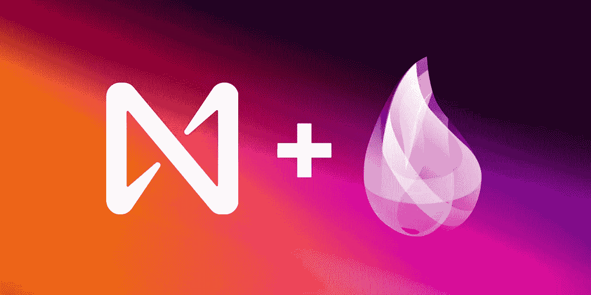
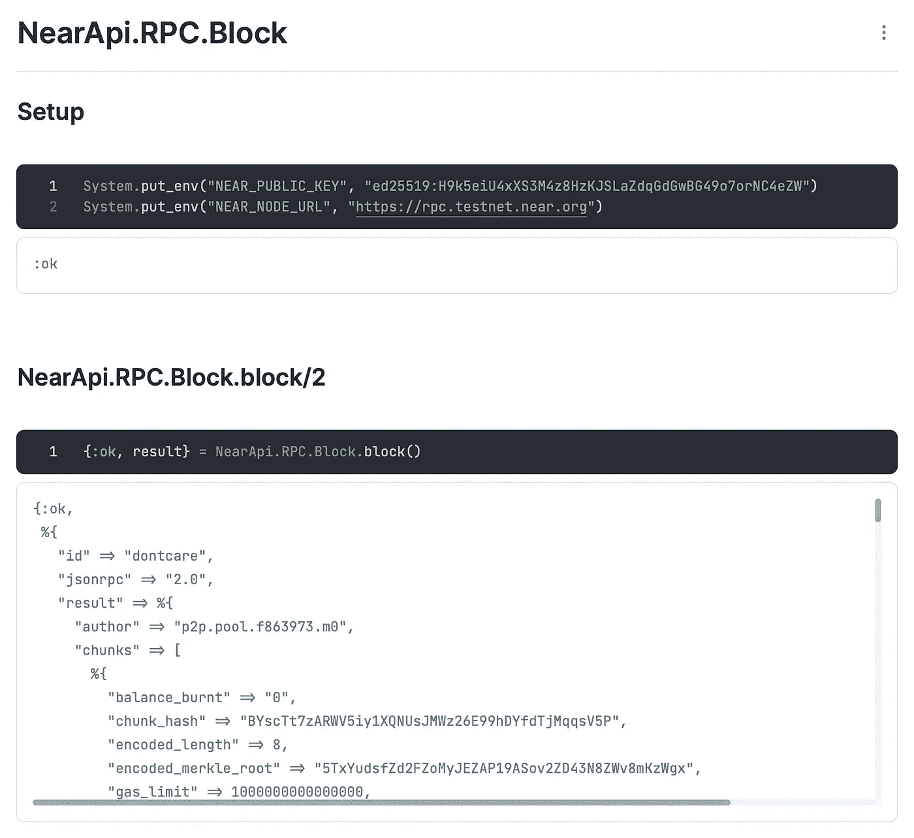
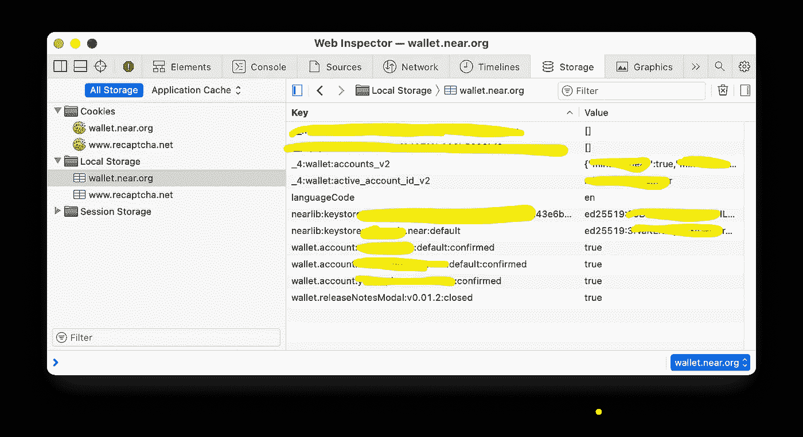

# 适用于近区块链的 Elixir API

> 原文：<https://betterprogramming.pub/elixir-api-for-near-blockchain-b3c2c112dbb8>

## 我的第一次体验是在区块链附近的



酏剂的近似 API

*我叫亚历克斯，我为区块链附近的* *创造了* [*仙丹 API。我希望这对你有用，如果你有任何问题，请联系我。*](https://github.com/alexfilatov/near-api-ex)

我承认——我通常不写文章，但我真的想和你分享我的成就，因为我对最终结果很满意！那是我第一次在区块链附近体验[，我在建造这个图书馆的时候非常兴奋。](https://near.org)

如果你想直接跳到代码示例，跳过我的故事和对附近区块链的赞美，向下滚动到“用法和代码示例”。

# **为什么我需要 Elixir API 用于近**

有一天，我的一个朋友告诉我，他正在开发一款回合制战略游戏，看起来像是《部落冲突》,这款游戏将在区块链附近开发。我问为什么我们有以太坊和智能合约？他的回答是:“想象一下，你的区块链交易在几毫秒内就完成了，而且不花你 10 美元，只是零头”。我是(现在仍然是)区块链开发的新手，但是我听说以太坊有这样的问题——缓慢而昂贵的交易。

所以我决定为自己做点什么，我的选择是一个简单的实时多人 TicTacToe 游戏，有锦标赛和奖金(剧透:最终我建立了 smth else)。

假设游戏必须是有大量并发用户的实时游戏，我决定 Elixir 将是这项工作的正确工具，我开始在谷歌上搜索 Elixir world 能给我提供什么，但什么也没有。嗯，听起来像是一个连接两个伟大世界的好机会——具有所有可伸缩性和强大容错能力的 Elixir，以及附近一个真正快速和廉价的区块链，因为智能合同而具有巨大的可能性。

将这两者结合起来应该会给我们带来很棒的东西！

# 什么是接近协议

我假设你们都有软件开发经验，听说过 Elixir，并且知道[为什么 Elixir 和 Phoenix 这么棒](https://curiosum.com/blog/why-elixir-phoenix-great-choice-for-modern-web-app)，那么让我来讲几句关于 NEAR Protocol 的事情。

NEAR——这是一款可扩展、快速且廉价的区块链，在 Rust 和 AssemblyScript 中有[智能合约。](https://docs.near.org/docs/develop/contracts/overview)

首先，我喜欢接近[气](https://www.investopedia.com/terms/g/gas-ethereum.asp)价/成交价。

想象一下，你有一个区块链，你应该支付大约 10 美元来完成交易。你将不得不把它包含在你项目的商业模式中，并最终以用户为代价。这不是你想对你的用户做的事情，如果你想在以太坊上构建，这是一个真正的挑战。

有了 NEAR 就便宜多了——交易成本低于 0.1 美元。如果我们谈论数字，在写这篇文章的时候，以太坊交易的平均价格是[$ 6-$ 180](https://etherscan.io/gastracker)，在附近是 [~$0.017](https://explorer.near.org/transactions/5PAesxLE1ZeKwJ5g2DyoJFEkmk6FZ5VfBdwzPgdjHbmp) ，差别很大，嗯？

接下来，我喜欢 NEAR 中添加交易的速度。NEAR 平台有一个“时钟”——几乎每秒钟在区块链产生一个新的区块。这允许限制天然气价格和更快地提交区块。NEAR 拥有[分片设计](https://near.org/blog/near-launches-nightshade-sharding-paving-the-way-for-mass-adoption/)和 1 秒的小块，添加交易的速度非常快。

最后，智能合约在 [Rust](https://www.rust-lang.org) 和 [AssemblyScript](https://www.assemblyscript.org) 中。这两种语言在合同中使用都很简单，而且有很多例子。

# 用法和代码示例

好了，聊够了，怎么用这个，你说的代码示例在哪里？

在编程级别上使用区块链总是与块和事务有关——您可以**查看**现有事务，也可以创建一个新的事务，通过添加您的事务来**修改**区块链。

## “视图-区块链”示例

要查看区块链事务，您并不总是需要访问键，一些 NEAR APIs 允许您使用 [RPC 函数](https://github.com/alexfilatov/near-api-ex#near-api-rpc-functions)查看没有键的块和事务。

例如，要查看一个现有的块，你需要调用`[Block](https://docs.near.org/docs/api/rpc/block-chunk)` RPC 函数。

首先，我们告诉我们的库我们将使用哪个网络:`export NEAR_NODE_URL=[https://rpc.testnet.near.org](https://rpc.testnet.near.org)`——这是`testnet`

然后仅仅简单的调用`NearApi.RPC.Block.block()`就给出了区块链最新确认区块的丰富信息(我截断了响应，实际上会有更多):

API 中有更多的仅供查看的 [RPC 函数，](https://github.com/alexfilatov/near-api-ex#near-api-rpc-functions)我为它们中的每一个创建了一个 [Livebook](https://livebook.dev) 示例，因此您将能够在本地(或在 [Fly.io](https://fly.io/launch/livebook) 上)运行它们，并查看来自附近 RPC API 的实时响应。



NearApi 的 Livebook 示例。RPC.Block.block/2

## “修改-区块链”示例

要在 NEAR 中创建一个新的交易，你需要被“认证”——区块链需要有一个交易的所有者。换句话说，您需要一个签名者密钥对(公共和私有)，这样您就可以在将事务发送到区块链之前对其进行签名。要获得密钥对，您需要[创建一个近距离钱包](https://wallet.near.org/create)。

关于签名者密钥，重要的是它们有两种类型:

*   `Full Access Keys`，当你创建一个钱包时，你会得到一个，它存储在你的浏览器中。
*   `FunctionCall Access Keys`，这样你就可以给一个智能合约有限的访问你钱包的权限，而不可能转移附近的代币。
    ( [关于访问键的更多信息](https://docs.near.org/docs/concepts/access-keys))

当您创建钱包时，NEAR 平台会将 FullAccess KeyPair 存储在您的浏览器存储器中，因此您将能够在您的浏览器中签署交易:



Safari 储物盒，带有近钱包钥匙

## 发送邻近令牌示例

作为一个例子，让我们发送一些附近的令牌。你需要一把`FullAccess`钥匙来做那件事。为了获取`FullAccess`密钥，您可以从浏览器存储器中获取密钥，如上图所示，或者在 CLI 附近使用[登录，并从本地文件存储器中获取密钥，例如，如果您的 NEAR Wallet `testnet`地址为`mintbot.testnet`，您的密钥文件将位于此处:
`~/.near-credentials/testnet/mintbot.testnet.json`，其内容如下:](https://github.com/near/near-cli)

```
{
  "account_id": "mintbot.testnet",
  "public_key": "ed25519:XXXXXXXXXXXXXXXXXXX",
  "private_key": "ed25519:XXXXXXXXXXXXXXXXXXXXXXXXXXXXXXXXXXXXXX"
}
```

在您的 mix 项目中，您可以执行以下操作来发送 NEAR 令牌，并且不要忘记添加`{:near_api, "~> 0.1"}`作为依赖项:

仙丹近 API 送钱示例

成功的结果将是创建一个 JSON，其中包含所有关于交易和收据的信息。

这里是[发送令牌 Livebook](https://github.com/alexfilatov/near_api/blob/main/notebooks/near_api/account.livemd) 示例，您可以在本地尝试响应。

## 近似智能合同呼叫示例

称之为智能合同——这是改变区块链状态的另一种方式。这是一种特殊类型的近距离交易— `FunctionCall`。NEAR 中的智能契约有自己的地址，例如`nft.mintbot.com`和我们可以调用的方法列表。

签署`FunctionCall`交易多数情况下不需要`FullAccess`键，`LimitedAccess`键就够了。

Elixir NEAR API 有一个调用智能合约的函数:

```
{:ok, result} = 
  NearApi.Contract.call(
    caller_account, 
    contract_address,
    contract_function,
    function_params
  )
```

这是一个调用 Mintbot 智能合约的例子。

Elixir NEAR API 函数调用示例

该函数的参数是:

*   `caller_account` —进行函数调用的账户
*   `"nft.mintbot.near"` —智能合同的地址
*   `nft_mint` —智能合约的功能
*   `params` —您正在传递的智能合约函数的参数

关于`FunctionCall`的更多细节，你可以点击[这里](https://nomicon.io/RuntimeSpec/FunctionCall)。

近`FunctionCall`事务 Livebook 这里是[这里是](https://github.com/alexfilatov/near_api/blob/main/notebooks/near_api/contract.livemd)，有请求和响应示例。

# 引擎盖下是什么？

上面所有的修改区块链的例子都使用带有一个或多个不同的[动作](https://github.com/alexfilatov/near_api/tree/main/lib/actions)的`[NearApi.Transaction](https://github.com/alexfilatov/near_api/blob/main/lib/transaction.ex)`模块&结构。

## **在 Elixir 中创建近交易**

该过程包含 4 个步骤:

1.  创建交易结构
2.  用 [Borsh](https://borsh.io) 将事务序列化为二进制
3.  用您的密钥对签署交易
4.  base64 编码并将事务发送到区块链

下面是`[NearApi.Transaction.t()](https://github.com/alexfilatov/near_api/blob/main/lib/transaction.ex#L7)`，它包含有效交易的 6 个必填字段:

`[NearApi.Transaction.t()](https://github.com/alexfilatov/near_api/blob/main/lib/transaction.ex#L7)`

因此，基本上，NEAR 中的事务是应用于区块链的动作列表，带有一些辅助信息。

所有交易都必须序列化为二进制代码，因为 NEAR 只接受二进制格式。我用我的 [Borsh 二进制串行器实现了 Elixir](https://github.com/alexfilatov/borsh) 。

为了将交易发送到区块链，我跳过了您需要做的所有细节，您可以在源代码[这里](https://github.com/alexfilatov/near-api-ex/blob/main/lib/transaction.ex)和[这里](https://github.com/alexfilatov/near-api-ex/blob/main/lib/account.ex#L27)中查看，但是请查看您在发送签名序列化交易时执行的最终函数调用:

```
tx =
"DwAAAG1pbnRib3QudGVzdG5ldABBxGVmSnc0VBAFqP1zcbviUut4vLbS/JK9UyECT5xGUgFeAb8uTgAAGgAAAG5mdF90ZXN0MTAubWludGJvdC50ZXN0bmV0AD7PlYhteyB6OGGxA6jG557JRwkL9vKXNlXlz0VTn9cBAAAAAggAAABuZnRfbWludDoBAAB7Im1ldGFkYXRhIjp7ImNvcGllcyI6MSwiZGVzY3JpcHRpb24iOiJORlQgZm9yIG1pbnRib3QudGVzdG5ldCBieSBNaW50Ym90IiwibWVkaWEiOiJodHRwczovL2lwZnMuaW8vaXBmcy9iYWZrcmVpYndxdGFkbmMyc3A0ZHNsMmt6ZDRqemFsNGR2eWo1bWx6czJhanNnNmRteGxrdXY1YTY1ZSIsInRpdGxlIjoiTkZUIGZvciBtaW50Ym90LnRlc3RuZXQgYnkgTWludGJvdCJ9LCJyZWNlaXZlcl9pZCI6Im1pbnRib3QudGVzdG5ldCIsInRva2VuX2lkIjoibWludGJvdC1uZnQtR2VYeDZwYTRybjVNSHBGcVlKUlJLeVAxaDZzVjJtWDZBdVg2MWdNOFE2aTMifQDAbjHZEAEAAAAAAAAAAAAAAAAAAAAAAAAQ3ktoL2UqPz0oTlYklUgUsNfhhd6MbdYubdrZsdRTCwIv3cYK7+zDHyvW2gLec1NR5AsipbGy405NyqMyvV0J"

NearApi.RPC.Transactions.send_transaction_commit(tx)
```

所以，`tx`这里是`Ed25519`签名，`Borsh`序列化成二进制，`Base64`编码的事务。

`NearApi.RPC.Transactions.send_transaction_commit` —同步函数，将`tx`发送给区块链，将`waits` 发送给结果(异步为`NearApi.RPC.Transactions.send_transaction_async`)

# 生产中接近 API 的酏剂

正如我之前所说，我的计划是创建一个 TicTacToe 游戏。但是后来，在我和来自[人类协会](https://humanguild.io)的人谈过之后，我改变了主意，决定做一个不那么复杂的东西——一个铸造 NFT 的工具。

实际上，NEAR [有制作 NFT 的工具](https://examples.near.org/NFT)，但是你必须熟练才能做到，这需要一些学习曲线来安装 [NEAR CLI](https://github.com/near/near-cli) ，学习命令，这不是很友好。我在这里试图解决的问题是完全消除技术方面，使铸造过程像在信使中发送图片一样简单。

准备好 Elixir API MVP(有了`NearApi.RPC`和发送`FunctionCall`事务的能力)后，我开始着手这个项目。

这就是 [Mintbot](https://www.mintbot.me) 的诞生。mint bot——是一个聊天机器人平台，用于在区块链附近创建 NFT。

我用 Mintbot 同时瞄准了 3 个目标:

*   创建一个非常简单的工具来铸造 NFT(观看 YouTube 上的演示展示[这里](https://www.youtube.com/watch?v=GaGphi5Fj5o)
*   在 API 附近创建[酏剂的工作证明](https://github.com/alexfilatov/near_api/)
*   向 [METABUILD Hackathon](https://devpost.com/software/mintbot) 提交项目并获胜(剧透:我没有赢哈哈)

假设我还没有准备好的 Elixir API，并且需要先构建一个 MVP 版本的库，那么构建它是非常有趣的。我设法构建了一个版本的库，它允许组合一个事务，对它进行二进制编码，并提交给区块链。

这足以在截止日期前成功地将`Mintbot`项目提交给黑客马拉松了！

我用长生不老药做了一些有趣的事情。我希望你能从我的文章中得到一些有用的东西。请让我知道你对这一切的想法。

# 资源

除此之外，这里还有一些关于 NEAR 和 Elixir 的好资料:

*   [面向高级开发人员的 NEAR 简介](https://hackmd.io/@nearly-learning/near-201)(基本上，这本书涵盖了开始使用 NEAR 所需了解的一切)
*   [NFT 附近教程](https://github.com/near-examples/nft-tutorial)
*   [近码示例](https://examples.near.org)
*   如果你想从仙丹开始，你应该去这里
*   [长生不老药论坛](https://elixirforum.com)，长生不老药开发者的好去处
*   [仙丹中的博什二进制连载](http://github.com/alexfilatov/borsh)