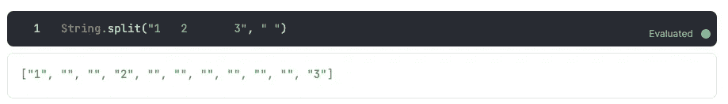

# Elixir 关联数据结构:映射和关键字列表

> 原文：<https://betterprogramming.pub/elixir-associative-data-structures-maps-and-keyword-lists-1db33d166bcc>

## 了解地图和关键字列表的工作原理

摘自[https://elixir-lang.org/](https://elixir-lang.org/)

关联数据结构允许一个键与一个给定值相关联。在 Python 中，它们被称为字典；在 JS 中，它们被称为文字对象。在 Elixir 中，有两个:关键字列表和映射。

# 关键词列表

它们通常用于向函数发送选项。让我们看一个使用关键字列表的例子。

假设我们有一个由空格分隔的三个数的二进制数，我们想得到一个包含这些数的列表。这可以通过将二进制字符串和分隔符放在 string 模块内的 split 函数中来轻松实现。

但是当二进制字符串中有更多的空格时会发生什么呢？

最后，我们没有列出这些数字。我们也有空白，这就是关键字列表出现的地方。

为了解决这个问题，我们可以在 split 函数中添加一个选项。当一个关键字列表是一个函数的最后一个参数时，我们可以不写尖括号。

换句话说:

重要的是，关键字列表是元组的列表，其中第一个元素是原子，第二个元素是关键字的值。

因为关键字列表是列表，我们可以做所有我们用普通列表做的操作。让我们通过连接列表来看一个例子(因此，它们是由我们排序的，并且具有与列表相同的线性性能，列表越长，找到值所需的时间就越长):

为了访问列表的值，我们从原子开始。代码如下:

如果我们有两个相同但值不同的键，它将返回找到的第一个值。

这些关键词列表被 Ecto 深度使用，这是一个针对 Elixir 的 ORM。在下面的例子中，我们看到一个对数据库执行查询的函数，这个函数来自于，它的第一个参数是在`client_cat`中的查询，并使用关键字列表、`select`和`where`。

# 地图

每当我们需要在键值结构中存储数据时，我们就使用映射。当与模式匹配结合使用时，它们非常有用，语法如下:

同样，要访问该地图的元素，我们使用以下代码:

如果我们试图访问一个不存在的键，它将返回 nil。我们也可以提取一个值，并把它放在一个变量中。值得一提的是，空地图可以与任何其他地图匹配。

也可以使用 ping 操作符`^`来匹配键。

我们有一个名为`Map`的模块，它具有操作映射的功能，比如获取给定键的值或添加新值。

要修改键值，我们可以使用以下语法:

原始地图不会被修改。记住，在长生不老药里，一切都是永恒不变的。当我们用这个语法更新一个条目时，如果这个键不存在，它将返回一个 KeyError 错误，而不是返回 nil。

在下面的代码中可以看到另一种获取地图值的方法:

最后，当一个映射的所有键都是原子时，我们就有了句法糖。

# 最后的想法

总之，我认为和模式匹配一起，这是操纵键值结构的一种非常聪明的方法。你怎么想呢?

检查以前的条目:

 [## 如何在药剂中使用控制结构

### 如何在灵丹妙药中使用格、条件、如果和除非

better 编程. pub](/how-to-use-control-structures-in-elixir-a8b2b134c1f5)  [## 如何在仙丹中使用模式匹配

### 了解等号运算符实际上是如何工作的

better 编程. pub](/how-to-use-pattern-matching-in-elixir-426709bb179a)  [## 长生不老药入门——了解它的种类

### 第 1 部分—基础知识

better 编程. pub](/learn-elixir-in-2023-a691d37f521)