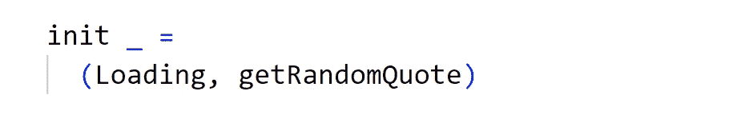
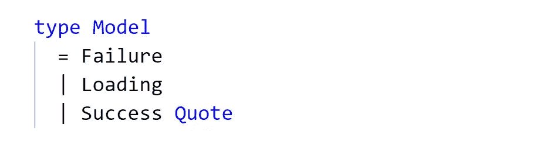
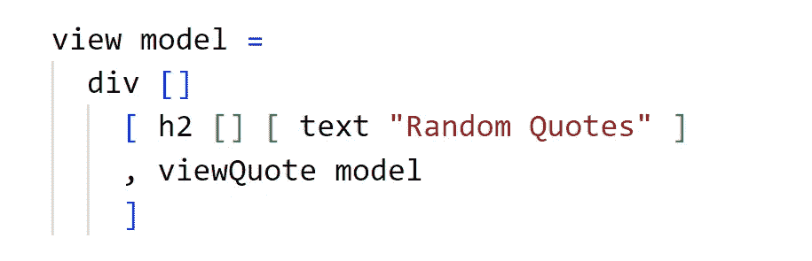
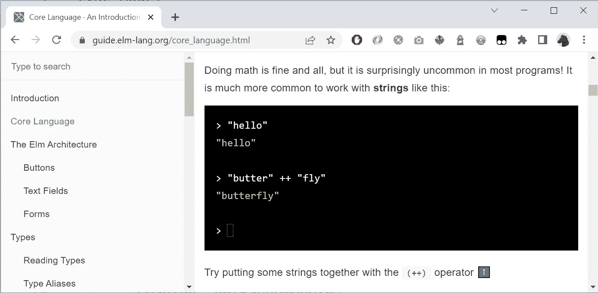
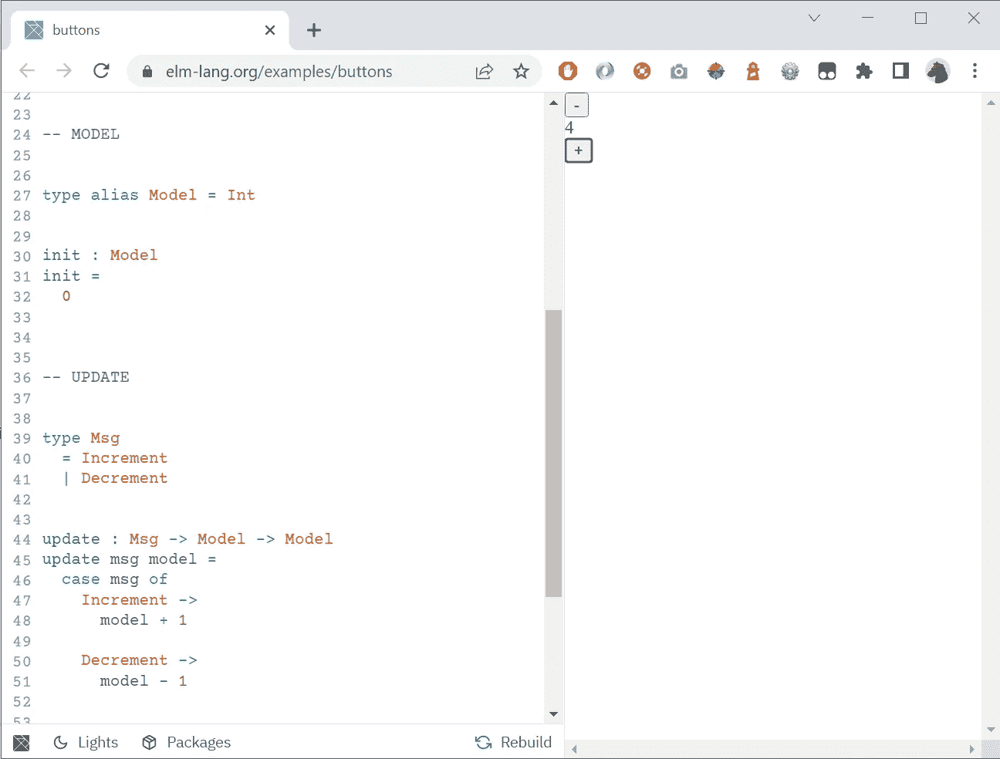
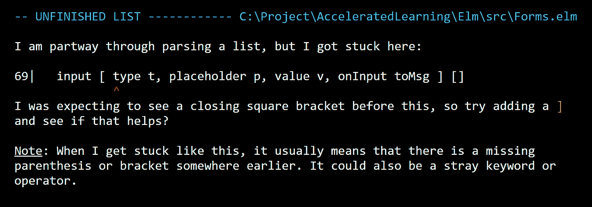

# elm——一种漂亮的 Web 开发语言

> 原文：<https://betterprogramming.pub/elm-a-beautiful-language-for-web-development-bc06fd0b570f>

## 这就是你混合使用 Haskell、TypeScript、Python 和 Rust 的结果

[Elm](https://elm-lang.org/) 是一种编写前端 JavaScript 代码的语言。

再来一个！？我通常对任何新事物都持怀疑态度，但我测试 Elm 有一段时间了，印象非常深刻。这里发生了一些令人兴奋的事情。有待探索的金矿。

为什么需要 Elm？

像 React，Angular，Vue 这些竞争对手有什么问题？

# 为什么？

榆树在很多方面都很特别。

它是功能性的。所有的值都是不可变的。没有副作用。基础只是函数:输入→输出。

与其他框架相比，Elm 使得创建干净且没有错误的代码变得更加容易。为什么？Elm 本质上是静态类型的。大多数错误是在编译时而不是运行时发现的。如果代码构建成功，它可能是正确的。

Elm 是一个纯函数，但是为什么它很重要呢？除了提高性能之外，还有一个非常好的优势:如果函数必须处理一些意外的事情，例如字符串不能转换为整数或者 http 调用出错，那么不会发送异常，但是函数会返回有关错误的信息。榆树并不区分快乐和悲伤的道路。只是数据输入，数据输出。

Elm 鼓励编写可组合的代码。可组合性可能是设计模式中最重要的部分[丘比特](https://dannorth.net/2022/02/10/cupid-for-joyful-coding/)。您可以快速编写解决小问题的代码，然后在没有太多重构的情况下进行构建。您可以解决问题，而不必创建太“智能”的代码或没有人理解的不必要的抽象代码。

Elm 是为 web 构建的，有一个简单的内置概念，如模型、视图、更新、订阅和解码器，使用户和运行时之间的数据流感觉直观。

null 值会在许多编程语言中引起问题。但是null 在 Elm 编程语言中并不存在。

# 更多原因

我希望上面列出的原因激起了你的好奇心，但让我们继续:

语法很紧凑，没有花括号，缩进有意义(就像在 Python 中一样)。需要几个括号。你可以写一些表达性的小代码。

如果你出错了，你会得到简单而有用的错误信息，比如:也许你想做 X？你忘记写 Y 了吗？

官方文档确实不错。它给出了一些很好的例子，文本也不太冗长。

对这种语言的更新很少。为什么这是优势？我们避免破坏性的改变，不需要重写旧代码。

# 榆树 vs 反应

如果将 Haskell(函数式)、TypeScript(编译成 JavaScript)、Python(简单紧凑的语法)和 Rust(友好的错误消息)混合在一起，就会得到 Elm。

Elm 与 React 等类似的框架/库竞争。我觉得 React 很棒。但是 React 不是静态类型的，我的经验是 React 应用程序经常会出现许多运行时错误。静态类型可以用 TypeScript 解决，但是我们可以用 TypeScript 欺骗很多，使用`*any*`数据类型或者忽略在部分代码中创建类型。

对于 React 和类似的框架，我们需要 Node 和无数的 JavaScript 包放在`node_module` 文件夹中。Elm 就不是这样了。

# 主要概念

Elm 应用程序的主要部分包括:

*   模型
*   视角
*   更新

下面是一个应用程序的代码片段，它从一个 API 获取随机报价并显示在屏幕上。

函数`init`是执行的第一行。它只是创建了一个初始模型。在下面的例子中，我们将初始状态设置为`Loading`，同时执行一个自定义命令`getRandomQuote`。

`model` 是显示视图所需的数据。相当于*状态*在反应。视图必须知道我们是否已经得到报价，如果我们正在加载报价或如果有什么地方出错。如果我们已经获取了报价，我们需要它的内容(它将存储在我们的自定义类型`Quote`中)。下面的简单声明告诉我们应用程序的所有状态。

`view` 描述了 HTML。它对应于组件(函数)在 React 中返回的内容。一个有趣的细节是，`div`、`h2`、等被看作是 Elm 中带两个参数(属性+其子项)的常规函数。

如果用户与站点交互，例如点击按钮或改变文本字段，则生成`message` 并自动发送到`update` 功能。

`update` 功能根据接收到的消息进行操作。它自动更新*视图*。

我们从一开始就知道会收到哪种类型的消息。如果我们忘记处理一个场景，例如，用户想要更多的报价或者加载报价有问题，这将是编译时的一个错误。这个真的很厉害。

一切都非常干净和紧凑。

# 更多技术

模型、视图和更新是 Elm 最重要的部分。

更多的内置概念如下:

*   **订阅—** 可以订阅外界发生的事情。例如，你设置了一个每秒发送一条*消息*的订阅(来更新时钟)。或者当新的动画帧可用时发送消息。或者在用户移动鼠标时发送消息。
*   **解码器—** 如果我们从一个 API 得到一个 JSON，我们希望它是一种特定的格式。解码器将原始 JSON 翻译成您自己的定制类型。如果 JSON 的结构不像我们预期的那样，我们马上就会知道。我们*失败得很快*并且能够在正确的地方处理情况。

# 看看他们的文件

官方文档[真的很好，如果你想尝试 Elm，这是一个完美的开始。概念描述得很清楚，在选择安装开发环境之前，您甚至可以在浏览器中编码。安装开发环境只需要几分钟时间。](https://guide.elm-lang.org/)

在官方文档中，您可以在不安装任何东西的情况下在浏览器中使用该语言:

您还可以读取和修改 Elm 代码，并在浏览器上运行:

# 错误消息

Elm 的一个有趣的细节是错误消息很清楚，它通常会给出关于*您应该做什么的建议:*

这些信息是在你和一个人交谈时写的——这很有趣。

# 缺点

Elm 的一个缺点是它还没有庞大的用户群。(2022 年 11 月 12 日)youtube 上只有几个关于如何开始的视频，而且很多都是 3-5 年前的。但是正如我之前所说的，官方文档非常棒，是入门的最佳途径。

# 背景

在听了精彩的 [Kodsnack](https://kodsnack.se/) 播客后，我对 Elm 产生了好奇，当时他们采访了 [Webbhuset](https://webbhuset.se/) ，

[可以在这里听插曲(瑞典语)。](https://kodsnack.se/498/)

Webbhuset 称赞了 Elm。他们长期致力于创建定制的电子商务解决方案。以前他们使用 PHP 和 React。但是代码变得越来越难维护。新开发人员很难理解代码，代码变得越来越(不必要的)复杂。

切换到 Elm 之后，一切都变得更好，代码也更容易扩展和维护。

我很想听听你在榆树的经历。