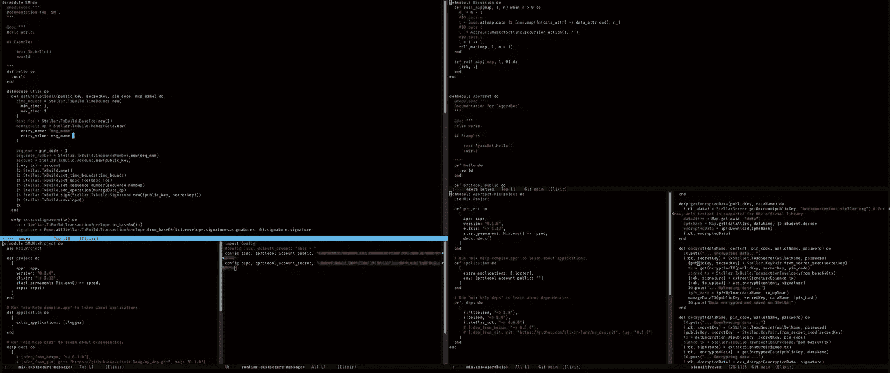

# Emacs 还是 VS 代码？我为什么以及如何慢慢转向 GNU Emacs

> 原文：<https://betterprogramming.pub/emacs-or-vs-code-why-and-how-im-slowly-switching-to-gnu-emacs-ea33c0837ac4>

## 我可能刚刚结束了我的编辑搜寻


照片由 [Jaye Haych](https://unsplash.com/@jaye_haych?utm_source=medium&utm_medium=referral) 在 [Unsplash](https://unsplash.com?utm_source=medium&utm_medium=referral) 上拍摄

不久前，我写了这篇关于我如何为 Python 开发设置 Vim 的文章。在过去的两年里，我对我的开发工具包做了很大的改变:

*   如果不是用 ML 做原型，我几乎不再使用 Python 了。
*   我现在一年没用 vim 了，用过 VSCode(还有 Emacs)。

在本文中，我想谈谈为什么我的大部分工作一直在慢慢地切换到 Emacs，并从较高的层面概述我正在添加的定制内容。



# 为什么是 Emacs 而不是 Vim？

我不想在这个话题上挑起战争。我对 Emacs 和 Vim 的了解还不够深入，无法对哪一个更好发表意见(如果有一个比另一个更好的话)，但是[这个堆栈溢出答案](https://stackoverflow.com/a/1433315/13532837)(以及其他答案)向我指出，Emacs 比 Vim 更具可定制性，另一方面，它更快、更容易学习。

我在寻找一个编辑器，我可以(很容易地)把它变成我想要的任何东西，Emacs 对我来说似乎是一个更好的匹配。

# 开始学习 Emacs

我不是编辑方面的专家，也不打算成为专家。我学到的最重要的一点是 Emacs 是可以用 Emacs Lisp 编程的。它可以是你的浏览器、终端、编辑器、启动程序、图像编辑器、流量拦截器，你能想到的还有很多。

另外，好消息是 Emacs 已经存在很长时间了，有大量的开源代码可以使用并集成到您的设置中。

## 编辑器导航

当我第一次阅读 quickstart Emacs 文件时，在编辑器中导航感觉很困难。现在，如果不使用 Emacs 键绑定，我几乎无法编辑一段文本。

例如，对我的工作流产生积极影响的一个键绑定是`C-u *n* (ctrl + u)`，因为它允许我将我选择的命令重复`n` 次。

## 定制 Emacs

我最喜欢定制 Emacs 的地方是[牛逼的 Emacs GitHub repo。](https://github.com/emacs-tw/awesome-emacs)它是一个按类别组织的 Emacs 包和库的集合。

为了让定制更进一步，你需要[学习 Emacs Lisp](https://www.gnu.org/software/emacs/manual/html_node/eintr/) 。我还没有学完 Lisp，但是一些教学已经派上了用场，例如在启动时找到文件，让它们准备好作为缓冲区。

# 为什么 Emacs 接管了我的开发工具包中的 VS 代码？

为什么我喜欢 Emacs 胜过 VS 代码？而如果我更喜欢 Emacs，为什么我还在用 VS 代码？

VS Code 是一个很棒的编辑器，值得一提的是，它也很容易定制。但是在使用了几天 Emacs 之后，我无法区分两者之间的区别。又过了几天，我简直不敢相信我已经错过了很长时间:Emacs 似乎快得多，而且很少。

老实说，我没有在我的设置中集成很多东西，我只需要一个快速的编辑器，我从终端做剩下的事情。这种方法使得像 Emacs 和 Vim 这样的轻量级和可定制的编辑器成为一个很好的选择。

此外，Emacs 允许我添加非常有用的(和特定的)定制。最好的部分是，当编辑器启动时，我可以为它添加条件语句。例如，根据启动 Emacs 的目录，我可以:

*   应用自定义键绑定
*   使用特定的主题和包
*   侦听文件中的更改并重新编译项目。

```
(add-hook 'emacs-startup-hook
   (lambda ()
     (setq launch-dir default-directory)
     (message launch-dir)
     (cond
      ((equal launch-dir "~/Desktop/secure-message/")
       (message "loaded in Secure Message dir, applying configs")
       ;; Do stuff
      )
     )
  ))
```

这是我在我的 Emacs 上应用的设置之一，我觉得它很棒，特别是因为我通常从事长期项目，这些项目使用不同的技术，需要不同的配置、按键绑定等等。

Emacs 允许我根据我正在处理的项目，让它作为不同的编辑器工作，特别是在键绑定方面，因为我可以根据目录让相同的组合执行不同的操作。

# 为什么我还在使用 VS 代码

到本文的这一步，您已经了解到我更喜欢 Emacs 而不是 VS 代码。然而，有一些任务我仍然觉得前者更快，例如，当使用 SvelteKit 时，我更喜欢 VS 代码。然而，我已经在做一些设置来改变这一点，并最终开始使用 Emacs 也用于 SvelteKit。

我喜欢为我的特定用例优化一切的想法，这是我最终完全转向 Emacs 的一个足够好的理由，但我想这需要一些时间。

# 结论

本文的重点是展示 Emacs 是如何像一块空白画布一样工作的，即使对于从未接触过 Lisp 的人来说，它也可以填充您想要的任何内容。当我使用它时，我添加了更多的配置，使得我使用 Emacs 的工作流比使用 VS 代码快得多。

当我找不到让一些特性按照我的期望工作的方法时，我有时会切换回 VS 代码几个小时，但最终会因为没有使用 Emacs 而感到内疚，找到完成事情的方法，并见证我比以前做事情更快。

也就是说，我不会向编程领域的绝对初学者推荐 Emacs。这并不是因为他们无法正确设置，而是因为他们通常从事大量的小型项目，为每个项目编写定制配置会非常耗时耗力。

我希望你喜欢这篇文章，因为我期待着更频繁地发布。

*感谢阅读。*