# 在 iOS 应用程序中嵌入 Unity 游戏

> 原文：<https://betterprogramming.pub/embed-a-unity-game-in-ios-app-7c2bd4cddb6f>

## 连接导出的 Unity 项目

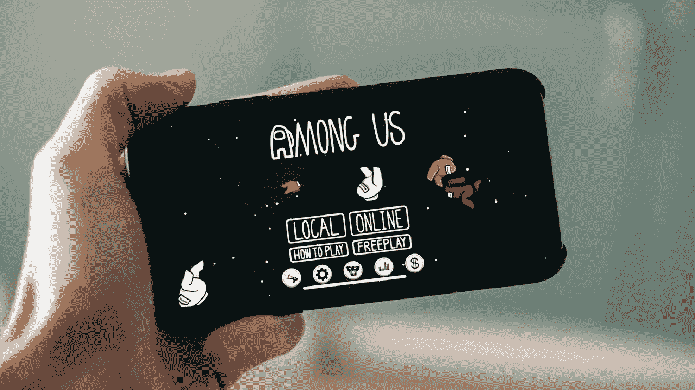

最近我遇到了一个任务，我必须将 Unity AR 模块嵌入到现有的 iOS 应用程序中。

阅读 Unity 的文档后发现，自 v2019.3 以来，Unity 通过其 [Unity as a Library](https://unity.com/features/unity-as-a-library) 功能提供了从原生 iOS 或 Android 应用程序加载和卸载 Unity 游戏的支持。

尽管文档本身非常全面，但仍有一些地方遗漏了，这就是为什么我做了这个演练，让我们开始吧。

# 创建一个 iOS 项目

首先，在工作区中创建一个空的 iOS 项目。一个简单的方法是首先创建一个空的 Xcode 项目，然后转到`File → Save As Workspace`。让我们将项目和工作空间都命名为`SwiftUnity`。

重要提示:确保您选择`Storyboard`作为界面，即使您想使用 SwiftUI，这些步骤也是必需的，因为它们是 Unity 集成工作的关键。

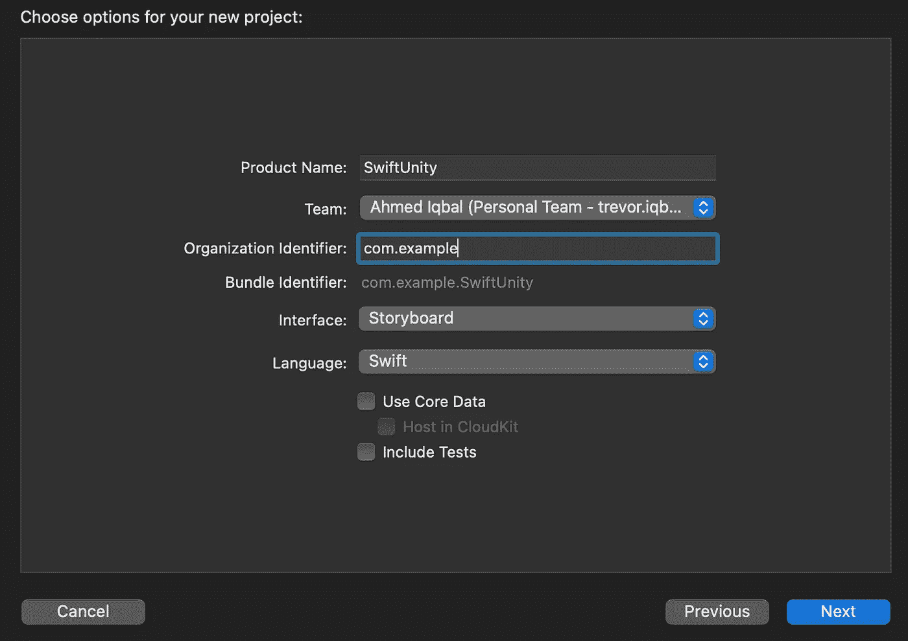

请注意，如果您想进行 SwiftUI 项目，那么不要忘记将最低 iOS 部署目标设置为 13.0。

# **设置 Unity 项目**

因为我们在这里主要关注 iOS，所以我不会深入解释 Unity，而只会关注我们将从 iOS 应用程序中卸载 Unity 模块的部分。

然而，我们需要遵循的一个重要步骤是在我们想要从 Unity 返回到我们的 iOS 应用程序的部分调用`[Application.Unload()](https://docs.unity3d.com/ScriptReference/Application.Unload.html)`。

基本上，这个函数不会完全破坏 unity 实例，而是在内存中保留一些空间，这样，如果用户想要多次打开 Unity 模块，就不需要完全加载 Unity 模块，而是利用现有的保留内存。

现在假设在 Unity 模块中，您已经在想要关闭它的地方放置了一个退出点，并且该退出点与 Unity 模块中的某个按钮相关联。所以简单的调用`[Application.Unload()](https://docs.unity3d.com/ScriptReference/Application.Unload.html)`如下图所示:

现在，一旦你完成以上步骤，打开 Unity 项目，进入文件→构建设置。在这里，您需要将平台从 PC、Mac & Linux Standalone 更改为 iOS，然后单击切换平台按钮。你需要等待 Unity 重新编译。

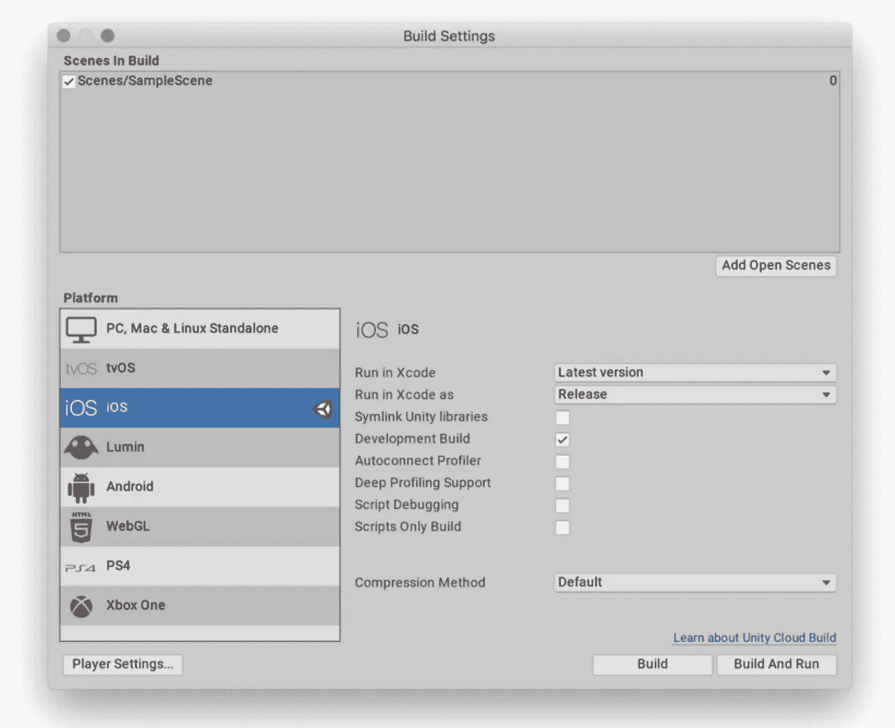

是时候将我们的 Unity 项目导出为 iOS 项目了。您不需要更改任何设置，只需单击 Build。您将在名为`UnityBuild`的文件夹中导出 Unity 项目。所以现在你的文件夹结构应该是这样的

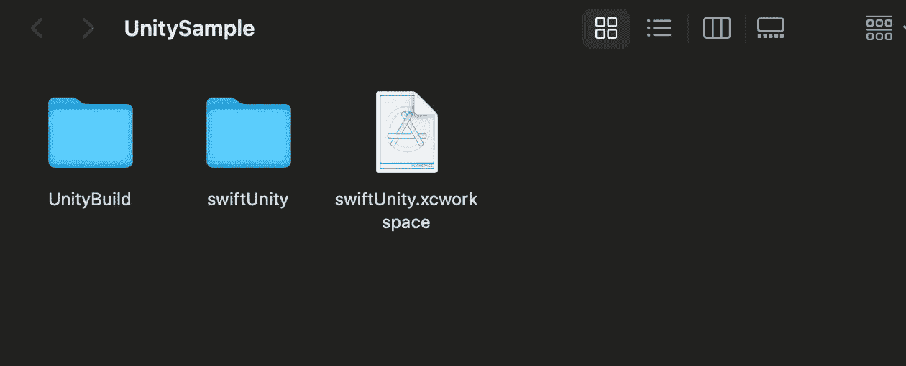

# 在 iOS 中嵌入 Unity

现在，当我们将导出的 Unity 项目与我们的 iOS 应用程序连接时，有趣的部分开始了。打开`swiftUnity.xcworkspace`，它目前只包含`SwiftUnity`项目。

在 Finder 中，找到`UnityExport`项目，将
`Unity-iPhone.xcodeproj`文件拖拽到工作区。

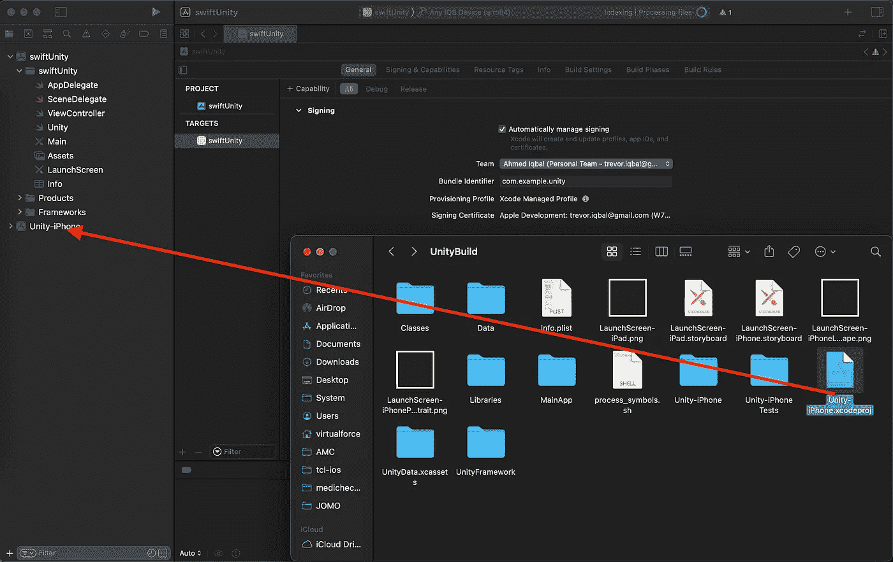

现在`swiftUnity.xcodeproj`和`Unity-iPhone.xcodeproj`都属于同一个工作空间。接下来，点击`swiftUnity`项目并选择 swiftUnity 目标。

从常规菜单中，向下滚动到框架、库和嵌入式内容部分。单击+按钮添加一个新框架。

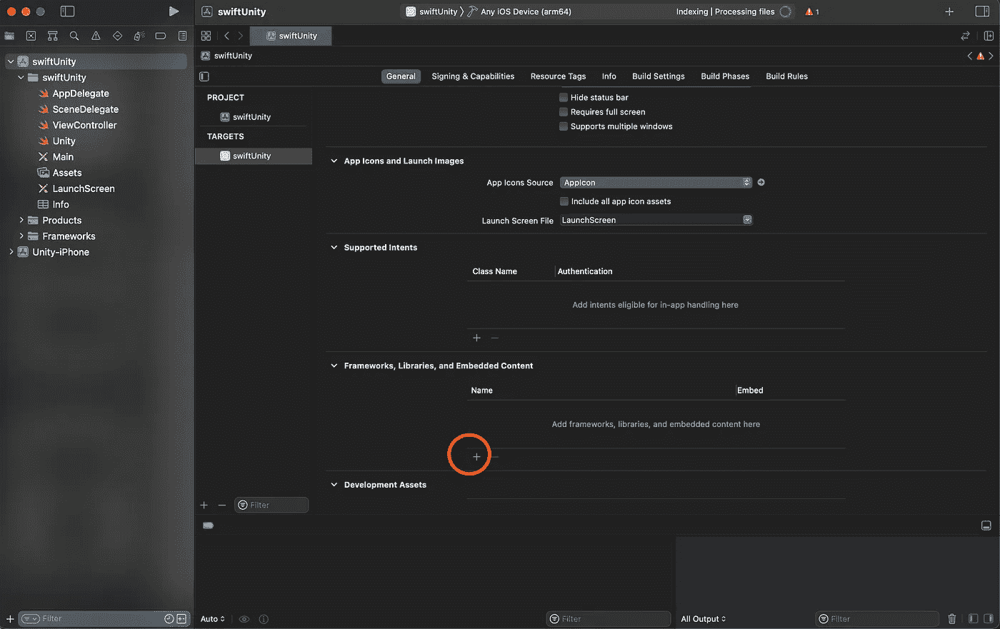

从列表中选择`UnityFramework.framework`并将其添加到项目中。

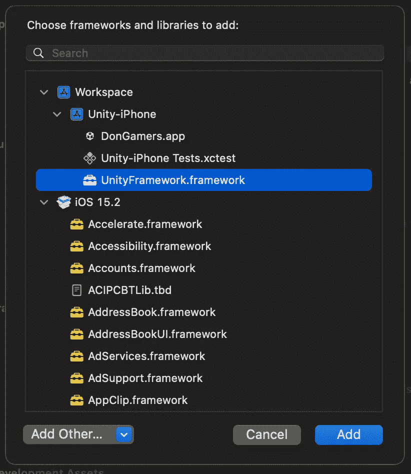

接下来，选择`Unity-iPhone` 项目中的`Data`文件夹。在右边的面板中，你会看到一个的“目标成员”部分。您需要勾选`UnityFramework`旁边的复选框。

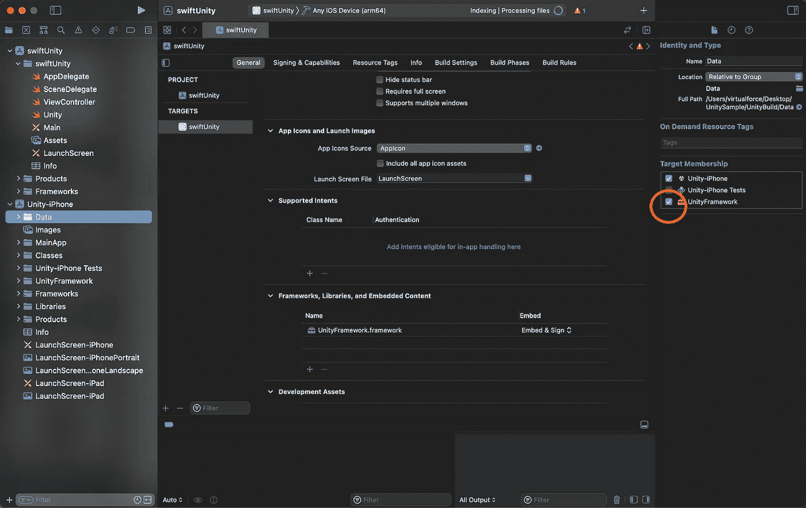

接下来，打开`Info.plist`并移除`Application Scene Manifest`入口。这将暂时中断应用程序，但我们将在稍后的`AppDelegate`中解决它。如果您跳过这一步，那么一旦 unity 实例启动，您将无法返回到您的 iOS 应用程序(调用`Application.Unload()`)。

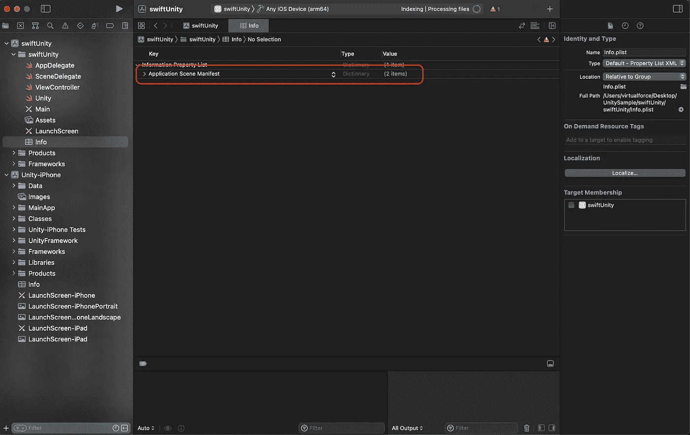

现在在`swiftUnity` 中创建一个 swift 文件，命名为 Unity。将以下代码添加到该文件中。

打开`AppDelegate.swift`并移除所有与场景相关的功能。我们还需要在这里传递对 Unity 的主应用程序窗口引用，因为这是我们卸载 Unity 游戏后将返回的窗口。

经过这些修改后，您的`AppDelegate`应该是这样的:

现在，在您现有的 Xcode 项目中，转到您想要打开 unity 模块的部分，在我的情况下，我将简单地在故事板上放置一个按钮，并打开 unity 模块以打开它的`IBAction`。

就这样，现在是运行和测试应用程序的时候了。

常见问题:如果 Xcode 在完成上述所有步骤后仍无法构建项目，并给出错误提示*“没有这样的模块 unity framework”*，那么只需从上面选择`UnityFramework`并按下`⌘+B`:

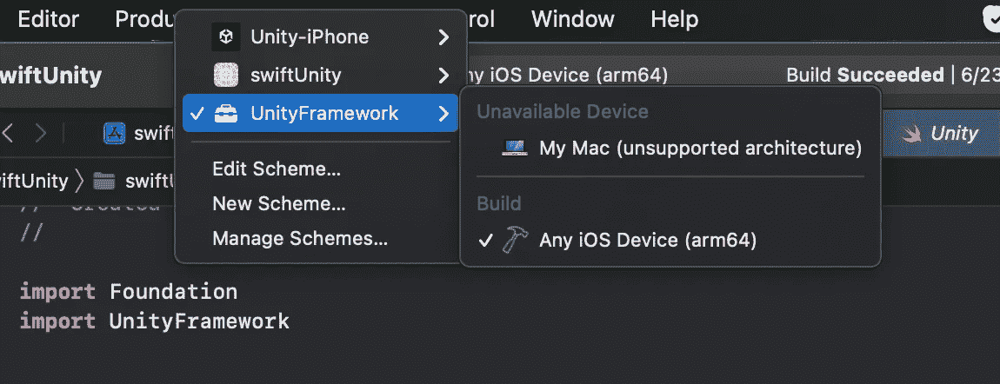

一旦完成，然后选择`Unity-iPhone`并做同样的事情，最后选择回你的 iOS 项目，即`swiftUnity`在我们的情况下，并运行该项目。

另一个需要记住的重要事项是在真实设备上运行项目，而不是在模拟器上。

# 最后外观

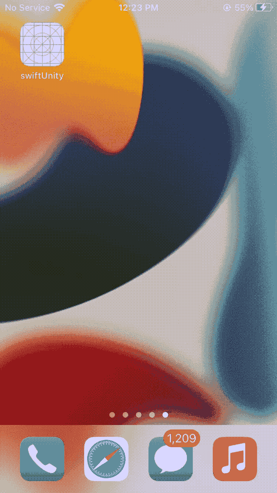 [## GitHub-MH-Ahmed Iqbal/embed-unity:如何在 iOS 应用中嵌入 unity 的演练

### 我们如何在 iOS 应用中嵌入 unity 的演练。为了更好地理解，请点击下面的链接

github.com](https://github.com/mh-ahmediqbal/embed-unity)