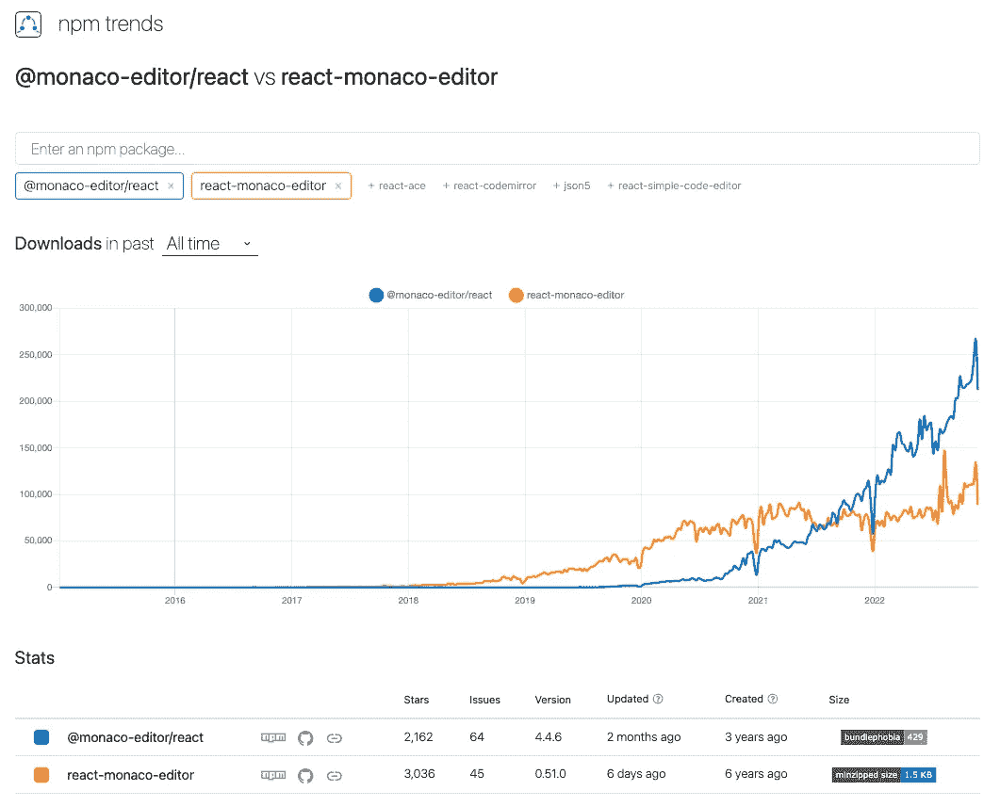
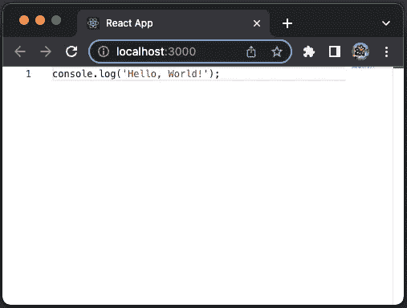
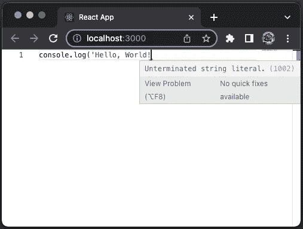
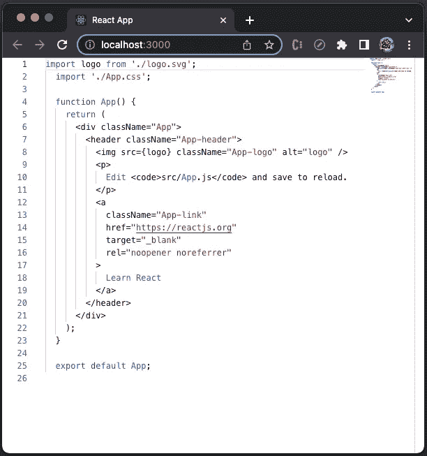
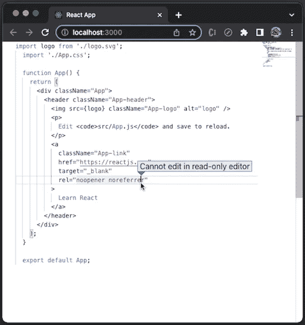
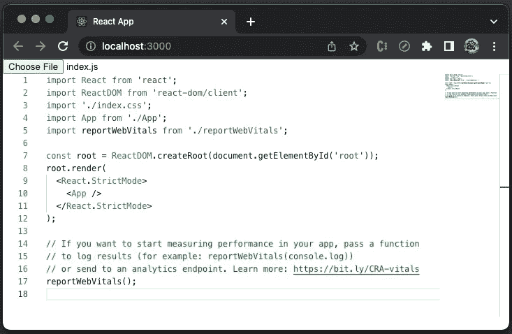
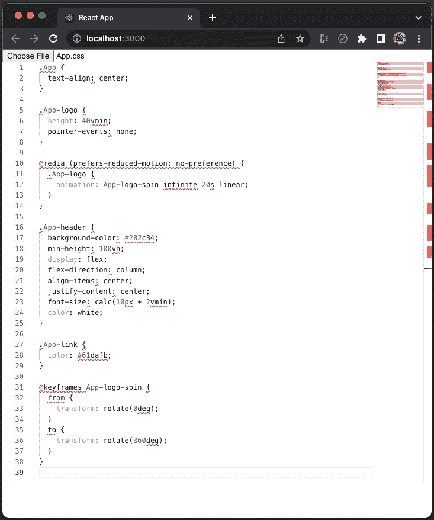
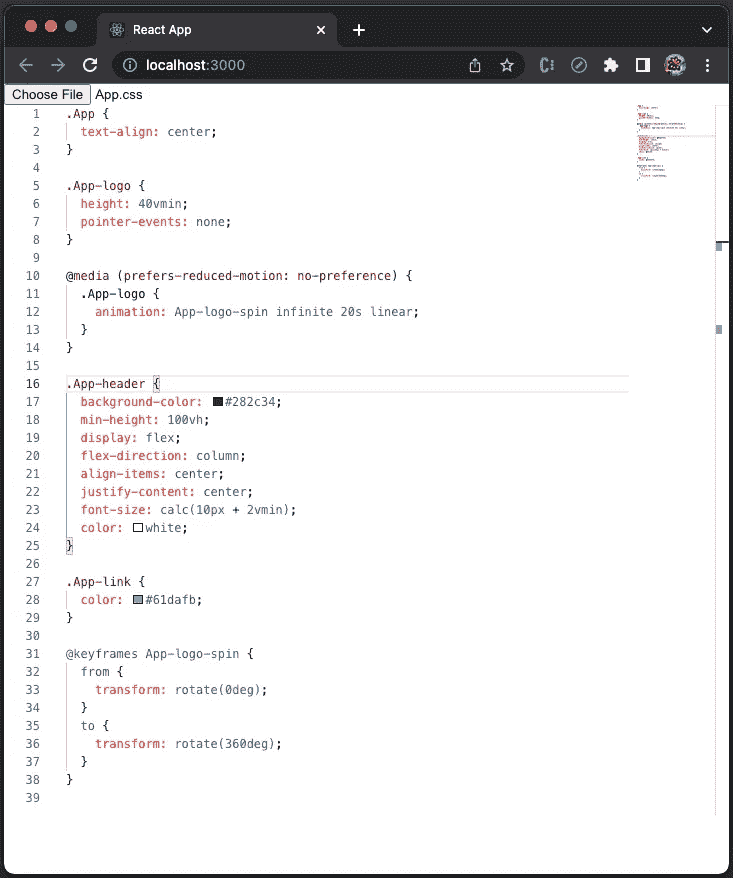
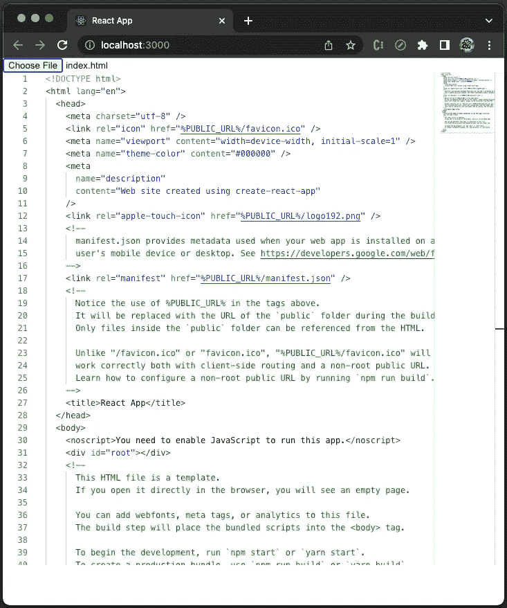
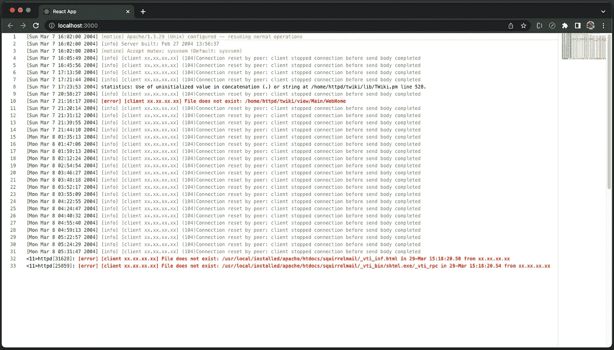

# 如何在 React 应用程序中嵌入摩纳哥编辑器

> 原文：<https://betterprogramming.pub/embedding-a-monaco-editor-inside-react-app-37083cf829e9>

## 一个支持 78 种语言的编辑器，具有语法高亮、自动完成、自动修正等功能。


由 [Setyaki Irham](https://unsplash.com/@setyaki?utm_source=medium&utm_medium=referral) 在 [Unsplash](https://unsplash.com?utm_source=medium&utm_medium=referral) 上拍摄的照片

# 介绍

[Monaco 编辑器](https://github.com/microsoft/monaco-editor)是微软提供的基于浏览器的代码编辑器。它在 MIT 许可证下获得许可，在 Edge、Chrome、Firefox、Safari 和 Opera 中受支持，但在移动浏览器或 web 框架中不受支持。Monaco 编辑器为 Visual Studio Code 提供了动力，这是一个针对 Windows、Linux 和 macOS 的有影响力的 IDE。

目前，Monaco 编辑器支持 78 种语言，具有语法突出显示、自动完成、自动更正和许多更高级的功能。它可以用来创建像 Visual Studio 代码一样复杂的 IDE，或者作为在 web 应用程序中显示工具的代码。

一个 React app 可以直接部署`monaco-editor`，也可以导入一些 React 包装的包。有两个受欢迎的包，`[@monaco-editor/react](https://github.com/suren-atoyan/monaco-react)`和`[react-monaco-editor](https://github.com/react-monaco-editor/react-monaco-editor)`。



作者图片

`react-monaco-editor`上市六年，3036 颗星。它得到了非常积极的管理。它需要 webpack 的改动，对于某些应用来说不方便，比如 [Create React App](/an-in-depth-guide-for-create-react-app-5-cra-5-b94b03c233f2) 。

`@monaco-editor/react`已经上市三年，首发 2，162 次。它得到了相当积极的管理。这个包的吸引力在于，除了安装包本身之外，它不需要任何改变。像 Create React App 这样的应用不需要弹出或重新布线。默认情况下，它使用 CDN 下载`monaco-editor`。然而，将`monaco-editor`作为`npm`包导入可能需要额外的`webpack`插件，比如`monaco-editor-webpack-plugin`。

这时，`@monaco-editor/react`更受欢迎。我们将以此为基础，在 Create React 应用程序中嵌入一个摩纳哥编辑器。

# **依赖关系**在@摩纳哥-编辑/react

`@monaco-editor/react`是 React 的摩纳哥编辑。它在 React 应用程序中使用`monaco-editor`,而不需要为 webpack、rollup、parcel 或任何 bundler 设置插件或修改配置文件。

monaco 编辑器提供了一个名为`loader`的脚本，它提供了下载 Monaco 源代码的工具。名为`[@monaco-editor/loader](https://github.com/suren-atoyan/monaco-loader)`的库处理配置和加载部分。它还提供易于使用的 API 进行交互。在`loader`的帮助下，嵌入一个摩纳哥编辑器只需要一行代码。

下面是`@monaco-editor/react`的`package.json`:

*   在第 22 行，它声明了一个依赖项`@monaco-editor/loader`，它将被安装到`node_modules`。
*   在第 14 和 15 行，它声明了`react`和`react-dom`的`[peerDependencies](/package-jsons-dependencies-in-depth-a1f0637a3129)`。一个`peerDependency`声明了包的兼容版本。如果`peerDependency`已经以正确的版本存在于`node_modules`中，则不会发生任何事情。否则，安装会显示警告。
*   在第 13 行，`@monaco-editor/react`也被声明为`peerDependency`。如果它不存在，安装将显示以下警告。

```
warning " > @monaco-editor/react@4.4.6" has unmet peer dependency "monaco-editor@>= 0.25.0 < 1".
```

没有`@monaco-editor/react`代码也能工作。但是没有`monaco-editor`的`TypeScript`定义它也能工作。如果你想把类型定义放在手边，需要安装`monaco-editor`。

# 设置工作环境

我们将在 Create React 应用程序中嵌入一个摩纳哥编辑器。以下命令创建一个 React 项目:

```
% yarn create react-app react-monaco-editor
% cd react-monaco-editor
```

我们安装`@monaco-editor/react`和`monaco-editor`。

```
% yarn add @monaco-editor/react monaco-editor
```

安装后，这些包成为`package.json`中`dependencies`的一部分:

```
"dependencies": {
  "@monaco-editor/react": "^4.4.6",
  "monaco-editor": "^0.34.1"
}
```

工作环境准备好了。

# 在 React 应用程序中嵌入一个摩纳哥编辑器

事实上，如果导入行不算的话，使用 Monaco 编辑器只需要一行代码。

下面是修改后的`src/App.js`:

*   在第 1 行，`Editor`是从`'@monaco-editor/react'`进口的。
*   在第 5 行，创建了带有`100%`视图高度(`vh`)的摩纳哥编辑器。它指定`language`是`javascript`，而`value`是`console.log('Hello, World!');`。

执行`yarn start`，摩纳哥编辑器嵌入 React app，内容预定义。



作者图片

# 智能感知功能和支持语言

尝试删除上面编辑器中的一些字符，它显示一个验证消息:`Unterminated string literal`。



作者图片

是的，编辑器具有验证功能。

`IntelliSense`是各种代码编辑功能的总称，包括代码完成、参数信息、快速信息和成员列表。`IntelliSense`Visual Studio 代码中可用的特性在 Monaco 编辑器中也可用。开箱后，`IntelliSense`准备好`typescript`、`javascript`、`css`、`less`、`scss`、`json`、`html`。

目前，摩纳哥编辑器支持 78 种语言，这些语言是在`[monaco.contribution.ts](https://github.com/microsoft/monaco-editor/blob/main/src/basic-languages/monaco.contribution.ts)`输入的。随着时间的推移，这个列表还会继续增长。

# 摩纳哥编辑器选项

默认编辑器可编辑行号。让我们提供一个更长的代码嵌入到`src/App.js`中:

*   在第 4-29 行，`value`被赋予了原始`src/App.js`的内容。
*   在第 32 行，编辑器中显示`value`。

执行`yarn start`，摩纳哥编辑器显示行号。如果您尝试修改代码，它是可编辑的。



作者图片

将道具`options`添加到编辑器中。

```
<Editor
  height="100vh"  
  language="javascript"
  value={value}
  options={{ readOnly: true, lineNumbers: 'off' }}
/>
```

编辑器变成没有行号的只读。



作者图片

除了`readonly`和`lineNumbers`，界面中还有很多选项，`IEditorOptions`。

# 给摩纳哥的编辑拿一个文件

我们在上面的`src/App.js`中硬编码了`value`，这不是一个好的做法。其中一个选择是使用文件上传器来动态加载文件。

下面是修改后的`src/App.js`:

*   在第 4–6 行，使用`<input type="file">`定义组件`FileUploader`，这是带有`Choose File`按钮的文件选择字段，用于文件上传。选择文件后，触发`onFileLoad`功能(第 5 行)至`setFile`(第 24 行)。
*   在第 9 行，为所选文件创建状态`file`。
*   在第 10 行，为所选文件内容创建状态`value`。
*   在第 12-20 行，当`file`改变时`useEffect`被触发。它创建一个`FileReader`(第 14 行)，读取文件内容(第 18 行)，然后`setValue`读取文件内容(第 16 行)。
*   在第 24 行，添加了`FileUploader`。
*   在第 25 行，将编辑器的高度调整到`90vh`。

执行`yarn start`，点击`Choose File`按钮，加载 Create React App 的`src/index.js`:



作者图片

动态加载不是很整洁吗？

装载`src/App.css`:



作者图片

我们看到相当多的语法错误。怎么了？

这是因为我们对`language`到`javascript`进行了硬编码。需要根据加载文件的类型进行调整。`file`有一个带文件扩展名的`name`字段和一个`type`字段。文件扩展名可以是`'js'`、`'css'`、`'html'`、`'json'`等。一个`type`字段可以是`"text/javascript"`、`"text/css"`、`"text/html"`、`"text/json"`等。

我们使用文件扩展名来设置文件类型。下面是修改后的`src/App.js`:

*   在第 11 行，为所选择的语言创建状态`language`，该状态在第 34 行使用。
*   在第 20–27 行，评估文件扩展名以生成`newLanguage`，它被用于`setLanguage`(第 27 行)。

再次加载`src/App.css`，没有语法错误。



作者图片

装载`public/index.html`:



作者图片

# 创造你自己的语言

尽管 Monaco 编辑器支持多种语言，但您可能想要创建自己的语言。我们展示了一个如何做的例子。

正如我们提到的`@monaco-editor/loader`处理配置和加载部分，`loader.init()`处理整个初始化过程并返回`monaco`的实例。`Editor`组件使用这个工具——获得对`monaco`的访问权并创建编辑器。

下面的例子改编自 [office 网站](https://microsoft.github.io/monaco-editor/playground.html#extending-language-services-custom-languages)，它为日志文件中的特定内容打开颜色。

*   在第 4–40 行，它定义了一个函数来返回日志文件内容。
*   在第 43–119 行，`useEffect`调用`loader.init()`来定义一种新语言`mySpecialLanguage`。
    –在第 46 行，注册新语言。
    –在第 49–58 行，它基于正则表达式定义了四个记号:`custom-error`(第 52 行)、`custom-notice`(第 53 行)、`custom-info`(第 54 行)和`custom-date`(第 55 行)。
    –在第 61–73 行，它定义了包含语言规则的`myCoolTheme`主题，`custom-info`为灰色(`#808080` ，第 65 行)，`custom-error`为红色(`#FF0000`，第`bold`(第 66 行)，`custom-notice`为橙色(`#ffa500`，第 67 行)，`custom-date`为绿色(`#008800`，第 68 行)，默认颜色为黑色(`#000000`，第 71 行)。
    –在第 76–108 行，它注册了一些自动完成快捷键，`simpleText`(第 79–83 行)，`testing`(第 84–90 行)，以及`ifelse`(第 91–104 行)。
    –在第 110–117 行，它创建具有指定主题(`myCoolTheme`，第 113 行)、值(`getCode()`，第 114 行)和语言(`mySpecialLanguage`，第 115 行)的编辑器。第 111 行的条件确保编辑器被添加一次。
*   在第 121 行，它创建了高度为`100vh`的`container`和`div`。

执行`yarn start`，我们会在编辑器中看到彩色的日志文件。



作者图片

这个例子注册了一些自动完成快捷键，`simpleText`、`testing`和`ifelse`。以下视频展示了它的工作原理:

作者图片

# 使用 Monaco 编辑器区分文件

Monaco 编辑器提供了比较两个文件的 diff 编辑器。用法很简单。

下面是修改后的`src/App.js`:

*   在第 1 行，`DiffEditor`从`'@monaco-editor/react'`导入。
*   在第 5-9 行，使用了`DiffEditor`，并带有`original`和`modified`内容的道具。

执行`yarn start`，我们看到代码不同。


作者图片

# 结论

我们在 React 应用程序中嵌入了一个摩纳哥编辑器。它支持几乎所有流行的语言，语法突出。对于`typescript`、`javascript`、`css`、`less`、`scss`、`json`、`html`，提供`IntelliSense`，包括代码完成、参数信息、快速信息、成员列表。此外，我们可以为附加功能创建自己的语言，例如颜色主题、自动完成和自动更正。

我们已经展示了如何在`Editor`中显示一个硬编码文件，在`Editor`中显示一个动态加载文件，在`DiffEditor`中显示两个文件的例子。

如果您只需要语法突出显示，您可能想看一看 [Prism](https://medium.com/javascript-in-plain-english/how-to-embed-a-prism-syntax-highlighter-in-react-apps-70eb263be5d) ，这是一个轻量级的、健壮的 JavaScript 库，可以执行语法突出显示。

感谢阅读。

> 感谢 S . Sreeram 和悉达多.钦塔帕利与我在摩纳哥编辑器上的合作。

```
**Want to Connect?**

If you are interested, check out [my directory of web development articles](https://jenniferfubook.medium.com/jennifer-fus-web-development-publications-1a887e4454af).
```