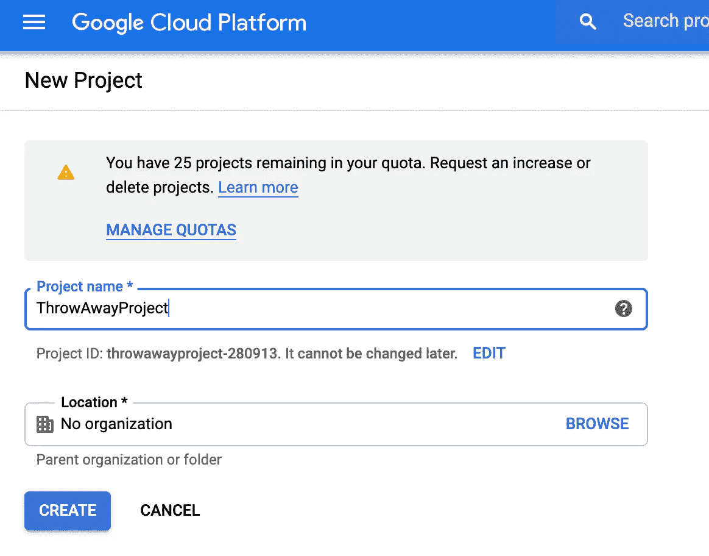
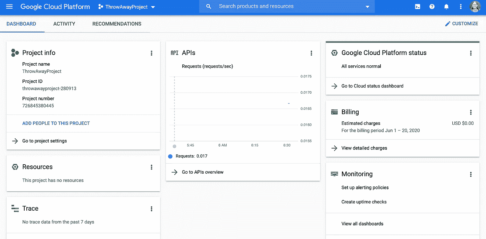
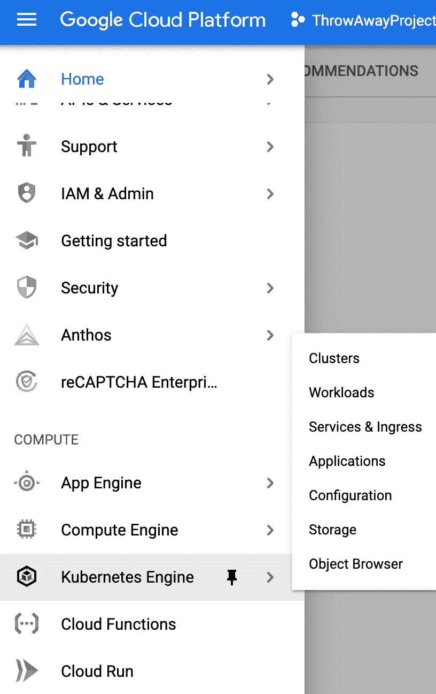
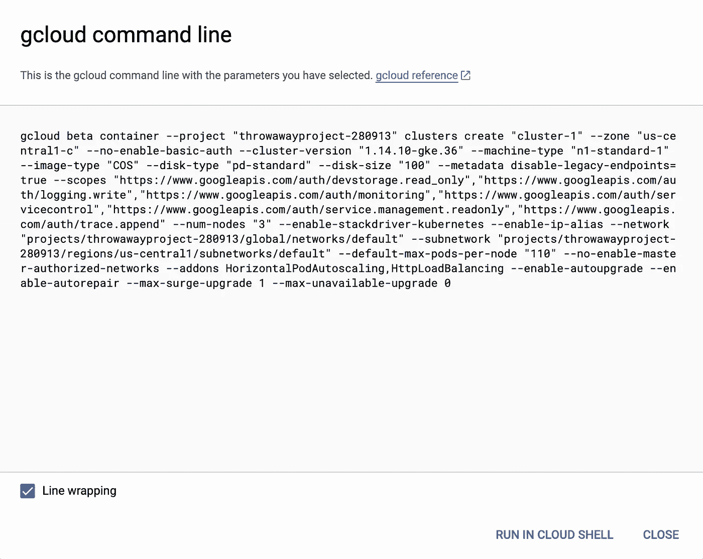
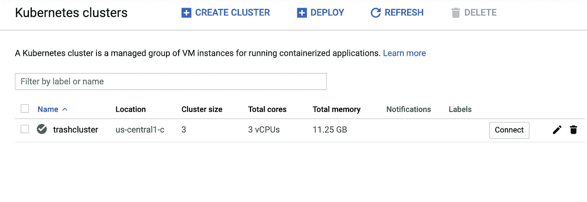

# 拥抱云

> 原文：<https://betterprogramming.pub/embrace-the-cloud-7a6d1c373b7a>

## 如何在云中移动您的 Kubernetes 应用程序


图片由[大卫·马克](https://pixabay.com/users/12019-12019/?utm_source=link-attribution&utm_medium=referral&utm_campaign=image&utm_content=1768742)从[皮克斯拜](https://pixabay.com/?utm_source=link-attribution&utm_medium=referral&utm_campaign=image&utm_content=1768742)拍摄

在我之前关于从零开始使用[Kubernetes](https://medium.com/better-programming/kubernetes-from-scratch-4691283e3995)的系列文章中，我演示了在裸机上运行 Kubernetes。这帮助我了解了 Kubernetes 的许多复杂之处，以及云提供商通常会处理的所有事情。但我的另一个目标是将 Kubernetes 提供的内容和云提供商处理的内容分开。

根据我的经验，云提供商喜欢模糊 Kubernetes 和他们的产品之间的界限。也许对此有一个简单的解释——直接的 Kubernetes 很复杂，所以作为一种增值，他们制作自己的命令或 GUI 界面来代替命令和描述。但如果你理解并严格使用 Kubernetes，你将能够做出更好的商业决策，并转向另一个更便宜的 Kubernetes 云提供商。最终，提供 Kubernetes 集群应该成为一种商品服务，就像提供云虚拟机一样。

所以今天，我要与魔鬼共舞，将我的一些应用移植到谷歌云平台(GCP)上运行。我不会让我的 GCP 集群运行很长时间，因为我不想在谷歌上欠下一大笔账。他们已经够富有了，他们不需要我的微薄的钱！但是，请将此视为一个演示，说明作为一名 IT 经理或 CTO，您可以如何将您的内部运营转移到 Google 专家的安全区域。

你需要一个 GCP 的账户，如果你还没有，去[https://cloud.google.com/](https://cloud.google.com/)点击“免费开始”按钮。从那以后，你就可以自己设置你的账户了。如果太复杂，也许看看 AWS 或 Azure——如果创建一个帐户很难，想象一下用它运行会是什么样子！GCP 免费提供一些时间和资源，但是买家要小心，确保你不会因为这样或那样的事情而被收费。

首先是建立一个项目。项目只是所有资源所在的分组。你可以给人不同的角色，设立预算，最重要的是，删除项目的时候把所有的资源都删除了。一旦你做好准备，你就不会想要任何资源了。



一旦你创建了你的项目，你应该有一个控制台。这是我的样子:



左上角的“汉堡”菜单(三条堆叠的水平线)是你找到路的钥匙。让我们找到去库伯内特斯的路。



选择集群以开始创建 Kubernetes 集群。如果这是您的第一个 Kubernetes 集群，这将需要一些时间，因为它必须设置 API。当轮盘完成旋转后，点击屏幕中间的“创建集群”按钮。给你的集群起一个名字，其余的你可以保留为默认值，然后点击“创建”按钮。同样，车轮会旋转一段时间。

创建完成后，您将拥有一个三节点集群。你可以点击这里，检查集群的各个部分。我的两篇关于 Kubernetes 的文章总共花了 22 分钟——你只需要点击几下按钮就可以完成同样的事情！

为了拥有任何有状态的应用程序(比如数据库)，您需要有存储。单击左侧的“存储”选项卡。单击“存储类”，您可以看到已经有一个名为“标准”的存储类。我的[建立你自己的家庭云存储](https://medium.com/me/stats/post/1aa74b5c6397)的两个部分，一个 18 分钟的阅读，已经自动完成。

如果您对为您创建的内容不感兴趣，使用这个 GUI 可以节省大量时间。唯一的问题是，你能复制它吗？你还记得你选择的所有选项和你到达目的地的路径吗？在这种情况下，你可能会这样做——我们只是采用了默认选项，点击非常直观。但是我们将要探索的案例要复杂得多，我们需要可重复性。任何脚本都应该保存在版本控制库中。

对于任何填充的 GUI 表单，GCP 经常会给出等价的命令行。在 Create Cluster 屏幕的底部，有指向 REST 和命令行等效项的链接。单击等效命令行，您会看到以下命令:



因此，您可以将它保存到脚本中供以后使用。通过参数化，你就有了一个随意创建集群的模板。但它不是 Kubernetes 命令(没有创建集群的 Kubernetes 命令),而是一个`gcloud`命令。那是从哪里来的？您必须将它安装在要控制集群的系统上。

在过去使用过`gcloud`之后，我可以说它以一种很难移除的方式插入到你的系统中。我肯定不想再装在笔记本上了。我将把我的一台家庭服务器配置成一种跳转框，任何时候我想运行访问 GCP Kubernetes 集群的`gcloud`命令或`kubectl`命令，我都会在那里 ssh。

为了让`gcloud`安装在你选择的系统上，你可以按照[这里的说明](https://cloud.google.com/sdk/docs/downloads-versioned-archives)。这将给你一个到压缩版本的链接，你可以在你的系统上下载和解压。然后可以运行`./google-cloud-sdk/install.sh`命令将所有东西添加到您的路径中。注销并重新登录，这样你的路径就设置好了，并检查以确保你可以运行`gcloud`——不带参数运行会给你一个子命令列表。

一旦您安装了`gcloud`，您可以通过点击 GCP 集群控制台上的“连接”按钮来设置它以访问您的集群:



这将为您提供命令行来设置对 Kubernetes 集群的访问。运行它，它会温和地提醒你先登录:

```
rkamradt@artful:~$ gcloud container clusters get-credentials trashcluster --zone us-central1-c --project throwawayproject-280913
WARNING: Could not open the configuration file: [/home/rkamradt/.config/gcloud/configurations/config_default].
ERROR: (gcloud.container.clusters.get-credentials) You do not currently have an active account selected.
Please run:$ gcloud auth loginto obtain new credentials.
```

运行`gcloud auth login`，它会给你一个在你的浏览器中打开的 URL，这将给你一个令牌。将该令牌复制并粘贴回命令行中应该提示它的位置。现在您可以设置您的默认项目:

```
rkamradt@artful:~$ gcloud config set project throwawayproject-280913
Updated property [core/project].
rkamradt@artful:~$ gcloud container clusters get-credentials trashcluster --zone us-central1-c --project throwawayproject-280913
Fetching cluster endpoint and auth data.
kubeconfig entry generated for trashcluster.
rkamradt@artful:~$
```

因为您已经在第一个命令中设置了默认项目，所以您可能不需要在第二个命令中提到它，但是我还是提到了，因为它已经在我的命令历史中了。现在你可以像平常一样运行`kubectl`命令了(默认情况下，安装`gcloud`不会安装`kubectl`)。如果尚未安装，您需要根据适用于您的主机类型的说明进行安装):

```
rkamradt@artful:~$ kubectl get nodes
NAME                                          STATUS   ROLES    AGE   VERSION
gke-trashcluster-default-pool-6ed65e2f-73ns   Ready    <none>   59m   v1.14.10-gke.36
gke-trashcluster-default-pool-6ed65e2f-8rrx   Ready    <none>   59m   v1.14.10-gke.36
gke-trashcluster-default-pool-6ed65e2f-bm3x   Ready    <none>   59m   v1.14.10-gke.36
```

现在我们来看这篇文章的要点——更新配置文件，使它们可以在 GCP 运行。

我将使用我在文章[如何使用 Kubernetes Cron Jobs 中介绍的系统来定期阅读新闻](https://levelup.gitconnected.com/how-to-use-kubernetes-cron-jobs-to-periodically-read-the-news-8b3b4513f8b7)，并且我碰巧将所有部署文件存储在我的 GitHub 存储库 [news-deploy](https://github.com/rkamradt/news-deploy/tree/gcp) 中。因此，我将该存储库克隆到我的主机上，并为 GCP 更改创建一个分支:

```
git clone git@github.com:rkamradt/news-deploy.git
cd news-deploy
git checkout -b gcp
```

我做的第一件事是创建名称空间。这应该不需要修改，我应该能够运行描述符。

```
kubectl create -f namespace.yaml
kubectl config set-context --current --namespace=nr
```

这将创建`nr`名称空间并将其设置为默认名称空间，因此我们不必到处键入`-n nr`。

我想做的下一件事是调出 MongoDB。这将需要一些修改来使用新的`StorageClass` `standard`。这里是`mongodb.yaml`现在的样子:

```
apiVersion: apps/v1
kind: StatefulSet
metadata:
  name: mongodb
spec:
  serviceName: "mongodb"
  replicas: 1 
  selector:
    matchLabels:
      app: mongodb
  template:
    metadata:
      labels:
        app: mongodb
        selector: mongodb
    spec:
      containers:
      - name: mongodb
        image: mongo:4.0.8
        env:
          - name: MONGO_INITDB_ROOT_USERNAME
            valueFrom:
              secretKeyRef:
                name: mongo-secret
                key: username
          - name: MONGO_INITDB_ROOT_PASSWORD
            valueFrom:
              secretKeyRef:
                name: mongo-secret
                key: password
        volumeMounts:
        - name: mongodb-data
          mountPath: /data/db
  volumeClaimTemplates:
  - metadata:
      name: mongodb-data
      annotations:
        volume.beta.kubernetes.io/storage-class: "standard"
    spec:
      accessModes: [ "ReadWriteOnce" ]
      resources:
        requests:
          storage: 10Gi---
apiVersion: v1
kind: Service
metadata:
  name: mongodb
  labels:
    name: mongodb
spec:
  ports:
  - port: 27017
    targetPort: 27017
  clusterIP: None
  selector:
    app: mongodb
```

注意它正在使用`volumeClaimTemplates`，这意味着它将根据需要为您创建存储。但是在部署它之前，我们需要添加一个秘密，以便 MongoDB 和使用它的应用程序在用户名和密码上协调一致。

```
kubectl create secret generic mongo-secret \
    --from-literal=username=mongo \
    --from-literal=password=*****
```

你必须使用你自己的密码。现在您可以部署 MongoDB 了:

```
kubectl apply -f mongodb.yaml
```

您可以使用`kubectl get all`命令来确保一切正常运行:

```
rkamradt@artful:~/news-deploy$ kubectl get all
NAME            READY   STATUS    RESTARTS   AGE
pod/mongodb-0   1/1     Running   0          54sNAME              TYPE        CLUSTER-IP   EXTERNAL-IP   PORT(S)     AGE
service/mongodb   ClusterIP   None         <none>        27017/TCP   53sNAME                       READY   AGE
statefulset.apps/mongodb   1/1     54s
```

新闻阅读器应用程序需要一个来自 newsapi.org 的密钥。如果你没有遵循我的文章[如何使用 Kubernetes Cron Jobs 定期阅读新闻](https://levelup.gitconnected.com/how-to-use-kubernetes-cron-jobs-to-periodically-read-the-news-8b3b4513f8b7)，你可以在[newsapi.org](https://newsapi.org/)创建一个帐户，并获得一个免费的密钥。然后用他们给你的密钥设置另一个秘密。

```
kubectl create secret generic newsapi-key \
    --from-literal=key=<your-newsapi-key>
```

现在你可以运行`newsreader-cronjob.yaml`来启动新闻阅读器:

```
kubectl apply -f newsreader-cronjob.yaml
```

它被设计为每小时运行 7 分钟，所以你必须休息一下，直到它运行一次。一旦它运行，您将看到它被列为`Completed`:

```
rkamradt@artful:~/news-deploy$ kubectl get pods
NAME                                  READY   STATUS      RESTARTS   AGE
mongodb-0                             1/1     Running     0          54m
newsreader-cronjob-1592669220-8gskc   0/1     Completed   0          2m17s
```

现在我们可以部署我们的阅读服务了。这将创建一个读取数据库并返回内容的服务。在运行它之前，我将编辑`readnews.yaml`并将`ClusterIP`改为`LoadBalancer`。然后你可以应用它:

```
kubectl apply -f readnews.yaml
```

再次运行`kubectl get all`命令，查看我们已经启动的所有内容:

```
rkamradt@artful:~/news-deploy$ kubectl get all
NAME                                       READY   STATUS      RESTARTS   AGE
pod/mongodb-0                              1/1     Running     0          147m
pod/newsreader-cronjob-1592669220-8gskc    0/1     Completed   0          94m
pod/newsreader-cronjob-1592672820-qhjmf    0/1     Completed   0          34m
pod/readnews-deployment-79575dbfd4-jqsk8   1/1     Running     0          17mNAME                       TYPE           CLUSTER-IP   EXTERNAL-IP      PORT(S)          AGE
service/mongodb            ClusterIP      None         <none>           27017/TCP        147m
service/readnews-service   LoadBalancer   10.40.0.24   35.232.171.241   8080:31997/TCP   17mNAME                                  READY   UP-TO-DATE   AVAILABLE   AGE
deployment.apps/readnews-deployment   1/1     1            1           17mNAME                                             DESIRED   CURRENT   READY   AGE
replicaset.apps/readnews-deployment-79575dbfd4   1         1         1       17mNAME                       READY   AGE
statefulset.apps/mongodb   1/1     147mNAME                                      COMPLETIONS   DURATION   AGE
job.batch/newsreader-cronjob-1592669220   1/1           9s         94m
job.batch/newsreader-cronjob-1592672820   1/1           9s         34mNAME                               SCHEDULE    SUSPEND   ACTIVE   LAST SCHEDULE   AGE
cronjob.batch/newsreader-cronjob   7 * * * *   False     0        35m             136m 
```

`readnews-service`上的外部 IP 地址可能会暂时显示为空或待定。一旦它被填写，复制外部 IP 地址，你应该能够卷曲它:

```
rkamradt@artful:~/news-deploy$ curl [http://35.232.171.241:8080/v1/headlines](http://35.232.171.241:8080/v1/headlines)
data:{"source":{"id":null,"name":"The Washington Post"},"author":"DeNeen L. Brown","title":"Tulsa’s ugly racial history: From Trail of Tears to deadly 1921 race massacre - The Washington Post","description":"The city where President Trump will hold his first political rally in months has a fraught racial history that begins with the Indian Removal Act in 1830 and ends with the city’s plan to dig for possible mass graves from a deadly 1921 race massacre.","url":"[https://www.washingtonpost.com/history/2020/06/20/tulsa-timeline-race-massacre-trump-rally-juneteenth/](https://www.washingtonpost.com/history/2020/06/20/tulsa-timeline-race-massacre-trump-rally-juneteenth/)","urlToImage":"[https://www.washingtonpost.com/wp-apps/imrs.php?src=https://arc-anglerfish-washpost-prod-washpost.s3.amazonaws.com/public/GIZOKG4MBFHF3DUAB6I2X2PTTQ&w=1440](https://www.washingtonpost.com/wp-apps/imrs.php?src=https://arc-anglerfish-washpost-prod-washpost.s3.amazonaws.com/public/GIZOKG4MBFHF3DUAB6I2X2PTTQ&w=1440)","publishedAt":"2020-06-20T13:47:43Z","content":"Heres a timeline of Tulsas past:\r\n1830 The Indian Removal Act is signed by President Andrew Jackson, pushing 60,000 Native Americans, including the Cherokee, Creek, Seminole, Choctaw, and Chickasaw, … [+5871 chars]"}
...
```

还能做什么？

我几次试图获得一个合适的入口，允许我为多个端点使用一个 IP，并成为一个 SSL 终端，但谷歌 GUI 界面让我困惑。我确信，如果我的工作依赖于它，我可以强行通过它，或者，如果我有服务合同，我可以打电话支持。但是对我来说，对于像 Kubernetes 这样复杂的东西，被一个“简单”的 GUI 界面所诱惑是一个不好的信号。这不是 GCP 第一次让我失望，但我也确信每个云提供商都有同样的问题。我打算称之为成功，并删除我的项目，以确保我不会产生任何费用！

我希望在这里展示的是，除了创建集群和创建入口的失败尝试之外，我只需要对我已经存在的部署文件进行微小的更改。虽然我不想降低将真实项目从内部迁移到云或者从一个云服务迁移到另一个云服务的难度，但是这是可能的。也许有一天，折扣云提供商会提供廉价的商用 Kubernetes 集群。通过卸载一些专业知识给你，价格会下降，对你来说唯一的区别是聘请 Kubernetes 专家，而不是 GCP 或 AWS 专家。

感谢阅读。我希望我已经对直接的 Kubernetes 和云提供商提供的 Kubernetes 之间的差异有了一些了解。

*注意:在撰写本文时，在 Google 云平台上运行 Kubernetes 集群需要花费 0.65 美元。完成后一定要删除你的项目，以免收到谷歌的惊喜账单。*

下面是包含必要脚本的 GitHub 存储库:

[](https://github.com/rkamradt/news-deploy/tree/gcp) [## rkamradt/新闻-部署

### 用于部署新闻阅读器/readnews 微服务的脚本- rkamradt/news-deploy

github.com](https://github.com/rkamradt/news-deploy/tree/gcp) 

其他一些文章提到:

[](https://medium.com/better-programming/kubernetes-from-scratch-4691283e3995) [## 从零开始

### 不含 Minikube 或 Microk8s 的 Kubernetes

medium.com](https://medium.com/better-programming/kubernetes-from-scratch-4691283e3995) [](https://medium.com/better-programming/build-your-own-in-home-cloud-storage-1aa74b5c6397) [## 构建您自己的家庭云存储(第 1 部分)

### 将可共享存储添加到您的家庭网络中

medium.com](https://medium.com/better-programming/build-your-own-in-home-cloud-storage-1aa74b5c6397) [](https://levelup.gitconnected.com/how-to-use-kubernetes-cron-jobs-to-periodically-read-the-news-8b3b4513f8b7) [## 如何使用 Kubernetes Cron Jobs 定期阅读新闻

### 阅读新闻的微服务。

levelup.gitconnected.com](https://levelup.gitconnected.com/how-to-use-kubernetes-cron-jobs-to-periodically-read-the-news-8b3b4513f8b7)