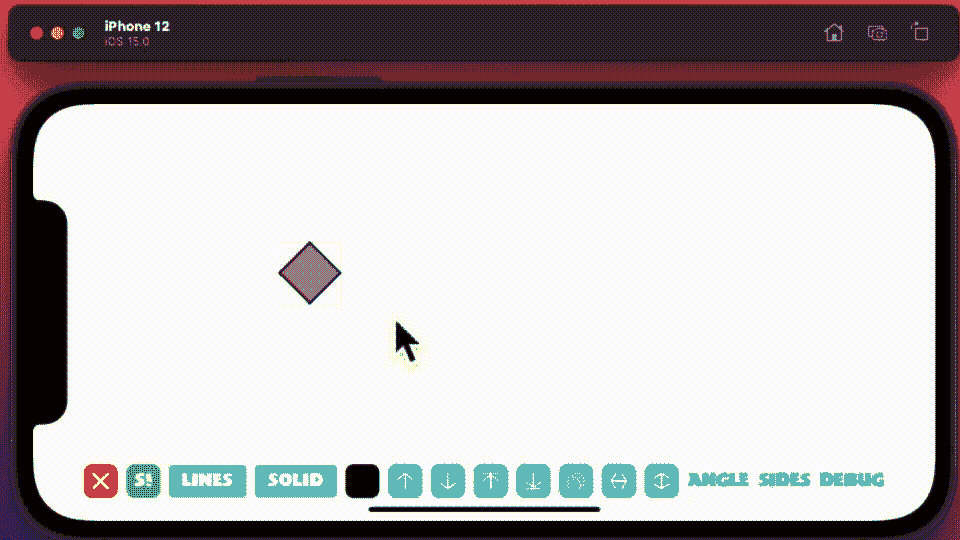

# 在 SwiftUI 绘画应用中采用算法

> 原文：<https://betterprogramming.pub/embracing-algorithms-in-your-swiftui-painting-app-652f8b8cd604>

## 完成构建我们的 iOS paint 应用程序的旅程


[莎伦·麦卡琴](https://unsplash.com/@sharonmccutcheon?utm_source=unsplash&utm_medium=referral&utm_content=creditCopyText)在 [Unsplash](https://unsplash.com/s/photos/colours?utm_source=unsplash&utm_medium=referral&utm_content=creditCopyText) 上的照片

我希望你已经阅读了这个简短系列的第一部分、第二部分和第三部分，在这个系列中，我开发了一个简单的绘画应用程序。

1.  [用 SwiftUI 在 iOS 15 中搭建绘画 App](/build-a-painting-app-in-ios-15-with-swiftui-bb757a925f6a)
2.  [向您的 SwiftUI 绘画应用添加形状和颜色](/adding-shapes-and-colors-to-your-swiftui-painting-app-751dbb6fdce3)
3.  [向 SwiftUI 绘画应用添加更多控件](/adding-more-controls-to-your-swiftui-painting-app-8edaede63e7e)

# 简短的

这是构建绘画应用系列的最后一篇，我希望巩固我所做的大部分工作，最终做出一些实质性的改变。最大的变化是我在上一篇文章中添加的控件代码。这一灵感来自于[拥抱算法 WWDC2018 演示](https://developer.apple.com/videos/play/wwdc2018/223/)的 17 分钟外卖——戴夫·亚伯拉罕斯在这个外卖中谈论如何修复他自己的绘画应用。

他告诉我们，他需要解决的一个问题是关注代码的可靠性、可维护性和性能。他的任务是删除所有的“原始循环”，尽可能用库代码替换它们。

除了演讲中启发的变化，我还添加了一些我还没有做的新功能，即一些对齐按钮和一个复制/粘贴按钮。我对`ContentView.swift`做了一些其他的改变，试图控制它对 CPU 的需求。

# 代码

所以对于业务部门来说——首先将所有函数移动到它们自己的文件中，`Shapes.swift`——我也移动了它们引用的数据结构。当我重新起草代码时，我是在现在移动的数据结构中这样做的。

让我们从`Shapes.swift`文件的前 40 行开始。在其中你会找到`Shapes`结构和十几个新 EA 例程中的第一个。

查找+数据结构的新方法

提醒一下，这是它之前的样子，带有原始的`for …in`循环:

旧的搜索方法

这里有几点。

最大的变化是我用内置的数组方法`lastIndex`替换了原始的循环——这一变化带来了一些显著的好处。

首先，最后一个索引向后计数，因此它修复了我提到的选择错误。

其次，它现在是一个更干净的位代码，其功能更加明显——人们希望它没有 WWDC 会谈中提到的潜在缺陷。

下一个方法是`deselection`，现在看起来像这样:

取消选择的新方法

这又是一个我设法使之更短、更有效的例行程序。我使用内置的库来搜索和构建需要取消选择的形状的索引，以前我只是(几乎)盲目地遍历每个形状(再次在原始循环中)。

取消选择的旧方法

接下来，我建立了一个我在应用程序的持续开发中需要的新方法。一种简单确认你是否选择了一个形状的方法。我需要它来确保角度/形状改变例程不会改变最后选择的项目，如果你没有选择一个新的项目(错误)。

当然，我使用了一个库例程:

如果选择了任何形状，将返回一个新例程

我继续检查代码，做了一些相当大的改动。新的`deleteObjectEA`现在只有一行，一段更有效的代码，因为它现在只需一次点击就可以移除所有选中的对象。

```
func deleteObjectEA(selectedIndx:Int) {
  objects.removeAll(where: { $0.selected == true })
}
```

我移动了方法来更新形状上的填充和线条中使用的颜色，这是我以前错过的:

新的着色方法

但是我对代码最大的改进是使用了在 WWDC2018 演讲中详细解释的想法。更新方法以改变形状的有效`z`指数。新的解决方案比以前的方案少一半的代码，而且效率大大提高。

新的铺设方法

虽然我承认我在 SO [Sweeper](http://sweeper777.me) 上从一个同事那里得到了帮助，但是我也添加了一些新方法，使用相同的编码范式来实现一些新功能。

一些新方法，新功能

我也更新了着色方法`setObject`,现在看起来像这样。

新的色彩方法

然后，我将所有这些整合到将要使用它们的视图中。

当然，在做了所有这些改变之后，我也需要对`ContentView.swift`做一些改变，尽管在我向你展示现在组成它的 400 行代码之前，这里有一个新应用的动画 GIF。



展示复制/粘贴+水平+对齐的快速演示

正如描述所说，这是一个快速演示给我看复制/粘贴形状，添加一个形状，给它更多的边，改变它们的形状相对于彼此的 z 层，最后垂直对齐正方形，然后水平对齐。

现在，我对更新后的`ContentView`做了一些改动，试图控制 CPU:

*   我已经移除了`Shapes`结构的预分配，并添加了代码在它们被创建时进行分配，有效地修复了我在上一篇文章中提到的删除错误。
*   我在这个形状上添加了一个灰色矩形，以帮助用户将它放在画布上。
*   我在拖动过程中添加了一个信号量，以确保它不会同时进入我隔离的四个部分(是的，我知道你永远不应该在主线程上使用信号量，所以你知道他们在家里不这样做)。
*   我添加了一个`TimelineView`,试图减少接口被调用来重画自己的次数。每 10 秒刷新一次的视图，就像这里看到的计时器一样。

```
let redraw = Timer.publish(every: 0.1, tolerance: .none, on: .main, in: .common).autoconnect()
```

*   我使用了在 SO 上找到的扩展来安全地测试数组上的属性，即使它没有成员。

```
extension Collection where Indices.Iterator.Element == Index {
    subscript (safe index: Index) -> Iterator.Element? {
    return indices.contains(index) ? self[index] : nil
  }
}
```

最后，所有这些附加控件背后的代码，引用了所有新的`EA`方法。其中一个引用了您也需要的这个扩展。一个`EA`扩展，返回匹配给定谓词的所有元素。

```
extension Array where Element: Equatable {
  func all(where predicate: (Element) -> Bool) -> [Element]  {
    return self.compactMap { predicate($0) ? $0 : nil }
  }
}
```

这个方法中用到的一个扩展，恐怕我之前没有提到。

```
func returnObjectEA() {
  let used = objects.all(where: { !$0.unused })
  report.send(used.count)
}
```

所有这些把我带到旅程的终点；尽管我之前说过，永远不要说永远。