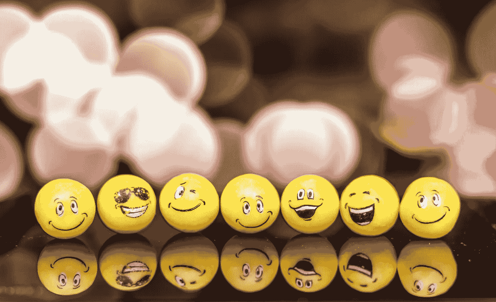

# 表情符号是有效网页设计的未来😃

> 原文：<https://betterprogramming.pub/emoji-are-the-future-of-effective-web-design-a9bf98b18616>

## 充分利用表情符号来显著地↗️改进你的网络应用程序❤️的用户界面



福斯托·加西亚在 [Unsplash](https://unsplash.com/search/photos/emoji?utm_source=unsplash&utm_medium=referral&utm_content=creditCopyText) 上拍摄的照片

[Adobe](https://www.slideshare.net/adobe/adobe-emoji-trend-report-2019) 于 2019 年 7 月 15 日发布的一项最新研究指出:

> 78%的表情符号用户同意表情符号应该继续努力实现包容性
> 
> 64%的人愿意通过表情符号购物

表情符号趋势报告显示，表情符号被 Z 世代广泛接受和使用，尤其是在信息平台上。因此，也许有一天表情符号会成为设计网站的标准。就我个人而言，在我目前的一个项目中，我尝试过用表情符号代替图标，结果比预期的要好。

# 当前的网页设计趋势

web 应用程序只需要好的内容和功能的日子已经一去不复返了。审美现在是最重要的因素之一，就像大多数人会如何恋爱一样😍和一个漂亮或英俊的伴侣而不是丑陋的伴侣。趋势和原则一直在来回移动，没有明确的方向。因此，如今的网页设计趋势变得越来越残酷和稀疏。让我们来看看过去几年的共同趋势:

## 🔹平面设计和材料设计

平面设计基于极简主义，调色板仅限于几种基本颜色，如红色、蓝色、绿色和黄色。徽标、按钮和图标被扁平化，以获得更简单、更易于查看的用户界面。然而，这带来了一个问题，用户无法确定哪些按钮或图像是可点击的。然后是材料设计，这是基于纸张和墨水的概念，创造现实的阴影和悬停效果，以分离按钮和图像。这提供了一个交互界面来吸引用户的注意力。

## 📄单页应用程序

单页应用始于社交媒体，垂直滚动将内容提供给用户。用户可以简单地垂直滚动来加载下一个内容。需要动态加载来填充滚动中的内容。

## 📱移动优先(响应式网页设计)

现在，大多数人花更多的时间使用智能手机，而不是电脑。因此，大多数网站更重视手机的用户界面，而不是电脑。一些公司采用响应式网页设计，界面根据屏幕分辨率变化。

## 标题的🗛衬线字体

一些网站开始尝试用衬线字体作为标题来吸引用户的兴趣。他们经常将这些与浅色背景色和简单的图形搭配，以增加更多的深度。Medium 就是顺应这一趋势的一个例子。

根据上述趋势，我们可以确定🕵️的主要目标是:

1.  从一开始就抓住用户的注意力，即使只是匆匆一瞥👀。
2.  确保用户留下来继续使用 web 应用程序。

一般来说，我们的注意力持续时间越来越短。让用户注意到你的网络应用是一个好的开始。这就是为什么点击诱饵标题🎣现在已经很常见了。让我们来看看在标题中使用表情符号放大点击诱饵效应的影响。

*   10 种最荒谬的食物🍲人们吃的东西
*   你会惊讶的😲赚大钱是多么容易💰
*   排名第一的音乐🎵每个人都听的

## 🤔是什么让表情符号与众不同？

是什么让表情符号区别于图标和其他符号？嗯，表情符号有两个明显的特征。首先也是最重要的，有些有固定的基色，能够改变✋✋人的肤色🏽✋🏿。这确保了每个人在颜色和形状上是一致的。其次，表情符号能够向用户传达情感。例如，您可以使用😳表示尴尬。与使用图标相比，这提供了更丰富的体验。

# 👍表情符号的优势

表情符号是丰富内容的理想选择，也是图标或图像的替代品。这是因为现在大多数人都有使用表情符号互相发信息的经验。后代已经熟悉了它们的用法，并且已经接受它成为他们生活的一部分。而且它是轻量级的，大量的表情符号被主动维护并作为 Unicode 标准加入。这意味着它们可以与文本结合，并在所有设备上正常呈现📱💻🖥️，而不影响内容的结构和布局(只要设备支持)。如果你使用图标，比如字体 Awesome，你需要将图标包装在一个`<i>`标签中，如下所示:

```
<p>This is a cloud <i class="fa fa-cloud"></i></p>
```

表情符号就不是这样了。您可以简单地将它添加到文本中，如下所示:

```
<p>This is a cloud ☁️</p>
```

正如我之前提到的，一些表情符号允许修改来改变肤色。让我们用下面的[例子](https://www.w3schools.com/charsets/tryit.asp?deci=9995&decitype=36):

```
p><span>&#9995;</span> No skin tone</p>
<p><span>&#9995;&#127999;</span> Dark skin tone</p>
<p><span>&#9995;&#127998;</span> Medium Dark skin tone</p>
<p><span>&#9995;&#127997;</span> Medium skin tone</p>
<p><span>&#9995;&#127996;</span> Medium Light skin tone</p>
<p><span>&#9995;&#127995;</span> Light skin tone</p>
```

通过在表情符号后添加以下代码，您可以根据五种不同的肤色对其进行修改:

*   🏿🏿深色肤色
*   🏾🏾中深肤色
*   🏽🏽中等肤色
*   🏼🏼中浅肤色
*   🏻🏻浅肤色

# 👎表情符号的缺点

然而，由于表情符号的含义没有固定的定义，人们会对它们做出不同的解释，从而导致误解😵在发送者和接收者之间。例如，如果你试图暗示你生病了，你应该使用以下哪一个？

```
🤒🤢🤮
```

此外，不同地方的人会根据他们的文化对它们做出不同的解释。以下表情符号👋可能意味着和西方人告别，但这意味着我们在中国不再是朋友了。如果这个表情符号🙅意思是不，下面这个表情符号怎么样🙆？你应该使用吗👌或者👍暗示你同意一个决定？

如你所见，意思很模糊。这对发送者和接收者来说都是非常混乱的。此外，不同的设备、浏览器和平台会以不同的方式呈现每个表情符号，支持的表情符号也不尽相同。当在设备或平台之间切换时，这可能会使用户感到困惑。此外，表情符号往往看起来很幼稚，很难从一开始就正确使用它们。放入太多表情符号会破坏整体的外观和感觉，让它看起来像一条自动化的垃圾信息。

# 📖做与不做

根据我的观察和评估，你应该使用表情符号:

*   如果您找不到合适的图标集，可以作为图标的替换
*   以及你想表达的上下文或意思。
*   在表达情感的句子中

```
I am feeling angry 💢
```

*   突出对每个人都通用的单词

```
The Reasons Why You Should Listen to Music 🎵 Every Day
```

你应该**而不是**🙅：

*   过度使用表情符号，把它们放在任何地方

```
Experts Agree 🙋‍♀️🙋‍♀️🙋‍♀ ️That Crying 😭😭😭😭😭😭😭😭 Is Good For Health
```

*   使用表情符号时，旁边没有上下文或含义。这只会导致混乱。

```
Both of them felt 😫 after the event.
```

*   将多个表情符号堆叠在一起，除非它们关系密切

```
Do you think that looks matter? 💪😤🙊
```

*   在信任非常重要的网站中使用它们。例如，安全和信息网站

```
We are one of the global leaders in website security. We provide daily website scans, firewall enhancement, and vulnerability patching. Join us and be safe every day! 😉😉
```

# 结论

恭喜你！给自己一个热烈的掌声👏走到这一步。我特意在段落中添加了更多的表情符号，让你了解表情符号如果放错了会如何毁掉整个句子。然而，表情符号将继续崛起，并可能成为未来有效网页设计的一个突出因素。现在是开始使用表情符号的最佳时机。让我们从送一些心形❤️给你爱的人开始，以显示你对他们的关心。希望你喜欢这篇文章，下次再见！

# 参考

1.  https://www.w3schools.com/w3css/w3css_icons.asp
2.  【https://www.w3schools.com/w3css/w3css_trends.asp 
3.  [https://www.w3schools.com/charsets/ref_emoji_skin_tones.asp](https://www.w3schools.com/charsets/ref_emoji_skin_tones.asp)
4.  [https://emojipedia.org/](https://emojipedia.org/)
5.  [https://99 designs . com . SG/blog/trends/we B- design-trends-2019/](https://99designs.com.sg/blog/trends/web-design-trends-2019/)
6.  [https://www . slide share . net/adobe/adobe-e moji-trend-report-2019](https://www.slideshare.net/adobe/adobe-emoji-trend-report-2019)