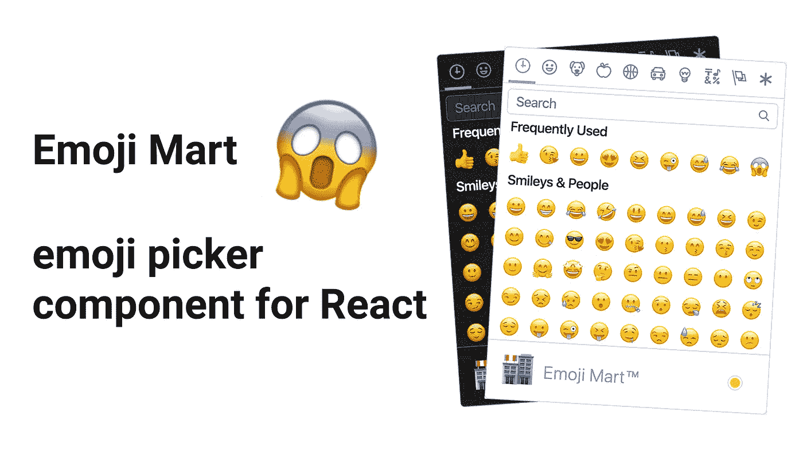

# 表情集市 React 的开源表情选择器组件

> 原文：<https://betterprogramming.pub/emoji-mart-an-open-source-emoji-picker-component-for-react-985a5ca681f3>

## 为您的用户添加表情符号的最快、最简单的方式



# 什么是表情集市？

表情集市是 React 的一个类似 Slack 的可定制表情选择器组件。没有更多额外的功能，只是一个简单的组件和一些简单的道具。

## 我为什么要用它？

只是为了帮助你的用户使用表情符号，而不必在他们使用电脑或智能手机时记住奇怪的键盘快捷键。

# 装置

用 [npm](https://www.npmjs.com/) 安装:

`npm install emoji-mart`

用[纱线](https://yarnpkg.com/)安装:

`yarn add emoji-mart`

**警告**:如果你没有在你的项目中使用 [Babel](https://babeljs.io/) ，这个组件也需要`babel-runtime`，就像我使用 React 脚本的例子一样。

在这种情况下，还记得添加:

`npm install babel-runtime`

或者，用纱线:

`yarn add babel-runtime`

这个伟大的模块没有其他的依赖，你可以在这个网站上查看[。](https://bundlephobia.com/result?p=emoji-mart@2.11.2)

# 我如何使用它？

您只需使用`Picker`组件并向`onSelect`事件道具添加一个监听器函数来获取选定的表情符号，之后，您可以对返回的对象做许多事情，如获取“原生”表情符号或类似的事情。

从`onSelect`函数返回的表情符号如下所示:

```
{
  id: 'smiley',
  name: 'Smiling Face with Open Mouth',
  colons: ':smiley:',
  text: ':)',
  emoticons: [
    '=)',
    '=-)'
  ],
  skin: null,
  native: '😃'
}
```

总结一下，用这几行:

```
import "emoji-mart/css/emoji-mart.css";
import { Picker } from "emoji-mart";<Picker onSelect={emoji => alert("Hey:"+emoji.native)} />
```

# CodeSandbox 表情集市游乐场

# 如果你想了解更多关于钩子的知识

当我开始使用钩子的时候，我个人读过一些关于 React 的书，这些书帮助我理解了如何使用像这样的工具:

*   学会反应钩子:【https://amzn.to/2UFiZ5F 
*   React 解释:React 2020 的分步指南:[https://amzn.to/3pEQdQV](https://amzn.to/3pEQdQV)

# 参考资料和资源

*   [GitHub](https://github.com/missive/emoji-mart)
*   [捆绑恐惧症](https://bundlephobia.com/result?p=emoji-mart@2.11.2)
*   [CodeSandbox](https://codesandbox.io/s/suspicious-khorana-6jfll)