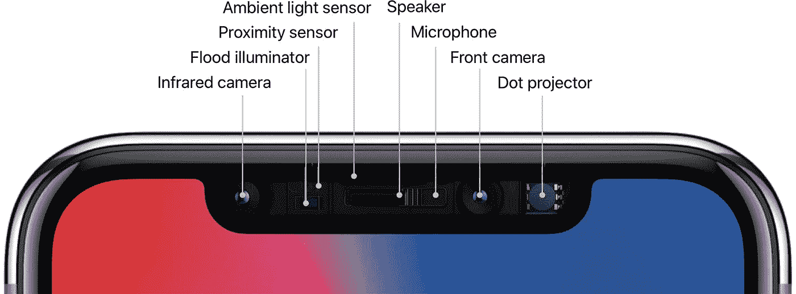
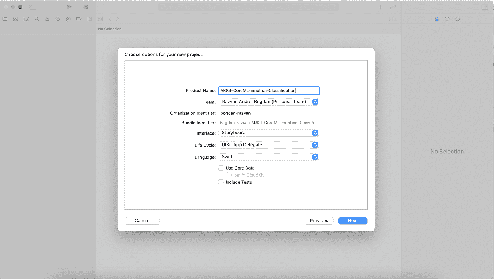
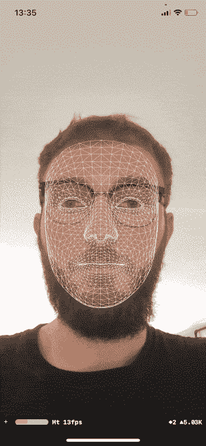
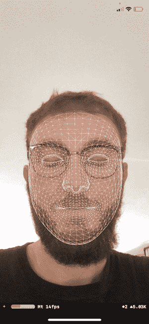
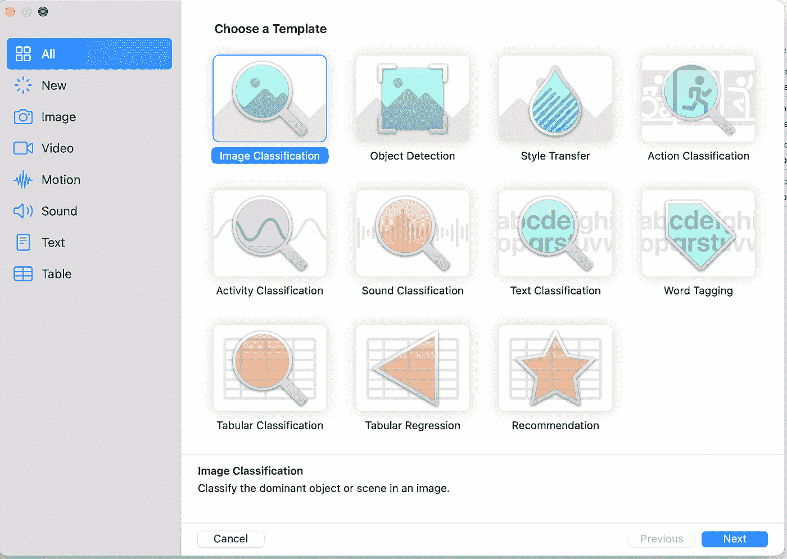
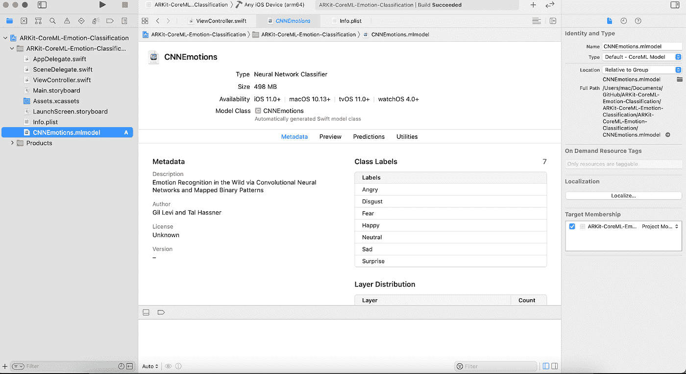
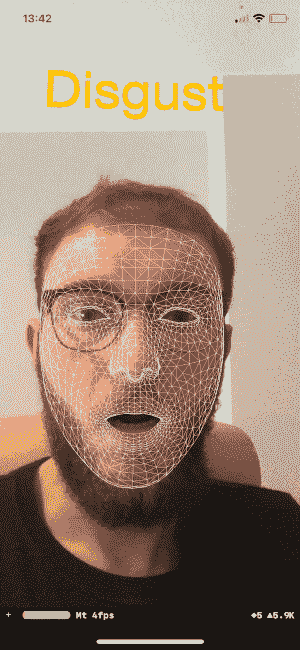

# 基于 ARKit 和 Core ML 的情感分类和人脸检测

> 原文：<https://betterprogramming.pub/emotion-classification-and-face-detection-using-arkit-and-coreml-6f4582363e7d>

## 关于构建基于机器学习和增强现实的 iOS 应用的实践教程

米在 [Unsplash](https://unsplash.com?utm_source=medium&utm_medium=referral) 上[拍照。](https://unsplash.com/@phammi?utm_source=medium&utm_medium=referral)

增强现实是一项相当新的技术，它允许移动用户与他们的周围环境进行交互。近年来，苹果、谷歌、微软等大公司在这一领域投入了大量资源。

在本教程中，我们将深入研究增强现实和机器学习的细节，并创建一个演示应用程序来展示它们的能力。

# 背景

[ARKit](https://developer.apple.com/documentation/arkit) 是一个开发平台，用户可以通过使用设备的传感器和摄像头来创建与环境互动的 AR 应用。ARKit 于 2017 年在 iOS 11 中首次推出，于 2020 年推出第 4 版，比以往任何时候都更强大。

ARKit 的人脸识别解决方案是基于使用设备的原深感摄像头。这是一项能够创建用户面部和头部 3D 模型的技术，也是 Face ID 技术背后的基础。

*原深感摄像头系统(来源:*[*iPhone 常见问题解答*](https://www.iphonefaq.org/archives/976228) *)*

iOS 11 引入了机器学习，允许用户构建具有新功能的应用和体验，如图像和音频分析、自然语言处理和语音识别。

Core ML 是为运行苹果操作系统的设备构建的框架。创建 ML 模型包括用足够大的数据集来训练它，以产生精确的分类或预测。

苹果提供了一个[集合](https://developer.apple.com/machine-learning/models/)预先训练好的 ML 模型，可以照原样使用。在我们的教程中，我们不会使用其中的一个，而是使用另一个[预先训练好的模型](https://talhassner.github.io/home/publication/2015_ICMI)，它能够根据人脸对情绪进行分类。

[Vision](https://developer.apple.com/documentation/vision) 框架是一个强大的工具包，用于在输入图像或视频上应用计算机视觉算法。它能够执行面部和面部标志检测、条形码识别和文本检测(OCR)。它还可以使用定制的 CoreML 模型来执行检测、预测和分类。今天，我们将重点讨论后者。

# 创建新项目

我们首先在 Xcode 中创建新项目。给它一个名字，选择一个团队，选择“故事板”作为界面，选择“Swift”作为语言。

在 Xcode 中创建新项目。

我们最终应该有这样的结构:

Xcode 中的项目结构

现在我们需要在`Info.plist`文件中添加这个相机使用描述，以便请求相机权限:`NSCameraUsageDescription` *。*

# 创建场景并显示面网格

第一步是建立`sceneView`。我们将全屏设置这个视图，由于我们使用的是`ARFaceTrackingConfiguration`，它将显示实时的前置摄像头画面。

`ARFaceTrackingConfiguration`是一种 ARKit 配置，能够使用前置摄像头和 TrueDepth 传感器检测和跟踪用户的面部。

既然我们已经开始了面部跟踪会话，我们需要我们的`ViewController`通过实现这个函数来符合`ARSCNViewDelegate`:

这将创建一个节点，并在我们的脸上应用白线遮罩:

这很酷，但是当用户闭上眼睛或张开嘴时更新遮罩怎么办？

# 更新面网格

为了实现这一点，我们需要实现`ARSCNViewDelegate`协议的另一个功能:

这是结果。现在看起来好多了:

# 创建核心 ML 请求

现在，我们已经使用 ARKit 设置了实时人脸跟踪，我们可以开始实现核心的 ML 请求，该请求将输出一种情绪(生气、高兴、中性等)。)鉴于用户的面子。

但在此之前，我们先来看看如何创建一个`.mlmodel`文件。

## 创建核心 ML 模型

苹果公司提供了一个创建这种模型的工具，叫做 Create ML。您可以使用 Finder 打开它，或者通过访问 Xcode 菜单>打开开发者工具>创建 ML 从 Xcode 启动它。

Create ML 提供了几个可供选择的模板，每个模板针对一个特定的场景:

创建核心 ML 模型。

我们今天不会创建任何分类器，因为我们将使用一个已经训练好的分类器来对情绪进行分类。

这个模型可以在这个谷歌驱动上找到，我们只需要把它拖放到 Xcode 项目的根文件夹中。

CNNEmotions ML 模型

所以，回到创建核心 ML 请求。

我们需要向我们的模型声明一个实例:

在更新面部网格的相同`didUpdate`功能中，我们也将这样做:

这将创建一个`VNImageRequestHandler`把包含我们的脸的当前帧作为`CVPixelBuffer`并在其上执行`VNCoreMLRequest`。

这意味着 Core ML 框架将对每幅图像运行机器学习算法，以便将面部表情分为以下七类之一:愤怒、厌恶、恐惧、高兴、自然、悲伤和惊讶。

为了避免误报，我们将分类的置信阈值设置为 92%的任意值。如果分类器至少对情感有 92%的把握，我们将把它显示在我们头顶上方的浮动 3D 标签中。

# 在浮动标签中显示情感

我们将再次使用 ARKit 的力量来创建一个文本节点，并将其放置在我们的头顶上。

让我们声明文本节点:

现在，我们实例化文本节点并将其添加到现有场景中:

该函数将由另一个`ARSCNViewDelegate`函数调用:

现在，在请求处理程序中，我们用以下行替换`//TODO`:

这将在三维浮动标签中显示情感:

# 结论

ARKit 和 Core ML 是强大的本地工具，提供了易于使用的设备功能，适合 iOS 开发的现代趋势。他们已经有了很大的潜力，并且随着每一次新的迭代得到改进。

本教程面向初学者和专业人员。最终项目可以在我的 GitHub 页面找到:

 [## bogdan-Raz van/ARKit-CoreML-情绪-分类

### ARKit 和 CoreML 情感分类用法示例-bogdan-Raz van/ARKit-CoreML-情感-分类

github.com](https://github.com/bogdan-razvan/ARKit-CoreML-Emotion-Classification) 

让我们在[领英](https://www.linkedin.com/in/bogdan-razvan/)上连接吧！