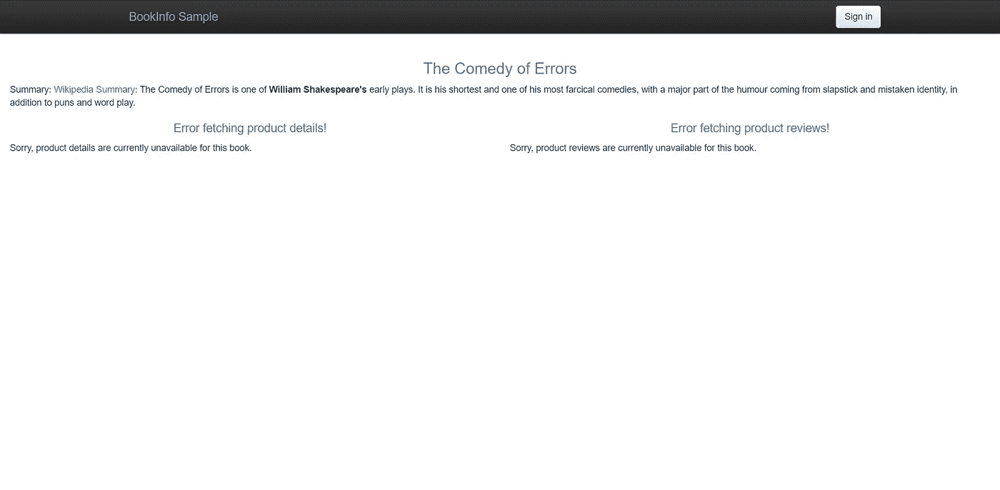
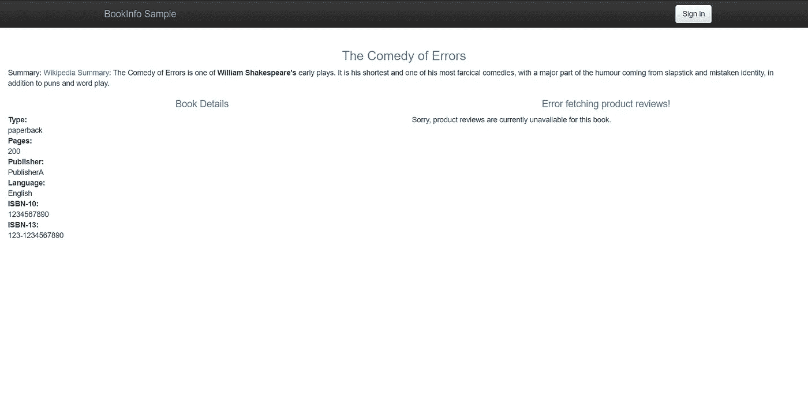
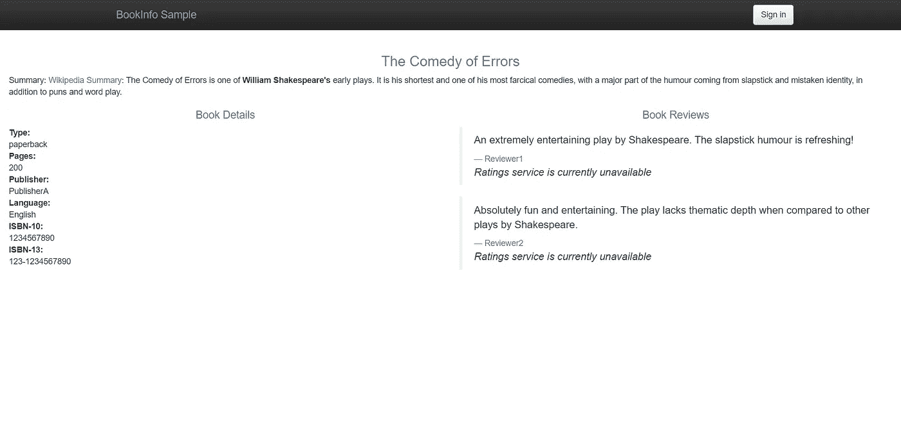
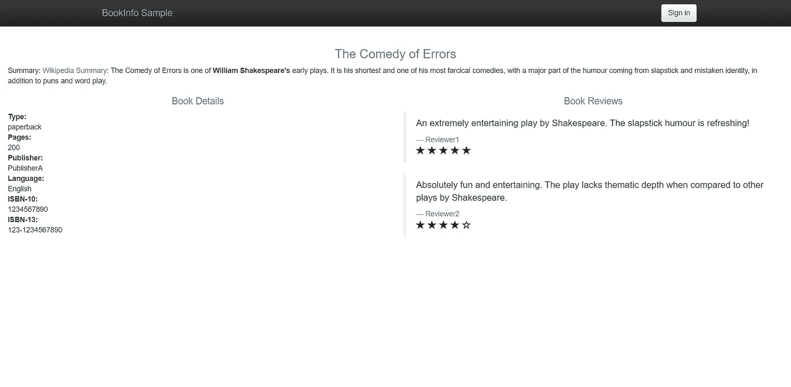

# 使用 Istio 实现 Kubernetes 工作负载之间的访问控制

> 原文：<https://betterprogramming.pub/enable-access-control-between-your-kubernetes-workloads-using-istio-cf72a9f9bd5e>

## Kubernetes 内部微服务之间的 Istio 授权指南

图片由 [Ishan @seefromthesky](https://unsplash.com/@seefromthesky?utm_source=unsplash&utm_medium=referral&utm_content=creditCopyText) 在 [Unsplash](https://unsplash.com/s/photos/roads?utm_source=unsplash&utm_medium=referral&utm_content=creditCopyText) 上拍摄

[Istio](https://istio.io) 是最流行的服务网格技术之一，你可以在 Kubernetes 上运行它来有效地控制你的微服务。除了允许流量管理和可视化，Istio 还为您的 Kubernetes 工作负载提供了许多细粒度的第 7 层安全特性。

虽然您可以使用 [Kubernetes 网络策略](https://medium.com/better-programming/how-to-secure-kubernetes-using-network-policies-bbb940909364)来构建第 3 层防火墙，但它不能为您提供大多数现代防火墙和入侵检测软件所使用的高级安全性。

Istio 通过为您的工作负载提供精细控制来填补这一空白。它可以根据消息头、HTTP 方法和源服务帐户等参数来允许或拒绝访问。

Istio 的行为与现代防火墙和入侵检测软件完全一样，它允许您像在传统基础设施中一样实现安全性。

Istio 知道 Kubernetes，因此使用内置的 Kubernetes RBAC 来确定身份。如果调用服务是 Kubernetes 工作负载，它可以使用 Kubernetes 服务帐户来识别它并控制访问。

这个故事是“[使用 Istio](https://medium.com/better-programming/enable-mutual-tls-authentication-between-your-kubernetes-workloads-using-istio-65338c8adf82) 在您的 Kubernetes 工作负载之间启用相互 TLS 认证”的后续今天，我们来讨论如何使用 Istio 在您的 Kubernetes 微服务之间启用访问控制。

# 先决条件

这个故事假设你对 Kubernetes 的工作原理有一个基本的了解，并且知道微服务和 Istio。关于 Istio 的简要介绍，请查看[如何使用 Istio](https://medium.com/better-programming/how-to-manage-microservices-on-kubernetes-with-istio-c25e97a60a59) 管理 Kubernetes 上的微服务。

确保您有一个正在运行的 Kubernetes 集群。我已经在谷歌的 Kubernetes 引擎中做了实际操作，但是它在任何其他的 Kubernetes 集群上都可以以同样的方式工作。

按照 Kubernetes 上的[Istio 入门指南](https://medium.com/better-programming/getting-started-with-istio-on-kubernetes-e582800121ea)在您的 Kubernetes 集群中安装 Istio 并部署*图书信息*应用程序。

# 配置全部拒绝策略

任何访问控制的起点都是首先实现一个`deny-all`策略，然后在需要时打开连接。让我们通过应用以下 YAML 为工作负载创建一个默认的`deny-all`策略。

使用`[http://LOAD_BALANCER_IP/productpage](http://LOAD_BALANCER_IP/productpage.)`从浏览器打开图书信息应用程序的产品页面。

RBAC 访问被拒绝

发生了什么事？正如所料，当您无法查看页面时，`deny-all`策略正在运行。

# 允许客户查看产品页面。

现在，让我们通过应用下面的 YAML，为客户端创建一个通过浏览器查看产品页面的策略

如果你看看 YAML，它允许所有的流量到产品页面的`GET`方法。

刷新浏览器中的产品页面。

允许产品页面

嗯，你现在可以看到图书信息产品页。但是，您仍然会看到一些错误。为什么会这样呢？虽然我们已经允许客户端访问`productpage`微服务，但是其余的微服务都遵循`deny-all`策略。

# 允许 productpage 微服务访问微服务的详细信息和评论

下一个逻辑步骤是允许从`productpage`微服务访问`details`微服务。应用下面的 YAML 文件。

如果您观察 YAML，您会看到`details`微服务只允许来自包含服务帐户`cluster.local/ns/default/sa/bookinfo-productpage`的源的流量到达`GET`方法。

`productpage`微服务使用这个服务账号，应该可以连接。

再次刷新页面，您将看到现在可以看到详细信息。然而，我们仍然需要在评论和评级方面下功夫。

允许详细信息

现在，让我们允许`productpage`微服务调用`reviews`微服务。

上述 YAML 类似于`details-viewer`策略，适用于`reviews`微服务。

在浏览器中再次刷新产品页面，您应该会看到评论也是可见的。但是，收视率还是没有。

允许分级

# 允许点评微服务访问评分微服务

这个链的下一步是允许流量从`reviews`微服务流向`ratings`微服务。运行以下命令来创建一个`ratings-viewer`策略。

正如您在 YAML 中看到的，它适用于`ratings`微服务，并且只允许来自包含`bookinfo-reviews`服务帐户的工作负载的连接。`reviews`微服务使用这个服务账号。

刷新产品页面，您应该会看到评级也是可见的。

允许评论

您已经成功地在您的微服务上应用了策略，并且只有正确的微服务才能在正确的 HTTP 方法上相互交互。

这在您的服务之间强制实施了一个适当的流量通道，并阻止了来自其他不应该调用的微服务的未授权访问。

# 结论

感谢阅读！我希望你喜欢这篇文章。

在下一篇文章“如何在 K8s 集群上使用 Istio 对非 Kubernetes 客户端进行授权”中，我将讨论使用 [JSON Web 令牌](https://jwt.io/)的最终用户授权，并进行实际演示，所以，到时见！