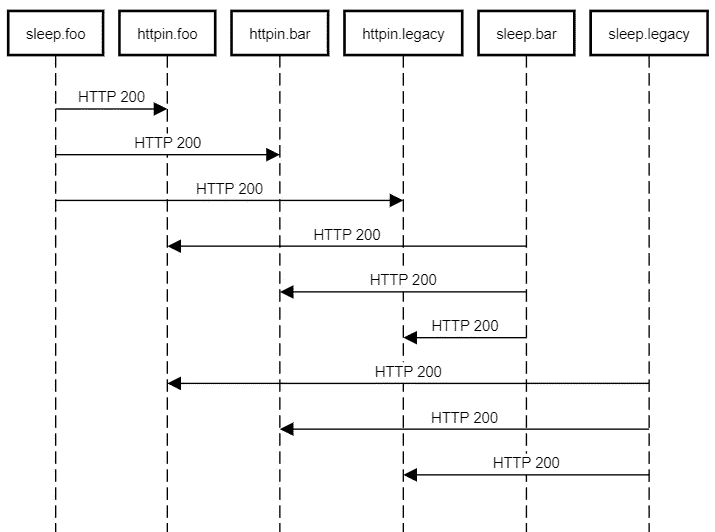

# 使用 Istio 在您的 Kubernetes 工作负载之间启用相互 TLS 认证

> 原文：<https://betterprogramming.pub/enable-mutual-tls-authentication-between-your-kubernetes-workloads-using-istio-65338c8adf82>

## Kubernetes 上您的微服务之间的 Istio 认证和相互 TLS 指南


蓝菊·福托雷菲在 [Unsplash](https://unsplash.com/s/photos/future?utm_source=unsplash&utm_medium=referral&utm_content=creditCopyText) 上拍摄的照片

在软件工程中，访问控制通常由两部分组成，认证和授权。认证是指了解请求者是否如其所声称的那样，而授权是指指定请求者被允许执行什么动作。

本文是“[如何使用 Istio](https://medium.com/better-programming/how-to-harden-your-microservices-on-kubernetes-using-istio-29c23dd90670) 在 Kubernetes 上强化您的微服务”的后续文章。今天，我们来讨论如何使用 Istio 在您的 Kubernetes 微服务之间启用相互 TLS 认证。

# 先决条件

本文假设您了解 Kubernetes 和微服务，并且知道 [Istio](https://istio.io) 。对于 Istio 的介绍，我建议您查看[如何使用 Istio](https://medium.com/better-programming/how-to-manage-microservices-on-kubernetes-with-istio-c25e97a60a59) 管理 Kubernetes 上的微服务。关于 Istio 安全的快速介绍，请阅读[如何使用 Istio](https://medium.com/better-programming/how-to-harden-your-microservices-on-kubernetes-using-istio-29c23dd90670) 在 Kubernetes 上强化您的微服务。

确保您有一个正在运行的 Kubernetes 集群，以便进行实际操作演示。我在[谷歌 Kubernetes 引擎](https://cloud.google.com/kubernetes-engine)上做了下图，但它在任何其他 Kubernetes 集群上的工作方式都是一样的。

# 默认情况下相互身份验证

缺省情况下，Istio 支持注入了侧车的工作负载之间的 TLS 通信。这允许微服务之间的端到端加密，以防止中间人攻击。

虽然这是默认设置，并且可能适用于大多数情况，但它是在兼容模式下运行的。这意味着注入了侧车的两个服务之间的流量将发送加密流量，但没有插入侧车的工作负载可以通过明文 HTTP 与后端微服务进行交互。

这意味着刚刚引入 Istio 的团队不必努力让所有源流量都启用 TLS。

让我们通过下面的实践演示来理解这种行为。

按照 Kubernetes 上的 Istio 入门指南[在您的 Kubernetes 集群中安装 Istio。对于此演示，您不需要安装图书信息应用程序。](https://medium.com/better-programming/getting-started-with-istio-on-kubernetes-e582800121ea)

创建三个名称空间，`foo`、`bar`和`legacy`，在`foo`和`bar`名称空间上启用自动侧车注入。不要标记`legacy`名称空间，因为我们想要模拟来自不包含边车的工作负载的流量。

```
$ kubectl create ns foo
namespace/foo created
$ kubectl create ns bar
namespace/bar created
$ kubectl create ns legacy
namespace/legacy created
$ kubectl label namespace foo istio-injection=enabled
namespace/foo labeled
$ kubectl label namespace bar istio-injection=enabled
namespace/bar labeled
```

现在让我们在所有三个名称空间上创建两个应用程序，`httpbin`和`sleep`。

```
$ kubectl apply -f [samples/httpbin/httpbin.yaml](https://raw.githubusercontent.com/istio/istio/release-1.5/samples/httpbin/httpbin.yaml) -n foo
$ kubectl apply -f [samples/sleep/sleep.yaml](https://raw.githubusercontent.com/istio/istio/release-1.5/samples/sleep/sleep.yaml) -n foo 
$ kubectl apply -f [samples/httpbin/httpbin.yaml](https://raw.githubusercontent.com/istio/istio/release-1.5/samples/httpbin/httpbin.yaml) -n bar
$ kubectl apply -f [samples/sleep/sleep.yaml](https://raw.githubusercontent.com/istio/istio/release-1.5/samples/sleep/sleep.yaml) -n bar
$ kubectl apply -f [samples/httpbin/httpbin.yaml](https://raw.githubusercontent.com/istio/istio/release-1.5/samples/httpbin/httpbin.yaml) -n legacy 
$ kubectl apply -f [samples/sleep/sleep.yaml](https://raw.githubusercontent.com/istio/istio/release-1.5/samples/sleep/sleep.yaml) -n legacy
```

现在列出所有三个名称空间的 pod，看看我们得到了什么。

先说`foo`:

```
$ kubectl get pod -n foo
NAME                       READY   STATUS    RESTARTS   AGE
httpbin-654c6cbbb9-76dgp   2/2     Running   0          96s
sleep-6bdb595bcb-vwh29     2/2     Running   0          86s
```

那`bar`呢:

```
$ kubectl get pod -n bar
NAME                       READY   STATUS    RESTARTS   AGE
httpbin-654c6cbbb9-rvxgv   2/2     Running   0          102s
sleep-6bdb595bcb-rhf7g     2/2     Running   0          91s
```

和`legacy`:

```
$ kubectl get pod -n legacy
NAME                       READY   STATUS    RESTARTS   AGE
httpbin-654c6cbbb9-xsmd9   1/1     Running   0          90s
sleep-6bdb595bcb-t9bkx     1/1     Running   0          83s
```

你看出区别了吗？因为我们没有在`legacy`名称空间上启用自动侧车注入，所以我们在 pod 中只有一个容器。`foo`和`bar`名称空间在 pod 中有两个容器，我们对它们进行了适当的标记，以支持 Istio 侧车注入。

现在，让我们生成从`sleep`微服务到`httpbin`微服务、从所有三个名称空间到所有三个名称空间的流量，如下所示:



默认情况下相互授权

如果您查看结果，您会看到所有请求都得到 HTTP 200 响应。Istio 足够智能，能够理解它正在与谁交互，并根据目标选择发送 TLS 流量或明文流量。如果 Istio 使用相互 TLS 认证，它会向后端发送一个`X-Forwarded-Client-Cert` 报头，这是一种**了解流量是否加密的极好方法。**

**让我们创建从`sleep.foo`到`httpbin.foo`的流量。**

```
**$ kubectl exec $(kubectl get pod -l app=sleep -n foo -o jsonpath={.items..metadata.name}) -c sleep -n foo -- curl [http://httpbin.foo:8000/headers](http://httpbin.foo:8000/headers) -s | grep X-Forwarded-Client-Cert"X-Forwarded-Client-Cert": "By=spiffe://cluster.local/ns/foo/sa/httpbin;Hash=05b619f1ebd6d8e4f59158bb614e8cac558a4228ec7bda28a80c9ad1a2594bf1;Subject=\"\";URI=spiffe://cluster.local/ns/foo/sa/sleep"**
```

**由于源和目标都有侧车，我们看到了头。Istio 对流量进行加密，如`X-Forwarded-Client-Cert`报头所示。**

**现在让我们创建从`sleep.foo`到`httpbin.legacy`的流量。在这种情况下，源包含边车，但目标不包含。**

```
**$ kubectl exec $(kubectl get pod -l app=sleep -n foo -o jsonpath={.items..metadata.name}) -c sleep -n foo -- curl [http://httpbin.legacy:8000/headers](http://httpbin.legacy:8000/headers) -s | grep X-Forwarded-Client-Cert**
```

**我们没有看到这样的标题。这意味着源和目的地之间的流量是明文。**

# **启用严格的相互 TLS**

**使用默认设置运行 Istio 可以提供一定程度的保护，但这并不是 Istio 所能做到的全部。**

**Istio 提供了许多其他功能，例如只允许所需的流量传播和控制访问，以便只有相关的微服务才能相互交互。**

**您可能希望启用严格的 TLS 来完全禁用服务网格中的不安全流量，以确保安全性至关重要。**

**您可以在全局级别、命名空间级别或工作负载级别启用严格的相互 TLS。**

**要在全局级别启用严格的相互 TLS，请运行以下命令:**

**如您所见，这是在具有`mtls`模式`STRICT`的`istio-system`名称空间上应用`PeerAuthentication`策略。这意味着 Kubernetes 集群中的所有名称空间只允许安全的 TLS 流量。**

**现在让我们运行同样的例子，看看我们得到了什么。**

**如您所见，Istio 拒绝了来自`legacy`名称空间的所有请求，退出代码为 56。这意味着 TLS 握手不成功，因为服务网格只期待 TLS 流量。**

**现在，让我们在名称空间级别上启用相互 TLS。但在此之前，我们需要通过运行以下命令来清理现有策略:**

```
**$ kubectl delete peerauthentication -n istio-system default
peerauthentication.security.istio.io "default" deleted**
```

**要在命名空间级别启用严格的相互 TLS，请运行以下命令:**

**它只对`foo`名称空间执行严格的 TLS 检查。让我们重新进行测试:**

**如您所见，只有从`sleep.legacy`到`httpbin.foo`的请求失败了，这是意料之中的。**

**您还可以以类似的方式在工作负载级别上启用严格 TLS。但是首先，让我们清理一下名称空间策略。**

```
**$ kubectl delete peerauthentication -n foo default
peerauthentication.security.istio.io "default" deleted**
```

**现在，让我们创建一个`PeerAuthentication`策略和一个`DestinationRule`策略，在工作负载级别上实施严格的 TLS:**

**让我们重新运行测试，看看会发生什么:**

**正如所料，只有从`sleep.legacy`到`httpbin.bar`的流量出现故障。**

# **结论**

**感谢阅读！我希望你喜欢这篇文章。**

**在下一部分“[使用 Istio](https://medium.com/better-programming/enable-access-control-between-your-kubernetes-workloads-using-istio-cf72a9f9bd5e) 启用 Kubernetes 工作负载之间的访问控制”中，我们将通过实际操作演示深入探讨 Istio 授权，敬请期待！**