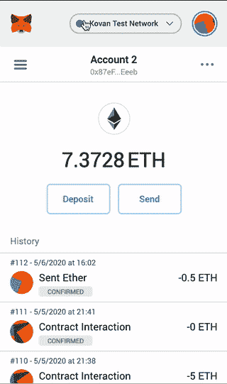

# 让您的 DApp 用户能够使用脸书和谷歌登录

> 原文：<https://betterprogramming.pub/enable-your-dapp-users-to-log-in-using-facebook-and-google-c33f6d504358>

## 使用 Torus 连接到常见的社交网络


约翰·施诺布里奇在 [Unsplash](https://unsplash.com/s/photos/user-experience?utm_source=unsplash&utm_medium=referral&utm_content=creditCopyText) 上的照片

在过去的几年里，Metamask 一直是 DApps 用来让用户访问其平台的主要工具。对于那些对加密钱包、不同网络、以太和 ERC20 令牌有深刻理解的人来说，这不是问题。对于那些没有高级知识的人来说，Metamask 很难操作。



Metamask 令人生畏的界面

首先，它是一个浏览器扩展，这意味着它必须在与 DApp 交互之前安装。当你最终安装它的时候，界面可能会有点让人不知所措，除非你真的了解你的东西。然后，当你在 DApp 上做一些事情时，令人生畏的警告信息和确认批准会弹出来。

这足以让任何普通用户望而却步，尤其是当涉及到真正的货币价值时。

# 没有麻烦的在线钱包

Torus 是一个旨在使用户与 web3 DApps 的交互更加流畅的项目。你可以使用脸书、谷歌和一大堆其他软件登录，而不必安装浏览器扩展，也不必保护新密码的安全。这将日志记录带入了 21 世纪。

以下是如何将 Torus 集成到您自己的项目中。

# 通过四个简单的步骤进行安装

*如需完整文档，请访问* [*Torus 网站*](https://docs.tor.us/) *。*

## 步骤 1:安装软件包

torus 包可以在 NPM 上找到，并使用以下命令安装:

```
npm install @toruslabs/torus-embed
```

除了 Torus 之外，您还需要 Web3 JS 包。如果您还没有安装，请使用以下命令进行安装:

```
npm install web3
```

## 步骤 2:导入和要求

在您希望建立连接的文件中，确保在文件的开头有以下代码:

```
import Torus from "@toruslabs/torus-embed";
import Web3 from "web3";
```

## 步骤 3:初始化 Torus

在同一个文件中，我们需要初始化 Torus 对象，这样我们就可以开始与它交互。为此，请将以下内容复制到您的文件中:

```
const torus = new Torus();
await torus.init();
```

## 步骤 4:登录并初始化 Web3

如果您希望您的 DApp 立即让用户登录，请将这些命令粘贴到前面几行的下面。如果您希望用户在按钮单击事件中登录，请将它们放入该事件的侦听器中。

```
await torus.login(); // await torus.ethereum.enable()
const web3 = new Web3(torus.provider);
```

这将提示用户使用他们选择的任何方法登录。


使用 Torus 的登录示例

他们的钱包地址可以从 Torus 网站管理，或者你也可以利用他们的 API 自己添加功能。

从这一点出发，使用第四步中的`web3`实例与区块链进行交互，就像使用 Metamask 一样！

# 进一步阅读

如果你对区块链开发感兴趣，我会写一些关于如何开始和建立投资组合的教程、演练、提示和技巧。查看以下资源:

[](https://medium.com/blockcentric/blockchain-development-resources-b44b752f3248) [## 区块链开发资源马上跟进

### 学习区块链、以太坊和 DApp 开发的资源列表

medium.com](https://medium.com/blockcentric/blockchain-development-resources-b44b752f3248)