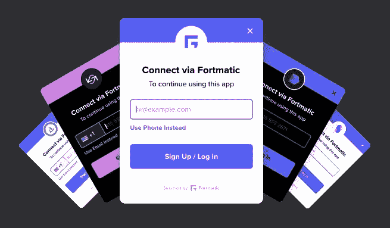
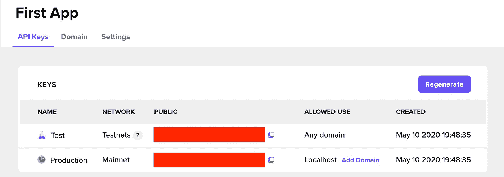
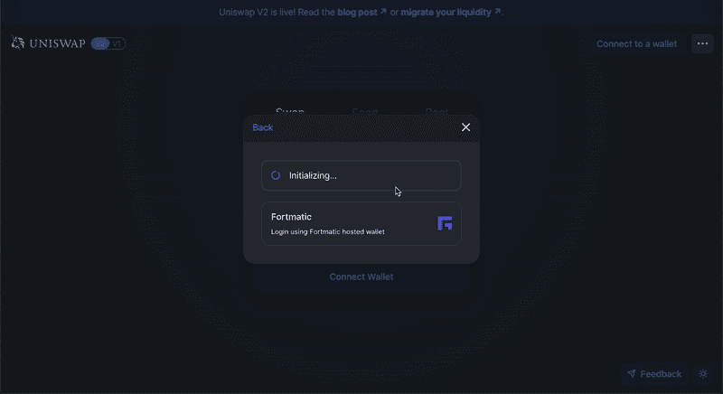

# 允许您的 DApp 用户使用他们的电子邮件地址或电话号码登录

> 原文：<https://betterprogramming.pub/enable-your-dapp-users-to-log-in-using-their-email-address-or-phone-number-c6d3b03a5b62>

## 使用 Fortmatic 将用户连接到您的 DApp


照片由 [Pexels](https://www.pexels.com/photo/woman-in-black-and-white-striped-dress-shirt-using-black-tablet-computer-3740568/?utm_content=attributionCopyText&utm_medium=referral&utm_source=pexels) 的 bongkarn thanyakij 拍摄

*前提:本文假设有* [*以太坊*](https://ethereum.org/)*[*web 3*](https://web3js.readthedocs.io/en/v1.2.8/)*[*节点*](https://nodejs.org/en/) *的基础知识。***

**自从以太坊 DApps 诞生以来， [Metamask](https://metamask.io/) 一直是用来连接用户的主要工具。虽然它仍然是最受欢迎的，但如果你是以太坊的新手，它很笨重，很难使用。**

**我最近[写了一篇文章，讲述如何通过允许用户注册并使用社交媒体账户](https://medium.com/better-programming/enable-your-dapp-users-to-log-in-using-facebook-and-google-c33f6d504358)登录，通过一个名为 [Torus](https://tor.us/) 的钱包提供商，让用户与你的 DApp 联系起来变得更加容易。**

**这里，我将介绍另一个选项。现在，您可以通过名为[for matic](https://fortmatic.com/)的钱包提供商，允许您的用户使用他们的电子邮件地址或电话号码连接到您的 DApp。**

# **最时尚的 web3 钱包界面**

**我最近和多家在线钱包提供商打过交道，在我看来，Fortmatic 拥有最流畅、最漂亮的用户体验。**

****

**图 1:格式化小部件示例主题**

**如图 1 所示，这个小部件带有几个显示主题，并与您的 DApp 无缝集成。每当交易需要批准时，它会使用这个主题小部件在您的 DApp 中提示它们。这与 Metamask 和 Torus 形成对比，它们打开新的窗口来批准交易。**

**如果用户安装了广告拦截软件，这通常会被拦截。让 Fortmatic 在与 DApp 相同的网页上提示用户意味着更流畅的体验。**

# **通过 3 个简单的步骤集成**

***要获得完整的文档，请访问 Fortmatic 的网站* *。***

## **第一步。创建一个帐户**

**最初，您需要[创建一个 Fortmatic](https://dashboard.fortmatic.com/login) 帐户来访问开发者仪表板。如果您已经有一个 GitHub 帐户，您可以使用它登录。**

**在那里，您将能够创建您的第一个应用程序并生成一个私钥。**

****

**图 2:仪表板中的第一个应用程序示例(键被涂红)**

## **第二步。导入到项目中**

**Fortmatic 有一个 SDK，只要你有一个正确的密钥，就可以轻松访问他们的小部件。运行以下命令进行安装:**

```
**npm install --save fortmatic**
```

**如果您还没有安装 web3，请运行以下命令确保您也安装了 web 3:**

```
**npm install --save web3**
```

**然后，在初始化 web3 连接的文件中，通过在文件顶部粘贴以下内容来导入 web3 和 Fortmatic:**

```
**import Fortmatic from 'fortmatic';
import Web3 from 'web3';**
```

## **第三步。初始化连接**

**在同一个文件中，通过粘贴以下内容初始化 Fortmatic 连接，其中`YOUR_API_KEY`是在 Fortmatic 仪表板中生成的密钥:**

```
**const fm = new Fortmatic('YOUR_API_KEY');
window.web3 = new Web3(fm.getProvider());**
```

**在开发环境中，确保使用提供的“Test”键。**

**从这一点上来说，使用你存储在`window.web3`中的`web3`实例与区块链交互，就像你使用元掩码一样！**

****

**图 3: Fortmatic 在 [Uniswap](https://uniswap.exchange/) 上的运行**

# **进一步阅读**

**如果你对区块链开发感兴趣，我会写一些关于如何开始和建立投资组合的教程、演练、提示和技巧。查看以下资源:**

**[](https://medium.com/blockcentric/blockchain-development-resources-b44b752f3248) [## 区块链开发资源马上跟进

### 学习区块链、以太坊和 DApp 开发的资源列表

medium.com](https://medium.com/blockcentric/blockchain-development-resources-b44b752f3248)**