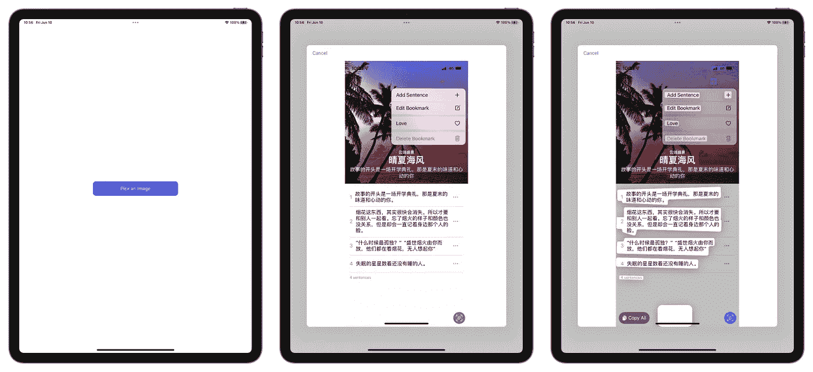
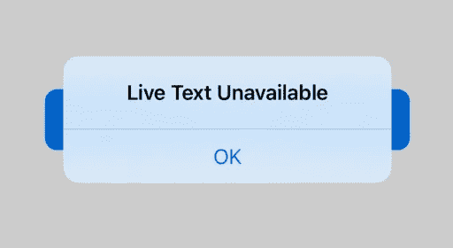
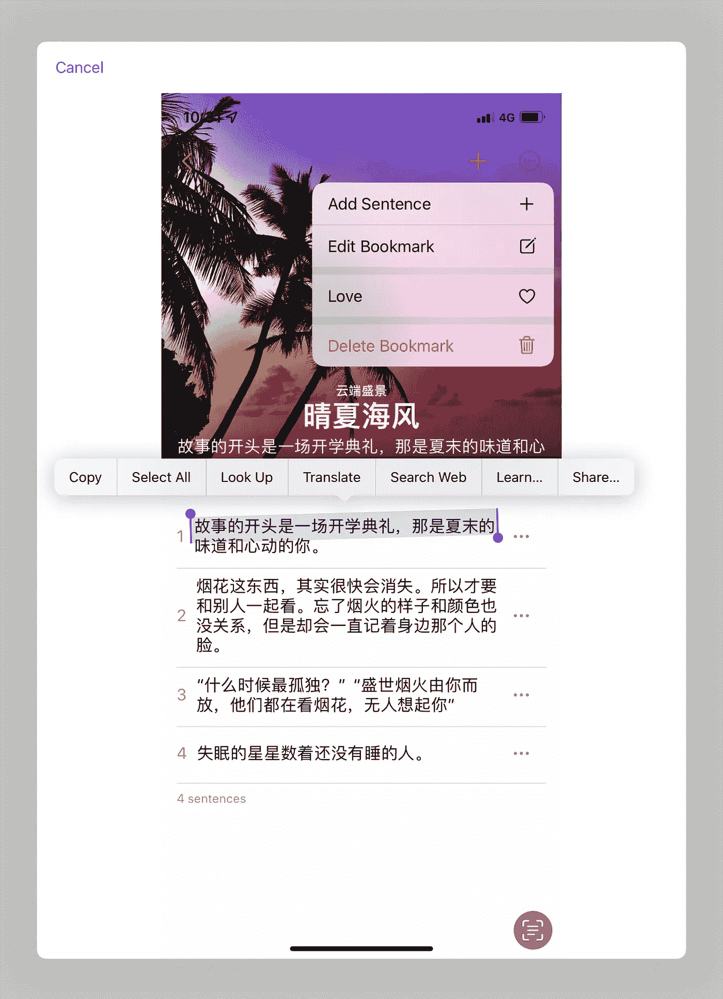

# WWDC22:在 SwiftUI 中启用与图像的实时文本交互

> 原文：<https://betterprogramming.pub/enabling-live-text-interactions-with-images-in-swiftui-5dd1d7f1676>

## 从图像片段、屏幕截图等中提取文本


照片由[coffeify work AFE](https://unsplash.com/@coffeefyworkafe?utm_source=medium&utm_medium=referral)在 [Unsplash](https://unsplash.com?utm_source=medium&utm_medium=referral) 拍摄

WWDC22 带来了许多更新，使开发人员能够创造有史以来最棒的用户体验。现在，实现与图像的实时文本交互比以往任何时候都更容易。只需几行代码，您就可以帮助用户识别图像中的文本或机器可读代码，用户可以轻松地复制或共享这些结果。

在这篇文章中，我将分享我在 SwiftUI 项目中嵌入 Live Text 函数的经验。下图是今天的项目。



我们将在本文中创建的项目

# 构建主视图

创建一个新的 Xcode 项目，我们现在将关注于`ContentView.swift`文件。下面的代码和我上一篇文章放的代码差不多:[iOS 16 中的 Live Text API——swift ui 中的摄像头扫描数据](https://medium.com/better-programming/scanning-data-with-the-camera-in-swiftui-491741e36f69)。我假设你有 SwiftUI 的基础知识，如果没有请查看苹果官方文档:[swift ui 介绍](https://developer.apple.com/tutorials/swiftui)。

上面的代码生成一个只包含一个`Button`视图的视图，它的功能是呈现动态文本视图，让用户对检测到的文本或机器可读代码进行复制或其他操作。然而，据苹果公司称，并非所有设备都具备实时文本功能:

> 对于 iOS 应用程序，Live Text 只能在装有 A12 Bionic 芯片和更高版本的设备上使用。

幸运的是，苹果为我们提供了一个新的 API 来检查设备是否支持实时文本。如果设备不支持实时文本，当试图点击按钮以显示实时文本视图时，应用程序将显示一个警告，说明设备不支持实时文本。



说明设备不支持实时文本的警报。

# 构建动态文本视图

实时文本视图包含对图像中出现的文本和 QR 码执行操作所需的所有功能。

创建一个名为`LiveTextInteractionView.swift`的新 SwiftUI 文件，并将以下代码添加到文件中:

由于我们还没有创建我们的实时文本视图，我将把文本视图放在这里。

# 检查设备是否支持实时文本

在应用程序中显示实时文本界面之前，请检查设备是否支持实时文本。如果`ImageAnalyzer` `[isSupported](https://developer.apple.com/documentation/visionkit/imageanalyzer/3974561-issupported)`属性为`true`，则显示文字直播界面。

在您的`ContentView`中，在您的`onAppear`代码中添加以下检查语句:

这将使您的应用程序能够在启动后立即检查设备是否支持实时文本。

# 在 iOS 中将实时文本交互对象添加到您的视图

本文仅包含如何在 iOS 或 iPadOS 应用程序内部实现 Live Text API 的说明，因此我不会分析 macOS 中的 API。

为了在 SwiftUI 视图中嵌入一个`UIView`，我们需要`UIViewRepresentable`来帮助我们。

创建一个名为`LiveTextInteraction.swift`的新 swift 文件，并添加以下代码:

`imageName`这里是一个字符串类型的值，所以你最好准备一个图像，添加到`Assets`。我把这张图片命名为`1.png`。

`imageView`是从`UIImageView`继承的`LiveTextImageView`类型值。`LiveTextImageView`仅用于在 SwiftUI 视图中嵌入`UIImageView`时调整图像大小。

对于 iOS 应用程序，您可以通过将交互对象添加到包含图像的视图来添加实时文本界面。向视图的交互中添加一个`[ImageAnalysisInteraction](https://developer.apple.com/documentation/visionkit/imageanalysisinteraction)`对象。

# 查找项目并开始与图像互动

`ImageAnalyzer.Configuration`对象用于指定我们要查找的图像中的项目类型。在这种情况下，我只关心文本类型的项目。`ImageAnalyzer.Configuration`对象的初始化很简单:

因为我们希望我们的应用程序支持实时文本，并在实时文本视图出现时立即获得检测结果，所以我们需要在`updateUIView`函数中添加上面的代码。更何况，正如[苹果官方文件](https://developer.apple.com/documentation/visionkit/enabling_live_text_interactions_with_images)中提到的:

> 本文中的代码清单使用了异步方法，您可以从一个异步方法或在一个`[Task](https://developer.apple.com/documentation/swift/task)`结构中调用这些方法。有关异步流的详细信息，请参见[并发](https://developer.apple.com/documentation/swift/concurrency)。

所以在我们添加`updateUIView`函数内部的代码之前，我们需要添加**任务**关键字。

然后通过向一个`[ImageAnalyzer](https://developer.apple.com/documentation/visionkit/imageanalyzer)`对象发送`[analyze(_:configuration:)](https://developer.apple.com/documentation/visionkit/imageanalyzer/3974554-analyze)`来分析图像，传递图像和配置。为了提高性能，在整个应用程序中使用分析器的单个共享实例。

这里我们检查图像是否是`nil`。如果图像存在，则使用`analyzer`对图像进行处理。`Analyzer`是在`LiveTextInteraction`中初始化的`ImageAnalyzer`对象:

```
**let** analyzer = ImageAnalyzer()
```

对于 iOS 应用程序，通过将`[ImageAnalysisInteraction](https://developer.apple.com/documentation/visionkit/imageanalysisinteraction)`对象的`[analysis](https://developer.apple.com/documentation/visionkit/imageanalysisinteraction/3974474-analysis)`属性设置为 analyze 方法的结果来启动实时文本界面。例如，在启动实时文本的控件的 action 方法中设置`[analysis](https://developer.apple.com/documentation/visionkit/imageanalysisinteraction/3974474-analysis)`属性。

现在，当我们单击并按住图像中的项目时，会出现标准的动态文本菜单。

# 使用交互类型自定义界面

您可以通过启用与图像中项目的交互类型来更改界面的行为。如果将交互或覆盖视图`[preferredInteractionTypes](https://developer.apple.com/documentation/visionkit/imageanalysisinteraction/3974487-preferredinteractiontypes)`属性设置为`[automatic](https://developer.apple.com/documentation/visionkit/imageanalysisinteraction/interactiontypes/3974430-automatic)`，用户可以与分析器在图像中找到的所有类型的项目进行交互。对于文本项，我将`[preferredInteractionTypes](https://developer.apple.com/documentation/visionkit/imageanalysisinteraction/3974487-preferredinteractiontypes)`改为`textSelection`。

通过将`[preferredInteractionTypes](https://developer.apple.com/documentation/visionkit/imageanalysisinteraction/3974487-preferredinteractiontypes)`属性设置为`[textSelection](https://developer.apple.com/documentation/visionkit/imageanalysisinteraction/interactiontypes/3974467-textselection)`，我们可以选择图像中的文本，然后执行一个基本的文本操作，比如复制、翻译或共享文本。



选择图像中的文本

现在运行这个项目，并享受自己。

# 源代码

你可以在 [Github](https://github.com/HuangRunHua/LiveTextWithImage) 上找到源代码。

# 支持我

如果你认为这篇文章有帮助，你可以在 [Mac 应用商店](https://apps.apple.com/us/app/filerapp/id1626627609?mt=12&itsct=apps_box_link&itscg=30200)上下载我的第一个 Mac 应用，名为 [FilerApp](https://huangrunhua.github.io/FilerApp/) 。FilerApp 是一个用于 Mac 的 Finder 扩展，它使您能够在系统的任何地方轻松创建支持格式的文件。它是免费的，对许多人来说是有用的。希望你喜欢。