# 通过一个简单的 GitHub 存储库启用 Monorepo

> 原文：<https://betterprogramming.pub/enabling-monorepo-with-a-simple-single-github-repository-39bc6347abba>

## 学习软件开发

## 凑合着在一个 GitHub 存储库上启用 Monorepo


罗曼·辛克维奇·🇺🇦在 [Unsplash](https://unsplash.com?utm_source=medium&utm_medium=referral) 上拍摄的照片

如今，要启动任何项目，我们都从项目的一个 GitHub 库开始。项目需要的所有东西都在这个单一的存储库中。我称之为单一项目。

随着它的成长，一些人称之为[巨石](https://dictionary.cambridge.org/dictionary/english/monolith)，其中一个定义是

> “一个强大的组织，不愿意改变，似乎对个人不感兴趣。”

对于一个软件项目来说，上面的定义在某种程度上也是正确的，特别是从它可能发生变化的角度来看。这可能发生在我们将所有的东西无结构地混杂到同一个存储库中时(如果参与其中的人数随着时间的推移而增加和变化，这可能更容易发生)，并对其进行进一步的更改。

# 分成更小的部分和单独的存储库

为了确保我们能够相应地成长和扩展，我们需要为团队独立工作划定清晰的划分和界限。

因此，我们将项目分成更清晰的小部分，并将它们放入不同的存储库中。

这得益于所有权、监管权和自主权。然而，挑战随之而来，尤其是随着存储库数量的增长。

1.  项目的集成变得更加困难，也就是说，要发布变更，集成需要多个步骤。
2.  跨项目的依赖共享现在更难管理了，因为我们需要强制一些舞蹈序列来使其协调一致。
3.  项目代码的可见性降低，使得搜索和调试更加困难。

# Monorepo 来拯救？

看到这种日益增长的痛苦，许多组织采取的一个主要方法是进行单一回购。

> monorepo 是一个版本控制的代码库，包含许多项目。虽然这些项目可能是相关的，但是它们通常在逻辑上是独立的，并且由不同的团队运行。

下图说明了现实生活中的这一点。

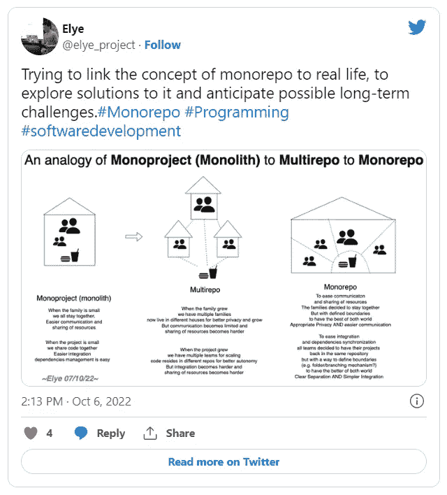

对于 Monorepo 的工作，一个主要的关键是，我们如何仍然有一个明确的“分离”定义，以确保每个团队将继续

1.  明确属于每个团队的代码部分的所有权
2.  团队特有的清晰可见性(例如，PR、在制品部分)和执行(CI 流程)

下面是一些关于我们如何在一个简单的 GitHub 库上实现我们所拥有的东西的想法

# 文件夹机制

每个 GitHub 存储库都有一个根文件夹。按照惯例，谁拥有根文件夹，谁就拥有整个存储库。

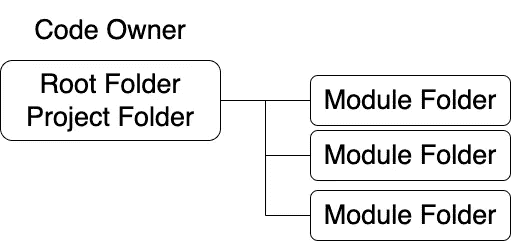

然而，对于 Monorepo，我们现在主持不同的项目。我们需要有能力让每个所有者清楚地拥有它的每一部分。

为了实现这一点，根不再属于任何代码所有者。也许它可以归 DevOps 团队所有。

相反，下一级文件夹可以被其他人使用。有了这些，我们现在有了一个非常清晰的文件夹结构，每个团队都可以拥有它。

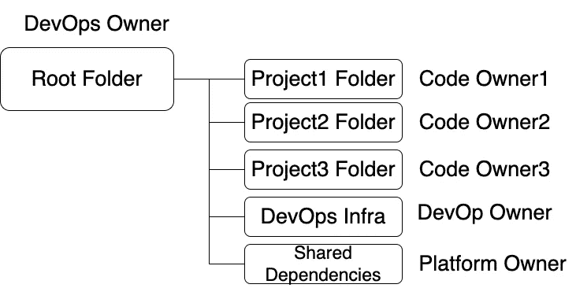

如图所示，我们还可以将 DevOps common infra 作为一个单独的文件夹跨项目共享，并共享一些依赖项。

这很好，因为所有的项目所有者都在相同的层次级别上，可以在相同的文件夹结构级别上访问更容易组织的项目，如“README”，甚至一些通用的工具文件，使其更易于管理，以便更清晰地管理。

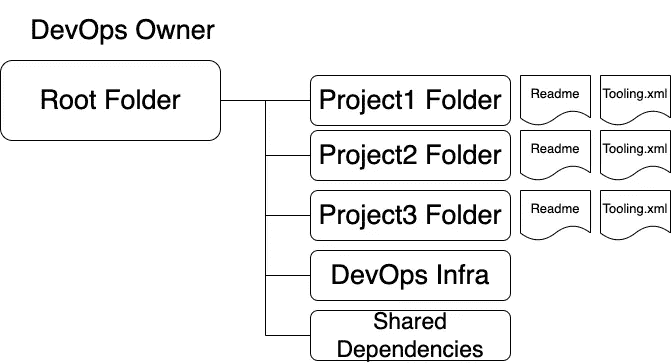

## 避免分层项目所有权文件夹

有时，人们可能会认为 Project 就像是另一个项目的库，如下所示:

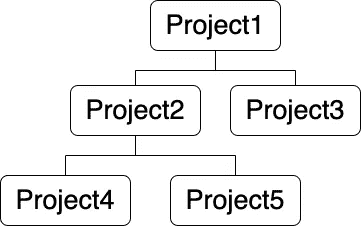

有一种诱惑使文件夹的结构像这样:

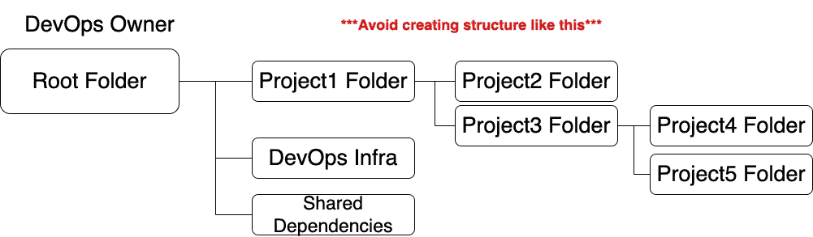

这可能会产生如下所述的各种问题:

*   这意味着子文件夹项目将始终属于父项目。这也妨碍了它将来在其他项目中的可重用性。如果真的很清楚它应该总是属于那个项目，也许它们应该被组合在一起作为一个项目。
*   这将使支持多项目单一回购的工具变得复杂。人们必须浏览分层文件夹以访问和识别不同的项目所有者。

## “但是，但是…我的移动开发工具只能包含项目子文件夹中的子模块项目”

好消息是，我已经探索了本地移动项目(例如 XCode 和 Android Studio)，人们可能可以从不同根级别的文件夹中导入子模块。

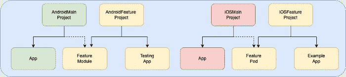

有关更多详细信息，请查看下面的文章:

[](https://medium.com/mobile-app-development-publication/monorepo-for-ios-and-android-project-2fe9eadd9748) [## iOS 和 Android 项目 Monorepo

### 在扩展项目开发的同时，尽可能简化集成和依赖性处理

medium.com](https://medium.com/mobile-app-development-publication/monorepo-for-ios-and-android-project-2fe9eadd9748) 

# 分支机制

文件夹分离有助于在同一个存储库中划分实际的代码所有权。然而，还有其他方面没有得到解决。

*   我们可以为不同团队的项目运行不同的 CI 流程吗？例如，当每个团队编码时，他们只想运行他们较小的项目 CI，而不是运行存储库中的整个项目套件！
*   我是否可以只查看我的团队的 PR，而不必列出所有组的 PR，并使用团队成员的姓名(会不时更改)手动过滤掉？
*   我能轻松地访问我的团队当前正在进行的工作代码吗？

一种可能的方法是为每个团队定义一个合适的分支名称实践。

## 每个项目的分支名称

以前我开发的正常做法是创建一个分支名`/feature/<feature-name>`。每个人都这样做。这不是问题，因为每个人都在同一个团队。我们队里没有太多的人。

然而，对于不同的团队，很难区分哪个团队正在开发哪个特性。

因此，需要一些分支命名约定，如下所示:

```
<project-name>/feature/<feature-name>
```

这样做的好处如下:

1.  当团队想找出他们拥有的分支时，他们更容易筛选出他们拥有的，并分别做相关的内务处理。
2.  我们的 CI 流程可以利用分支根名称来确定流程运行(例如，它不需要运行所有项目的 CI 流程)。这允许团队定制他们自己的 CI 过程，并且在开发中有更好的周转时间。

## 每个团队的分支主管

在一个单独的存储库中，每个团队都有自己的`main`分支和`feature`分支。通常，他们可能对`main`和其他人有不同的 CI 运行配置。

因此，为了保持类似的优势，可以考虑引入团队的主要分支。

```
<project-name>/main
```

因此，特色分支，即`<project-name>/feature/<feature-name>`可以合并到这个`<project-name>/main`分支中。

在“可发布”之后，团队领导将`<project-name>/main`分支合并到实际的`main`分支中。

当然，这个`<project-name>/main`应该总是尽可能有规律地与`main`分支同步，也许每当`main`分支有新的变化时就自动同步。

在这种情况下，对“长期存在的”分支地狱问题的担心在这里将会非常少见，因为文件夹有非常清晰的编码分离。冲突是非常罕见的，因为除了团队本身之外，在`main`分支中不会发生影响团队代码的其他代码变更。

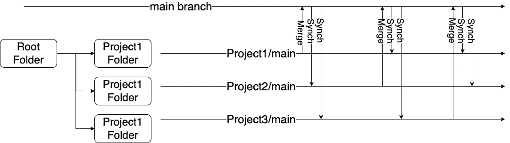

> 有一个例外，当一个共享的依赖项升级或基础设施更新到整个系统时，这将影响所有的项目，因此主分支中的这种变化将影响所有的团队。
> 
> 但是这种情况不会像团队中通常的代码变更那样频繁(也不会对代码产生大的影响),也不会带来好处(下面将会分享)。
> 
> 如果它们发生得太频繁，那么项目的划分应该被重新检查。

这样做的好处如下:

# 对于每次合并，主版本将更有意义

期待很正常，任何到了`main`的东西都有望随时发布。假设每个签入的`main`都是立即释放的。然后，将“发布”的数量最小化为一个组合并特征，而不是不完整特征的单个 PRs。

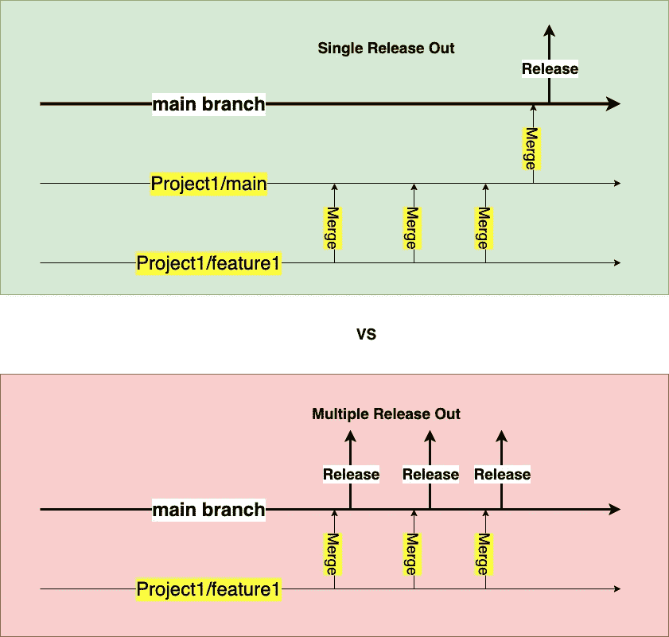

此图仅显示了一个项目。随着多个项目的不断合并，这种差异会更加剧烈

# 可以更好地总结主要发布项

假设我们不在每次合并到`main`时发布(例如，移动项目，我们在固定的持续时间后将一个“发布”分组到商店)，将一个组合并到`main`会更好，因为它可以产生有意义的总结

请看下图:

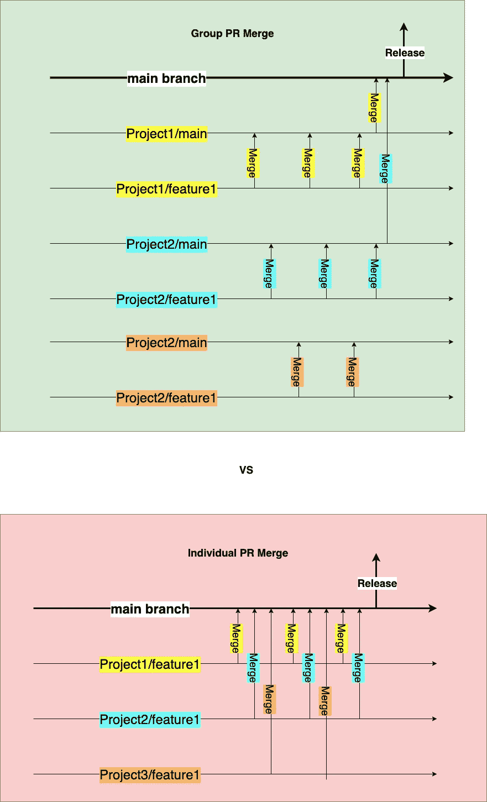

作者图片

从那里开始，在发布时，发布说明将看起来像下面这样，合并的组将放在那里。看起来更简洁有意义。

*   有一个完整的功能将与一个有意义的公关一起发布
*   没有任何部分特性(注意，在组 PR 合并的情况下，项目 3/特性 1 甚至没有发布)

> **注**:完整特征的定义=要一起发布的预期零件。它可能是切换背后的部分项目，但却是一个有意义的版本

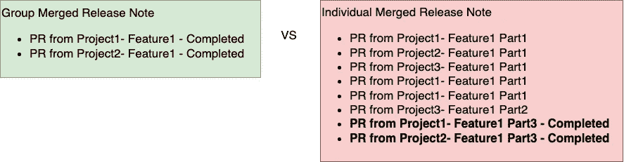

这个图只显示了三个项目。当有更多的项目时，列表的多样性会更大。

# 当发现问题时，更容易检测到有问题的变更

按照上面的思路，发布一个分组合并，附带一个简洁的摘要发布和一个 PR 列表，这样更容易找到哪个 PR 引入了一个 bug。分组列表可以分开。

要浏览的 pr 列表更快，并且它们有意义地链接在一起。为新的修补程序版本恢复它们也更快。

## 各自团队的 PRs 调查结果要容易得多

通过`<project name>/main`分支，我们可以很容易地过滤出与被检查集团相关的 PR。可以检查要合并到的目标分支。

这样做的语法取自[这个堆栈溢出](https://stackoverflow.com/a/32293984/3286489)。

> 搜索短语是:`*is:open is:pr base:X*`
> 
> 官方描述:[基于分行名称的搜索](https://docs.github.com/en/github/searching-for-information-on-github/searching-issues-and-pull-requests#search-by-branch-name)
> 
> 您也可以选择添加`*is:merged*`或`*is:unmerged*`过滤器。

# 在项目中，多层 CI 流程沿着“进行中的工作”与“功能完成”进行

当一些特性开发正在进行时，我们希望将它合并到一个工作分支中，并让它运行足够的测试以加快 CI 周转时间。

开发人员可能不想运行整个繁重的测试功能。但是在完成开发后，人们可能希望通过一个更严格的测试链接来自动运行主项目。

如果我们有一个`<project name>/main`分支，那么我们可以在合并到实际的`main`之前配置它运行一个更健壮的 CI 测试。

在`<project name>/feature/<feature-name>`分支，可以有一个更快周转的 CI 测试，如果需要，可以选择更健壮的测试。

这样，我们可以有一个多层的测试来处理阶段合并，同时确保在适当的开发水平上的快速周转时间。

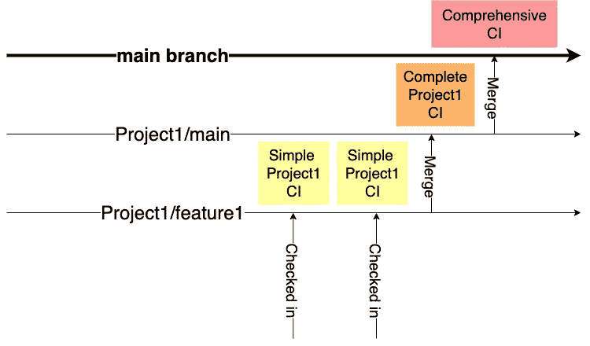

# TL；速度三角形定位法(dead reckoning)

使用文件夹和分支机制，我们可以将一个普通的 GitHub 存储库转换成 Monorepo。它将在团队之间实现一些清晰的代码和过程划分。

人们可以利用 GitHub 中的其他功能，例如标记或项目参考级别。

尽管如此，仍有其他棘手的问题需要解决。以下是其中的一些:

*   协调团队间的依赖关系变更——这是谁的责任？每个球队老板？轮换 DevOps 团队？平台团队？
*   我们是否也为跨多个不同平台的项目提供服务，并共享相同的结构？
*   我们在同一个平台上发布不同的主项目吗？如果是这样，需要什么分支机制？
*   假设我们共享同一个 GitHub 库，那么它会随着大量代码的增长而继续扩展吗？

嗯，就像一个成长中的家庭生活在一起一样，总会有一些挑战需要一起应对。我相信有办法解决或解决这些问题。我们只需要合作，有时为了在同一屋檐下和谐相处而妥协。