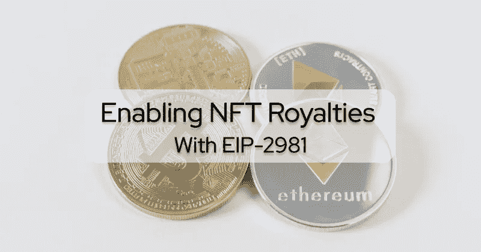
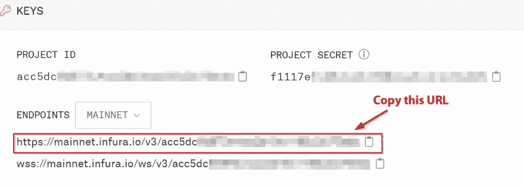

# 启用 EIP 的 NFT 版税-2981

> 原文：<https://betterprogramming.pub/enabling-nft-royalties-with-eip-2981-1cc7cf4378a9>

## EIP-2981 引入了一种更简单的方法来启用 NFT 项目的版税。了解这个版税标准以及如何实施它



随着 [ERC721 标准](https://eips.ethereum.org/EIPS/eip-721)的最终确定，不可替代令牌(NFT)开始受到大量关注。这些被证明是独一无二的资产存储在区块链上，并引入了一种新的方式来收集和交易艺术，音乐，个人资料图片(PFPs)等。2021 年夏天，由于流行的热潮，创造和销售 NFT 成为一种快速积累财富的方式。

然而，当阅读底层规范时，您会注意到 ERC721 或 ERC1155 标准中没有获取和分割版税的功能。这些标准只处理所有权状态跟踪、批准和直接转移。

如果界面不包含任何原生版税功能，作为一个创作者，您如何能够在最初销售后很长时间内制作能够积累财富的 NFT？像 OpenSea 这样的交易平台是如何分一杯羹的？如果你有一个更复杂的版税情况，如分割版税怎么办？

在本文中，我们将探讨使用 NFTs 的版税的几个方面。我们将研究实现版税的方法，包括专有解决方案、注册和 EIP-2981。我们还将研究一种分期付款的方法。最后，我们将运行一个项目，并看到版税分裂的行动。

我们开始吧！

# 什么是 NFT 版税？

就在第一批 NFTs 问世后几个月，市场合同就建立起来了，它允许持有者在商品上贴上价格标签，出价购买，并与他人安全交易。许多这样的市场甚至不存储用户的竞价交易；他们的配对合同收集交易的链外签名，并将它们存储在一个集中的服务器基础设施上。在区块链上拥有独一无二的东西的想法使 OpenSea 成为世界上最成功的市场之一，在[油老虎排行榜](https://etherscan.io/gastracker)上一直排名第一。

那些逐渐去中心化的市场的真正成功故事是从他们每笔交易收取的费用中写出来的。例如，每只无聊的猿以 100 Eth 的价格交易，OpenSea 就能稳定地获得 2.5 Eth 的巨额利润。将创作者留在他们的市场平台上的激励措施是向他们提供从二级市场销售中长期获利的选择。在 NFT 领域，这通常被称为“版税”。

# 为 NFT 创作者赚钱:铸造费和版税

当有人通过部署 ERC721 合约推出基本的 NFT 系列时，他们首先要考虑的是铸造，或者说新的令牌是如何进入生活的？

令您惊讶的是，ERC721 本身并没有定义任何默认的铸造规则。甚至它的官方规格也只提到过一次“薄荷”这个词。然而，几乎所有可收集的 NFT 合同都包含一种通过发送费用来调用的“造币”方法，这已成为常识。新铸造的代币可以在市场平台上立即交易，根据其社会市场机制，新铸造的资产可能会在几个小时内卖出大量铸造费。

铸造费对 NFT 合约的受益账户来说是有利可图的。然而，热门收藏的主要收入来源是版税，也就是当商品在其平台上交易时，市场从销售价格中分离出来的费用。既然 ERC721 与经济概念无关，更与 NFT 交易无关，那么 NFT 系列如何强制降低二次销售的版税呢？简单的答案？它不能。

重要的是要明白版税不是一个可以由收藏本身强制执行的概念。人们曾试图建立集合合约，这些合约带有自己的市场逻辑，并禁止在其受控环境之外的转让，但它们从未获得太多关注，因为市场是在主导平台上建立的。

对于这些人来说，版税支付是一个自愿的概念，每个市场单独实施。因此，当 NFT 合同只是作为注册管理机构和市场单独管理版税支付时，收藏所有者如何定义他们的版税计划，以便每个市场都支持它？

# 专有解决方案

对于市场来说，确定收取多少版税以及将它们转移到哪里的最简单的方法是依赖于由集合实现的自己的专有接口。一个很好的例子是 Rarible exchange 合同，它试图支持各种外部版税接口，其中有两个 Rarible 定义了自己，是 NFT 领域的早期参与者:

```
interface RoyaltiesV1 {
    event SecondarySaleFees(uint256 tokenId, address[] recipients, uint[] bps);
    function getFeeRecipients(uint256 id) external view returns (address payable[] memory);
    function getFeeBps(uint256 id) external view returns (uint[] memory);
}interface RoyaltiesV2 {
    event RoyaltiesSet(uint256 tokenId, LibPart.Part[] royalties);
    function getRaribleV2Royalties(uint256 id) external view returns (LibPart.Part[] memory);
}
```

NFT 集合可以实现这些接口来返回版税金额和一组接收者。然后，当市场契约上的交易发生时，交易契约检查所涉及的 NFT 集合是否实现了这些接口中的一个，调用它，并使用它的返回值来相应地分割费用。

注意，实际的销售价格不是方法接口的一部分。相反，他们以基点(bps)的形式产生版税份额，这是版税分配方案中常用的术语，通常翻译为 1/10000——500 的份额意味着贸易价值的 5%应作为版税发送给收藏所有者。

# 版税注册

然而，专有接口可能会导致问题。NFT 契约的作者无法知道哪些接口可能会成为强制实现的，因为他们无法预测他们的令牌将在哪些市场上进行交易。更糟糕的是，如果他们在发布相关的市场合同之前启动了一个收集合同，他们通常没有简单的方法来添加各自的版税分配方案。

为了解决这个问题，围绕 [manifold.xyz](https://www.manifold.xyz/) 的一个主要 NFT 市场财团同意部署一个行业范围的注册合同，收藏建设者可以使用它来独立于他们的令牌合同发出版税分割信号。版税注册的[开源代码库](https://github.com/manifoldxyz/royalty-registry-solidity/blob/main/contracts/RoyaltyEngineV1.sol)显示它支持许多最重要的市场界面。

例如，如果一个 NFT 收藏所有者只实现了上面提到的 Rarible 的版税分配方案之一，另一个不知道该接口的市场可以简单地调用通用注册中心的`[getRoyaltyView](https://github.com/manifoldxyz/royalty-registry-solidity/blob/main/contracts/RoyaltyEngineV1.sol#L107)`函数。它试图查询令牌合同上所有已知的版税接口，并将任何响应转换为通常可用的结果。

注册处甚至更进一步。没有在合同中加入任何版税信号方案的收藏所有者可以部署一个扩展的“覆盖”合同，并在公共注册中心注册。这种注册方法将确保只有集合所有者(由`owner`公共成员标识)可以调用它。

# EIP-2981:跨市场的 NFT 版税信号标准

2020 年，一些雄心勃勃的个人开始定义一个通用接口，它足够灵活，可以覆盖大多数与版税相关的用例，并且易于理解和实现:EIP-2981。它只定义了 NFT 合同可以实施的一种方法:

```
function royaltyInfo(uint256 _tokenId,  uint256 _salePrice) 
  external view 
  returns (address receiver, uint256 royaltyAmount);
```

请注意它有意缺乏的特性:它既不关心几个政党之间的分裂，也不强加任何百分比或基点的概念。调用者很清楚他们将收到什么返回值，实现者也很清楚如何实现这一点。

该接口也完全在链外工作，因此在替代基础设施上交易资产的市场仍然可以查询创建者费用，而不知道除了 EIP-2981 方法的接口签名之外的任何事情。

该接口适用于以 Eth 表示的销售额，以及任何其他货币。实施者只需将`_salePrice`除以他们的计算基数，然后乘以相同基数上的版税百分比。虽然实施者可以运行复杂的逻辑来根据外部因素计算动态版税，但建议尽可能少地执行此方法，因为它将在交易方之间的销售转移交易中执行，并且他们的天然气费用应该相当低。

为了让您了解非平凡的 EIP-2981 实现可能是什么样子，这里有一个片段，您可以在 1/1 NFT 收藏中找到，它表明原始创作者的地址以及他们对任何与该标准兼容的市场的版税要求:

如果您正在使用 OpenZeppelin 的 ERC721 基础契约构建 NFT 契约，您可能已经注意到他们最近添加了一个包含管理方法和私有成员的`[ERC721Royalty](https://docs.openzeppelin.com/contracts/4.x/api/token/erc721#ERC721Royalty)`基础契约，以简化专用令牌版税的处理。

# ERC1155 印刷品的版税

市场并不是唯一让用户从版税计划中获利的应用。例如，Treum 的 [EulerBeats](https://eulerbeats.com/) 在他们的合同集合中使用了多令牌标准 [ERC1155](https://eips.ethereum.org/EIPS/eip-1155) ，这代表了结合了计算机生成的曲调和生成艺术作品的 NFT。铸造种子令牌后，用户可以从中获得有限数量的打印，每次打印的价格会沿着令牌合同定义的绑定曲线上升。

每铸造一枚新的英格玛种子，合同会将铸造费的 50%提成转给当前种子的所有者。如果接收方实现了特定于平台的`IEulerBeatsRoyaltyReceiver`接口，它甚至可以对版税支付做出反应，并在他们的种子印刷完成后执行代码。

# PaymentSplitters:向不止一个接收者发送 NFT 版税。

EIP-2981 缺乏其他方法现成解决的用例。它只能向请求方发送一个版税接收地址。因此，需要在几个接受者之间分割版税的情况必须单独实现。

这可能会带来几个新问题:首先，呼叫者/市场不一定必须将资金与触发交易的相同交易一起发送，而是可以在以后决定这样做，例如在从另一个帐户进行的高能效多呼叫中。第二，对地址的支付呼叫可能在汽油使用方面受到高度限制。Solidity 中的任何[默认接收方函数](https://docs.soliditylang.org/en/v0.8.13/contracts.html?highlight=receive#receive-ether-function)都被强烈鼓励使用尽可能少的 gas，因为发送方可能没有意识到他们正在向合同转移资金。

最重要的考虑是，直接从契约交互中汇款会带来陷入可重入漏洞的风险；这就是为什么强烈建议支持拉取机制，允许受益人不时地提取他们的收益，而不是直接将资金推到调用合同未知的地址。

幸运的是，OpenZeppelin 的基础合同又覆盖了我们。他们的 [PaymentSplitter](https://docs.openzeppelin.com/contracts/4.x/api/finance#PaymentSplitter) 原语允许建立单独的分割合同，以保证资金的安全，直到他们的收款人要求他们，他们的[接收功能](https://github.com/OpenZeppelin/openzeppelin-contracts/blob/v4.5.0/contracts/finance/PaymentSplitter.sol#L68)只需要最少的汽油就可以运行。NFT 集合建设者可以创建一个内嵌的支付拆分器，其中包含想要的受益人列表和他们各自的份额金额，并让他们的 EIP-2981 实现产生该拆分合同的地址。

对于许多用例来说，这种方法的权衡可能是可以忽略的:PaymentSplitter 部署相对来说是气体密集型的，并且一旦 Splitter 初始化，就不可能替换收款人或股份。在[创成式艺术项目拼接](https://github.com/SpliceNFT/splicenft/blob/main/packages/contracts/contracts/ReplaceablePaymentSplitter.sol)中可以找到如何有效地替换拆分器参与者和实例化节能分包合同的示例实现。

# 用本地 Mainnet Fork 测试 NFT 版税支出

设计与任意 NFT 合约交互的市场不是一项简单的任务，因为无法预测实时网络上的合约是否按照 ERC 界面运行。然而，使用 [Ganache](https://trufflesuite.com/blog/introducing-ganache-7/) 针对这些契约测试我们的代码是有帮助的。这个强大的工具让我们可以在本地机器上创建以太坊网络的即时分支，而无需设置我们自己的区块链节点。相反，它依赖于 [Infura](https://docs.infura.io/infura/) 节点来读取我们正在交互的合同和账户的当前状态。

在开始我们的区块链实例之前，让我们克隆我们的概念证明的存储库，进入新目录，并安装任何依赖项:

```
git clone https://github.com/elmariachi111/royalty-marketplace.git
cd royalty-marketplace
npm i
```

为了了解这个 NFT 市场示例中发生了什么，让我们看一下`contracts`文件夹中的`ClosedDesert.sol`代码。

```
// SPDX-License-Identifier: MIT
pragma solidity ^0.8.0;import "@openzeppelin/contracts/token/ERC721/IERC721.sol";
import "@openzeppelin/contracts/utils/Address.sol";
import "@openzeppelin/contracts/security/ReentrancyGuard.sol";
import "@openzeppelin/contracts/token/common/ERC2981.sol";
import "@manifoldxyz/royalty-registry-solidity/contracts/IRoyaltyEngineV1.sol";struct Offer {
  IERC721 collection;
  uint256 token_id;
  uint256 priceInWei;
}
/**
 * DO NOT USE IN PRODUCTION!
 * a fixed reserve price marketplace
 */
contract ClosedDesert is ReentrancyGuard { mapping(bytes32 => Offer) public offers; // https://royaltyregistry.xyz/lookup
  IRoyaltyEngineV1 royaltyEngineMainnet = IRoyaltyEngineV1(0x0385603ab55642cb4Dd5De3aE9e306809991804f); event OnSale(bytes32 offerHash, address indexed collection, uint256 token_id, address indexed owner);
  event Bought(address indexed collection, uint256 token_id, address buyer, uint256 price); function sellNFT(IERC721 collection, uint256 token_id, uint256 priceInWei) public {
    require(collection.ownerOf(token_id) == msg.sender, "must own the NFT");
    require(collection.getApproved(token_id) == address(this), "must approve the marketplace to sell"); bytes32 offerHash = keccak256(abi.encodePacked(collection, token_id));
    offers[offerHash] = Offer({
      collection: collection,
      token_id: token_id,
      priceInWei: priceInWei
    });
    emit OnSale(offerHash, address(collection), token_id, msg.sender);
  } function buyNft(bytes32 offerHash) public payable nonReentrant {
    Offer memory offer = offers[offerHash];
    require(address(offer.collection) != address(0x0), "no such offer");
    require(msg.value >= offer.priceInWei, "reserve price not met"); address payable owner = payable(offer.collection.ownerOf(offer.token_id)); emit Bought(address(offer.collection), offer.token_id, msg.sender, offer.priceInWei); // effect: clear offer
    delete offers[offerHash]; (address payable[] memory recipients, uint256[] memory amounts) =
      royaltyEngineMainnet.getRoyalty(address(offer.collection), offer.token_id, msg.value); uint256 payoutToSeller = offer.priceInWei; //transfer royalties
    for(uint i = 0; i < recipients.length; i++) {
      payoutToSeller = payoutToSeller - amounts[i];
      Address.sendValue(recipients[i], amounts[i]);
    }
    //transfer remaining sales revenue to seller
    Address.sendValue(owner, payoutToSeller); //finally transfer asset
    offer.collection.safeTransferFrom(owner, msg.sender, offer.token_id);
  }
}}
```

在我们的示例中，卖家可以在获得转让批准后，以固定的销售价格列出他们的资产。买家可以关注`OnSale`事件，并通过发布`buyNft`交易和发送想要的 Eth 值来做出响应。市场合同在销售交易期间检查开放的 mainnet [NFT 版税注册表](https://royaltyregistry.xyz/lookup)以查看收藏所有者是否请求版税，然后相应地支付它们。如上所述，公共版税注册已经将 EIP-2981 兼容合同考虑在内。尽管如此，它也支持许多其他专有的分发方案。

接下来，我们将部署我们的本地区块链实例，并使用真实用户的帐户和 NFT 测试我们的合同。

为了测试 mainnet 条件下的契约行为，我们首先需要访问一个 [Infura mainnet 节点](https://infura.io/product/ethereum)，方法是请求一个项目 id 并在我们的机器上本地安装[Ganache V7](https://github.com/trufflesuite/ganache#command-line-use)。然后，我们可以使用我们最喜欢的 NFT 市场来查找收藏，并找到一个将在我们的测试中扮演卖家角色的 NFT 持有人帐户。卖家必须实际拥有我们将要出售的 NFT。

最后，找一个有足够 mainnet 资金(至少 1 Eth)的账户来支付卖家要求的销售价格。有了这些帐户和工具，我们可以在新的终端窗口中使用以下命令启动本地 Ganache mainnet 实例:

```
npx ganache --fork https://mainnet.infura.io/v3/<infuraid> --unlock <0xseller-account> --unlock <0xbuyer-account>
```

确保在上面的命令中使用您自己的 Infura mainnet 端点作为 URL。



如果你找不到要解锁的帐户，这里有几个可以试试:

卖家地址:`0x27b4582d577d024175ed7ffb7008cc2b1ba7e1c2`
买家地址:`0xd8dA6BF26964aF9D7eEd9e03E53415D37aA96045`

**注意:**因为我们在 Ganache 实例中模拟以太坊主网，所以当您读到本文时，卖方可能已经不再拥有我们将要出售的 NFT，或者买方可能已经没有足够的以太网来实际购买。因此，如果这些地址不起作用，您将不得不寻找符合上述标准的地址。

使用上面的地址示例，我们的命令如下所示:

```
npx ganache --fork https://mainnet.infura.io/v3/<infuraid> --unlock 0x27b4582d577d024175ed7ffb7008cc2b1ba7e1c2 --unlock 0xd8dA6BF26964aF9D7eEd9e03E53415D37aA96045
```

接下来，在我们最初的终端窗口中，我们将从存储库中编译和部署 marketplace 契约，并选择我们的本地 mainnet fork 提供者，这可以在 **truffle-config.js** 中找到:

```
npx truffle compile
npx truffle migrate --network mainfork
```

现在，我们可以在 mainnet 条件下测试我们的版税感知市场合同，而无需支付一分钱的天然气费用。所有即将到来的交易将由本地 Ganache 链代表真实用户的帐户执行。

让我们看一下`testMarketplace.js`脚本(在`scripts`文件夹中找到),我们将使用它与我们部署的市场智能合同进行交互:

```
const ClosedDesert = artifacts.require("ClosedDesert");
const IErc721 = require("../build/contracts/IERC721.json");//Change these constants:
const collectionAddress = "0xed5af388653567af2f388e6224dc7c4b3241c544"; // Azuki
const tokenId = 9183;
let sellerAddress = "0x27b4582d577d024175ed7ffb7008cc2b1ba7e1c2";
const buyerAddress = "0xd8dA6BF26964aF9D7eEd9e03E53415D37aA96045";module.exports = async function(callback) {
  try {
    const marketplace = await ClosedDesert.deployed();
    const erc721 = new web3.eth.Contract(IErc721.abi, collectionAddress);
    const salesPrice = web3.utils.toWei("1", "ether"); //buyerAddress = await web3.utils.toChecksumAddress(buyerAddress); // marketplace needs the seller's approval to transfer their tokens
    const approval = await erc721.methods.approve(marketplace.address, tokenId).send({from: sellerAddress});
    const sellReceipt = await marketplace.sellNFT(collectionAddress, tokenId, salesPrice, {
      from: sellerAddress
    });
    const { offerHash } = sellReceipt.logs[0].args; const oldOwner = await erc721.methods.ownerOf(tokenId).call();
    console.log(`owner of ${collectionAddress} #${tokenId}`, oldOwner); const oldSellerBalance = web3.utils.toBN(await web3.eth.getBalance(sellerAddress));
    console.log("Seller Balance (Eth):", web3.utils.fromWei(oldSellerBalance)); // buyer buys the item for a sales price of 1 Eth
    const buyReceipt = await marketplace.buyNft(offerHash, {from: buyerAddress, value: salesPrice});
    const newOwner = await erc721.methods.ownerOf(tokenId).call();
    console.log(`owner of ${collectionAddress} #${tokenId}`, newOwner); const newSellerBalance = web3.utils.toBN(await web3.eth.getBalance(sellerAddress));
    console.log("Seller Balance (Eth):", web3.utils.fromWei(newSellerBalance));
    console.log("Seller Balance Diff (Eth):", web3.utils.fromWei(newSellerBalance.sub(oldSellerBalance))); } catch(e) {
    console.error(e)
  } finally {
    callback();
  }
}
```

**注意**:常量`collectionAddress`、`sellerAddress`和`buyerAddress`必须都是满足上述标准的合法 mainnet 地址，而`sellerAddress`和`buyerAddress`必须都在您的 Ganache 实例中解锁。`tokenId`常数也必须是卖家拥有的 NFT 的实际值`tokenId`。

在这个助手脚本中，我们将设置对我们将与之交互的合同的引用。我们决定在样本代码中获得 EIP-2981 兼容的[志那都红豆集合](https://www.azuki.com/)，但是它可以是任何 NFT 集合。我们使用以下命令运行该脚本:

```
npx truffle exec scripts/testMarketplace.js --network mainfork
```

如果一切运行正常，您应该会在控制台中收到如下输出:

```
owner of Azuki 0xed5af388653567af2f388e6224dc7c4b3241c544 #9183 0x27b4582D577d024175ed7FFB7008cC2B1ba7e1C2
Seller Balance (Eth): 0.111864414925655418
owner of Azuki 0xed5af388653567af2f388e6224dc7c4b3241c544 #9183 0xd8dA6BF26964aF9D7eEd9e03E53415D37aA96045
Seller Balance (Eth): 1.061864414925655418
Seller Balance Diff (Eth): 0.95
```

让我们浏览一下刚刚发生的步骤，以便了解它是如何工作的。首先，该脚本要求卖方在 NFT 售出后批准转让，这一步通常由各自的市场合同处理。然后，我们通过代表当前所有者致电`sellNft`来创建销售报价。最后，我们简单地重用 sale 事件中包含的 offer hash，让我们的买方调用`buyNft`方法并发送请求的销售价格 1 Eth。

当你比较卖家交易前后的余额时，你会注意到他们没有收到要求的 1 Eth，而只有 0.95。按照 mainnet 版税注册合同的指示，剩余资金已转移到志那都红豆的版税接收方。

# 结论

版税是在 NFT 取得成功的主要驱动力。以前，它们是专有市场的附加功能，现在已经演变成不可替代的代币经济的强制属性。他们向任何 NFT 收藏品建造者承诺，当他们的作品开始吸引广大观众时，他们就可以获利。他们是一个伟大的经济概念，以某种方式分配销售收入，为原始代码作者或 NFT 艺术家提供激励。

ERC721 不包含任何经济特征的概念；因此，NFT 特许权使用费不能通过象征性合同直接强制执行。相反，市场建设者必须为令牌合约提供接口，以表明他们对交易费用的要求以及将交易费用发送到哪里。EIP-2981 版税信令接口是一个简洁而强大的行业标准，可以在不给实现者增加更多复杂性的情况下实现这一点。每份新的 ERC721 合同都应考虑实施至少一个基本的版税信号，以便专有的市场工具能够获取并引用该信号。