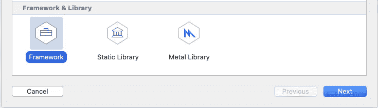
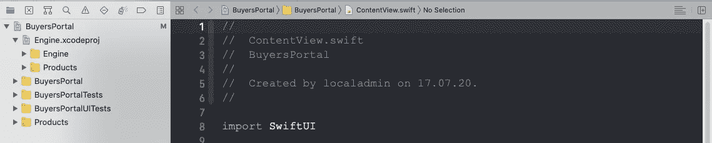
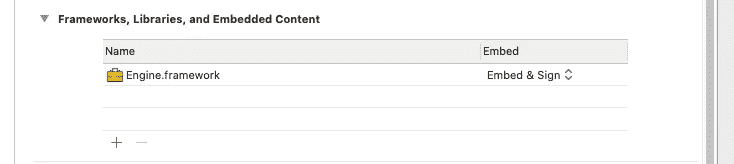

# Swift 中的封装、访问控制和框架

> 原文：<https://betterprogramming.pub/encapsulation-access-controls-and-frameworks-in-swift-6b5ddf8ce717>

## 使用访问控制的实用指南，包括框架的创建


克里斯托夫·高尔在 [Unsplash](https://unsplash.com/) 上拍摄的照片

就论文而言，我必须承认这有点长，大约有 2000 多字。在前半部分，我将介绍三种基本的访问类型:私有、文件私有和内部。在第二部分，我将介绍如何创建一个具有公共和开放访问类型的框架。两个部分都有标签，可以独立阅读。

先说一些背景。早在 20 世纪 70 年代，瑞士苏黎世联邦理工学院的信息学教授，一个叫[尼古拉斯·沃斯](https://en.wikipedia.org/wiki/Niklaus_Wirth)的人，创造并出版了当时革命性的教学语言。一种他称为帕斯卡的语言。这是一种基于他的书 [*算法+数据结构=程序*](https://en.wikipedia.org/wiki/Algorithms_%2B_Data_Structures_%3D_Programs) *的语言。*

它是最早引入封装概念的高级计算机语言之一。这是一个我们今天都认为理所当然的概念。它的基本思想是，需要创建一个范围，在这个范围内可以限制对代码中元素的访问。私有和公共变量和方法的概念。

事实上，Pascal 作为一种语言被设计得如此之好，以至于苹果决定用它来编写 Mac OS。苹果操作系统，也就是命运多舛的丽莎和麦金塔电脑运行的操作系统。在其他人都还在使用 c 的时候，这是一个勇敢的决定。

与此同时，C 本身也在经历着转变。十年前，随着 Objective C 语言的发展，Pascal 语言问世，这种语言又一次采用了封装的思想和概念。巧合的是，史蒂夫·乔布斯的新团队在 NextStep OS 项目中再次使用了这种语言。给我们目标 c 的公司。

正如他们所说，剩下的就是历史了。乔布斯于 1997 年回到苹果，带来了新的操作系统和新的语言，Objective C。正如你所知，Objective C 是 Swift 的前身，众所周知，它于 2014 年问世。

今天，Swift 继续建立在 Pascal 的遗产之上，并且在该语言中有五个封装级别:私有、文件私有、内部、公共和开放。访问级别可以应用于变量、类、结构、枚举、函数、方法，甚至 SwiftUI 的新包装器构建。相对于源文件、定义所述代码的实体和/或模块的访问级别。

# 私有、文件私有和内部

好了，历史足够了，让我们编码吧。我们将使用两个项目来说明这些访问级别是如何工作的。我们从最严格的，私有的开始。使用 SwiftUI 作为接口创建一个新项目，并向其中添加一个 cocoa touch 类文件，将其命名为 Person.class，并添加您在此处看到的代码。

```
**class** Person {
  **var** id: **String** = "SecretID"
}
```

访问该对象的 SwiftUI 接口需要如下所示。

这里的默认访问级别是内部。内部意味着可以在定义它们的整个模块中访问。默认情况下，您在 Xcode 项目中创建的所有内容都具有内部访问权限。在 SwiftUI 实现中命名了 Person 类之后，它可以访问其中的所有变量。现在让我们试着把事情锁定一点。更改 person 类中的`id`使其成为私有的。

```
**private** **var** id: **String** = "SecretID"
```

您将立即在 ContentView.swift SwiftUI 代码中得到一个错误，警告您类变量不再可访问。我们把它弄坏了，怎么修。

现在让我们假设我们不想改变`id`，我们只想读取它。我们可以通过在类中定义一个方法来修复这个错误，我们可以用这个方法来返回 id。将`Person ID`类修改成如下所示的代码。

```
**class** Person {
  **private** **var** id: **String** = "SecretID"
  **func** displayid() -> **String** {
    **return** id
  }
}
```

由于函数`displayed()`将被分配内部权限，我们可以在 SwiftUI 代码中调用该函数。

```
**struct** ContentView: **View** {
  @**State** **var** person = Person()
  **var** **body**: **some** **View** {
    Text("\(person.displayid())")
  }
}
```

展望未来，想象我们需要能够改变`secret ID`。为此，我们可以创建一个新的类(尽管与`Person.class`在同一个文件中)，向其中添加一个函数，如下所示。

```
**class** Management {
  **static** **func** updateID(for person:Person, with newID:**String** ) {   
    person.id = newID
  }
}
```

当然，您的新管理类最初也不会访问`person.id`，因为它是一个不同的类，很像 SwiftUI struct。您将得到与之前相同的错误。

为了解决这个问题，同时保留一些安全性，我们可以将 Person 类中的变量`id`的访问级别改为`fileprivate`。因为您在 Person 类所在的同一个文件中定义了管理类，所以它将获得访问权；而不开放对`ContentView.swift`文件中 SwiftUI 实现的访问。

```
**fileprivate** **var** id: String = "SecretID"
```

您可以通过更改代码的`ContentView.swift`来测试新的实现，如下所示。

这将在最初显示`secret ID`消息三秒后更新您将在屏幕上看到的`ID`。注意，我在这里需要`dnr`变量，因为没有它 SwiftUI 不会知道它需要再次重新运行主体。

# 框架、公共和开放

现在，为了说明封装的最后两个级别，我们将切换项目。返回桌面，创建一个新项目。称之为 BuyersPortal 我打算再次使用 SwiftUI 作为接口。

打开`ContentView.swift`并将这些结构和类添加到其中。

我们在这里定义的是一个产品记录和一个将使用它的类。现在更新`ContentView.swift`来访问您的新结构/类。

当你准备跑的时候；去吧。它将显示值为零的`newCustomer`。点击文本，它会进入你刚刚定义的方法，价格会改变。`Product`和`Purchases`类的默认权限是内部的，所有内容都在同一个文件中，这一切都将完美地工作。

现在想象你正在和你的同事 Stewart 一起远程工作。你的工作是定义`Product`和`Purchases`对象，而他的工作是将它们付诸行动。现在，您可以编写您在这里看到的代码，并发布源代码，但这不是很实际，也许您想保留对它的更多控制。

这就是框架、公共和开放访问控制发挥作用的地方。您将`Product`和`Purchases`对象嵌入到一个具有公共/开放权限的框架中。一个你交给 Stewart 的框架，确信他能够使用它，但不会滥用它。

要构建一个框架，请返回 Xcode 并启动一个新项目。就叫`Engine`吧，不过等等，不要选通常的单页 app，这次选个框架。



作者截图。

一个项目将会出现，它看起来相当光秃秃的，里面只有几个文件。向其中添加一个新的 swift 源代码文件，复制并粘贴我上面概述的代码，在您的新框架项目中定义`Product`和`Purchase`对象&方法。

编译一下，检查一下没有打错字，没有错误。关闭项目，现在仔细遵循这些步骤。

*   回到`BuyersPortal`项目，就是你刚刚剪切并粘贴了你的结构和类的那个项目，并注释掉所有内容。
*   打开包含`Engine`项目的文件夹(其中包含结构和类),然后将其中的`xcodeproj`拖动到`BuyersPortal`。

`BuyersPortal`项目的文件检查器现在应该是这样的。`Engine`项目在`BuyersPortal`项目内。



作者截图。

严格地说，我们不需要在这里包含整个`Engine`项目，我们可以只包含框架。但是在这种情况下包含整个项目更有意义，因为在我们将框架交付给 Stewart 之前，我们将更改其中的代码以获得正确的权限。

现在，编译一切，以确保我们没有设法破坏我们的桌面。好了，我们准备慢慢地重建`BuyersPortal`中的`ContentView.swif` t。从定义`Purchases`的那行开始。行不通；你会得到一个错误“找不到…”

这不是 swift 的许可问题，而是告诉你它不知道你在说什么。这仍然是一个 Xcode 问题。

我们需要再做一步来将我们的`Engine`项目集成到`BuyersPortal`中。回到项目并展开`Engine`项目，在 products 下找到您想要的`Engine.framework`。

现在选择`BuyersPortal`项目，向下滚动到框架、库和嵌入内容区域。您需要将刚刚找到的`Engine.framework`拖到此部分。如果正确的话，项目框架、库和嵌入内容应该是这样的。



作者截图。

不要犯拖到`Engine`项目的框架、库和嵌入式代码部分的错误，那是行不通的！

链接之后，确保现在在`ContentView.swift`文件中也包含了一个导入语句。`BuyersPortal`中的`ContentView.swift`即。

```
import Engine
```

现在取消对初始行的注释，以定义您的第一个`Purchases`对象。

```
@State var newCustomer = Purchases()
```

没用的，但是别担心，我们就快到了。现在您需要修复 Swift 权限。

此时，`Engine`类中的所有权限都被设置为默认权限，即内部权限。将`Purchases`类的权限更改为 public，然后重试。错误信息会改变，它会抱怨初始化器不是公共的。给你的`Purchases`类添加一个初始化器，然后重新编译。这次会成功的。我们正在取得进展。

取消对`Text`对象的`onTapGesture`注释，它将再次抱怨对`Purchases`类中的`Product`结构和`products`变量的访问权限，以及对`calculatePrice`方法的访问权限。让它们在你的`Engine`类中全部公开。您在`Engine`产品中的代码应该看起来像这样。

编译并运行。点击`newCustomer`字段，它将运行`calculate price`方法并报告新的价格。好了，你有它，公众访问。

除了最后一种类型的访问控制，即开放访问控制，我们已经讨论过了。现在想象一下 Stewart 想要在这里继承我们的`Purchases`类。例如，他可能想要一个折扣班。一个直接从我们的`Purchases`类继承其值和方法的类。

编辑`BuyersPortal`项目并向其中添加一个新文件，即`DiscountPurchases.swift`。在`DiscountPurchases.swift`文件中添加以下代码。斯图尔特想为 55 岁以上的购买者提供折扣。

要明确的是，这还不行。我们需要再次调整我们的`Engine`类的权限。

如果他按原样尝试，它将返回另一个访问控制错误。这不是我们想要的，也不是他需要的。将代码更改为如下所示。你需要使`purchases`类成为一个开放的类。也改变函数`calculatePrice`的公共访问，因为他也需要访问这个函数。

```
open class Purchases {
```

现在再次回到`DiscountPurchases`类并添加这段代码。

```
override func calculatePrice() -> Double {
  super.calculatePrice() * (1 - discountPercentage / 100)
}
```

现在一切都可以编译了。您所需要做的就是在 SwiftUI 字段中添加一些代码，将它们组合在一起。要测试您将要发布的新框架，请使用下面的代码。

这让我走到了最后。我们已经讨论了这两个项目中所有主要的访问类型。然而，在我离开之前，我想给你指出一个视频的方向，这篇文章的大部分内容都是基于这个视频。你猜对了，我的同事斯图尔特制作了一个视频。这是一个很好的资源，涵盖了您在这里可以找到的相同内容，并提供了更多的细节。你可以在这里找到视频[。](https://www.youtube.com/watch?time_continue=9&v=V7B3ZmvV_Us&feature=emb_logo)