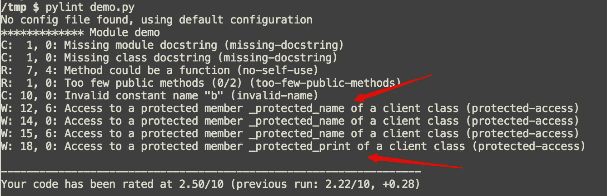
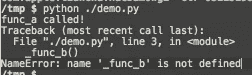
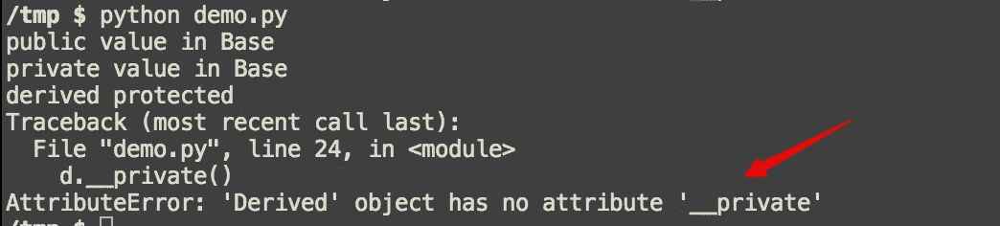
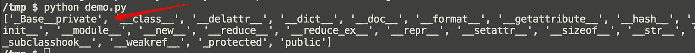

# Python 中的封装

> 原文：<https://betterprogramming.pub/encapsulation-in-python-d76212d52478>

## 如何降低系统的复杂性


unsplash.com 图片鸣谢 [@dtopkin1](https://unsplash.com/@dtopkin1)

封装是面向对象编程的一个重要方面。

让我们用简单的话来解释封装:信息隐藏。这意味着界定内部接口并从外部世界进行归因。

信息隐藏的好处是降低系统的复杂性和增加鲁棒性。为什么？因为封装限制了不同软件组件的相互依赖性。

假设我们创建了一个模块。我们的用户只能通过公共 API 与我们交互；他们不关心这个模块的内部。即使内部实现的细节发生了变化，用户的代码也不需要相应的改变。

为了实现封装，我们需要学习如何定义和使用私有属性和私有函数。

理论到此为止，我们来谈谈如何在 Python 中实现这一点。

Python 是一种解释型编程语言，实现了*弱封装*。弱封装意味着它是按照约定执行的，而不是由语言强制执行的。所以，和 Java 或者 C++还是有一些区别的。

# 受保护的属性和方法

如果你读过一些 Python 代码，你总会发现一些属性名带有前缀下划线。让我们写一个简单的`Class`:

输出将是:

```
hello
hello_again
new name
called _protected_print
```

从结果来看，带有前缀下划线的属性或方法的行为与普通属性或方法相同。那么，为什么我们需要为属性添加前缀下划线呢？

前缀下划线是对开发人员的警告:请小心这个属性或方法，不要在声明的`Class`之外使用它！

`pylint`会报告这种不良代码气味:



前缀分数的另一个好处是，它避免了在定义的模块之外的内部函数的通配符导入。让我们来看看这段代码:

```
# foo module: foo.py
def func_a():
    print("func_a called!")def _func_b():
    print("_func_b called!")
```

然后，如果我们在代码的另一部分使用通配符导入:

```
from foo import *func_a()
_func_b()
```

我们会遇到一个错误:



顺便说一下，[通配符导入](http://pep8.org/#imports)是 Python 中的另一个不好的味道，我们应该在实践中避免这种情况。

# 私有属性和方法

在传统的 OOP 语言中，为什么私有属性和方法不能被派生的`Class`访问？因为它在信息隐藏方面很有用。

假设我们声明了一个名为`mood`的属性，但是在派生的`Class`中，我们重新声明了另一个名为`mood`的属性。这覆盖了父`Class`中的前一个，并且可能会在代码中引入一个 bug。

那么，我们如何使用 Python 中的私有属性呢？

答案是在属性或方法中添加双前缀下划线。让我们运行这段代码:

输出将是:

```
public value in Base
private value in Base
derived protected
```

我们从一个派生的对象中调用`public`函数，这将调用`Base`类中的`public`函数。

注意:因为`__private`是一个私有方法，只有对象本身可以使用它，私有方法没有命名冲突。

如果我们添加另一行代码:

```
d.__private()
```

它将触发另一个错误:



为什么？让我们打印该对象的所有方法，并找出是否有名为`_Base__private`的方法。运行代码片段:

```
print dir(d)
```



这被称为 Python 解释器应用的`name mangling`。因为名字中添加了前缀名称`Class`，私有方法被小心地保护起来，以免在派生类中被重写。

同样，这意味着我们可以使用`d._Base__private`来调用私有函数。记住，不是强制的！

感谢阅读。