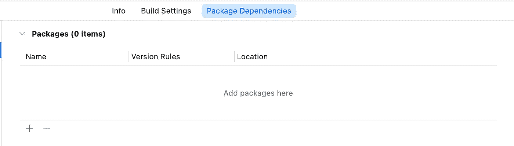
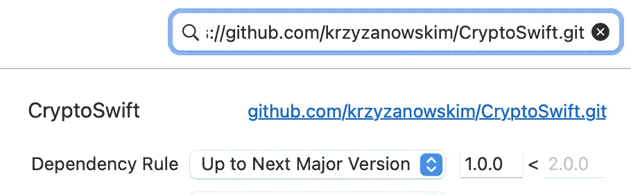

# 在 Swift 中加密常见场景

> 原文：<https://betterprogramming.pub/encrypting-common-scenarios-in-swift-34168034190c>

## 使用 AES 加密


马库斯·温克勒在 [Unsplash](https://unsplash.com/?utm_source=unsplash&utm_medium=referral&utm_content=creditCopyText) 上拍摄的照片

我认为，加密是移动开发中最重要的主题，以防止逆向工程，窃取用户敏感数据。由于开发优先级的原因，它有时会被忽略。有很多方法可以保护用户敏感数据，例如:加密类型的端到端保护、SSL 锁定、忽略未知的不安全(HTTP)连接等。

在这个故事中，我将以一种加密类型为例，说明如何实现端到端保护。

让我们假设我们有一个一次性密码，通过给短信提供商来验证应用程序。我们选择 **AES** 加密，提供双向加密。

## 俄歇电子能谱

它被称为高级加密标准。使用 AES 有两个参数—名为`key`、`iv`(初始化向量)。密钥的大小可以是 128/196/256 位。iv 的大小是 126 位。在本例中，我们选择 256 位密钥，126 位 iv。让我们随机生成两个参数

然后，我们需要通过依赖管理器将名为`[**CryptoSwift**](https://github.com/krzyzanowskim/CryptoSwift)`的第三方库导入到我们现有的项目中。让我们使用 Swift 包管理器。

选择项目并转到项目中的**包依赖关系**选项。

点击 **+** 按钮。



将下面的 URL 复制并粘贴到搜索栏。

调整库的版本。

```
"https://github.com/krzyzanowskim/CryptoSwift.git"
```



点击窗口底部的**添加包**按钮。

现在，让我们创建一个扩展文件来定义加密和解密。

## 加密

在扩展文件`encryption`方法中，首先，我们需要使用 **utf8** 将给定的代码转换成数据。在使用给定的密钥和 iv 参数后，我们需要使用 AES 的初始化密钥、iv 和填充参数。之后将它转换成数据并转换成`hexadecimalString`。

## [通信]解密

首先，从`hexadecimalString`获取数据以使用 AES 的解密方法。之后，使用数据和编码选项在新字符串中初始化它。

有了这个扩展，我们可以很容易地加密从 SMS 提供者到 web 服务的一次性密码。

目前就这些。我们看到，加密用户敏感数据是使用 AES 加密的一次性密码，用于发送到 web 服务。

我写了一个关于用加密处理用户敏感数据的第三方库。可以使用，也可以投稿。