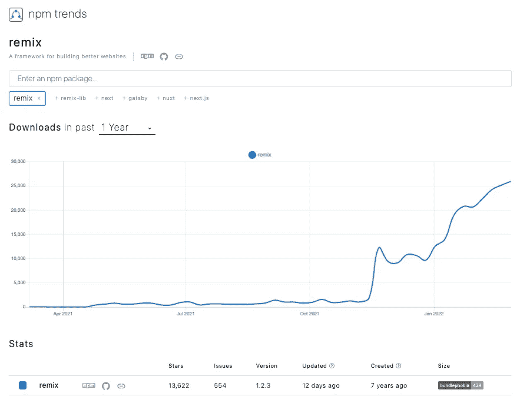
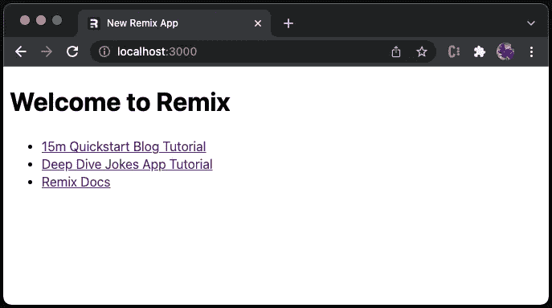
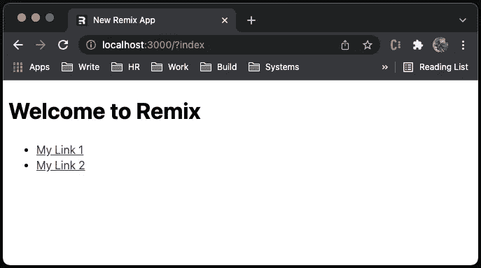
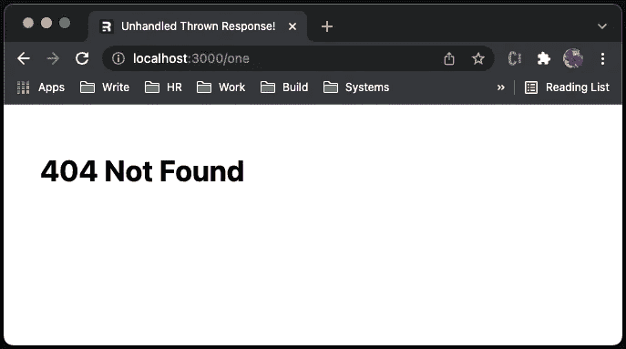
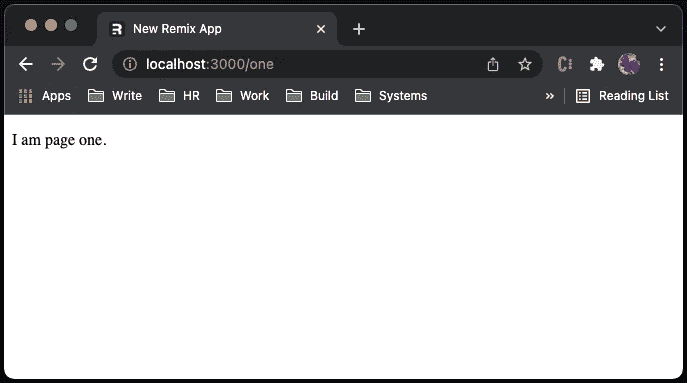
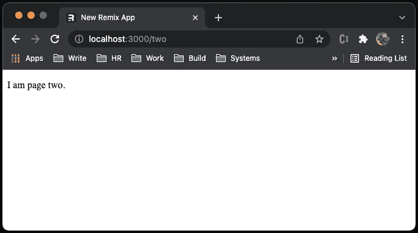
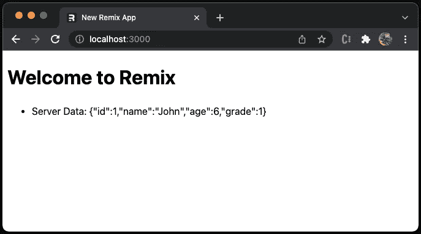
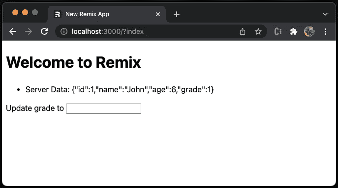
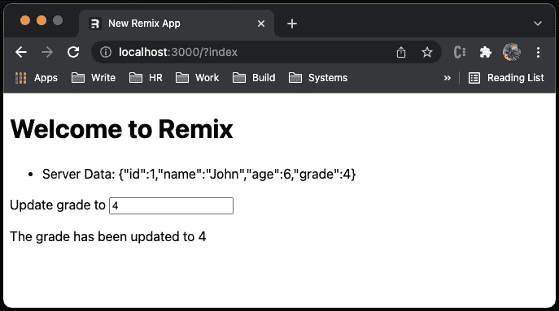
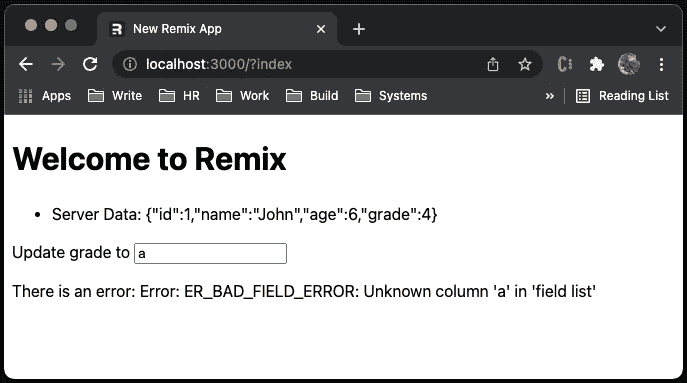

# Remix React 框架一览:全栈开发者指南

> 原文：<https://betterprogramming.pub/end-to-end-guide-to-remix-a-full-stack-web-framework-8dc56eb6a9c7>

## 介绍新的 web 框架，帮助您更快、更干净地构建


照片由 [Krys Amon](https://unsplash.com/@krysamon?utm_source=medium&utm_medium=referral) 在 [Unsplash](https://unsplash.com?utm_source=medium&utm_medium=referral) 上拍摄

Remix 是一个全栈式的 web 框架，它专注于用户界面，并通过 web 基础来提供快速、灵活、有弹性的用户体验。它包括 esbuild、React 路由器、服务器端渲染、生产服务器和后端优化。

自从 2021 年 10 月正式发布以来，Remix 已经成为一个被广泛采用的 React 框架。



作者图片

混音有很多优点:

*   它使用速度极快的 JavaScript/CSS 捆绑器和迷你器 [esbuild](/bundle-up-a-javascript-project-using-esbuild-b2c824ba0d39) 编译。
*   它在服务器端使用渐进式增强。只有必要的 JavaScript、JSON 和 CSS 内容被发送到浏览器。
*   它执行动态服务器端渲染。
*   它知道何时重新提取变异的数据，因为 Remix 监督整个工作流程。
*   它包括带有 React 路由器、服务器端渲染、生产服务器和后端优化的端到端解决方案。

# 设置混音

运行以下命令来安装 Remix:

```
% npx create-remix
? Where would you like to create your app? remix-app
? What type of app do you want to create? Just the basics
? Where do you want to deploy? Choose Remix if you're unsure; it's easy to change deployment targets. Remix App Server
? TypeScript or JavaScript? JavaScript
? Do you want me to run `npm install`? Yes
```

在安装过程中有几个选择。

*   Remix 框架安装在文件夹`remix-app`中。
*   app 的类型是`Just the basics`。
*   有许多服务器可供选择。选项有`Remix App Server`、`Express Server`、`Architect (AWS Lambda)`、`Fly.io`、`Netlify`、`Vercel`和`Cloudflare Pages`。我们使用默认的`Remix App Server`，这是一个基于 Express 的全功能 Node.js 服务器。
*   在 TypeScript 和 JavaScript 之间也有一个选择。在本文中，选择 JavaScript。

安装完成后，文件夹`remix-app`如下所示:

```
remix-app
├── README.md
├── app
│   ├── entry.client.jsx
│   ├── entry.server.jsx
│   ├── root.jsx
│   └── routes
│       └── index.jsx
├── node_modules
├── package.json
├── package-lock.json
├── public
│   └── favicon.ico
├── .eslintrc.js
├── .gitignore
├── remix.config.js
└── jsconfig.json
```

*   `app`:是包含 Remix app 代码的目录。
*   `app/entry.client.jsx`:浏览器要加载的进入码。相当于[创建 React App](/an-in-depth-guide-for-create-react-app-5-cra-5-b94b03c233f2) 的`index.js`。此外，它融合了 React 代码(第 4 行)，完成了我们在文章[中描述的](https://javascript.plainenglish.io/a-hands-on-guide-for-a-server-side-rendering-react-18-app-4e630aae274c) [index.js](https://gist.github.com/JenniferFuBook/e3ac4022445bd9fdfeb4d03c5e92d058#file-indexhydrate-js) 服务器端渲染 React 应用的实践指南中所做的工作。

*   `app/entry.server.jsx`:当请求到达服务器时，它是 JavaScript 的第一部分。Remix 只加载必要的数据，但是开发人员需要处理响应。该文件用于将 React 应用程序呈现为字符串/流，该字符串/流作为响应发送给客户端。

*   `app/root.jsx`:它是应用程序的根组件。这相当于创建了 React App 的`App.js`。`<LiveReload />`(第 27 行)显式编码，推荐开发。

*   `app/routes`:它是托管所有路由的目录。
*   `app/routes/index.jsx`:默认调用的是索引路由。

*   `public`:这是存放静态资产和产品构建的目录。
*   `public/favicon.ico`:浏览器标签和书签显示的混音图标。
*   `remix.config.js`:是 Remix 配置文件。
*   `jsconfig.js`:JavaScript 配置文件。

该应用程序可以在开发模式下执行:

```
npm run dev
```

它也可以在生产模式下执行:

```
npm run build
npm start
```



作者图片

开箱即用，我们有 React 路由器、服务器端渲染和生产服务器。

# 混合路线

上面的官方例子有外部网站的静态链接。重写`app/routes/index.jsx`以链接到内部页面。

第 9 行是到路线的链接，`"/one"`。

第 12 行是到路线的链接，`"/two"`。

页面看起来很好。



作者图片

但是，单击任何一个链接都会显示 404 错误。



作者图片

Remix 路由器使用文件系统来定义页面路由。有两种方法可以解决这个问题。推荐的方法是将路由目录中的缺失页实现为索引文件，即`app/routes/one/index.jsx`:

现在页面工作了:



作者图片

第二种方法是将文件命名为路径，即`app/routes/two.jsx`:

这是页面:



作者图片

Remix 路由器支持 [React 路由器](/a-step-by-step-guide-on-react-router-6-8964c10af364#71a9-41181d1f934)，包括嵌套路由和动态参数。

# 再混合装载机

在 Remix 中，大部分路由都是由 API 和 UI 组件组成的。API 与后端交互，而 UI 组件显示在浏览器中。Remix APIs 简化并优化了与后端的交互，包括如何将数据放入组件以及何时执行数据突变。

`loader`函数是一个特殊的 API。它被导出以便在渲染之前在服务器上调用。它通常从后端获取数据。

然后，UI 组件通过钩子`useLoaderData`使用加载的数据呈现页面。

我们写过一篇文章，[在 Create React App 环境中设置和使用 MySQL](/set-up-and-use-mysql-in-create-react-app-environment-22a4c7dc077f)。让我们看看在 Remix 环境中设置和使用 MySQL 是多么容易。

设置`mysql` ( `mysql2`工作方式类似)，用于 MySQL 协议的 JavaScript 客户端:

```
npm i mysql
```

`mysql`成为`package.json`中`[dependencies](/package-jsons-dependencies-in-depth-a1f0637a3129)`的一部分。

将`app/routes/index.jsx`修改如下:

第 4–9 行定义了用户配置。

第 11–13 行使用用户配置创建 MySQL 连接。第 12 行启用多个语句，默认情况下禁用这些语句以避免可能的 SQL 注入攻击。

第 15–25 行定义了`loader`函数，它连接到数据库来查询学生表(第 16 行)。如果有错误，承诺被解析到`null`(第 19 行)。否则，返回 MySQL 表的第一行(第 22 行)，假设至少有一行。

第 28 行调用`useLoaderData`来检索加载的数据，这些数据呈现在第 33 行。

不需要重新启动服务器。`npm run dev`类似于`nodemon`，自动监控代码变更，并重建变更。

但是，浏览器控制台上有一个错误:

多么神秘的错误信息！

当服务器端依赖项被捆绑在客户端脚本中时，会出现此错误。

为了让 Remix 在服务器和浏览器环境中运行应用程序，应用程序模块和第三方依赖项需要小心模块副作用。Remix 编译器会自动从浏览器包中删除服务器代码。在上面的代码中，第 11–13 行创建 MySQL 连接，这是服务器代码。`loader`消失了，但是`mysql`依赖关系保留了下来。浏览器无法正确处理`mysql`模块。

要解决这个问题，只需将代码和用户配置一起移动到`loader`函数中，就可以消除副作用。

现在可以用了。



作者图片

但是，我们要在每次调用`loader`函数时创建一个 MySQL 连接吗？

更好的方法是在`app/entry.server.jsx`(第 30–32 行)中创建一个 MySQL 连接:

然后，`app/routes/index.jsx`简单地导入`connection`(第 2 行):

# 混合动作

`<Form>`组件是一种执行数据突变的声明性方式:创建、更新和删除数据。Remix 的`Form`是一个增强的 HTML 表单组件。route 不使用 React 事件处理程序，比如`onClick`，而是导出表单提交时调用的`action`函数。`useState`不需要维护字段值。

类似于`loader`函数，还有`action`函数，在表单提交时调用。与钩子`userLoaderData`类似，`action`函数也有一个钩子`useActionData`，它捕获`action`函数返回的数据。

我们使用`action`和`useActionData`来构建具有修改学生成绩能力的示例。



作者图片

下面是改编的`app/routes/index.jsx`:

第 17–33 行定义了`action`函数，该函数读取表单提交数据(第 18–19 行)并连接到数据库以更新学生表(第 22 行)。如果有错误，承诺被解析为错误消息(第 26 行)。否则，它返回一个成功的消息(第 28 行)。

第 37 行调用`useActionData`来检索动作结果，该结果呈现在第 50 行。

第 44–49 行添加了`Form`组件。

保存更改，并在输入字段中输入`4`。点击 enter 后，该值被发送到`action`以更新数据库。Remix 检测到数据突变，并调用`loader`来检索要显示的最新值。



作者图片

如果输入无效，将显示错误消息。



作者图片

`Remix App Server`和后端之间的流程是无缝的。不需要样板代码。

# 结论

我们已经经历了如何使用混音。它有很多优点，最引人注目的是速度——在浏览器中加载页面很快，开发端到端应用程序也很快。Remix 是一个全栈 Web 框架，包括 esbuild、React 路由器、服务器端渲染、生产服务器和后端优化。

我们已经在许多文章中讨论了这些特性。有了 Remix，它们都是可用的，没有样板文件。

混音有什么缺点吗？

是的，混音还是新的。错误报告需要改进。例如，如果我们想要一个服务器在一个被占用的端口上，它不会报告错误或建议一个不同的端口。当它报告错误时，一些错误消息过于隐晦。

不管怎样，Remix 已经成为一个被广泛采用的 React 框架。

感谢阅读。我希望这有所帮助。如果你有兴趣，可以看看[我的其他媒体文章](https://jenniferfubook.medium.com/jennifer-fus-web-development-publications-1a887e4454af)。