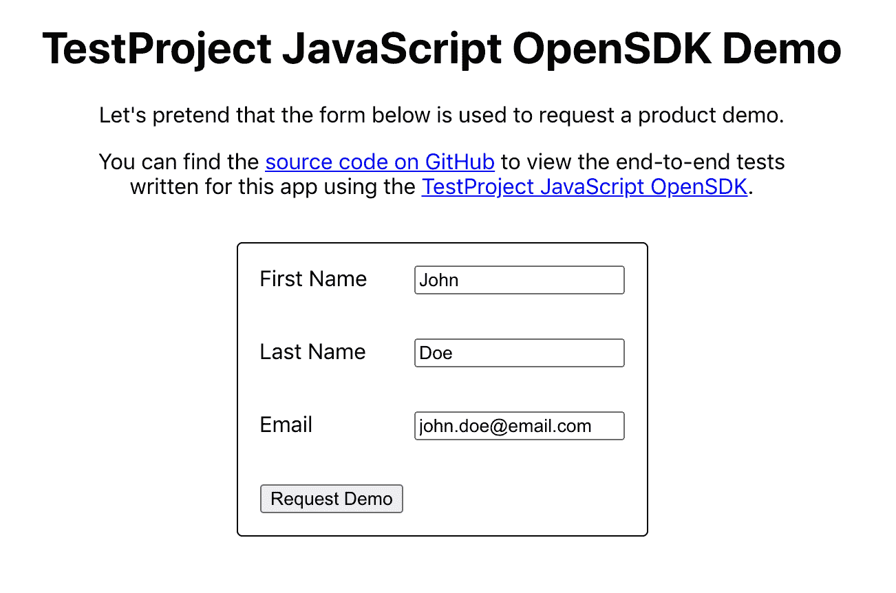
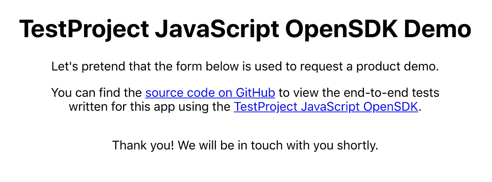
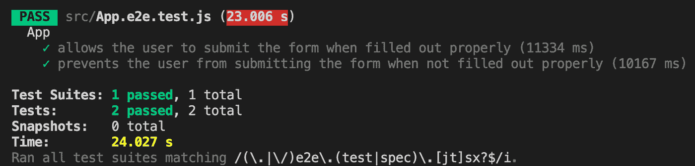

# 使用 React、Jest 和 TestProject JavaScript OpenSDK 进行端到端测试

> 原文：<https://betterprogramming.pub/end-to-end-testing-with-react-jest-and-the-testproject-javascript-opensdk-d290fec3ab30>

## 最新测试框架一览


在 [Unsplash](https://unsplash.com?utm_source=medium&utm_medium=referral) 上 [Testalize.me](https://unsplash.com/@testalizeme?utm_source=medium&utm_medium=referral) 拍摄的照片。

有一长串端到端(e2e)测试框架可供选择，很难知道应该使用哪一个。 [Cypress](https://www.cypress.io/) 和 [Selenium](https://www.selenium.dev/) 作为最广泛使用的选项领先市场，但还有用于移动应用测试的 [Appium](https://appium.io/) ，用于 Chrome 中自动化任务的[木偶师](https://pptr.dev/)，以及用于 Angular 和 AngularJS 应用的[量角器](https://www.protractortest.org/)，仅举几个例子。

最近，一个新人加入了这个团队: [TestProject](https://testproject.io/) ，这是一个用于 e2e 测试的免费开源测试自动化平台，有助于简化 web、移动和 API 测试。TestProject SDK 支持 Java、C#、Python，最近还支持 JavaScript。

在本文中，我们将展示如何使用[test project JavaScript open SDK](https://github.com/testproject-io/javascript-opensdk)来测试 React 应用程序，并将 [Jest](https://jestjs.io/) 作为我们的测试框架。

准备好开始了吗？

# 应用概述

首先，让我们看一下将要测试的演示应用程序。这个应用程序相对简单:只是一个简单的请求表单，用户可以在其中输入他们的名字、姓氏和电子邮件地址。


演示应用程序:申请表

如果提交的表单没有正确填写，错误消息会显示在每个无效输入的下方。


演示应用程序:无效输入

成功提交表单后，应用程序会显示一些确认文本。



演示应用程序:填写表单



演示应用程序:确认页面

很简单，对吧？如果你想看演示，你可以[在我的网站](http://tylerhawkins.info/testproject-demo/build/)上找到演示应用，或者[在 GitHub](https://github.com/thawkin3/testproject-demo) 上查看源代码。

现在，让我们看看这个应用程序是如何制作的。

# 创建 React 应用程序

如上所述，这个应用程序是用 React 编写的。为了简化样板代码和开发工具，我使用了 [create-react-app](https://github.com/facebook/create-react-app) 工具来引导应用程序。

```
npx create-react-app testproject-demo
```

生成了框架应用程序后，我删除了默认的应用程序内容，并在一个名为`RequestForm.js`的文件中编写了一个简单的表单组件。下面是完整复制的申请表代码:

如您所见，我们有一个函数组件，它显示用户的名、姓和电子邮件地址这三个输入。表格底部有一个“请求演示”提交按钮。提交表单时，如果有任何无效输入，将显示错误消息；如果表单提交成功，将显示确认消息。

这就是这个应用程序的全部内容。现在，开始有趣的部分。我们如何用 TestProject 配置我们的端到端测试？

# TestProject 入门

首先，我们需要首先[创建一个免费的测试项目账户](https://testproject.io/)。之后，我们可以[下载 TestProject 代理](https://app.testproject.io/#/download)。可以选择下载桌面版或 Docker 版代理。选择哪个由你自己决定，但我选择了下载 Mac 版桌面应用。然后，您需要[注册您的代理](https://app.testproject.io/#/agents)来将您的代理链接到您的 TestProject 帐户。

接下来，我们将[生成一个开发者令牌](https://app.testproject.io/#/integrations/sdk)用于我们的项目。一旦我们有了开发人员令牌，我们将在项目的根目录下创建一个`.env`文件，并添加以下代码行来将我们的令牌存储在`TP_DEV_TOKEN`环境变量中:

```
TP_DEV_TOKEN=<YOUR DEV TOKEN HERE>
```

您会注意到，我们在`.gitignore`文件中告诉 Git 忽略我们的`.env`文件，这样我们的令牌或其他环境秘密就不会被提交到我们的版本控制中，并意外地与其他人共享。

最后，我们需要安装几个 npm 包作为`devDependencies`，以便在我们的应用程序中使用 TestProject JavaScript OpenSDK:

```
yarn add --dev @tpio/javascript-opensdk selenium-webdriver
```

至此，我们已经为在 e2e 测试中使用 TestProject 打下了基础。

# 配置 Jest

接下来，我们需要配置 Jest。由于我们使用 create-react-app 来引导我们的应用程序，我们的项目使用 [react-scripts](https://www.npmjs.com/package/react-scripts) 来运行 Jest 和 [React 测试库](https://testing-library.com/docs/react-testing-library/intro/)以及一些默认的配置选项。然而，如果我们能够配置 Jest 并添加一些 npm 脚本来分别运行单元测试和 e2e 测试，那就更好了。

为此，我向我的`package.json`文件的`“scripts”`部分添加了以下 npm 脚本。每个都包含一些特定的 Jest CLI 配置选项:

那太多了！让我们分解这些命令，同时突出代码的一些关键部分。

首先，我们来看看`start`的剧本。这个很简单:它以开发模式在本地运行我们的应用程序。这很重要，因为 e2e 测试需要应用程序运行才能正常工作。

接下来，我们来看一下`test:e2e`脚本。在尝试运行任何测试之前，此命令会等待应用程序在端口 3000 上本地运行。然后，它使用`react-scripts test`命令来运行我们的应用程序的测试，但是应用了几个 Jest CLI 配置选项。`testPathPattern`选项告诉 Jest 只运行以`e2e.test.js`结尾的测试(以及其他一些变化)。`testTimeout`选项将 Jest 的默认超时(每次测试 5 秒)增加到 30 秒，因为 e2e 测试比简单的单元测试运行时间要长一些。`runInBand`选项告诉 Jest 串行运行我们的测试文件，而不是并行运行，因为我们的机器上只安装了一个 TestProject 代理。最后，`watchAll=false`选项使得测试不在“观察”模式下运行，这是 Jest with react-scripts 的默认设置。咻，太多了！

第三个剧本是`test:e2e:ci`。该命令由`start`和`test:e2e`命令组合而成，有助于简化测试过程。为了使用原来的`test:e2e`命令，我们必须在本地运行应用程序。所以我们需要先运行`yarn start`，然后运行`yarn test:e2e`。这没什么大不了的，但是现在我们有了一个更简单的过程，我们可以运行`yarn test:e2e:ci`来启动应用程序和运行 e2e 测试。

第四个脚本`test:e2e:watch`与`test:e2e`脚本非常相似，但是在“观察”模式下运行测试，以防您在对应用程序进行更改时希望测试在后台持续运行。

最后三个脚本用于运行单元测试。`test:unit`脚本使用 Jest 和 React 测试库运行单元测试，并且只寻找以`unit.test.js`结尾的测试(以及其他一些变化)。`test:unit:coverage`脚本运行那些相同的单元测试，但是还包括一个测试覆盖报告。最后，`test:unit:watch`脚本在“观察”模式下运行单元测试。

这可能看起来需要接受很多信息，但是这里的要点是，我们现在已经创建了几个有用的 npm 脚本，允许我们使用简短的命令轻松运行我们的单元和 e2e 测试。所有艰难的配置工作都已经完成，所以现在我们可以专注于编写实际的测试。

# 使用 JavaScript OpenSDK 编写测试

我们现在已经为我们的项目配置了 Jest 和 TestProject，所以我们准备编写我们的第一个 e2e 测试。端到端测试通常侧重于用户旅程所代表的应用程序的关键工作流。

对于我们的请求表单，我可以想到两个重要的用户旅程:当用户试图提交无效的表单时，以及当用户成功提交正确填写的表单时。让我们为每个工作流编写一个 e2e 测试。

我们完整的`App.e2e.test.js`文件如下所示:

在我们的第一个测试中，我们确保用户可以成功提交表单。我们导航到应用程序的 URL，使用`sendKeys`方法在三个输入字段中输入文本，然后单击“提交”按钮。然后，我们等待确认文本出现在屏幕上，以确认我们的提交是成功的。

你会注意到所有的选择器看起来就像普通的 Selenium 选择器。您通常会使用 CSS 选择器或 XPath 选择器来查找元素。

在我们的第二个测试中，我们确保当页面上有无效输入时，用户不能提交表单。我们首先导航到应用程序的 URL，然后立即点击“提交”按钮，无需填写任何输入字段。然后，我们验证屏幕上是否显示了这三条错误消息。

您还会注意到，我们已经提取了一些共享的测试设置，并分解到`beforeEach`和`afterEach`模块中。在`beforeEach`块中，我们为 Chrome 创建了 web 驱动程序。在`afterEach`区块，我们退出驱动。

# 运行我们的 E2E 测试

关键时刻到了:让我们尝试运行端到端测试。在我们的终端中，我们将运行`yarn test:e2e:ci`来启动应用程序并运行 e2e 测试。然后…两个测试通过了！您应该看到应用程序在 Chrome 浏览器上打开，看到每个测试的执行步骤，然后在终端中看到测试结果:



在终端运行我们的 e2e 测试

TestProject 甚至提供了自己免费的内置报告仪表板以及本地 HTML 和 PDF 报告，以便您可以在浏览器中查看测试结果。当查看作为 CI 管道的一部分运行的测试时，这是完美的。这是我运行测试套件两次后的报告:


测试项目报告仪表板

# 结论

嗯，我们做到了！我们使用 React、Jest 和 TestProject JavaScript OpenSDK 成功编写并运行了端到端测试。任务完成。

令人兴奋的是，这只是冰山一角。TestProject 充满了其他隐藏的瑰宝，比如使用 GUI 在浏览器中直接编写测试的能力[，大量用于通常需要的测试操作的](https://docs.testproject.io/using-the-smart-test-recorder/web-testing/creating-a-web-test-using-the-testproject-recorder)[插件](https://addons.testproject.io/)，以及用于发送测试报告通知的与 Slack 等应用程序的[集成。](https://docs.testproject.io/testproject-integrations/integration-to-slack)

谁知道端到端测试自动化的未来会怎样，但是 TestProject 肯定是一个值得关注的平台。