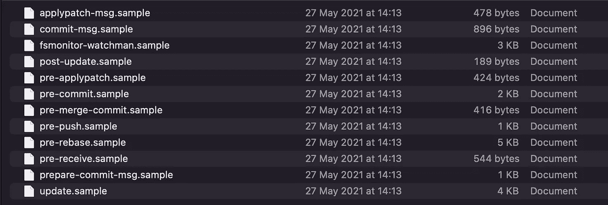
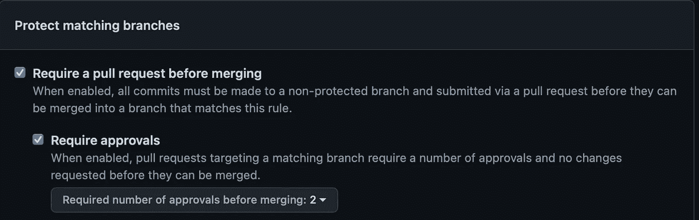
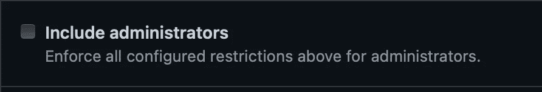
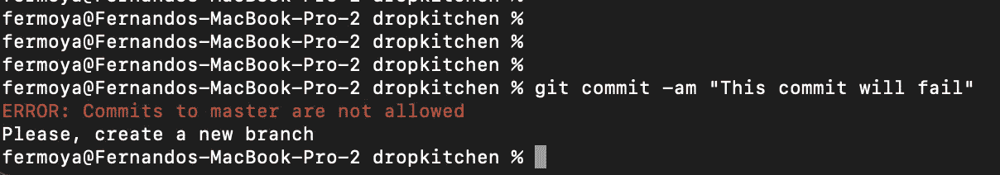
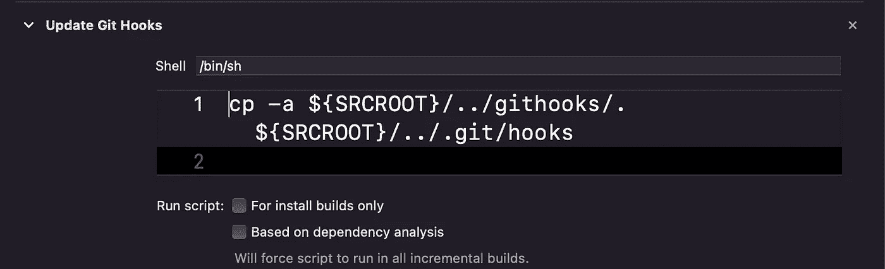

# 用 Git 钩子加强你团队的代码风格

> 原文：<https://betterprogramming.pub/enforce-your-teams-code-style-with-git-hooks-a892e584482b>

## 了解如何设置 Git 挂钩


照片由[梅根·洛德](https://unsplash.com/@meglord?utm_source=medium&utm_medium=referral)在 [Unsplash](https://unsplash.com?utm_source=medium&utm_medium=referral) 上拍摄

# 介绍

如果您正在使用 git 并在一个大型团队中工作，您可能已经就如何组织 Git 提交和分支/标记进行了一些讨论:

*   避免大的提交标题。
*   分支应该以`feature`或`fix`为前缀。
*   标签应该遵循`vX.X.X`的模式。
*   …

此外，您可能正在使用 JIRA 或任何其他问题跟踪工具，并且可能对将票据链接到提交和/或分支名称感兴趣。或者，您可能想在按下遥控器之前运行一个 linter。使用 Git 钩子可以完成这一点以及更多的事情。

通过这篇文章，我将简要解释什么是 Git 挂钩，并设置两个挂钩:

*   防止提交到`master` / `main`
*   如果提交日志没有链接到 JIRA 票证，则阻止推送

# 概述:Git 挂钩

Git 挂钩只是响应特定的`git`事件而被调用的脚本。这里是所有可用钩子的完整列表。

这些钩子通常可以在 Git 钩子文件夹中找到，也就是`<your_git_folder>/.git/hooks`(除非通过`core.hooksPath`改变)。默认情况下，Git 会用示例填充这个文件夹:



有两种类型的 Git 挂钩:

*   **在本地机器上运行的客户端钩子**。
*   运行在 Git 服务器中的服务器端钩子。

理想情况下，为了对您的项目实施特定的策略，您应该使用*服务器端钩子。然而，在大多数软件仓库中，你都需要一个企业账户，比如 Github ，这是有代价的。*

这就是为什么你可能最终会使用客户端钩子。这并不意味着这项工作不能完成，但它也有缺点，因为钩子不能与回购的其余部分一起克隆。他们实际上没有被跟踪。这意味着每个团队成员都可能有不同的钩子或者根本没有钩子！然而，这种情况可以在某种程度上得到缓解，我们将在后面看到。

# 我们的第一个 Git 挂钩

让我们从创建第一个钩子开始。我们的目标是避免提交到默认分支(`master`或任何其他分支)。这个目标听起来可能有点不可思议，因为大多数 git 存储库允许您设置规则来保护您的分支免受直接的`git push`。例如，GitHub 允许您"*在合并*之前要求一个 pull 请求":



但是，这不适用于管理员。您仍然可以强制他们遵守相同的规则:



但是您可能会感兴趣，同时仍然不允许管理员推送`master`，让他们跳过一些其他标准(批准、检查……)。这是 Git 挂钩可以派上用场的一种情况。

我们只需转到 hooks 文件夹，将`pre-commit.sample`重命名为`pre-commit`，也就是去掉`sample`扩展名。此外，请确保该文件具有执行权限:

```
cd <your_git_folder>/.git/hooks
mv pre-commit.sample pre-commit
chmod +x pre-commit
```

有其他钩子可以满足我们的目的，但是`pre-commit`会在早期停止 git 进程。打开文件，删除其内容并粘贴以下内容:

```
#!/bin/sh# 1
branch=`git branch --show-current`RED='\033[0;31m'
NC='\033[0m' # No Color# 2
if [[ "$branch" =~ (master|main) ]]; then
  echo "${RED}ERROR: Commits to $branch are not allowed${NC}" >&2
  echo "Please, create a new branch" >&2
  exit 1
else
  exit 0
fi
```

这个脚本将简单地:

1.  获取您当前分支机构的名称
2.  检查一下是叫`main`还是`master`。

让我们来看看它的实际应用:

```
git checkout master
git pull
echo "Test pre-commit hook" > test.txt
git add -A
git commit -am "This commit will fail"
```

您应该得到这样的结果:



# 关于钩子的更多信息

最近，我发现自己在工作中遇到的一件事是，确保没有一个分支在没有与至少一个提交相关联的 JIRA 票证的情况下被合并。原因是，然后我们使用该票 ID 在我们的 CICD 服务器中“变魔术”(转换票，添加一个`Fix version`，并将 JIRA 作为我们的真实来源)。

一种方法是通过 Git 挂钩。同样，*客户端钩子*在这里会工作得更好，但是我们有我们的局限性。`pre-push`挂钩工作正常。如果我们重复上一节中的过程:

```
cd <your_git_folder>/.git/hooks
mv pre-push.sample pre-push
chmod +x pre-push
```

然后我们可以开始编辑脚本。在这种情况下，我们希望将当前分支与`master`进行比较，并获得新的提交。然后检查`commit-messages`并寻找特定的模式。假设您的 JIRA 项目名为`Project`，门票 id 遵循模式`PROJ-XXX`。我们可以很容易地确保`commit-log`至少包含一个票证 ID:

```
#!/bin/shRED='\033[0;31m'
NC='\033[0m' # No Colorremote=$1# 1
tag_name=$(grep -E 'refs/tags/([^ ]*) ' </dev/stdin | cut -d ' ' -f 1 | sed 's/refs\/tags\///g')if [ ! -z $tag_name ]; then
  # A tag is being pushed, no need to make any checks
  exit 0
fi# 2
main_branch_name=`git symbolic-ref refs/remotes/$remote/HEAD | sed "s@^refs/remotes/$remote/@@"`# 3
current_branch_name=`git branch --show-current`# 4
commit_log=`git log --format=%B $remote/$main_branch_name..$current_branch_name`# 5
regex="(PROJ|proj)-[0-9]+"if [[ ! $commit_log =~ $regex ]]; then
  echo "${RED}ERROR: No JIRA ticket ID was found${NC}" >&2
  echo "Please, include a ticket ID in one of your commits" >&2
  exit 1
fiexit 0
```

让我们来分解一下:

1.  检查标签是否被按下。如果是这样，`exit`因为我们对标签不感兴趣。
2.  获取我们的回购违约分行。请注意，这因团队而异，一些团队更喜欢`master`或`main`，而另一些团队选择不同的分支作为他们的默认分支。
3.  获取正在推送的当前分支的名称。
4.  比较两个分支，取出`commit-message`。
5.  查找模式`PROJ-XXX`忽略案例。

结果是:

```
$ git push
ERROR: No JIRA ticket ID was found
Please, include a ticket ID in one of your commits
```

此外，我们可以通过检查不同的正则表达式来对`tag`或`branch`名称进行一些验证，但是我将把它作为一个练习留给读者。

# 在团队成员中分享钩子

在文章的开头，我提到过*本地 Git 挂钩*不能轻易地与团队的其他成员共享，因为这些文件不会被 Git 跟踪，并且在一天结束时，每个团队成员都要将它们复制到`.git/hooks`文件夹中。

一个方便的解决方案是在你的项目结构`<your_git_project>/githooks`中创建一个新的文件夹`githooks`，并放入所有的 git 钩子中。然后，让您的应用程序在执行之前将`githooks`中的所有文件复制到`.git/hooks`中。

例如，作为一名 iOS 开发人员，我使用 Xcode。在构建 iOS 应用程序之前，我们已经设置了一个脚本，该脚本简单地将所有钩子复制到 Git Hooks 文件夹，以保持它们是最新的。



然而，如果你可以选择使用*服务器端钩子*，我强烈推荐你使用它们。

例如，我们在这里完成的同样的事情可以通过使用`update` hook 来完成(尽管有些事情可能需要在脚本中修改)。