# 重用的工程应用程序:使用 Slack、MuleSoft 和 Salesforce 的实际例子

> 原文：<https://betterprogramming.pub/engineering-apps-for-reuse-a-practical-example-using-slack-mulesoft-and-salesforce-855a3116ea66>

## 设计、构建、部署和监控 API

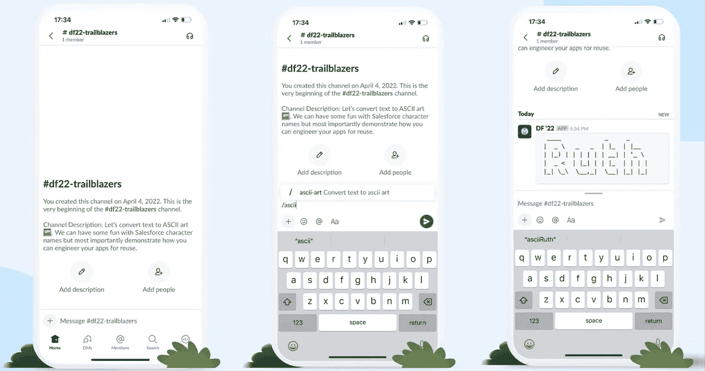

ASCII art .跨 Slack 和 Salesforce 重用的| image by author

本文描述了设计和构建可跨 Slack 和 Salesforce 重用的 API 的过程。它演示了如何在 Slack 中创建一个简单的斜杠命令，并在 Salesforce 中创建一个流来将文本转换为 ASCII 艺术。

> 重新利用现有的 API 来连接不同的系统是提高生产率和帮助降低组织成本的一个关键指标。

# 这个想法

假设我们的任务是在 Slack 中为用户创造一个交互体验。我们希望提供一个斜杠命令，允许用户指定一些文本，并让我们的应用程序将这些文本转换成 ASCII 艺术。

有三个问题我们应该思考；

1.  有没有我可以重用的现有编程库？
2.  有没有我可以重用的现有 API？
3.  有多少客户想要使用这个特性？

# 设计

第一步是设计一个 API 规范，它可以将消息作为输入和输出 ASCII 码。

通过使用 MuleSoft 的 Anypoint 平台，我不仅可以设计 API 规范，还可以在内部共享它，以便让其他希望为其应用程序添加类似功能的人发现它。

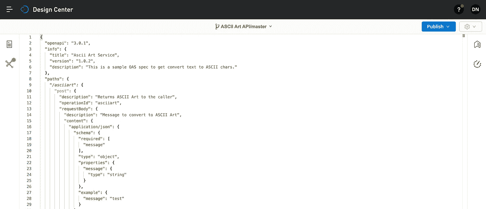

任意点设计—创建 API 规范

我的下一个工作是决定是否有现有的编程库可以帮助我。

MuleSoft 应用程序是基于 Java 的，作为世界上最广泛采用的编程语言之一，我发现了许多可以帮助我的 Java 类。

 [## GitHub—lalyos/jfiglet:fig fonts(http://www.figlet.org/)的 Java 实现创建 ascii…

### 用 Java 实现 FIGfonts 来创建 ascii 艺术横幅。我的目标是:作为一个 maven 依赖项进行分发…

github.com](https://github.com/lalyos/jfiglet) 

现在，松弛斜线命令期望输入和输出是松弛特定的格式。我没有将所有的逻辑封装在一个 API 调用中，而是将文本到 ASCII 的转换分解到一个可以重用的单独的 API 中。

ascii-art-sapi 将基于我们的 api 规范。设计用于重复使用。

slack-ascii-art-xapi 将为 slack 编排和转换消息。简而言之，它会把 ASCII 艺术转换成 Slack 里好看的东西。

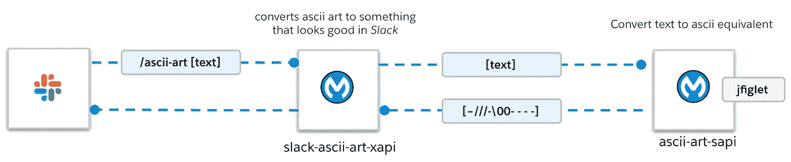

创建两个 API 来帮助我们走向成功

为了演示重用 api 的能力，我们还将使用 ascii-art-sapi 来创建在 Salesforce 中将文本转换为 ascii 的能力。

在这种情况下，我们将使用外部服务将 API 规范转换为可调用的 Apex，我们可以在流中直接使用它。

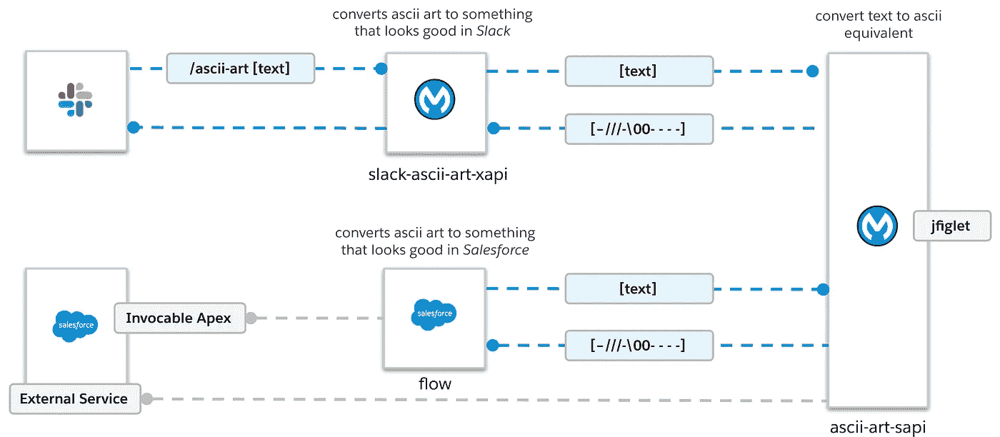

跨两种不同体验重用 API

# 建筑

## ascii-art-sapi

对于构建阶段，我们使用 MuleSoft 的 Anypoint Studio。这提供了连接器、处理器和模块，允许我用比编写代码更少的时间实现 API 逻辑。

因为 MuleSoft 编译成 Java 应用程序，所以我可以包含 jfiglet 库作为依赖项。

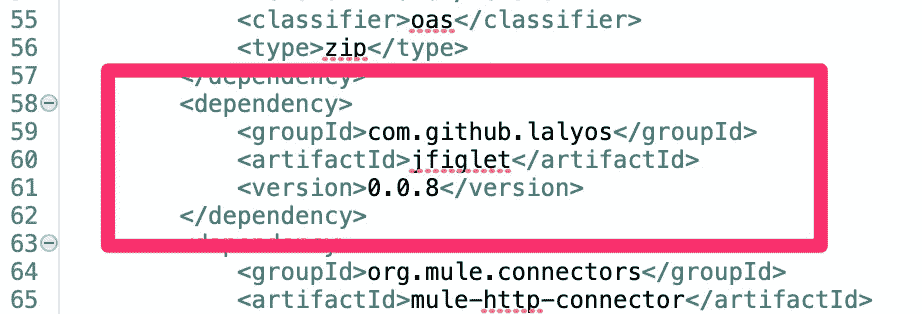

将 jfiglet 作为依赖项包含在内

使用转换消息模块允许我使用上面的 Java 类将输入转换成 ASCII。

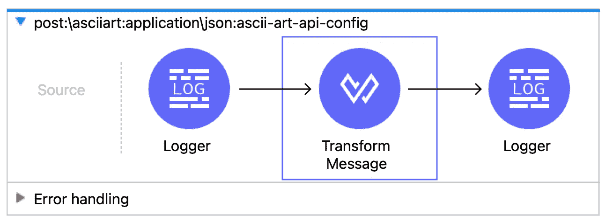

我可以从依赖项中导入 Java 类，然后简单地使用里面的方法。在这种情况下，将给定的字符串转换为 ASCII 字符。

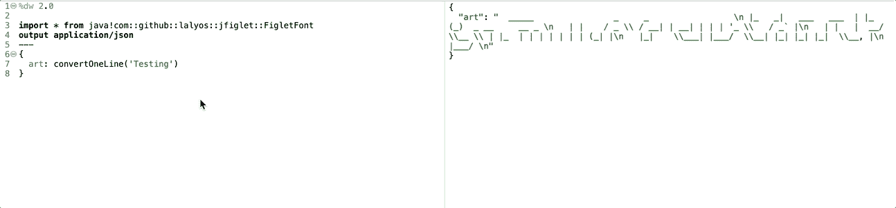

导入第三方库并调用它们的方法

我们现在准备好部署 API 了。

## slack-ascii-art-xapi

对于特定于松弛时间的逻辑，我们将构建以下内容:

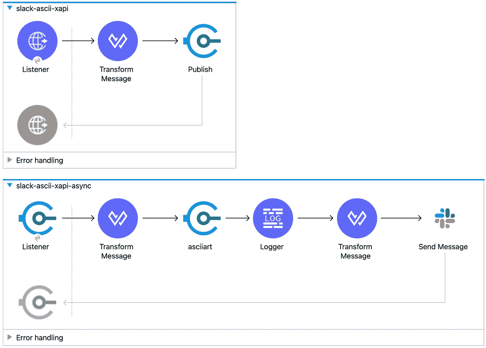

封装到新 API 中的特定于 Slack 的逻辑

这个 API 将从 Slack slash 命令接收输入，并立即将其发布到队列中进行异步处理。

然后，异步侦听器将调用现有的 ascii-art API，在将消息发送回 Slack 通道之前，将文本从 slash 命令转换为 ascii。

所以，看起来是这样的:

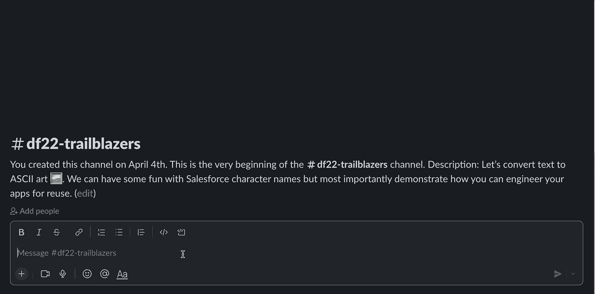

斜线命令— ascii-art

好了，现在我们有了一个正常运行的 Slack slash 命令。让我们看看如何将这种体验融入 Salesforce。

由于我们设计了 ascii-art API，我们可以使用外部服务将规范导入 Salesforce。

Salesforce 中需要命名凭据来为 Anypoint 平台和 ascii-art API 提供端点和授权详细信息。

从 Salesforce 导航至设置->外部服务并完成向导。在本例中，我们连接到 MuleSoft Anypoint 平台，以便 Salesforce 可以找到并创建 Apex 类来调用我们的 ASCII art 端点。

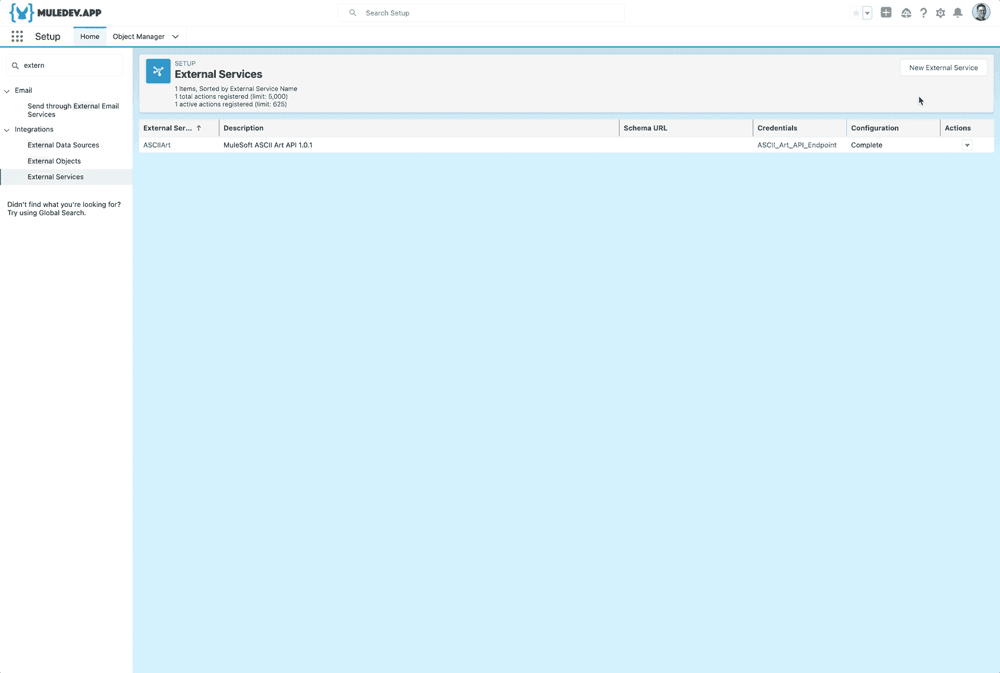

在 Salesforce 中创建外部服务

现在我们已经创建了外部服务，我们可以使用声明性工具来调用 API。在这个例子中，我们将使用 Flow。

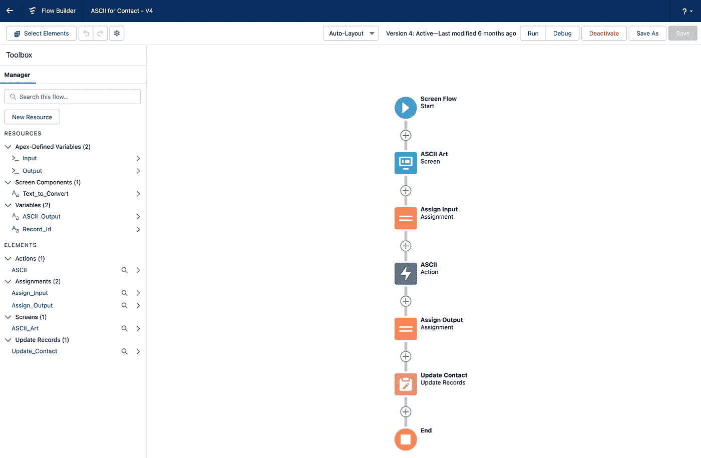

Flow 自动包含使用我们通过外部服务导入的 API 所需的动作。我们为用户提供了一个屏幕来指定要转换成 ASCII 的文本，在上面的例子中，我们将输出保存到了`Contact`对象的一个字段中。

在配置结束时，您的用户体验应该如下所示:

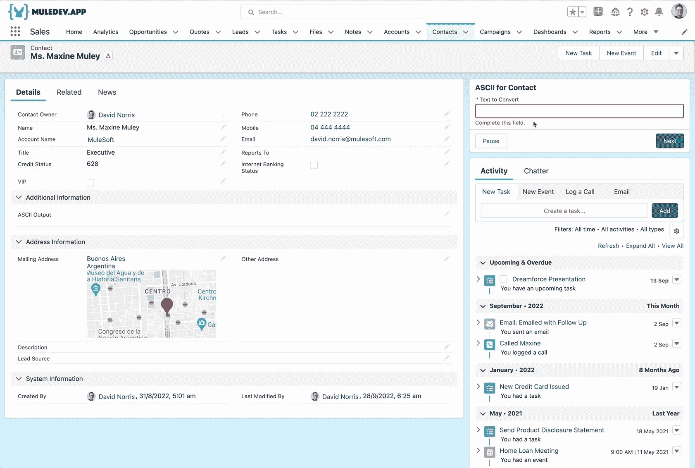

使用外部服务调用 API 端点的 Salesforce 流程

# 摘要

设计可重用应用的关键要素之一是设计、构建、部署、管理和监控 API 的能力。

MuleSoft 的 Anypoint 平台提供了这样的能力。将这种力量与 Slack 和 Salesforce 结合起来，你就能设计出一些很棒的体验。