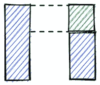
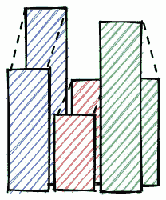
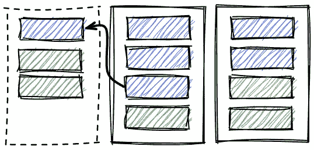

# 工程水平:三个视角的案例研究

> 原文：<https://betterprogramming.pub/engineering-levels-a-case-study-from-three-perspectives-6443c18dae26>

## 从三个不同的角度看好的层次框架的力量

鸣谢:作者

*最初发表于*【https://engstuff.substack.com】

*最近有很多关于工程水平的争论，是好是坏，或者只是没用。在这个故事中，我希望展示一个积极努力的结果。然而，在我们开始之前，让我们来看看构建一个好的框架的关键要素是什么*

# *你有层次，为什么？*

*虽然这似乎是一个显而易见的问题，但答案可能会有很大差异。它们的范围从决定薪水到职业发展。在设计你的框架之前，设定你想要的结果并对它们进行优先排序是很重要的。*

*对预期成果进行优先排序是该框架的一个重要组成部分。如果你有一个水平框架，但不知道你在寻找什么结果，咨询你的经理、主管或首席技术官。*

# *校长*

## *1.为团队成员设计，供经理使用*

*您必须关注这样一个原则，即级别是为团队成员而不是经理设置的。在评估他们的现状和落后之处时，团队成员可以确定他们的现状和他们的未来。在很多地方，级别只是领导者控制团队成员薪酬或提出要求的方式。这些组织未能意识到级别可以带来的实质性价值。*

## *2.性能与增长*

*一些经理可以将业绩和增长混为一谈。这些听起来可能一样，但根本不同。*

> *绩效计划侧重于实现结果，而成长计划侧重于获得技能、知识和方法，以实现和维持期望的结果。*

***你的一对一应该推动增长**，并经常调整和评估期望([设定期望的魔力](/the-magic-of-setting-expectations-978ba7316df8))。**调平框架应作为测量增量的快照。***

## *3.有争议的改进*

*不要等待均衡练习。在每次一对一之前，检查评估并确定差距所在。提供机会和反馈来解决这些问题。*

# *第 1 章:软件工程师 Dejen*

**

*这都是关于差距*

## *信念:我知道自己的价值，你知道吗？*

*德扬热爱他现在的团队。共事近一年后，事情看起来很有希望。在他看来，他的技能正在提高，他已经准备好承担复杂的任务，但其他团队成员一直在接受所有具有挑战性的任务。*

*幸运的是，德真的公司刚刚发布了一个全新的调平系统。作为首次展示的一部分，他与他的经理一起执行了一个平衡流程。令人惊讶的是，Dejen 意识到他的经理不同意他的自我评估。这是一个好的转变。他们找到了差距，两个月后，他被认证为高级软件工程师。*

## *目标:不仅仅是我的经理*

*德仁在过去的三年里已经换了两个经理，现在在一次公司重组后即将换一个。让这种转变有点压力的一个障碍是，Dejen 觉得他需要一次又一次地证明自己的价值。*

*幸运的是，德真的公司刚刚发布了一个全新的调平系统。他和他的经理进行了一次级别调整，他的级别被定为高级工程师。当德扬加入简的团队(他的新工程经理)时，他仍然需要证明自己的影响力，但他不必从头开始。他将被赋予符合其经验水平的挑战性任务。*

# *第 2 章:工程经理简*

**

*不同的技能*

## *专家:强化[圆锥模型](/the-cone-model-for-teams-support-network-9b87659c8008)*

*该公司几周前雇佣了 Jan，其使命是实施一项新战略。他组建了一个由五名天才工程师组成的团队。又过了几周，Jan 注意到团队的成长与他的存在直接相关。一些工程师需要更多的关注来改善他们的产品思维，而其他人则需要关注质量。简知道他不可能无处不在，决定使用[的锥形模型](/the-cone-model-for-teams-support-network-9b87659c8008)。*

*利用最新的平衡练习，他能够识别在这些领域有优势的团队成员，并将他们与需要推动的人匹配起来。*

## *本地千里马:你试过吗？*

*自从 Jan 和 Dejen 开始一起工作已经有六个月了。Jan 对 Dejen 的整体表现很满意，并决定再进行一次水平测试。结果呈现出不同的景象。虽然德扬做得很好，但他达到了自己的“局部最大值”。这次演习暴露了他领导能力的不足。虽然他保持着优秀的交付记录，但他没有展示出任何指导技能。在回顾他的 1:1 笔记时，Jan 注意到没有团队成员提到 Dejen 是一个有影响力的人物。*

*他们一起决定在 Dejen 和一个初级会员之间建立正式的师徒关系。*

# *第 3 章:工程副总裁阿马拉*

**

*建设部队*

## *框架:管理者的高质量标准*

*工程经理和其他人一样，可以有不同的能力水平。有些人是能够激励团队的出色领导者，而另一些人是能够计划和执行复杂计划的有能力的管理者。*

*作为经理中的经理(董事中的经理)，Amara 需要一种工具来确保所有团队合作者获得最佳支持并健康成长。她希望确保所有工程经理与他们的团队成员有一个高质量的反馈回路。因此，涵盖了所有相关领域，并对未来有明确的预期。平衡框架为尚未掌握评估和反馈技能的经理提供了一些结构。*

*管理者通常受益于由两个维度、层次和领域组成的框架。*

## *专业领域:建立工程文化。*

*通过定义领域，Amara(工程副总裁)可以影响她的组织的焦点，并确保工程文化与公司的愿景一致。例如，在产品适应市场之前的阶段，这些领域反映了更多的创新，而在产品适应市场之后，这些领域反映了质量和专业化。确定了每个领域的明确期望后，Amara 可以为她的组织设定高质量或协作意味着什么的基调。*

## *级别:组织规划*

*一般来说，团队成员之间经验和技能的健康平衡有助于营造积极的工作环境，并提高技能对低年级和高年级学生的价值。低年级学生帮助高年级学生发展领导和指导技能。这有助于保持团队的参与和渴望。另一方面，高年级学生可以通过这种经历来教育低年级学生，提高他们的技能。*

*除非 Amara 注意，否则她的组织将会发展出一批高级团队。如果需要创建新的团队，她需要仔细决定将谁分配到哪里。*

*有效的级别评估将让她绘制出您团队中的级别分布图，并模拟潜在的增长情景。Amara 将能够回答这样的问题，我们需要雇用多少初级员工？能不能开三个新队？*