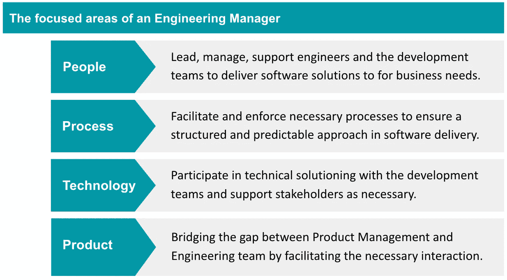
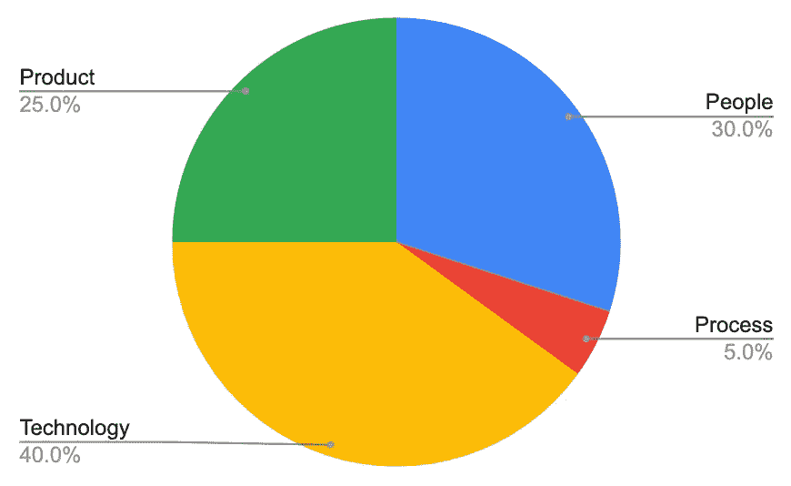
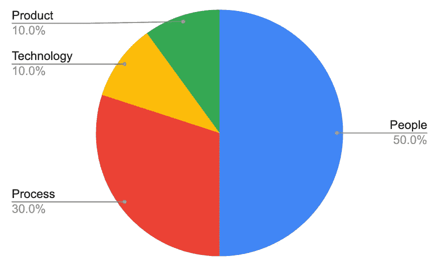

# 做一名工程经理意味着什么？

> 原文：<https://betterprogramming.pub/engineering-manager-cfdb336a5715>

## 关于角色、责任和优势的讨论

工程经理的角色存在于大多数老牌科技公司，但有时它是最难理解工程经理做什么的角色。每个公司，在不同的生命周期，面临不同性质的挑战，因此对工程经理的期望在不同的阶段有所不同。例如，一个十人创业公司的工程经理和微软的工程经理做着完全不同的工作。

我有机会担任工程经理的角色，从一个五人团队到一家跨国公司，在那里我与许多工程经理合作。在过去的两年里，我也一直在积极地为这个角色进行构思、提炼和招聘。我反复解释了一个工程经理在各种平台上做什么，所以把想法写下来可能不是一个坏主意。

工程经理角色的四个重点领域如下:

# 人

工程师是团队中最重要的资产，事实上，是组织中最重要的资产。没有人，无论产品路线图多么有远见，软件架构图多么复杂，或者云中有多少计算能力，都没有大脑来处理它。工程经理的首要工作是照顾团队成员以获得最佳绩效。

照顾人意味着支持团队成员，为他们扫清障碍。工程经理有权管理人力资源。然而，这个权力机构负责确保团队能够执行交付业务需求。如果一名工程师陷入了某种执行困境，无论是技术性的还是非技术性的，工程经理都有责任确保工程师获得必要的支持和资源，以有效地开展工作。

工程经理关注工程师的成长。在微观层面上，如果工程师需要在编写单元测试、面向对象编程或数据库规范化方面进行特定的改进，工程经理负责确保工程师发展这些硬技能。实现改进的战术方法可以根据具体情况而有所不同。一个经理可能会选择与工程师一起进行 mob 编程(可能该经理是特定模块的原始作者)，另一个经理可能会在 PluralSight 中为工程师指定一门课程。大多数经理会选择多种选择的组合来实现目标。

工程经理在宏观层面上支持团队成员的职业发展。无论是从初级工程师到中级工程师、高级工程师、首席工程师，甚至是向工程经理或员工工程师迈进，工程经理都将指导、指导、促进成长，并提供必要的赞助来证明职业发展的合理性。

这就是为什么工程经理需要有坚实的开发背景，例如，10 年以上的开发经验，并且自己经历过这一过程，以了解职业发展每个阶段的挑战以及如何有效地解决这些挑战。换句话说，工程经理还负责管理绩效评估，包括绩效改进计划、晋升、加薪、奖金等。为他们的团队成员。

作为一名工程经理，最具挑战性的部分之一是解决团队成员之间的冲突。想象一下，有两个拥有 20 年编码经验的高级工程师，他们已经在公司工作了 10 年，并开始就技术方法相互争论。他们已经争论了三天，工作无法进行。

作为工程经理，你是做什么的？这是我与工程经理候选人讨论的一个实际面试话题。一个有经验的工程经理必须有多种方法来处理这种情况，并以最小的升级推进交付。

# 过程

拥有流程的目的是为了可预测性和可见性。过多的流程使得团队行动缓慢，速度下降，而流程的缺失使得团队运行混乱。很少有对齐，谁也不知道会发生什么。取得平衡对工程经理来说是一个挑战；这种平衡可能是主观的，取决于你与谁交谈。

企业喜欢收入增长趋势、客户获取成本(CAC)趋势、每用户平均收入(ARPU)趋势、息税折旧摊销前利润(EBITDA)趋势等形式的可预测性。软件交付需要可预测性。

明确知道移动应用 2.0 版本将在某个日期发布，具有 X、Y 和 Z 新功能和错误修复，这对于满足客户的期望非常重要。团队交付特定范围的速度和能力的可预测性对于了解发布日期是否现实是很重要的。对代码如何从工程师的机器运送到生产环境的可预测性是很重要的，以确保团队可以在一定的交付时间内部署。

一个新特性如何被整理、计划、优先化、分配、开发、测试和部署的可预测性对于保持每个工程师在软件开发生命周期过程中保持一致是很重要的。云支出的可预测性允许工程领导层与财务部门合作预测预算，以确定下一财年的分配。

虽然工程经理可能离直接改变收入、CAC、ARPU、EBITDA 有点远，但工程经理促进并有时强制执行移动发布、CICD 管道(包括不同级别的自动化测试和脚本部署)、代码分支、Scrum 实践、云费用等流程，以实现软件交付的可预测性。

当团队规模为 10 名或更少的工程师时，获得工程团队绩效的可见性相对容易。当团队规模超过 100 人并涉及多个站点时，这是对可见性的全新挑战。

可见性对于高层领导制定资源分配(投资或撤资)和产品路线图的战略决策至关重要。虽然可以深入研究团队协作软件，如吉拉或 Azure DevOps，以查看特定的用户故事、bug、任务，甚至 Git commit，但它可能无法提供一个客观和全面的视角，来了解 100 多名工程师团队在一段时间内如何工作以及工作内容。

因此，相应的工程经理需要让团队如何工作以及团队在做什么变得可见。

在一个 sprint 或一个季度内，以下指标的可见性可以作为一个良好的开端:

*   交付准确性:计划了多少/交付了多少
*   能力利用率:团队能力使用了多少
*   进行中的工作:每个工程师有多少正在进行的工作
*   投资组合:对每一类工作投入了多少工程努力，例如，新特性、错误修复、客户支持、卓越工程、创新等。

虽然大多数人不喜欢超负荷的过程，但是一个好的工程经理理解过程的重要性和价值，在生产力、可预测性和可见性之间取得平衡，并在这方面教育他们的团队。

# 技术

一个工程经理最好有 10 年以上开发和交付软件的经验。重要的是要认识到，虽然一个工程经理在软件开发方面有丰富的经验，但他不应该是团队中技术能力最强、效率最高的程序员，否则工程经理可能会扮演错误的角色。

工程经理的主要职责不是写代码。想要进入技术领导角色的有经验的工程师应该考虑诸如工程团队中的助理工程师或首席工程师之类的角色，如果可能的话。

工程经理利用他们丰富的软件开发经验来支持和指导团队朝着正确的方向实现。这可能如下所示:

*   将正确的技能组合(技术和非技术)和资历组合放入团队
*   确保工程师通过正确的界面进行协作，而不是各自为政
*   获得非职能方面的必要支持，以及团队需要的其他专长和专业技能
*   访问团队可用的必要工具、库和平台

这些是经常被忽视的幕后协调，需要技术上有经验的人员将碎片放在一起并清除路障，以便团队中的工程师可以有效地交付。

从技术上讲，工程经理如何参与到团队中有很多种方式。极端的一端是一个工程经理，他和一个新的工程师进行结对编程，也许是因为工程经理有一个非常小的团队和一个小项目要交付。另一端是工程经理获得对技术任务的估计，并关注状态，这可能是因为工程经理有一个涉及复杂实现的大型团队(20-30 名工程师)。

大多数时候，工程经理的参与介于两者之间。太过投入可能会意外地在工程经理和技术主管之间产生竞争，而太过疏远，工程经理可能会看不到团队中正在发生的事情。平衡 it 需要高度的成熟度和灵活性，以满足工程团队和组织的需求。与其说它是科学，不如说它是一门艺术。

# 产品

大多数团队负责交付产品，无论是面向内部还是外部。通常，每个团队都有一个产品经理的角色，那么工程经理的角色是什么呢？

一个工程经理需要对他们团队正在运输的产品有足够的了解。工程经理不应试图与产品经理竞争，以证明他们更了解产品，而是与产品经理发挥互补作用。

产品经理通常引入产品的业务环境，而工程经理和他的团队引入技术环境来弥合实现中的差距。通过充分了解产品，工程经理可以与产品经理就优先考虑期望的功能进行深刻而健康的讨论。

例如，承担技术债务来为一个很好的特性腾出空间会有什么后果？在高水平上构建特定范围需要多少工程资源(工程师数量和时间)？有哪些卓越工程计划可以潜在地消除恼人但不重要的错误？

产品知识对于工程经理理解其团队成员在项目层面的挑战至关重要。如果一个工程经理对产品的背景不够了解，他就不能有效地支持他们的工程师。拥有产品领域知识使工程经理能够将他的团队成员、产品范围、技术实现、质量、交付时间表以及与其他团队的潜在合作联系起来。

# 摘要

工程经理应该对每个重点领域投入多少注意力取决于几个因素:

*   经理的直接下属人数
*   产品的复杂性
*   团队中工程师的技术成熟度
*   工程经理的开发背景(后端、移动、QA、web、SRE 等。)
*   组织生命周期阶段，即组织要求工程经理注意什么。

以下是几个例子:

## 启动

初创公司的工程经理很可能主要参与技术实现和与业务利益相关者的产品改进(产品经理的角色可能还没有创建)，而不是其他人。在较小的团队规模中，流程通常是最不受关注的，因为它们通常是一种开销，而不是必需品。

一个工程经理在一个由七名工程师组成的团队中的工作分配示例。有时被称为技术主管经理。

## 老牌科技公司

> "工程师讨厌在技术方面被微观管理，但喜欢在职业方面被紧密管理."大卫·加文，2013 年。“谷歌如何在管理上出卖其工程师。”

一家老牌科技公司的工程经理可能会在人员发展上投入更多时间，包括职业发展。工程经理不断改进产品交付流程、交付可预测性，并提高团队生产力的可见性，同时支持技术方面，并在必要时与产品经理合作。

一家拥有 20 多个工程师团队的成熟技术公司的工程经理的工作分配示例。

作为文章的总结，以下是谷歌开展的一项名为 Project Oxygen 的研究中优秀管理者的八种行为:

1.  是个好教练
2.  授权给团队，不要微观管理
3.  对团队成员的成功和个人幸福表示兴趣和关注
4.  富有成效且注重结果
5.  善于沟通——倾听和分享信息
6.  有助于职业发展
7.  对团队有清晰的愿景和战略
8.  拥有帮助他们向团队提供建议的关键技术技能

在这篇文章中，我过度简化了工程经理所面临的挑战的本质。然而，将职责的性质分为四个重点领域和几个潜在比率，将有助于理解工程经理的工作以及该角色在组织的不同阶段将如何演变。

Google 的 Project Oxygen 确定的八种行为是工程管理人员超越他人的良好指导原则。