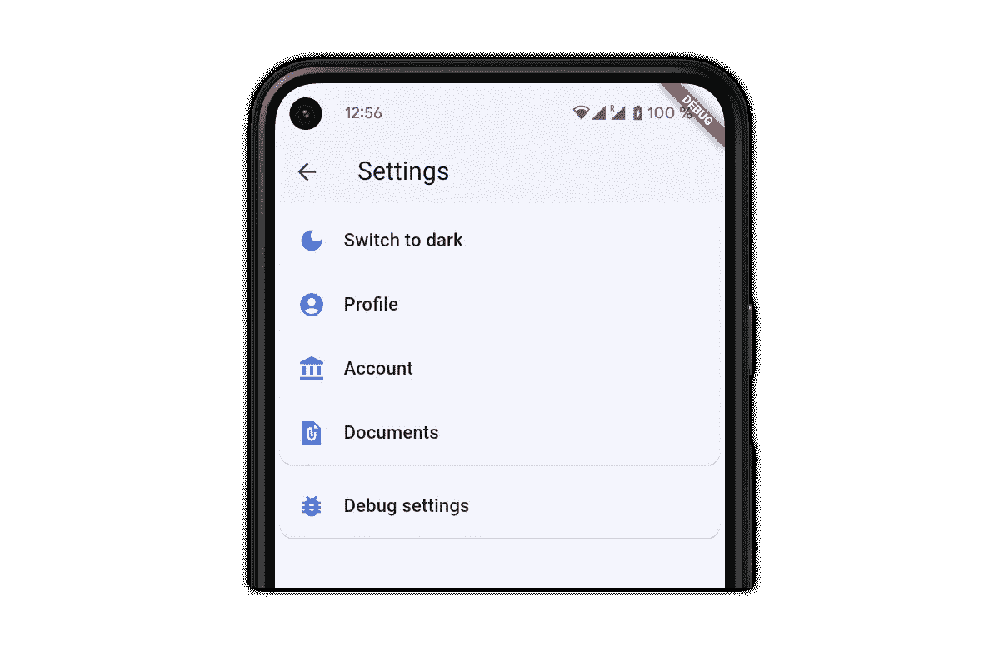
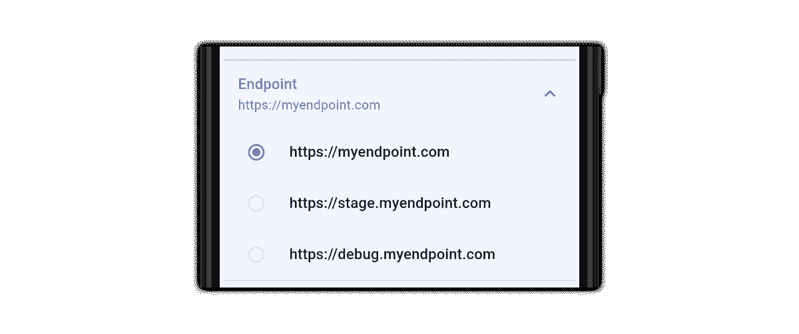
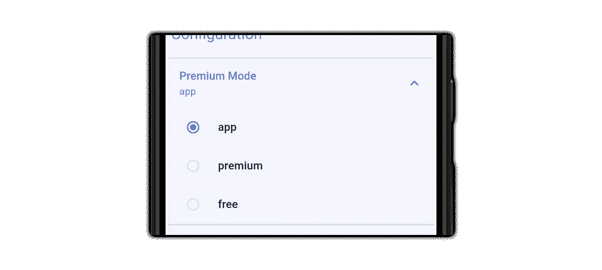
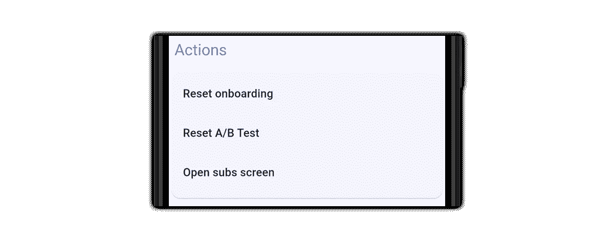
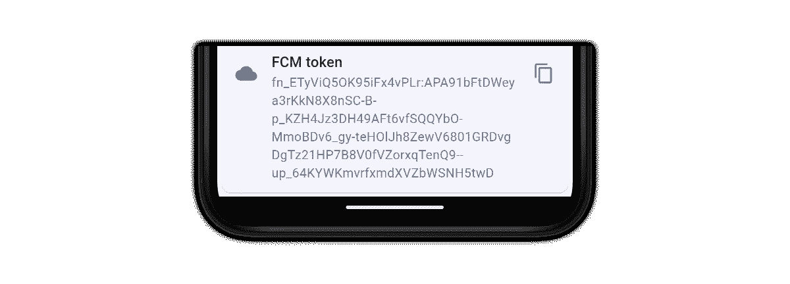
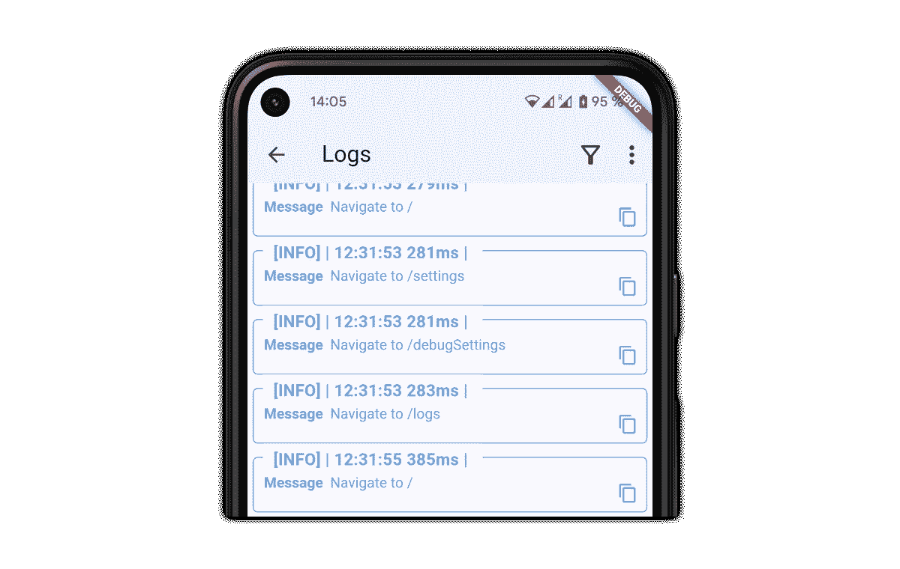
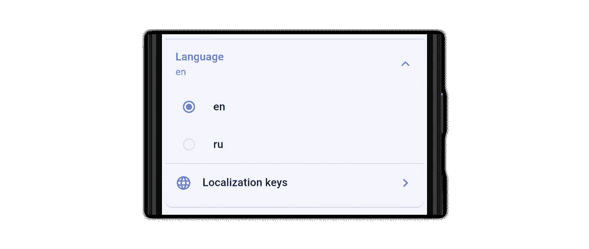
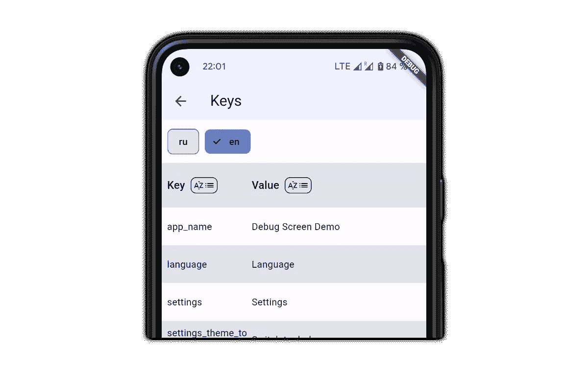

# 如何用 Flutter 建立一个满足你需求的工程菜单

> 原文：<https://betterprogramming.pub/engineering-menu-that-meets-your-needs-in-a-flutter-b2c20ac21dd8>

## 创建有效工程菜单的分步指南

[Vecteezy 的免费库存照片](https://www.vecteezy.com/free-photos)

今天的主题是工程菜单。你们中的一些人可能对它很熟悉，它是开发人员的菜单或调试菜单。这在移动开发领域并不是一个热门话题，但是在大多数情况下，一个好的工程菜单可能不会显著地减少开发和手工测试的时间。

在本文中，我们将研究组织特殊屏幕的各种方法，这将帮助您和您的团队更好地控制操作和观察最终用户看不到的数据，如服务器端点、高级状态、FCM 令牌访问、本地化、日志、触发某些场景的特定操作等。

> 这篇文章不仅仅是针对 Flutter 开发者的。这个主题中的任何想法都可以应用于任何其他移动平台。

在下面的例子中，我们将使用一些第三方包来帮助更快地开发工程菜单。第三方库的代码片段将在顶部包含一个导入包，这样你可以在[的 pub.dev](https://pub.dev/packages) 中找到关于它的详细信息。

如果您想使用任何其他解决方案来构建工程菜单，或者如果您已经有了一个，您可以检查想法并在您的项目中实施它们，如果您觉得它们可以帮助您的话。

# 选择一个地方作为切入点

你把工程菜单的入口点放在哪里没有区别——任何地方都可以。只有两件事你应该关心:在你的产品发布中隐藏它，避免在你放置入口控制的地方显著改变应用程序 UI。
在这个例子中，我们只是把它放在设置屏幕的其他部分之后。

设置屏幕是放置该选项的合理位置，但是正如我们讨论过的，您可以选择任何其他位置。同样，不要忘记添加检查。下面是如何做到这一点:

你选择哪条路并不重要；最好的选择是打开一个单独的屏幕或弹出对话框，并在上面放置所有用于调试目的的设置。

# 设置类型

在继续之前，让我们考虑一下我们可能需要哪些信息。从全球来看，我们可以将信息分为三类:

*   在生产中是静态的，在调试版本中是可变的(预定义的默认值，例如端点)
*   只有信息，没有改变的可能性(设备信息，FCM 令牌等。)
*   可以执行某些工作或将某些值重置为默认值的操作(重置标志、打开订阅屏幕等)。)

最后两点非常清楚。例如，当我们显示信息时，我们需要访问提供者的数据，并将其显示在 UI 上的块中。当我们处理动作时，情况非常相似——我们需要访问将要执行动作的执行器。第一个有点复杂，大家来搞清楚。

# 环境

与本文中的许多部分一样，它可以有另一个名称，但其思想是提供一个入口点，您可以在调试模式下使用它，并在生产模式下安全地使用它。为了实现这一点，我们可以构建一个包含方法的类，这些方法将返回调试模式下的所有可修改值:

不幸的是，我们不能创建不是`Future`的返回类型，因为在调试实现中，我们需要将值存储在内部存储器中。但是，作为一个优势，它允许我们对一些(或所有)属性使用远程配置。

我们的调试实现将继承我们的产品，并添加一些方法来更改和存储我们将设置的值。代码如下:

因此，现在我们应该向`Environment`类添加一些方法来解决调试模式并返回环境的有效实例:

这个代码片段保证调试属性不会在生产代码中起作用。DI 选项也是可能的，但是在我们的示例中，我们不会将解决方案复杂化，而是关注其他细节。

# 服务器端点

最有用的部分之一(当然，如果你有后端)。看起来怎么样？例如，作为可扩展块，如下图所示:

下面是代码的样子:

# 溢价状态

另一件非常有用的事情是强制用户进入高级状态。此选项有助于快速访问高级功能，无需测试帐户。

下面的代码片段展示了我们如何在我们的`Environment`类中实现它:

您可以注意到，`PremiumMode`可能是三个值之一:`app`、`premium`和`free`。高级和免费选项是强制选项，必须将应用程序切换到特定模式，而应用程序是特定值，这表明检测高级状态的逻辑应该在另一个地方执行。这是什么地方？通常，这款应用的账单管理器负责处理购物、确认收据等等。

这是我们的 UI 小部件:

# 行动

一个非常不同的部分是行动。我们可以把什么样的动作归入这一类？有两大类:

*   重置一些数据—入职调查标志、A/B 测试分布、高级功能的剩余尝试次数等。
*   调用一些操作—显示订阅屏幕、推送通知以检查深层链接、向服务器发送特定请求、运行后台数据更新等。

您将实现哪一个取决于您的应用程序功能。

# FCM 令牌

当然，您可以从控制台获得这些信息，但是访问这个值非常方便，即使您没有笔记本电脑。

`[debug_bricks_fcm_token](https://pub.dev/packages/debug_bricks_fcm_token)`包允许您在一行代码中显示上面的块:

该组件显示 FCM 令牌，将其复制到剪贴板，并在您点击 UI 控件时将其打印到控制台。

# 记录

有时，当您的屏幕上有日志时，它会非常有用，尤其是当您注意到工作场所之外的某个地方有问题时。像往常一样，有很多解决方案，但是在我们的示例中，我们使用了`[talker_flutter](https://pub.dev/packages/talker_flutter)`包，它非常容易集成，并且具有可读的输出。

# 设备信息

如果您在大型团队中工作，这些信息会很有用。当崩溃发生时，我们总是知道所有的设备信息。但是当我们面临不可预测的 UI 问题时，了解主要的设备特征非常重要(通常，拥有设备和当前的 SDK 版本就足以获得所有其他信息):

`[debug_bricks_device_info](https://pub.dev/packages/debug_bricks_device_info)`包有助于在一行代码中显示信息:

在引擎盖下，这个包使用另一个包`[device_info_plus](https://pub.dev/packages/device_info_plus)`，并提供定制输出的可能性。单击 UI 控件还会将数据复制到剪贴板并打印到控制台。

# 本地化控制

如果您的应用程序没有为用户提供更改语言的显式控制，则此选项非常有用。

Flutter 没有提供严格的规则来组织你的本地化文件，但是一些流行的包提供了。其中一个包就是`[easy_localization](https://pub.dev/packages/easy_localization)`。这个软件包提供了非常丰富的功能来维护您的本地化。我们可以通过下面的代码集成上图中的 UI 控件:

如果您实现另一个解决方案来处理本地化，您可以自己构建这个控件，但是正如我们在本文开始时注意到的，这只是一个想法。

另一个好主意是集成一个可以完全访问所有关键字和翻译的屏幕，以帮助本地化团队跟踪和检查实现。如果使用`[easy_localization](https://pub.dev/packages/easy_localization)`，也可以使用`[debug_bricks_easy_localization](https://pub.dev/packages/debug_bricks_easy_localization)` 包中的`LocalizationsTable`小部件:

上面的代码显示了下表:

# 结论

因此，我们刚刚探索了工程菜单的一些主要部分，它们可能对您的开发过程有所帮助，让我们总结一下:

*   服务器端点
*   溢价状态
*   行动
*   FCM 令牌
*   记录
*   设备信息
*   局限

当然，每个应用程序都是独特的，您可能会发现大部分涵盖的想法并不符合您的要求，这没关系。这里最重要的是，我希望这篇文章能帮助你找到满足你需求的想法。请记住，当您的团队节省更多时间时，您可以尽快在应用程序中构建工程菜单。

以下是 GitHub 上一个示例项目的完整代码:

 [## GitHub-landarskiy/flutter _ debug _ screen _ example

### 此时您不能执行该操作。您已使用另一个标签页或窗口登录。您已在另一个选项卡中注销，或者…

github.com](https://github.com/landarskiy/flutter_debug_screen_example) 

你的申请中有哪些“必须具备”的选项？在下面的评论中分享你的经验，享受编码吧。