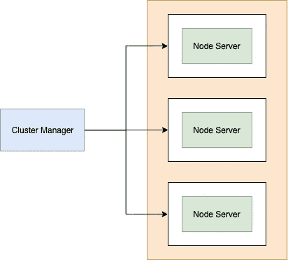
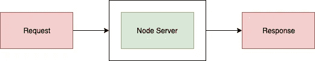
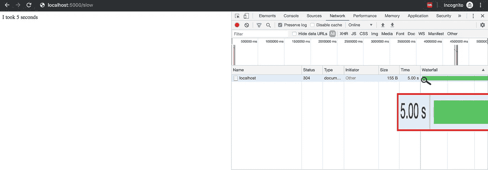
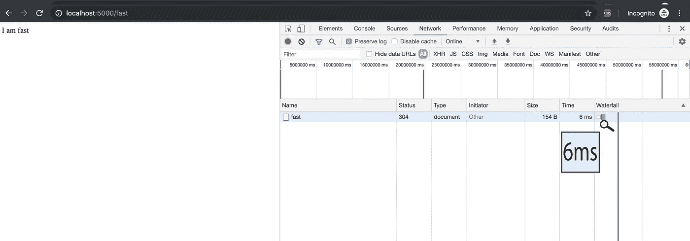
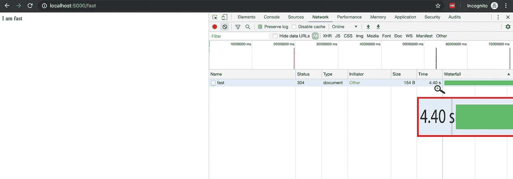
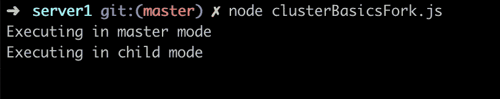
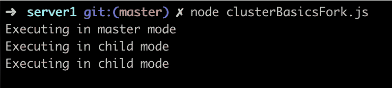
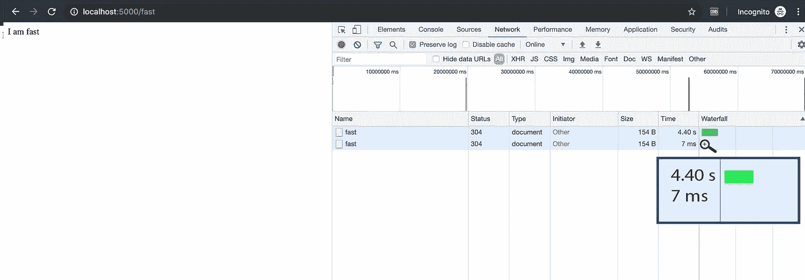

# 通过集群增强 Node.js 的性能(第 1 部分)

> 原文：<https://betterprogramming.pub/enhance-your-node-js-performance-through-clustering-part-1-4cf9cc710774>

## 理解 Node.js 是如何工作的



# **为什么要在 Node.js 中使用集群？**

Node.js 应用程序运行在单个处理器上，这意味着默认情况下它们不利用多核系统。如果您有一个 4 核 CPU，并且正常运行 Node.js 应用程序，那么它将在一个核上执行，而其他三个核将保持未使用状态。

让我们讨论一个简单 Node.js 应用程序的基本可伸缩性问题。



简单的 Node.js 应用程序。集群是在父进程下运行的相似工作线程的池。

让我们在其中添加一小段代码。

该应用程序有两条路线:

1.`/slow`正在调用`load()`，这将需要五秒钟才能完成。并且这个路由会返回一个随机字符串(“我用了 5 秒”)。
2。`/fast`尽快返回一些随机的字符串。

如果我加载一个`/slow`页面，需要 5 秒钟——如我所料。



如果我加载一个`/fast`页面，需要 6 毫秒——这几乎可以忽略不计。



但是，如果我先尝试加载`/slow`页面，然后立即尝试加载`/fast`页面，执行会花费多少时间？让我们检查一下。



页面花费了 4.5 秒，而不是之前的几毫秒。

## **为什么会这样？**

这是因为我们的应用程序运行在一个集群上。当我们试图在加载完`/slow`页面后立即加载`/fast`页面时，`/fast`页面加载仍在等待`/slow`页面加载先完成。

想象一下，如果这种情况发生在拥有数百万用户的生产环境中。这肯定会损害用户体验，甚至可能导致用户流失，这对任何组织都是危险的。

# **集群在这里有什么帮助**

借助集群，我们可以借助 node 的集群模块在同一个 Node.js 应用程序中创建多个节点集群。

使用这种方法的主要优势是，我们可以通过利用多个处理器内核轻松扩展我们的应用程序执行。另一个优势是集群在同一个端口上运行，因此所有请求都将通过一个端口进行路由。

集群管理器是主进程，它负责通过使用`child_process`模块的`fork()`方法来创建和控制工作进程。虽然理论上听起来很复杂，但是非常简单。借助 Node.js 集群模块，我们可以在应用程序中使用集群。


要使用集群模块:

```
const cluster = require(“cluster”);
```

集群模块多次执行同一个 Node.js 进程，因此您必须确定主进程执行了哪部分代码，子进程执行了哪部分代码。

借助于`cluster.isMaster` 标志，集群模块帮助我们识别主流程和子流程。例如:

让我们检查输出:



所以如果你叫两次`cluster.fork()`。

以下是输出结果:



集群模块已经执行了三次相同的过程。第一个在主模式下执行，接下来的两个在子模式下执行。

让我们以前面讨论过的同一个`/slow`和`/fast`为例，使用集群来执行它。

让我们加载`/slow`路线。


现在来加载`/fast`路线。



`/slow`路线花费了 5 秒来加载(与之前花费的时间相同)，但是`/fast`路线，之前花费了将近 4.4 秒，现在只需要 7 毫秒就可以加载。

## 为什么会这样？

以前，这两个路由都在单个内核中加载，但现在在集群的帮助下，这些`/slow`和`/fast`路由在两个不同的内核中加载——因为我们通过调用`cluster.fork()`两次创建了两个工作子进程。

# 下一步是什么？

在理解聚类概念时，肯定会产生许多疑问，例如:

1.  为了获得最佳吞吐量，我们应该创建多少个理想的子进程？
2.  有没有更好更现实的方法来测试集群流，而不是冗余地加载`/slow`和`/fast`路由？
3.  调用`fork()`是使用集群的唯一方式吗(因为通常不经常使用)？

别急，这些问题都会在下一篇回答。

## 在这个系列中

我们需要详细讨论更多的话题。在接下来的几篇文章中，我将详细讲述以下主题:

*   通过集群提高 Node.js 的性能(第 2 部分)
*   节点事件循环的内部工作方式
*   创业应该用 [hapi](https://hapi.dev/) 还是 [Express](https://expressjs.com/) 呢？

感谢阅读。