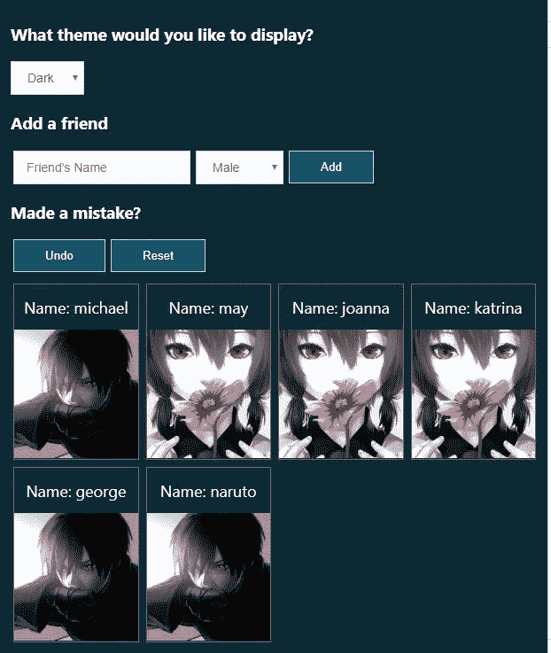
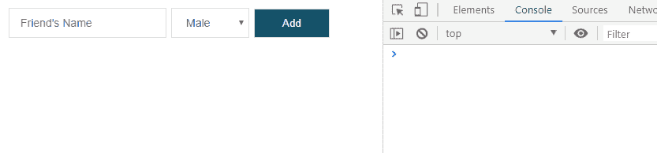
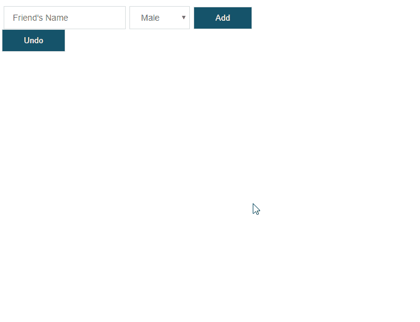
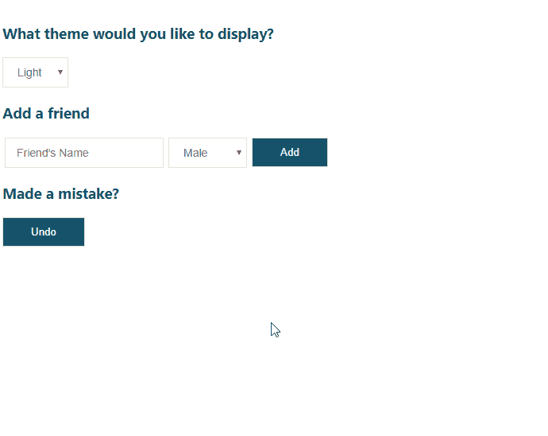
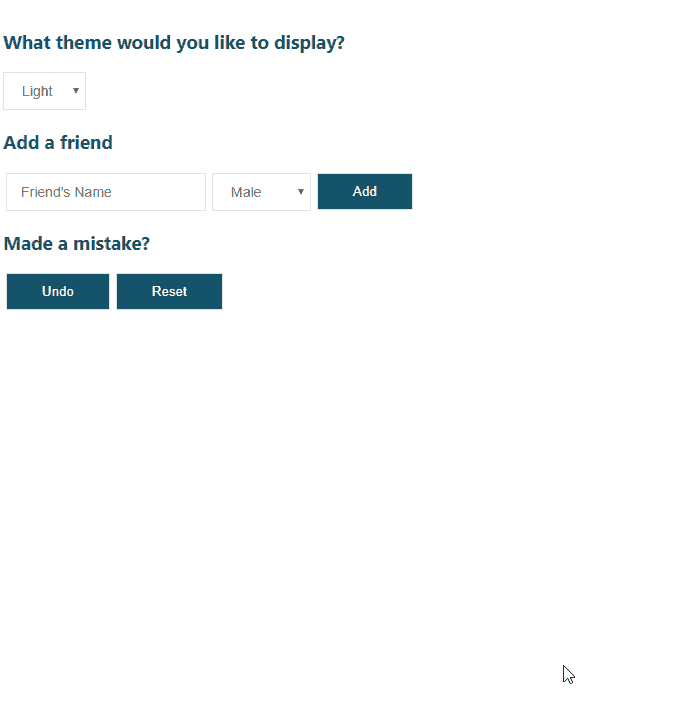
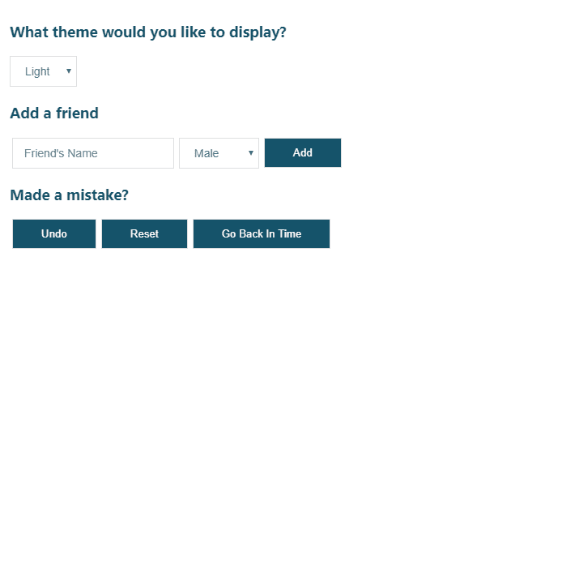

# 使用撤销和重置功能增强 React 应用程序

> 原文：<https://betterprogramming.pub/enhance-your-react-app-with-undo-and-reset-abilities-cee6f37af0d9>

## 增强用户能力

## 现在是让 React 做大事的时候了


你有没有开发过出错时希望有*撤销*功能的东西？那么*复位*呢？

幸运的是，我们使用的软件中总是有撤销或重置功能。我说的是 [vscode](https://code.visualstudio.com/) 中的 *ctrl + z* ，或者，90 年代常见的，表单中的 *reset* 按钮。

很容易理解为什么我们需要它们，因为人类总是会犯错。无论是书面文章中的打字错误还是用词错误，我们都需要用某种方式来弥补。不过，当你想到这一点时，几乎在任何地方都有方法可以撤销某些事情。铅笔有橡皮，电话有被拆开的功能，用户可以选择重设密码，可擦笔可以擦掉墨水——这样的例子不胜枚举。

但是作为一个应用程序的开发者，如何实现撤销或重置功能呢？你从哪里开始？你应该从哪里寻求建议？

好了，别再看了，因为我在这里向您展示如何用*撤销*和*重置*功能来增强您的应用程序！在这篇文章中，你会发现实现起来并不难，到最后，*你就可以自己添加了。*

我们将建立的是一个用户界面，用户可以通过名字添加他们的朋友，并指定他们朋友的性别。当朋友被插入时，卡片将被附加到显示朋友注册信息的屏幕上。此外，如果他们的朋友是女性，它会显示一条*热粉色*的边界线，而男性会显示一条*蓝绿色*的边界线。如果用户在注册好友时出错，他或她可以选择*撤销*该动作，或者*将整个界面复位*回到其开始状态。最后，他们将能够改变他们的界面主题，从亮模式到暗模式，反之亦然。

下面是它的样子(注意:在这篇文章的结尾有一个例子，在这个例子中，这个过程更进一步):

## 灯光模式


## 黑暗模式



事不宜迟，我们开始吧！

在本教程中，我们将使用`create-react-app`快速生成一个 React 项目。

(如果你想从 GitHub 获得一份库的副本，点击[这里](https://github.com/jsmanifest/undo-reset))。

继续使用下面的命令创建一个项目。对于本教程，我将称我们的项目为`undo-reset`。

```
npx create-react-app undo-reset
```

完成后，进入目录:

```
cd undo-reset
```

在主条目`src/index.js`中，我们将对其进行一些清理:

起始款式可在`src/styles.css`中找到，包括:

现在创造`src/App.js`。这将呈现我们将在整个教程中构建的所有组件:

因为我们让用户添加他们的朋友并指定他们的姓名和性别，所以我们定义了几个 React 钩子来保存输入值，我们还将定义更新它们的方法。

然后，我们将实现钩子将自己附加到的元素和输入字段:

`src/styles.css`:

我不喜欢在我的教程中使用超级简单的界面——毕竟，我确实*重视你花在阅读我的帖子上的时间——所以我在样式上花了一些心思，让你不会感到无聊。*

接下来，我们需要一个稳固的地方来放置撤销和重置逻辑，因此我们将创建一个自定义钩子来处理状态更新:

`src/useApp.js`

上面的`onSubmit`将被传递到我们之前定义的`form`中，这将有助于在用户提交好友时将他们添加到好友列表中:

`src/App.js`

这里需要注意的是`onSubmit`被赋予了字段参数作为参数。如果我们回头看看我们的`onSubmit`处理器，它不是一个[高阶函数](https://codeburst.io/here-are-7-ways-higher-order-functions-can-improve-your-life-a392aa6b29d2)。这意味着它将在组件挂载时被立即调用，因此我们需要将`onSubmit`处理程序转换成一个高阶函数来绕过它，并赋予它接收字段值的能力:

`src/useApp.js`

到目前为止，我们有这个:



接下来，我们将开始实现逻辑。但是首先，我们需要定义*状态结构*:

`src/useApp.js`

```
const initialState = {
  friends: [],
  history: [],
}
```

本教程最重要的部分是`history`。当用户提交一个动作时，我们将捕获应用程序的状态，并将其安全地存储在一个地方，我们可以在以后引用它来撤销用户的动作。这个*就是`state.history`，只有我们自定义的钩子需要知道。然而，它也可以在用户界面中使用有趣的功能，比如允许用户通过网格查看他们以前的操作，并选择返回到哪一个。这是一个方便的小功能，让你的用户惊叹不已！(**编辑**:我在文章末尾提供了一个例子——在*奖金*部分的下面)*

*接下来，我们将在 reducer 中添加开关案例，以便我们的状态可以实际更新:*

*`src/useApp.js`*

*当我们`dispatch`一个类型为`*‘*add-friend*’*`的动作时，我们继续将这个新朋友添加到列表中。但用户不知道的是，我们在默默地保存他们之前的编辑。我们捕获了应用程序的最新状态，并将其保存在`history`数组中。这样，如果用户想回到以前的状态，我们可以做到！*

*因为我们使用的是 React hook API，所以我们不能忘记从 React 导入它。我们还需要在自定义钩子中定义`useReducer`实现，这样我们就可以获得 API 来发送信号以更新我们的本地状态:*

*`src/useApp.js`*

*现在我们已经获得了 API，让我们将它们整合到需要它的地方:*

*`src/useApp.js`*

*到目前为止，我们的定制钩子是这样的:*

*接下来，我们需要呈现插入到`state.friends`中的朋友列表，以便用户可以在界面中看到他们:*

*`src/App.js`*

*如果你想知道这条奇怪的线在做什么:*

```
**
```

*实际上，我只是提供了自己的图像来呈现在`img`元素上，以便在界面中轻松区分女性和男性——出于演示目的。如果您需要它们的副本，那些正在克隆存储库的人将能够在`*src/images*`目录中看到它们:)*

*我们在`App.js`的顶部导入女性/男性图像，在`App`组件的正上方，我们将定义一个`FriendBox`组件，当用户将它们添加到列表中时，该组件将负责呈现一个`friend`框:*

*为了从视觉角度进一步区分女性和男性，我额外添加了基本风格来代表每种风格:*

*`src/styles.css`*

```
*.teal-border {
  border: 1px solid #467b8f;
}.hotpink-border {
  border: 1px solid #c1247d;
}*
```

*这是我们目前对`App.js`文件的了解:*

*这里的盒子使用的样式有:*

*`src/styles.css`*

*哦，真倒霉！我们忘记做的一件事是引入`undo`方法，这样我们可以在接口中使用它！继续从`useApp`中取出并将其放在`Undo`按钮上:*

*`src/App.js`*

*现在，当用户点击`Undo`按钮时，他们最后的动作应该被恢复！*

**

*一切都在按计划进行。用户能够将他们的朋友添加到列表中，在界面中轻松区分哪些是女性，哪些是男性，并撤销他们之前的提交。*

*您是否注意到在`App`组件中现在有了一个`resetValues`方法，它被作为第二个参数传递给`*onSubmit*`？用户可能会觉得有点奇怪的一件事是，在他们提交朋友后，他们的输入没有被清除。那里还需要同样的名字吗？除非他们有两三个同名的朋友，否则他们肯定会按下退格键，自己清除掉。但是我们作为开发者有能力让他们的生活变得更简单，所以这就是为什么我们实现了一个`resetValues`。*

*话虽如此，它应该被声明为`onSubmit`的第二个参数，因为我们将它作为 UI 组件中的第二个参数传入:*

*`src/useApp.js`*

*我们的撤销功能现在应该可以 100%正常工作了，但是我还会做得更复杂一点，因为`undo`可以兼容任何东西。*

*因此，我们将让用户为界面声明一个主题颜色，这样他们就不会对白色感到厌倦:*

*`src/useApp.js`*

```
*const initialState = {
  friends: [],
  history: [],
  theme: 'light',
}*
```

*`src/useApp.js`*

*此外，我声明了一个`insertToHistory`实用程序来为我们带来额外的好处，以防我们将来为 state 参数传递一个奇怪的值，您可能已经注意到了:*

*我想补充一点，随着你的应用变得越来越大越来越复杂，提前思考是一个非常重要的习惯。*

*现在继续主题实现，我们将定义一个用户界面组件可以利用的自定义方法:*

*`src/useApp.js`*

*将主题组件和方法应用于界面:*

*`src/App.js`*

*因为我们添加了主题改变特性，所以添加一些条件样式来适应改变可能是个好主意，对吗？*

```
*<div className={cx({
    'theme-light': theme === 'light',
    'theme-dark': theme === 'dark',
  })}*// ...rest of the component**
```

*这是它的风格:*

*`src/styles.css`*

*厉害！下面是我们的界面现在能做的！*

**

*为自己走到这一步鼓掌吧！*

*不过我们先不要庆祝，因为这篇文章的标题还提到了界面的重置特性。*

*现在，让我们通过在我们现有的减速器上定义开关箱来实现这一点:*

*`src/useApp.js`*

*当然，这意味着接下来必须定义一种方法，向减速器发送状态变化的信号。别忘了在钩子的末端归还它！*

*`src/useApp.js`*

*从 UI 组件中的挂钩析构它:*

*`src/App.js`*

```
*const { onSubmit, friends, undo, theme, onThemeChange, reset } = useApp()*
```

*`src/App.js`*

*最后但同样重要的是，用于这些动作的样式使它们水平对齐:*

*`src/styles.css`*

```
*.undo-actions {
  display: flex;
  align-items: center;
}.undo-actions > div {
  margin: auto 3px;
}*
```

*结果:*

**

*难道你不喜欢界面重置也被撤销所捕获吗？*

*如果您选择下载并克隆存储库，您将看到如下所示的细微修改:*

*`src/App.js`*

*这是相同的代码，除了我通过将组件分离到它们自己的文件中来组织它，使它更具可读性和可维护性。*

# *奖金*

*在本教程开始的时候，我提到了一个可以向用户显示的界面——如果需要，用户可以选择应用程序的状态。下面是一个使用中的例子:*

**

# *结论*

*让我们面对现实，撤销事情对我们非常有用，因为我们人类从未停止犯错。我希望这意味着你发现这真的很有用！*

*下次再见，如果你以后想从我这里读到更多，可以关注我！*