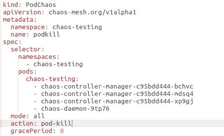
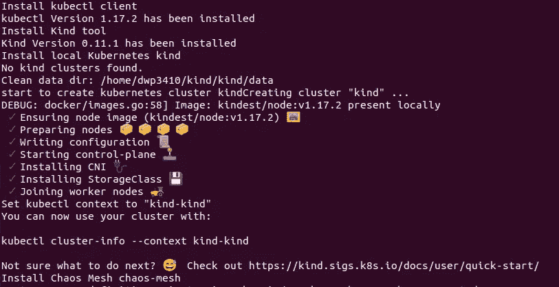
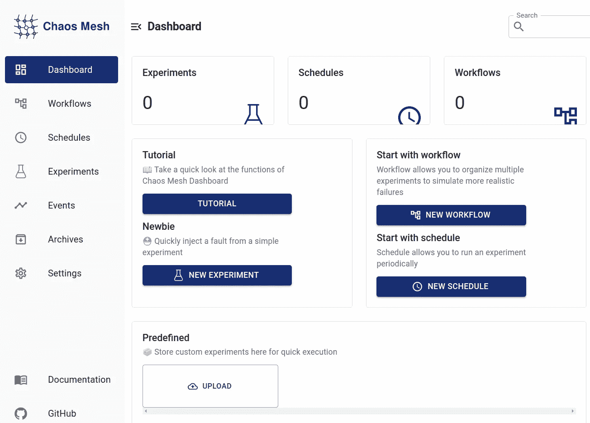
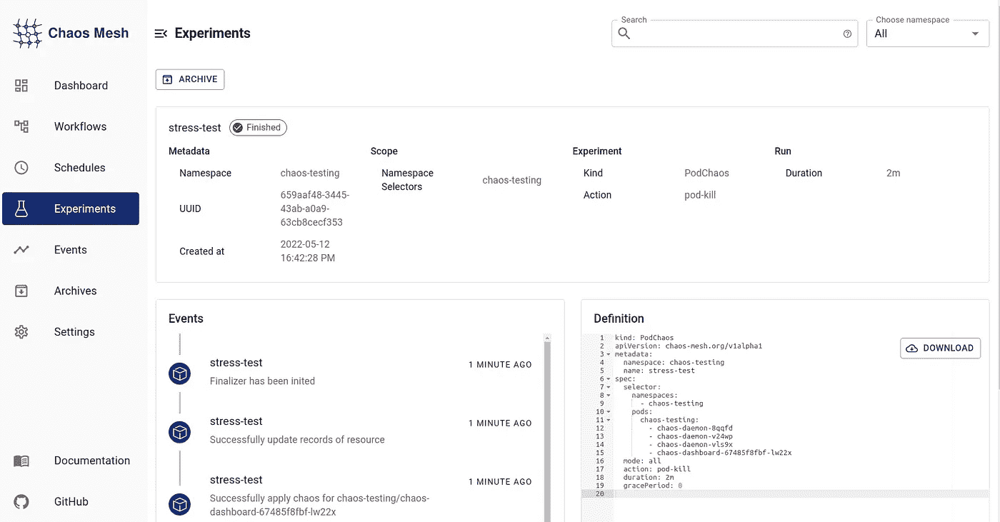
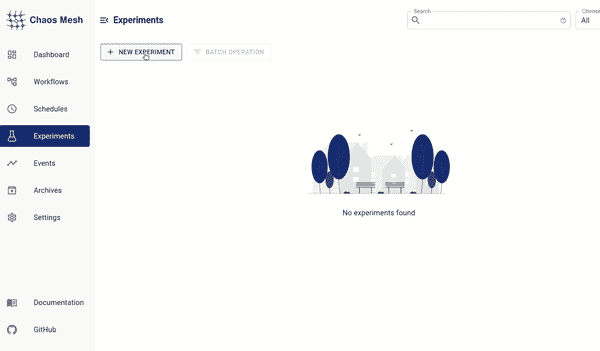
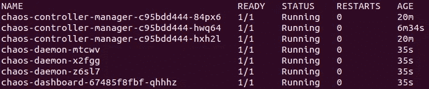

# 用混沌网确保稳定的生产环境

> 原文：<https://betterprogramming.pub/ensure-a-stable-production-environment-with-chaos-mesh-54057773d582>

## 介绍混沌网格，一个强大的混沌工程工具


照片由[大流士巴沙尔](https://unsplash.com/@dariusbashar?utm_source=medium&utm_medium=referral)在 [Unsplash](https://unsplash.com?utm_source=medium&utm_medium=referral) 上拍摄

如今，分布式计算系统中的故障变得难以预测。我们需要主动预防问题。[混沌工程](https://en.wikipedia.org/wiki/Chaos_engineering)方法正是为了这个目的。

在这篇文章中，我将介绍[混沌网格](https://chaos-mesh.org/)，一个强大的混沌工程工具。如果你不熟悉混沌概念，请阅读下面的内容，否则你可以直接跳到混沌网格部分。

# 混沌工程概念

混沌工程是一个现代概念，在分布式环境中故意造成混乱但真实的情况。这个想法最初是由网飞的工程师在 2011 年设计的。这种测试验证了生产环境可以容忍意外故障。我们可以在生产受到影响之前主动处理最致命的弱点。它测试环境对基础架构、网络和应用程序故障的恢复能力。

例如，我们可以检查如果单点故障崩溃会发生什么。对系统的其他剩余部分会有什么影响？如果我们发现了问题，我们可以重新设计策略，并重复测试以确保实施了正确的解决方案。

典型的混沌测试案例:

*   模拟高 CPU 负载和流量的意外增加。
*   在服务中注入延迟。
*   导致网络中断。
*   分离舱故障。

还有很多。

# 混沌网格概述

混沌网格是一个开源的云原生混沌工程工具。它提供了一个方便的网络界面，您可以在其中创建您的实验。或者，您可以直接从 UI 或从`.yaml` 文件中构造它们。

下面是一个`.yaml`格式的 pod-kill 实验示例:



pod 杀死示例

它支持 Kubernetes 以及物理节点的各种类型的实验。我建议阅读[文档](https://chaos-mesh.org/docs/)来熟悉所有的测试。

您可以选择运行一次性实验以及预定的实验。

## 调试工具

您想查看您的实验的日志和调试信息吗？Chaos Mesh 提供了一个名为 [chaosctl](https://chaos-mesh.org/docs/chaosctl-tool/) 的命令行工具。注意，目前它支持 IOChaos、NetworkChaos 和 StressChaos 场景的调试。

## 与 GitHub 操作集成

确保您的项目顺利运行的最佳方式是将检查集成到您的 CI/CD 管道中。你可以将混沌网格连接到 [GitHub 动作](https://docs.github.com/en/actions)。[官方指南](https://chaos-mesh.org/docs/integrate-chaos-mesh-into-github-actions/)包含了几个简单步骤的配置信息。

## Grafana 支架

您可以使用数据源插件将混沌网格集成到 Grafana 中。当您想要可视化关于正在运行的实验的信息时，这很有用。查看关于集成过程的[指南](https://chaos-mesh.org/docs/use-grafana-data-source/)。

# 混沌网格演示实验

首先，让我们使用一个`kind`环境在 Linux 上安装 Chaos Mesh。

*如果不使用* `*kind*` *，请查看* [*安装指南*](https://chaos-mesh.org/docs/quick-start/) *查看其他选项如*`*minikube*`*`*k3s*`*等。**

*在终端中运行以下命令:*

```
*curl -sSL https://mirrors.chaos-mesh.org/v2.1.5/install.sh | bash -s -- --local kind*
```

**

*安装混沌网格*

*这需要几分钟。验证安装:*

```
*kubectl get po -n chaos-testing*
```

*您应该看到您的 pod 正在运行:*

**

*安装后运行 pod*

*在本教程中，我们将通过用户界面创建实验。要访问 Chaos 仪表板，您需要启用端口转发:*

```
*kubectl port-forward -n chaos-testing svc/chaos-dashboard 2333:2333*
```

*现在你应该可以通过浏览器中的`[http://localhost:2333](http://localhost:2333/)`访问它了。*

*以下是仪表板的快速概览:*

**

*混沌仪表板概述*

*如果您已有实验，您可以查看**实验**菜单下的状态:*

**

*实验细节*

*在这个演示中，我将创建一个 pod-kill 测试。如下图所示，通过用户界面导航和设置实验非常直观:*

**

*创造一个豆荚杀死实验*

*就是这样！*

*现在执行这个命令来查看 pod 状态:*

```
*kubectl get po -n chaos-testing*
```

*你应该注意到一些豆荚被重新创建了(见**年龄** **35s** ):*

**

*重新创建的 pod 状态*

# *结论*

*在这篇文章中，我介绍了混沌网格的主要特点。您学习了如何从混沌仪表板创建实验。你现在知道为什么混沌工程是一个好的实践。*

*我希望你能从这篇文章中学到一些有益的东西。感谢您的阅读，下次再见！*