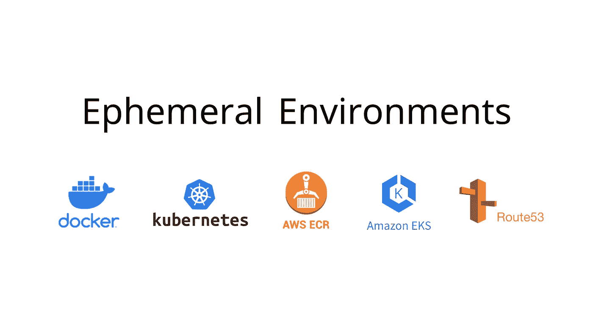
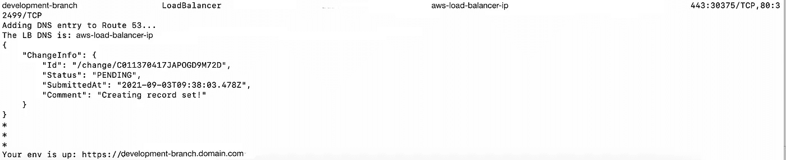

# 在 AWS 上设置短暂的后端环境

> 原文：<https://betterprogramming.pub/ephemeral-backend-environments-on-aws-a45632544dde>

## 创建工作流程的简短教程



在开发后端功能时，开发人员需要单独的环境在云上部署他们的代码(在统一测试环境之前)，以便在真实的服务器上更好地测试，并与前端团队共享，以有效地构建产品(并远离 ngrok 之类的产品)。

# **解决方案**

这里有一个解决方案，可以在几分钟之内在 AWS 上的私有 VPC 上设置临时后端 env！

## **先决条件:**

*   AWS 帐户。
*   服务:ECR(弹性集装箱注册)，EKS(弹性 Kubernetes 服务)，以及在私有 VPC 上配置的 Route 53。
*   Dockerfile(用于将图像推送到 ECR)
*   Kubernetes 清单文件(用于部署到 EKS 上的 Kubernetes 集群)

# **工作流程**

*   从 ECR 中提取最后一个推送的构建标记。

```
LAST_REPO=$(aws ecr describe-images — output text — repository-name “<repository-name>” — query ‘sort_by(imageDetails,& imagePushedAt)[-1].imageTags[0]’)
```

*   更新标签。在我们的例子中，我们使用的是数值，所以我们只增加 1。

```
TAG=$((LAST_REPO + 1))
```

*   选择一个子域。这也可以是分支名称(我们希望保持它的灵活性，因此现在设置一个默认的子域)。

```
SUB_DOMAIN=development-branch
```

*   使用新标签构建 docker 映像并推送到 ECR。*更多* [*此处*](https://docs.aws.amazon.com/AmazonECR/latest/userguide/getting-started-cli.html) *。*

```
docker build -t <repository-name>:$TAG .docker tag <id>.dkr.ecr.<region>.amazonaws.com/<repository-name>:$TAG <repository-name>:$TAGdocker push <id>.dkr.ecr.<region>.amazonaws.com/<repository-name>:$TAG
```

*   删除 EKS 上运行的现有服务(如果有)。这个文件是一个带有部署和服务的经典 k8s 清单文件，保持简单，因为它只是一个开发环境，不需要蓝绿色部署。*更多* [*此处*](https://dev.to/slashpai/quickly-creating-kubernetes-manifest-files-using-kubectl-2khj) *。*

```
kubectl delete -f kub-manifest.yml
```

*   使用传递给 Kubernetes 清单文件的新标记重新运行 EKS 集群。

```
ECR_TAG=$TAGcat kub-manifest.yml | sed “s/{{ECR_TAG}}/$ECR_TAG/g” | kubectl apply -f -
```

*   从 EKS 获取服务 DNS(我们使用负载平衡器)

```
DNS=$(kubectl get svc <repository-name> -o jsonpath=”{.status.loadBalancer.ingress[0].hostname}”)
```

*   更新 53 号公路的详细信息。更多[此处](https://docs.aws.amazon.com/cli/latest/reference/route53/change-resource-record-sets.html)。

```
aws route53 change-resource-record-sets — hosted-zone-id “<host-zone-id>” — change-batch ‘{ “Comment”: “Creating record set!”,
 “Changes”: [ { “Action”: “UPSERT”, “ResourceRecordSet”: { “Name”:
 “‘“$SUB_DOMAIN”’.<domain-name>”, “Type”: “CNAME”, “TTL”:
 120, “ResourceRecords”: [ { “Value”: “‘“$DNS”’” } ] } } ] }’
```

*   瞧，环境准备好了！

```
Your env is up: [https://$SUB_DOMAIN.<](/$SUB_DOMAIN.poc.twinhealth.com)domain-name>
```

## **截图(已删除变量信息)**



# **最后的想法**

*   这个脚本可以在 CL/CI 上配置，只需稍加调整，并根据需要使用。
*   可以使用部署在 AWS Lambda 上的单独批处理作业来终止这些环境，以节省成本。

干杯！