# 角度误差处理

> 原文：<https://betterprogramming.pub/error-handling-in-angular-67c308df0f07>

## 如何正确处理角度应用中的误差

在这篇文章中，我们将演示如何正确处理角度应用中的误差。

软件开发中的错误处理与拥有一个正常工作的应用程序一样重要。为了拥有一个完整和健壮的应用程序，必须正确处理错误和异常。

我将指导您如何有效处理角度应用中的错误。在本教程中，我使用的是 Angular 7 . 0 . 4——我建议你使用相同的版本。

# **先决条件**

您的系统上应该有以下内容:

## 结节

*   转到[nodejs.org](https://nodejs.org/en/)
*   下载并安装可用的 LTS 版本。
*   要检查您的版本，请在终端/控制台窗口中运行`node -v`。

## 角度 CLI

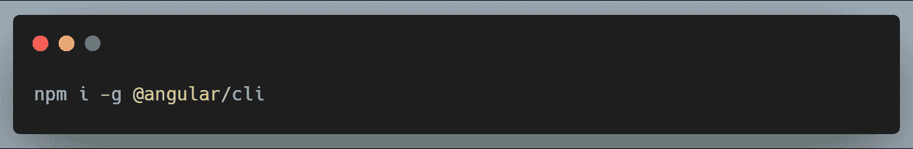

## Visual Studio 代码

我使用 VSCode，但是你可以使用任何其他的 IDE (Atom，Vim 等等。).

有了这些，我们可以开始为我们的应用程序创建一个新文件夹。

*   在 VSCode 中打开文件夹，方法是在文件夹中单击鼠标右键，然后使用 VSCode 打开。
*   打开 VsCode 终端并创建一个新的 angular 项目。

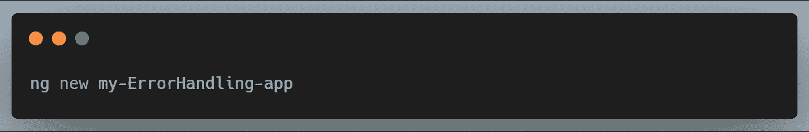

*   `ng new`命令提示您关于要包含在初始应用程序项目中的特性的信息。通过按 Enter 或 Return 键接受默认值。
*   Cd 到项目文件夹 **cd myErrorHandlingApp**

本地服务应用程序:

这将在 **localhost:4200** 上的本地浏览器中打开应用程序。您应该看到这个:

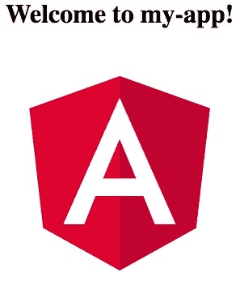

Angular 应用程序中的错误可以是客户端错误，也可以是服务器端错误:

*   客户端错误:与前端代码和网络相关的错误—它们抛出 4xx 状态代码。
*   服务器端错误:与后端代码、数据库和文件系统相关的错误。他们通常抛出 5xx 状态码。

我们将使用 Angular 的内置`HttpClientModule`，通过使用 [chucknorris](https://api.chucknorris.io/) API 显示随机笑话来演示错误处理。

1.我们首先将`HttpClientModule`导入到我们的根模块(app.module.ts)中。

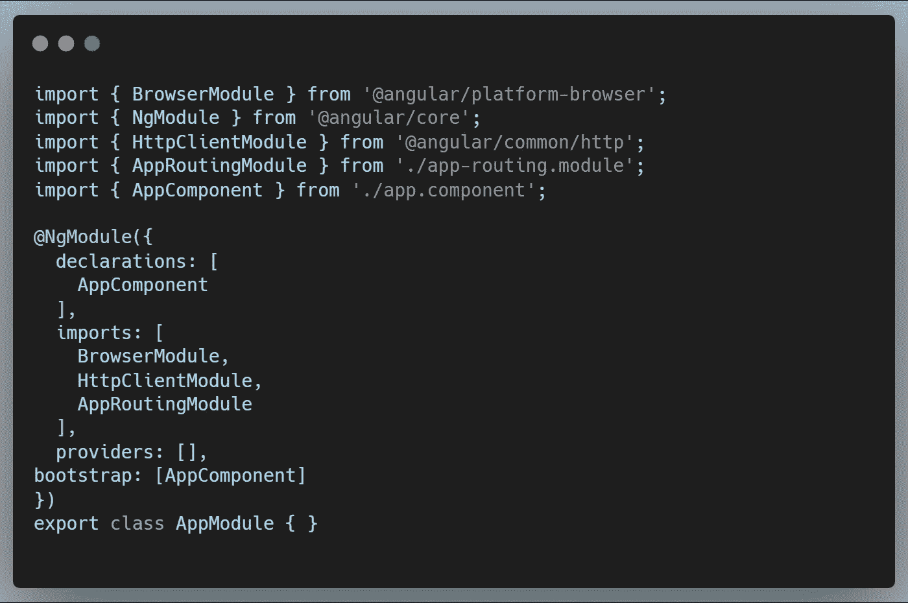

2.在 app.component.html，我们创建了一个按钮，单击它将启动 HTTP 请求:

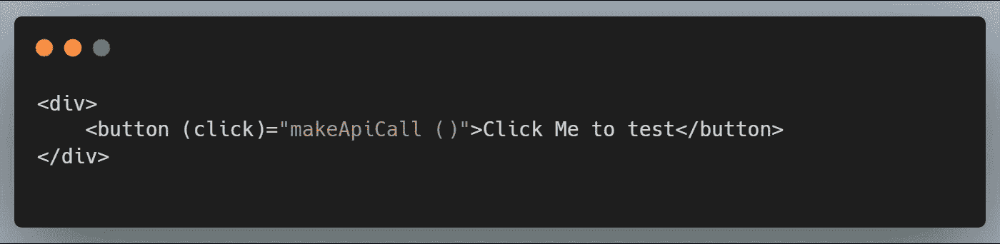

3.在 app.component.ts 中，我们包含了构造函数，并扩展了组件的类来实现 OnInit 生命周期挂钩。

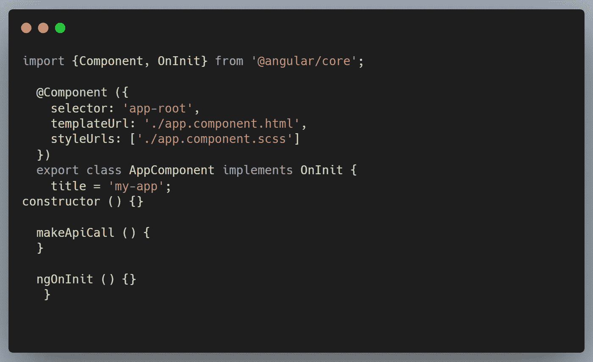

4.现在我们需要创建一个可以发出 HTTP 请求的服务。服务是 Angular 的重要组成部分。当我们需要在应用程序的任何地方使用代码时，或者我们需要在应用程序之间传递数据时，服务就会派上用场。

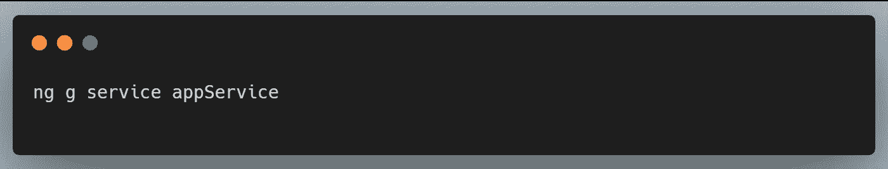

这将创建一个新的可注入服务，它可以被注入到我们所有的组件中。我们现在应该将它放在我们的文件夹树中。

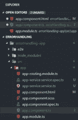

5.创建服务后，我们将服务注入到 app 组件控制器(app。component.ts 文件)。请注意 appService 是如何导入到组件中的。

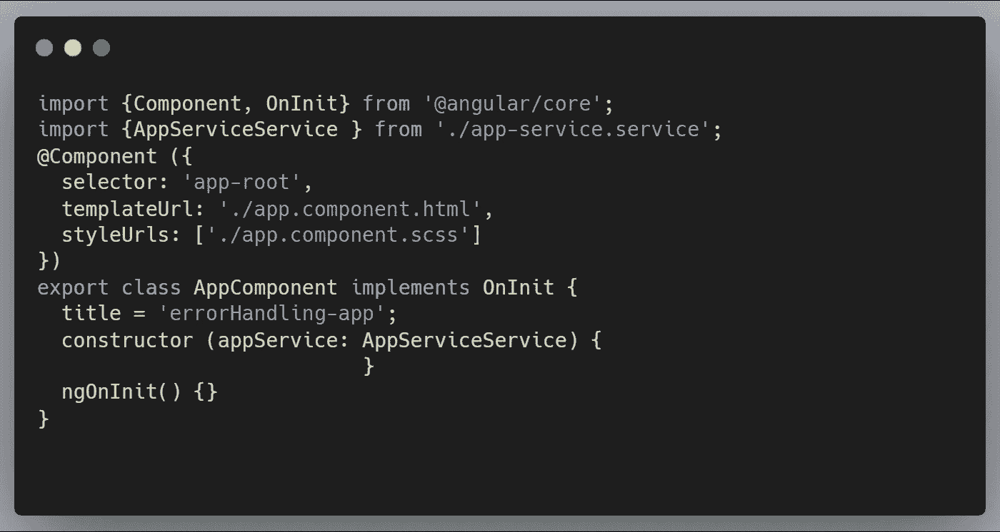

6.在 appService 中，我们将向 chuck Norris open API 发出 HTTP 请求，以获取随机笑话。

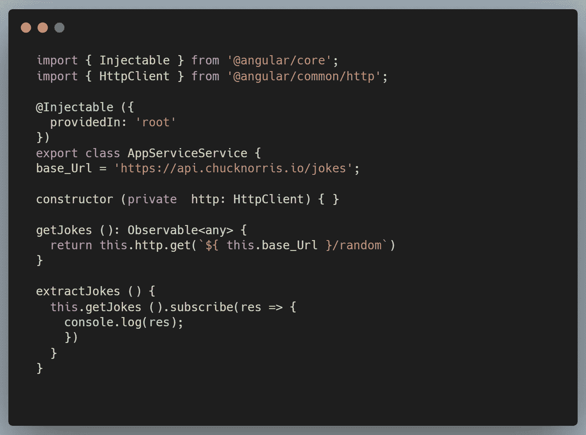

我做了什么?

*   将我们的 API 的基本 URL 设置为[https://api.chucknorris.io/jokes](https://api.chucknorris.io/jokes)
*   在构造函数中将 HttpClient 服务作为私有变量注入。注意:你需要将`HttpClientModule` 从' @angular/common/http '导入到 app.module.ts 中。
*   我创建了一个`getJokes` ，它调用 HTTP get 方法来获取随机笑话。这是作为`Observables`返回的。
*   在`extractJokes` 方法中，我订阅了可观察到的笑话并将其记录在控制台上。

7.我们需要做的下一件事是从点击按钮的控制器中调用`extractJokes` 方法。在`makeApi` 方法中，插入此；

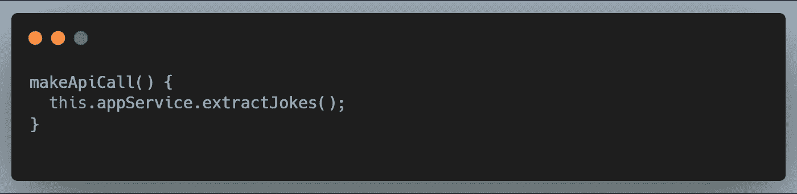

保存您的代码，然后单击按钮。您应该会在浏览器的控制台上看到一个`joke` 对象。

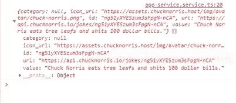

工作正常，对吗？

我们完成了应用程序，并准备发货。但是等等！如果我们的 HTTP 请求出错，会发生什么？我们如何让用户知道这个错误？我们该如何处理？现在有许多方法可以做到这一点，在本教程中，让我们探索其中的一些。

# **错误处理**

我们可以使用一个错误处理程序来提醒用户有错误。

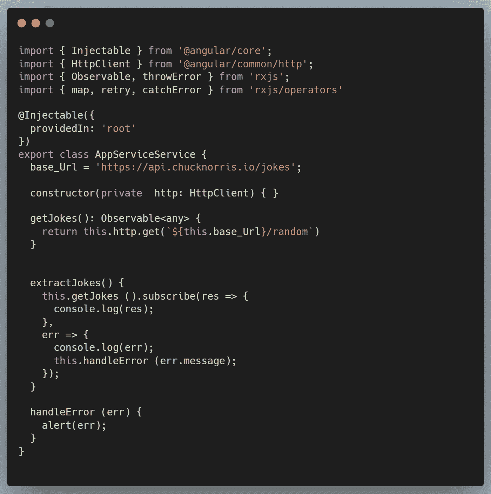

我创建了一个新的`handleError` 方法来提醒用户错误。我还添加了第二个参数，它接受错误，将其记录到浏览器的控制台，并调用`handleError`函数，将错误作为参数传递。

让我们模拟一个错误场景。让您的浏览器离线，然后单击按钮进行测试:

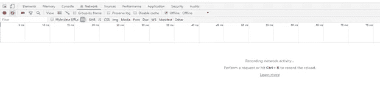

您应该会收到这样的警告:

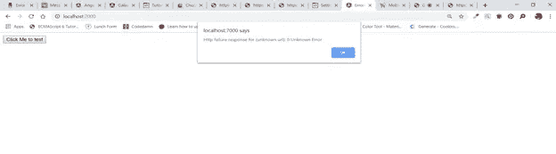

这告诉我们有一个 HTTP 失败响应。现在用户知道了这个错误——一个改进……但是我们可以做得更好。

让我们重新编写代码。从我们服务的`getJokes` 方法开始

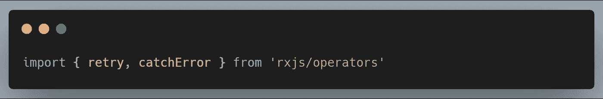

我们需要从 rxjs/operators 中导入`retry` 和`catchError` 运算符。`retry`将帮助我们在抛出错误之前重试指定次数的 HTTP 请求，`catchError`将向用户抛出错误。

现在修改`getJokes` **、**、`extractJokes`、和`handleError`的方法如下所示:

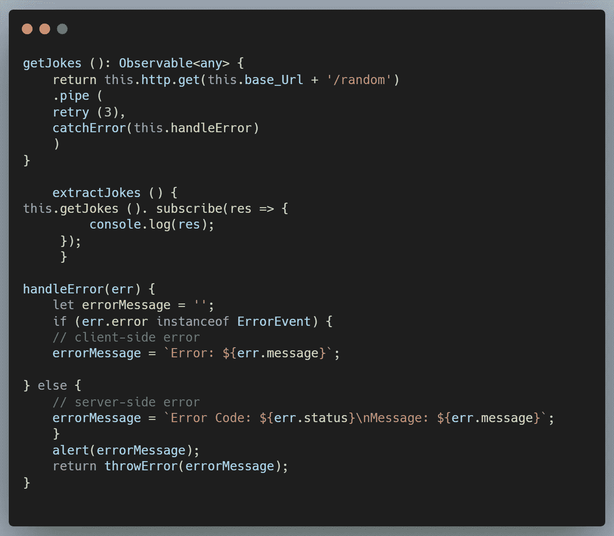

请记住，正如我前面提到的——错误可能发生在客户端，也可能发生在服务器端，所以我们需要同时捕捉两者。每当我们点击按钮发出 HTTP 请求时，我们已经成功地处理了发生的任何一种错误。

处理错误的第二种方法是使用角度 4.3.1 中引入的`HttpInterceptor` 。`HttpInterceptor`用于拦截所有 HTTP 请求和响应，并有选择地对其进行转换。`HttpInterceptor`是一个可以由类实现的接口。它有一个`intercept` 方法，当 HTTP 请求被拦截时，该方法将实现所有的逻辑。更多可以从官方[角度文档](https://angular.io/api/common/http/HttpInterceptor)中阅读。

*   创建一个新类`HttpInterceptor.ts`:

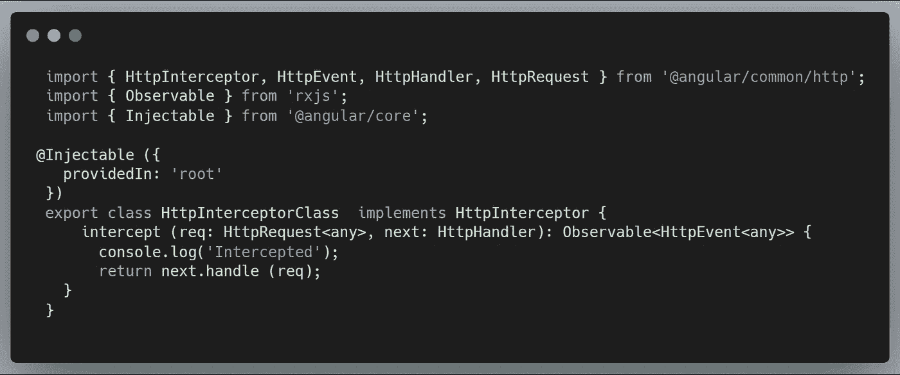

我们需要将新类添加到 app 模块的提供者列表中:

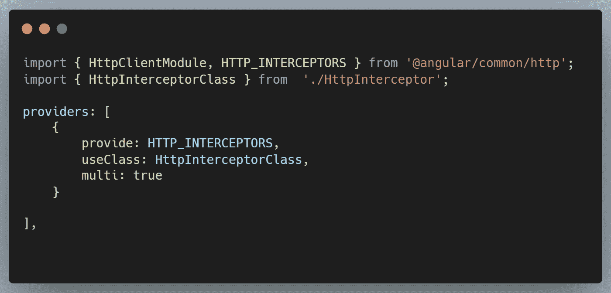

注意`HTTP_INTERCEPTORS` 是如何从@angular/common/http 导入的。如果您点击按钮发出 HTTP 请求，该请求将被拦截,“拦截”将被记录到浏览器的控制台。

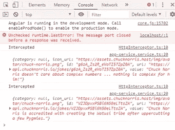

我们现在已经能够拦截所有请求，并成功地将每个请求的消息记录到控制台。这样，我们可以在这里放入我们的错误处理逻辑。如下编辑`HttpInterceptor`文件:

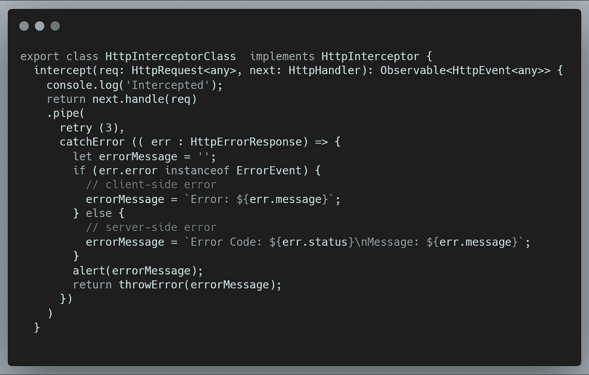

使用`HttpInterceptor`允许我们有一个适当的关注点分离，这正是 Angular 宣扬的最佳实践。如果我们想改变在应用程序的任何部分将错误推给用户的方式，我们可以简单地在创建的拦截器类中这样做，这样我们就可以在应用程序中正确和全局地处理错误。

你可以在这里访问源代码****

****通过编码来改变现状。****