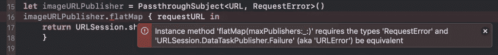

# 解释了联合收割机中的错误处理

> 原文：<https://betterprogramming.pub/error-handling-in-combine-explained-9f622ba759ce>

## 使用代码示例展示如何战胜那些失败的案例


当[开始使用 Combine](https://www.avanderlee.com/swift/combine/) 时，您会很快遇到错误处理问题。每个合并流要么接收一个值，要么接收一个错误，不像 RxSwift 这样的框架，您需要明确预期的错误类型。

为了让您对这些情况有所准备，在本文中，我将介绍 Combine 中可用的选项，以捕获、忽略和处理流中的错误。我们还将介绍当您的流发生错误时，您需要知道的一些重要的事情。

> 刚刚开始使用联合收割机？您可能想先看看 Swift 或 my [Combine Playground](https://github.com/AvdLee/CombineSwiftPlayground) 中的[Combine 框架入门。](https://www.avanderlee.com/swift/combine/)

# 组合流和键入的错误

像 RxSwift 和 Combine 这样的框架之间的一个很大的区别是对流中类型化错误定义的要求。如果我们比较一下`Observable`和它的等价组合`AnyPublisher`，我们可以看到类型声明的不同。

```
public class Observable<Element> : ObservableType
struct AnyPublisher<Output, Failure> where Failure : Error
```

`AnyPublisher`要求我们指定`Failure`错误类型，而`Observable`只接受通用的`Element`类型。

Swift 要求我们考虑错误处理，我们可以把它当成好东西。然而，这并不妨碍我们将预期类型定义为仅仅是`Swift.Error`，这基本上归结为与 RxSwift 中相同的行为。

一旦您要求您的流预期某种错误类型，您将遇到强制转换错误，因为每个操作符都需要返回与主流相同的错误类型。让我们深入研究用于错误处理的合并操作符。

## 使用 mapError 映射错误

为了将错误映射到预期的错误类型，我们可以使用`mapError`操作符。在下面的例子中，我们有一个 passthrough 主题，它需要一个 URL 输出和一个`RequestError`错误类型。

一旦我们开始将这个流映射到一个`URLSessionDataTaskPublisher`中，我们会立即得到一个指出错误类型不匹配的错误。



使用 mapError 在 Swift Combine 中处理错误

在这种情况下，解决方案就像使用`mapError`操作符一样简单，它将使用我们之前定义的会话错误案例将`URLError`包装成`RequestError`。

## 使用重试运算符

在上面的例子中，我们使用了一个`URLSessionDataTaskPublisher`。在处理数据请求时，您可能希望在实际接受错误之前使用 [retry](https://developer.apple.com/documentation/combine/publishers/retry) 操作符。在流实际失败之前，需要重试的次数。

## 捕捉错误

如果您想在早期捕捉错误并在之后忽略它们，您可以使用`catch`操作符。此运算符允许您在请求失败时返回的默认值。这方面的例子有:

*   搜索结果的空数组
*   图像请求失败时的默认图像占位符

我们将在示例中使用后者。

## 使用 replaceError 代替 catch

ReplaceError vs Catch:两个操作符看起来非常相似。最大的不同是`replaceError(:)`操作符完全忽略了这个错误。和上面的例子一样，我们只是在出错的情况下返回占位符`notFoundImage`。

我们可以通过使用 replace error 操作符将任何错误直接映射到占位符图像中来简化这一过程:

## 当分配(至:开:)运算符不可用时

需要映射错误的一个常见例子是当您试图将一个输出值赋给一个对象的属性时。您将尝试使用自动补全功能，并发现`assign(to:on:)`操作符不可用。如果您被迫以任何一种方式编写代码，将会出现以下错误:

> 在“Publisher”上引用实例方法“assign(to:on:)”要求“RequestError”和“Never”类型等效

您可以通过如上面示例中所解释的那样捕捉错误或者简单地使用`assertNoFailure`操作符来解决这个问题。该操作符将引发致命错误，因此，只有在编程错误时才应该使用。如果预计会出现错误，您应该始终使用 catch 运算符。

# 结论

我们已经介绍了很多关于 Combine 中错误处理的内容，这应该足以让你战胜所有那些失败的案例了！确保相应地处理错误，不要简单地忽略它们。对你的用户来说，不开心的流程和开心的流程一样重要。

如果您想玩玩刚刚学到的东西，请查看我的 [Swift Combine Playground](https://github.com/AvdLee/CombineSwiftPlayground) ，其中包含一个关于联合收割机错误处理的页面。

要了解更多关于 Swift Combine 的信息，请查看我的其他联合收割机博客帖子:

*   [用代码示例解释联合收割机中的错误处理](https://www.avanderlee.com/swift/combine-error-handling/)
*   [使用 Swift](https://www.avanderlee.com/debugging/combine-swift/) 中的运算符组合调试
*   [创建自定义的联合发布器来扩展 UIKit](https://www.avanderlee.com/swift/custom-combine-publisher/)
*   [从 Swift 的联合框架开始](https://www.avanderlee.com/swift/combine/)

*最初发表于*[*SwiftLee*](https://www.avanderlee.com)*。*

*更多帖子及更新:* [*@twannl*](https://www.twitter.com/twannl)