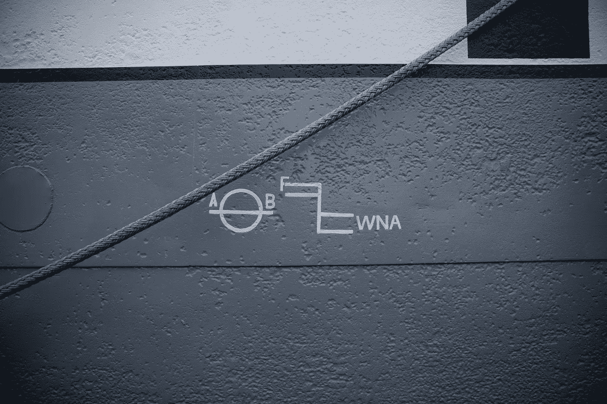

# 如何使用 Express 处理错误

> 原文：<https://betterprogramming.pub/error-handling-with-express-6b8deedf5438>

## 查看默认事件处理程序以及如何使用自定义处理程序



照片由[乔丹·麦基](https://unsplash.com/@jordanmcgee?utm_source=unsplash&utm_medium=referral&utm_content=creditCopyText)在 [Unsplash](https://unsplash.com/s/photos/unexpected?utm_source=unsplash&utm_medium=referral&utm_content=creditCopyText) 上拍摄

与任何其他应用程序一样，我们必须让 [Express](https://expressjs.com/) 应用程序准备好处理错误，如意外输入或文件错误。

在本文中，我们将研究如何用 Express 处理错误。

# 捕捉错误

错误处理是同步和异步处理出现的任何错误的过程。Express 附带了一个默认的错误处理程序，这样我们就不必自己编写了。

例如，如果我们在路由处理程序中抛出如下错误:

```
app.get('/', (req, res, next) => {
  throw new Error('error');
});
```

快车会赶上它并继续前进。我们应该看到`error`而不是应用崩溃。

对于异步错误，我们必须调用`next`来传递错误，表达如下:

上面的代码将在`setTimeout`回调中抛出一个错误，并且`catch`块通过传递错误的`next`调用来调用内置的错误处理程序。

我们应该看到`error`而不是应用崩溃。

同样，我们必须抓住被拒绝的承诺。我们可以这样做:

```
app.get('/', (req, res, next) => {
  Promise
    .reject('error')
    .catch(next)
});
```

或者，使用`async`和`await`语法，我们可以编写以下代码:

我们应该看到`error`显示出来，而不是应用程序崩溃，出现堆栈跟踪。

同样的逻辑也适用于具有事件处理程序链的路由。我们可以如下调用`next`:

我们应该看到`error`和堆栈跟踪一起显示。


照片由[埃里克·穆尔](https://unsplash.com/@ericmuhr?utm_source=medium&utm_medium=referral)在 [Unsplash](https://unsplash.com?utm_source=medium&utm_medium=referral) 拍摄

# 默认错误处理程序

当我们调用`next`时，默认的错误处理程序捕捉错误，而不是用自定义的错误处理程序来处理它。

生产环境中不显示堆栈跟踪。如果我们想发送一个不同的默认响应，我们必须编写自己的错误处理程序。

路由处理程序、中间件和错误处理程序之间的唯一区别是，错误处理程序在包含错误数据的请求参数之前有一个`err`参数。

我们可以编写一个带有自定义事件处理程序的简单路由，如下所示:

注意，我们在路由下面有错误处理程序。顺序很重要。它必须位于我们想要处理的所有路由之下，以便调用错误处理程序。

我们可以编写多个自定义错误处理程序，如下所示:

上面我们知道的是，如果第一个错误处理程序中的`req.xhr`为真，那么它将发送`Fail!`响应，而不会继续第二个错误处理程序。否则通过调用`next`调用第二个。

因此，如果我们在路由处理程序中的`setTimeout`前添加`req.foo = true`，那么:

然后我们得到`Fail!`。否则，我们得到`Error!`。

调用`next`会跳到错误处理程序，即使链中还有其他路由处理程序。

# 结论

为了处理错误，如果没有定义自定义事件处理程序，我们应该调用`next`将错误处理委托给默认事件处理程序。

我们也可以通过创建一个在`req`、`res`和`next`之前有`err`参数的函数来定义我们自己的错误处理函数。`err`参数有从`next`传来的错误对象。

错误处理程序必须放在所有常规路由处理代码之后，这样它们才能运行。

此外，我们可以有多个错误处理器。如果我们对它调用`next`，那么它将继续下一个错误处理程序。