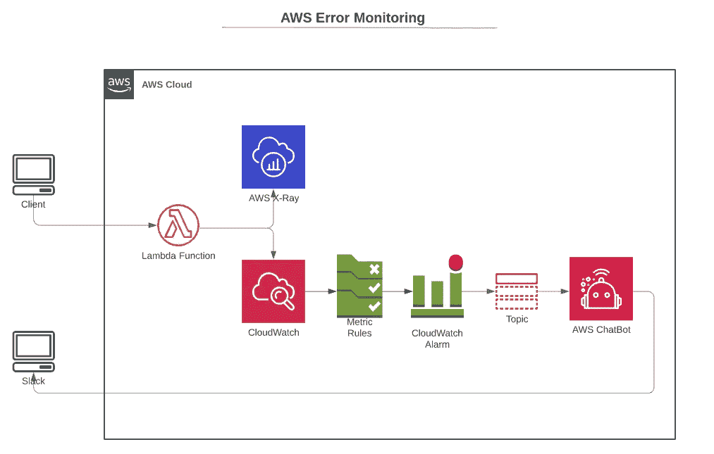
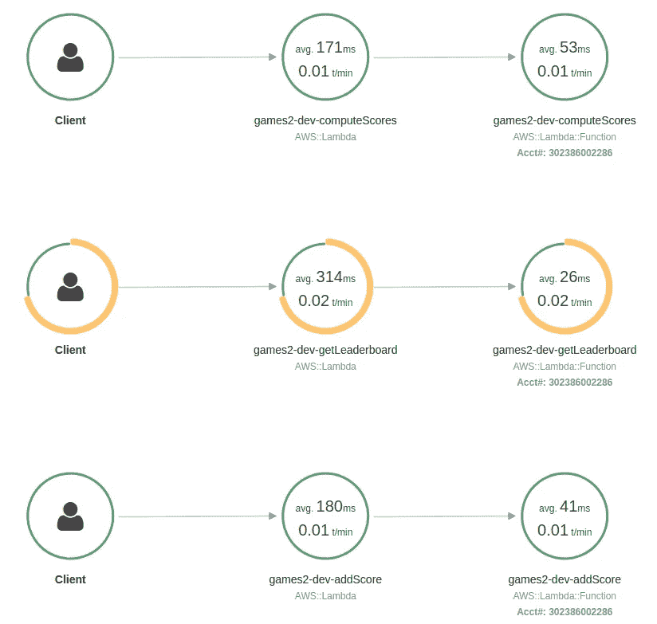
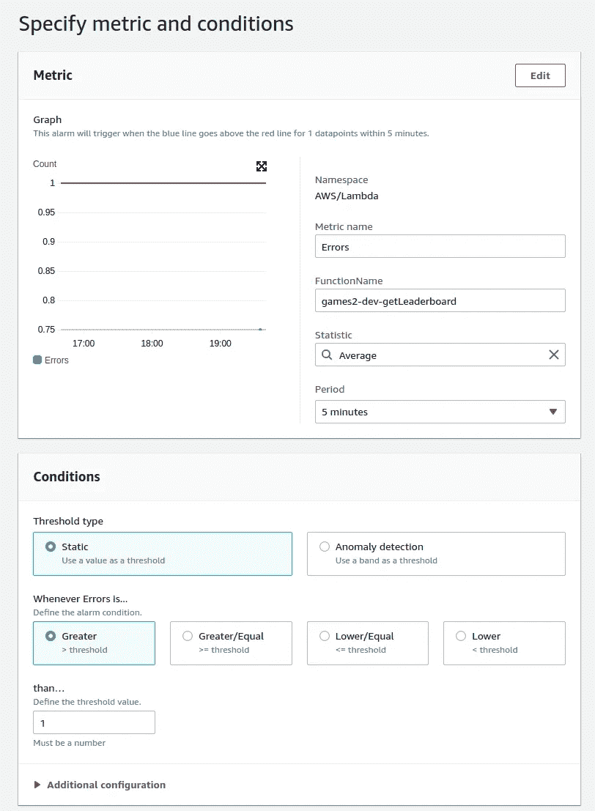
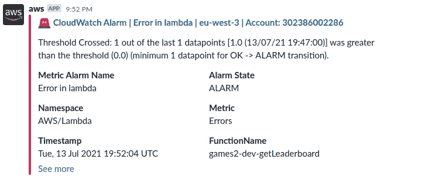
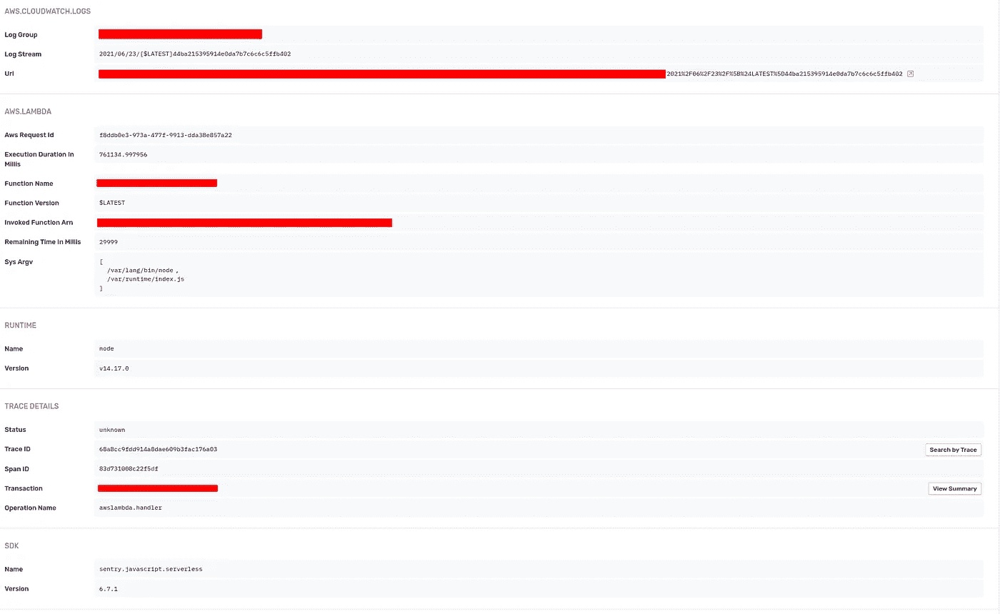

# AWS Lambda 中的错误监控

> 原文：<https://betterprogramming.pub/error-monitoring-in-aws-lambda-5e16d75f1fcc>

## 记录、监控和报告意外的 Lambda 错误


大卫·普帕扎在 [Unsplash](https://unsplash.com?utm_source=medium&utm_medium=referral) 上的照片

亚马逊 Lambda 曾经是 AWS 生态系统中的起步产品。它开创了无服务器趋势，并永远改变了后端基础架构。推出七年后，它已经成为 AWS 服务的基石。它在它们的互操作性中起着关键作用。

AWS Lambda 还有其他一些特性，使它成为一个不可或缺的工具:

*   量入为出，这意味着在不使用时节省成本
*   完全由事件驱动
*   支持多种语言
*   可攀登的

另一方面，它非常容易使用，以至于开发人员往往会忘记应用一些最佳实践:

*   它需要用单元测试进行适当的测试。
*   它需要成为 CI 工作流的一部分，以保持您的系统同步。
*   需要对其进行监控，并提供错误报告以确保稳定性。

在本文中，我将关注 Lambda 的错误和监控方面，以及如何在 Slack 中获得实时通知。

我们如何确定我们的 Lambda 运行正常、健康、没有错误？AWS 提供任何内置的解决方案吗？在 AWS 世界之外还有什么其他选择？

✍The 文章中的例子将使用 Javascript，但适用于 Lamdba 支持的任何语言和使用的第三方工具。

# 使用亚马逊的基础设施

我们可以从检查 AWS 提供了什么开始。

让我们看看 Amazon 在其文档中是如何监控和跟踪 Lambda 函数中的错误的:

> “为了帮助你处理 Lambda 应用中的错误，Lambda 集成了亚马逊 CloudWatch 和 AWS X-Ray 等服务。您可以使用日志、指标、警报和跟踪的组合来快速检测和识别您的功能代码、API 或支持您应用的其他资源中的问题”“【docs.aws.amazon.com】T4

让我们继续使用这些服务来实时监控我们的 Lambda 函数。当出现任何问题时，我们希望在 Slack 中得到错误通知。以下是我们需要遵循的步骤:

*   配置 AWS X 射线服务。
*   配置一些 CloudWatch 警报。
*   配置 AWS 聊天机器人服务。

下面是我们将要配置的图表:



作者创建的图表

## 1.配置 AWS X 射线

x 射线是监控服务运行状况的工具。一个很大的优势是 AWS X-Ray 有一个永久的免费层。然后，这是值得设置它有一个味道。

如何启用 AWS X 射线？通过以下步骤:

*   打开 Lambda 控制台上的[功能页面](https://console.aws.amazon.com/lambda/home#/functions)。
*   选择一个函数。
*   选择配置，然后选择监控工具。
*   选择编辑。
*   在 X 射线下，启用活动追踪。
*   点击保存。

如果您使用无服务器框架，您可以简单地在您的`yml`文件中的 Lambda 配置下设置`tracing: true`。

配置 X 射线后，您现在将对服务的健康状况有一个总体了解。你一眼就能看到大局。每个服务都有一个绿色/黄色。黄色表示某些东西没有按预期工作。

让我们来看一个 X 射线服务地图的示例:



作者提供的 AWS X 射线服务地图的屏幕截图

正如我们在上面的图片中看到的，Lambda 函数之一没有按预期执行。

AWS 会主动发送故障通知吗？不是默认的。它不知道使用什么标准。我们需要对此进行配置。怎么才能做到呢？为此我们需要使用 CloudWatch 警报。

## 2.添加 CloudWatch 警报

在深入探讨之前，让我们回顾一下什么是 CloudWatch:

> “Amazon CloudWatch 是一项监控和管理服务，为 AWS、混合和内部应用程序和基础架构资源提供数据和可操作的见解。借助 CloudWatch，您可以从单一平台以日志和指标的形式收集和访问所有性能和运营数据。”— [亚马逊云手表功能](https://aws.amazon.com/cloudwatch/features/#:~:text=Amazon%20CloudWatch%20is%20a%20monitoring,metrics%20from%20a%20single%20platform)

CloudWatch 警报是 CloudWatch 服务的一项功能。他们会在 CloudWatch 上监控一些指标。警报将根据用户定义的阈值触发。

让我们配置一个简单的指标来警告 Lambda 函数发生的任何错误。我们需要做的是:

*   转到 CloudWatch。
*   点击报警>报警中
*   点击“创建警报”
*   在下面填写警报的详细信息。



CloudWatch 警报指标和条件配置

CloudWatch alarms 将为您提供两个触发警报的渠道:

*   通过电子邮件
*   使用主题

由于我们想要一些实时通知，我们将需要配置一个主题。您可以创建或使用现有主题将警报转储到其中。题目是为了什么？它将成为与其他服务进行沟通的渠道。对于这个场景，我们将把它连接到 AWS 聊天机器人。

## 3.设置 AWS 聊天机器人

AWS Chatbot 是 AWS 的 Slack 集成。它的配置很简单。你需要做的就是:

*   将 AWS 聊天机器人绑定到您想要的 Slack 工作区。
*   点击配置新频道。
*   选择 AWS 聊天机器人将转储消息的空闲通道。
*   从主题列表中选择先前创建的主题。

该过程完成并触发 CloudWatch 警报后，您将在 Slack 中实时收到通知。



## 关于自动气象站建设的思考

AWS 聊天机器人可以做比显示错误更多的事情。你可以在[文档](https://aws.amazon.com/chatbot/)中查看它的特性。

现在我们只使用 AWS 基础设施配置了一切，我们满意了吗？算是吧。监控是直观和有用的，但另一方面，错误跟踪可能会更好。

错误堆栈缺少一些上下文。大多数时候，您仍然会发现自己在挖掘 CloudWatch 日志。即使这些也可能不够。您可能会插入一些`console.log`语句来提供关于问题的附加信息。

没有更好的办法吗？我们可以使用另一种工具来获得更好的堆栈跟踪吗？

# 使用专用的错误报告工具

错误报告工具在 web 应用程序中很常见。这些年来他们有了很大的进步。他们的用户界面变得更加友好，错误信息也更加完整。

这和这个有什么关系？他们中的大多数都有专门的 Lambda 集成。在本文中，我将关注 [Sentry 的 Lambda 集成](https://docs.sentry.io/platforms/node/guides/aws-lambda/)。然而，其他工具，如[滚动条](https://docs.rollbar.com/docs/aws-lambda)，也有类似的 API。

先从安装开始吧。Sentry 有自己的包含 Lambda 集成的包。

```
yarn add @sentry/serverless
```

安装后，只需在 Lambda 代码中使用集成即可:

Lambda 函数不能无限期运行。它们受到超时限制，很难微调。使用 Sentry，如果你发现你的 Lambda 函数超时，你可以得到提醒。

要捕获函数的超时，需要在配置中设置`captureTimeoutWarning`标志:

我们已经看到了如何配置 Sentry 来捕获意外错误。如果您想要手动捕获一个异常，该怎么办？你可以用`captureException`来表示:

我们已经看到配置 Sentry 的错误报告是多么容易。我们如何将其与 Slack 整合？很容易，因为 Sentry 有自己的 Slack bot。

*   将 Slack 集成添加到 Sentry。
*   转到提醒。
*   选择任何项目。
*   创建新的通知。
*   选择要显示警报的松弛通道。

就这样，一切都准备好了。我们现在将使用 Sentry 在我们的 Slack 频道上接收错误通知。

Sentry 会给我们的错误跟踪增加什么样的上下文？它包括哪些数据？以下数据将始终是错误报告的一部分:

*   功能详情
*   `sys.argv`为功能
*   指向云观察日志的链接
*   AWS 请求 ID
*   功能执行时间
*   功能版本



从所有与 AWS 相关的信息中捕获哨兵错误

有了所有这些额外的信息和更好的堆栈跟踪，识别异常的根源就更容易了。

# 结论

谈到错误报告，我们已经看到并比较了这两种方法。AWS 工具擅长监控，而 Sentry 擅长错误报告。

混合方法将是完美的解决方案。您可以使用 X-Ray 来监控服务的状态，使用 Sentry 来监控错误。

Sentry 特别擅长收集所有相关信息，并以简单明了的格式呈现出来。AWS 没有很好地给出错误执行的上下文。偶尔你可能需要日志，这就是为什么 Sentry 包含了 CloudWatch 日志的确切路径。

在 Lambda 中添加错误报告是至关重要的，即使它是一个微小而琐碎的函数。它可能看起来不值得——直到你开始面对生产中的一些错误，并且你不明白哪里出错了。

积极主动总是明智之举。

干杯。

# 有关系的

[](/7-tips-to-write-efficient-and-performant-javascript-code-bccbdb9662ae) [## 编写高效高性能 JavaScript 代码的 7 个技巧

### 提升您的 JavaScript 应用程序的性能

better 编程. pub](/7-tips-to-write-efficient-and-performant-javascript-code-bccbdb9662ae) [](/7-habits-of-productive-developers-bce60d880907) [## 高效开发人员的 7 个习惯

### 建立正确的习惯来保持每天的工作效率

better 编程. pub](/7-habits-of-productive-developers-bce60d880907)