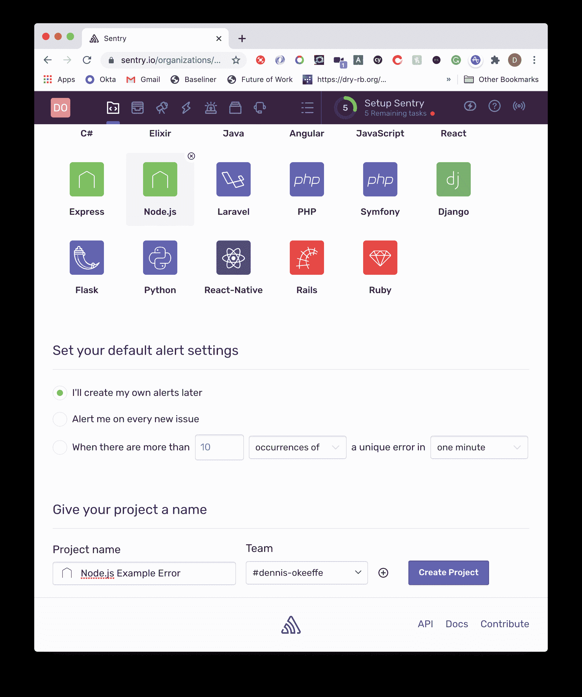
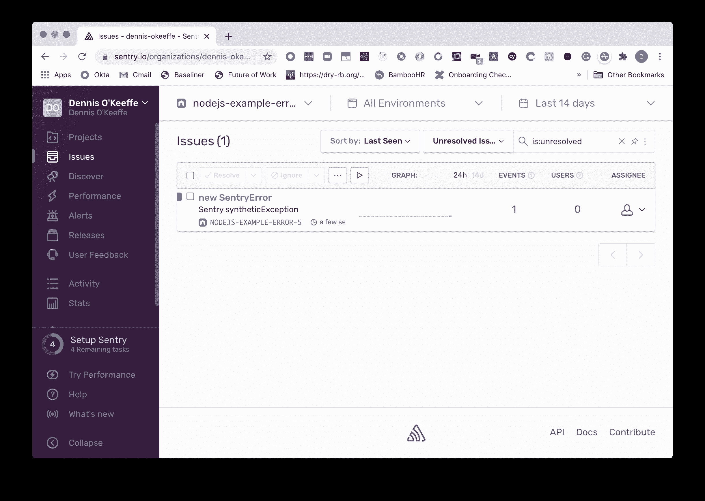
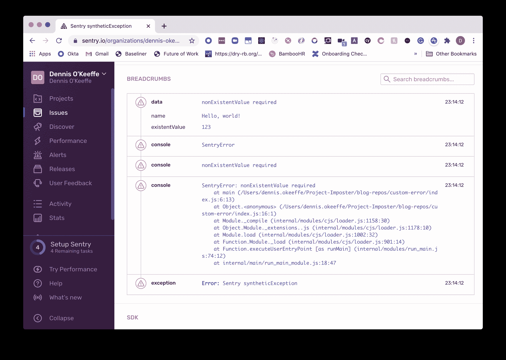
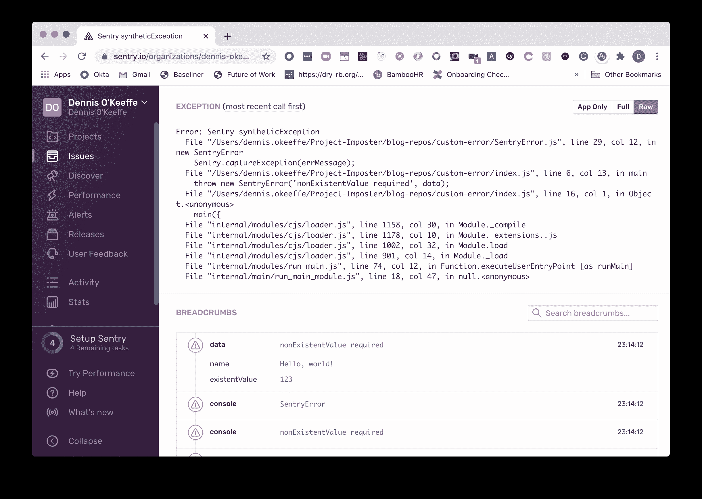
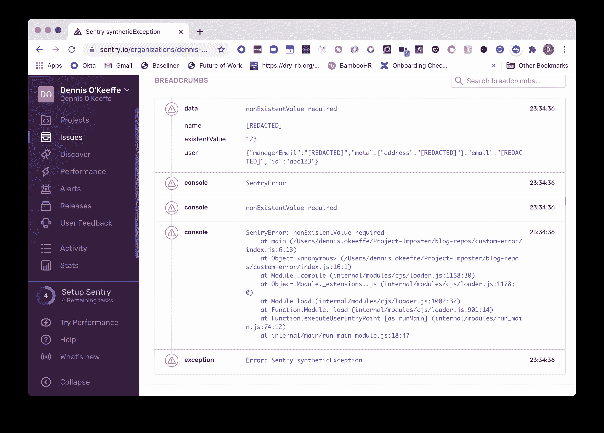

# 使用 ES6 类和哨兵进行错误跟踪

> 原文：<https://betterprogramming.pub/error-tracing-with-es6-classes-and-sentry-116b3c95946b>

## Node.js 中更好的日志记录

*原图鸣谢:* [*阿里·萨阿达*](https://unsplash.com/@camsaadat) 上 [Unsplash](https://unsplash.com/@camsaadat?utm_source=unsplash&utm_medium=referral&utm_content=creditCopyText)

在今天的教程中，我们将关注一个用 ES6 类扩展`Error`原型的实际应用，以及我们如何使用它进行有效的错误跟踪。

没时间？查看[完成的示例](https://github.com/okeeffed/custom-sentry-error)。

本教程期望你已经建立了一个 [Sentry](https://sentry.io/) 账户，并且在一定程度上能够自给自足地启动你的项目。

它还希望您运行的是支持 ES6 类的[节点](https://nodejs.org/en/)版本。我正在这个项目中运行`12.16.1`。

# 开始

让我们建立一个新的节点项目并安装一些 dep。

我们将使用 [dotenv](https://github.com/motdotla/dotenv) 隐藏我们的哨兵端点。

## 。gitignore

把我们不希望存储在 Git 中的文件扔进去。

# 设置岗哨

虽然这不会进入细节，我们想在我们的哨兵帐户建立一个新的节点项目。

设置完成后，它会给你一个`dsn` URL，我们将把它添加到我们的`.env`文件中:

我们现在准备设置我们的自定义错误。

# SentryError.js

在`Sentry.js`中增加以下内容:

在代码中，我们执行以下操作:

1.  要求`dotenv`将我们的`.env`文件读入`process.env`
2.  初始化岗哨
3.  创建一个*扩展* `Error`的类。用外行人的 JavaScript 术语来说，*扩展了*意味着我们的新`SentryError`从`Error`原型扩展而来。我们可以使用构造函数初始化我们从`Error`继承的所有属性。
4.  用`constructor`初始化一个新实例

每当我们为一个新的`SentryError`实例调用`new SentryError()`时，`constructor`本身就是一个被调用的方法。

我们告诉它，我们接受一个错误消息(类似于`new Error('error message')`)、数据(我们将使用它来设置 breadcrumbs 以帮助我们调试)，以及我们在构造函数中使用的 bread crumbs 类型(默认为`error`)。

我们在构造函数中做的第一件事是调用`super(errMessage)`，这是我们调用到`Error`原型的链。这将在这个对象上设置我们期望从`Error`获得的属性，比如`name`、`message`和`stack`(我们将在后面看到)。

之后，我们实际上是设置一个面包屑，并告诉 Sentry 捕获一个异常。你可以在[哨兵文档](https://docs.sentry.io/error-reporting/capturing/)中读到更多关于这些的内容，但是 TL；博士认为这些电话会填充我们哨兵上的遥测数据。

就凭这一点，我们已经准备好了。

# 测试我们的新“错误”

在`index.js`中，添加以下内容:

在这里，我们只是做以下事情:

1.  我们需要我们的新`Error`。
2.  我们有一个`main`函数，如果`data.nonExistentValue`不存在(它不会存在),它就抛出新的`SentryError`。
3.  最后，我们用将要分配给`data`的信息对象来调用`main`。

运行下面的代码会得到这个结果:

从`catch`块中，您可以看到我们的新错误可以访问`name`、`message`和`stack`属性，我们在上面提到过这种情况，这要感谢在我们的类中使用 call `super(errMessage)`来继承`Error`原型的属性。

如果我们前往岗哨，我们可以看到我们的错误已被记录。

如果我们看看基本设置，我们可以看到我们的面包屑记录在`data`下，控制台日志也被跟踪(这是可配置的)。

那些日志来自我们的`catch`街区。如果我们从“仅应用程序”更改为“原始”，您可以看到我们的堆栈跟踪也显示在异常中:

# 如何处理敏感信息

作为一家公司，我们不希望客户的个人身份数据与第三方共享。

这些工具是我们帮助调试和追溯用户旅程以改进产品的一种方式，用户相信我们不会分享这些信息。

有几种方法可以保护我们自己，但我今天要举的一个例子是我们如何实现自己的“拒绝”或“阻止”列表。

让我们对我们的`SentryError.js`和`index.js`文件做一些小的更新。

对于`index.js`，让我们更新传入`main`的信息，以包括一些虚拟用户数据(和我的公共电子邮件):

假设我们不希望共享姓名、用户电子邮件、用户的经理电子邮件或他们的地址，但是我们希望保留 ID 以解决调试问题。我们可以在我们的类中添加一个助手方法，并设置一个`denyList`，我们可以在这个方法中使用它来递归地改变我们的面包屑数据。

为什么把`denyList`放在课外？没有特别的原因，但是我发现如果这是抽象的，那么编写单元正则表达式测试会更容易，并且它可以用于您可能想要设置的其他第三方阻止列表。如果可以在其他地方重用，也可以出于同样的原因将其从类中删除。

更新`SentryError.js`:

`redactSensitiveInformation`使用递归的力量。我们基本上希望它递归地检查一个对象，以编辑匹配正则表达式的信息。

这意味着:

…将根据我们当前的拒绝列表修订为以下内容:

`denyList.some`遍历我们的正则表达式数组，如果任何正则表达式匹配，它将返回“true”这有助于我们从列表中确定要修订的数据。

让我们再次运行`node index.js`并在 Sentry 中确认这一点。

胜利！

# 结论

今天，我们使用 ES6 类来扩展 error。如果有人想知道为什么你会这样做，而不是仅仅扩展原型，我的回答是这主要是偏好。

在这种情况下，我发现类可读性更好，并提供了更好的开发体验，但是注意，如果在 web 上这样做，将文件传输回 ES5 是有成本的。

今天，我们提出了黑名单的想法。如果你想要一个更强的替代方案，那么就采用允许列表的想法，在允许列表中，一个属性必须被允许才能出现在岗哨上。

# 资源和进一步阅读

1.  [完成示例](https://github.com/okeeffed/custom-sentry-error)
2.  [哨兵](https://sentry.io/)
3.  [哨兵—捕获事件](https://docs.sentry.io/error-reporting/capturing/)
4.  [哨兵——面包屑](https://docs.sentry.io/enriching-error-data/breadcrumbs/)
5.  [JavaScript 中的 Super 和 Extends—Medium](https://medium.com/beginners-guide-to-mobile-web-development/super-and-extends-in-javascript-es6-understanding-the-tough-parts-6120372d3420)