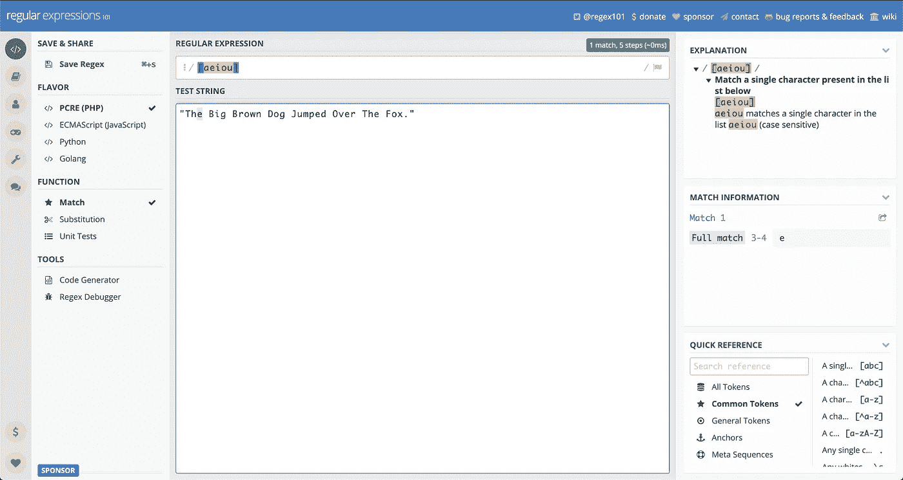
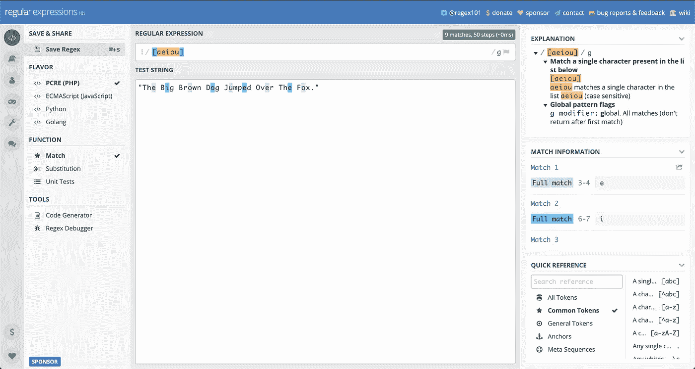
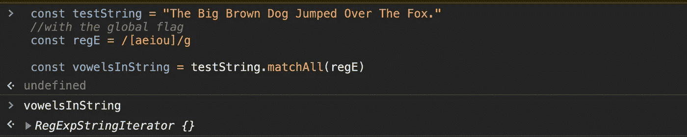
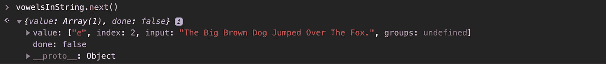
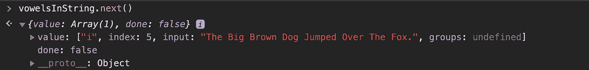
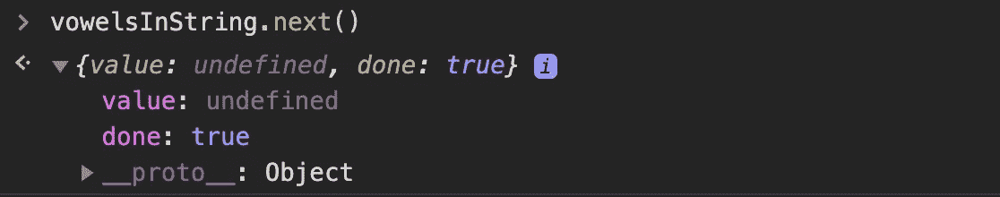
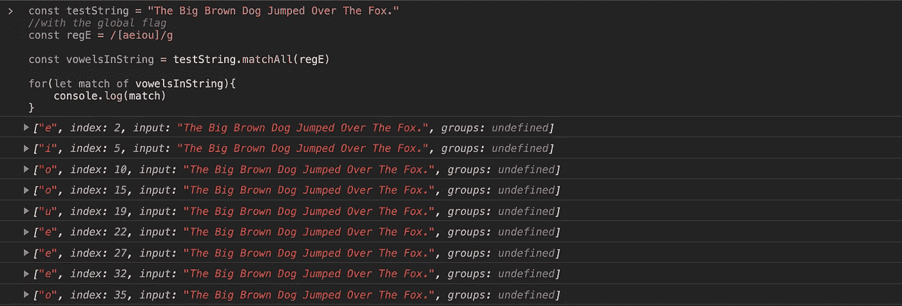
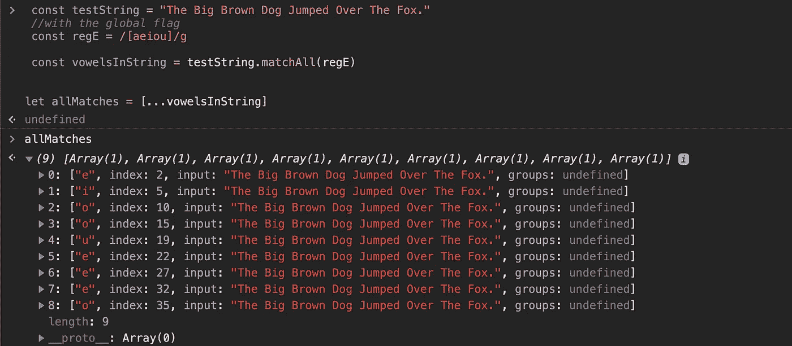

# JavaScript ES 2020 提示。matchAll()方法

> 原文：<https://betterprogramming.pub/es-2020-tips-matchall-method-f0513e335315>

## matchAll 是如何比较和对比的匹配


[杰米街](https://unsplash.com/@jamie452?utm_source=unsplash&utm_medium=referral&utm_content=creditCopyText)在 [Unsplash](https://unsplash.com/s/photos/matches?utm_source=unsplash&utm_medium=referral&utm_content=creditCopyText) 上拍照。

当我从我的正则表达式系列，中休息的时候，我想写一篇仍然与正则表达式有关的文章。我最近学习了`.matchAll()` 法，直到上周我才开始使用。

我在本文[中提到过](https://medium.com/swlh/regex-series-what-is-regex-926ea8284cd9)如何匹配一个模式，并使用`.match()`方法将其提取到一个数组中。你会发现`.matchAll()`和`.match()`的工作方式相似，只是略有不同。

# 。匹配()

`[.match()](https://developer.mozilla.org/en-US/docs/Web/JavaScript/Reference/Global_Objects/String/match)` [方法](https://developer.mozilla.org/en-US/docs/Web/JavaScript/Reference/Global_Objects/String/match)采用一个参数:`RegExp`。

您将使用`.match()`作为您正在测试的字符串值的属性，在括号内，您将放置您的`RegExp`模式。返回值将是所有匹配的数组或空数组。返回的数组将依赖于`g`(或全局)标志，该标志返回您想要匹配的模式的所有出现。



如您所见，它返回一个数组，第一个索引是它匹配的元音字母。有趣的是，数组中的下一个索引读起来像一个对象。第二个索引包含一个`index`属性，其值是字符串中匹配出现位置的索引。接下来，`input`属性包含原始字符串的值和属于捕获组的`groups`属性。它只匹配第一个事件，因为我们没有使用全局标志。

## 带着全球国旗



它返回一个数组，字符串中的所有元音字母都匹配到该数组中。

# 。matchAll()

对于`.matchAll()`，它*不会*创建一个提取了所有匹配的数组，而是创建一个迭代器。它需要一个参数:`RegExp`。

根据 [MDN web 文档](https://developer.mozilla.org/en-US/docs/Web/JavaScript/Reference/Global_Objects/String/matchAll),`RegExp`必须有`/g`标志。否则，会抛出一个`TypeError`。

为了更好地理解`.matchAll()`方法，让我们尝试使用它。

我将把上面的例子粘贴到控制台中，但是变量`vowelsInString`中有`.matchAll()`:



当我们检查变量`vowelsInString`时，我们得到一个`RegExpStringIterator`。

那是什么意思？

要查看迭代器，我们可以循环遍历它或者使用`.next()`方法。我会告诉你两种方法。

如果我们使用`.next()`:



我们得到第一个匹配，它以一个对象的形式存在，有两个键值对。它有一个值为数组的`value`键和一个值为`false`的`done`键。

在`value`键的数组中，我们有实际的匹配及其所有信息。第一个索引是我们在正则表达式中寻找的元音。这个数组中的下一个索引读起来像一个对象。它包含原始字符串中匹配位置的索引值。接下来是输入属性和输入字符串本身的值。最后，最后一个索引是`groups`属性，它查看捕获组是否在我们的正则表达式中。

对象的第二个`done`键意味着这个正则表达式有额外的匹配。换句话说，这个迭代器还没有完成。到最后会变成`true`。让我们继续我们的迭代:



这是最终版本的样子:



如您所见，我们的`value`是未定义的，并且`done`属性现在是`true`。

现在我将向您展示它是如何与`for…of`循环一起工作的:



为了将它转换成一个完整的数组，MDN 建议使用`spread`操作符。为此，我们只需写下:

```
let allMatches = […vowelsInString]
```



现在有一个包含所有匹配及其相应信息的数组。

# 结论

我希望这是一个关于使用`.matchAll()`和`.match()`的有用教程。如果您仍然对这两种方法感到好奇，我建议您阅读 MDN 的文档:

*   `[.matchAll](https://developer.mozilla.org/en-US/docs/Web/JavaScript/Reference/Global_Objects/String/matchAll)`
*   `[.match](https://developer.mozilla.org/en-US/docs/Web/JavaScript/Reference/Global_Objects/String/match)`