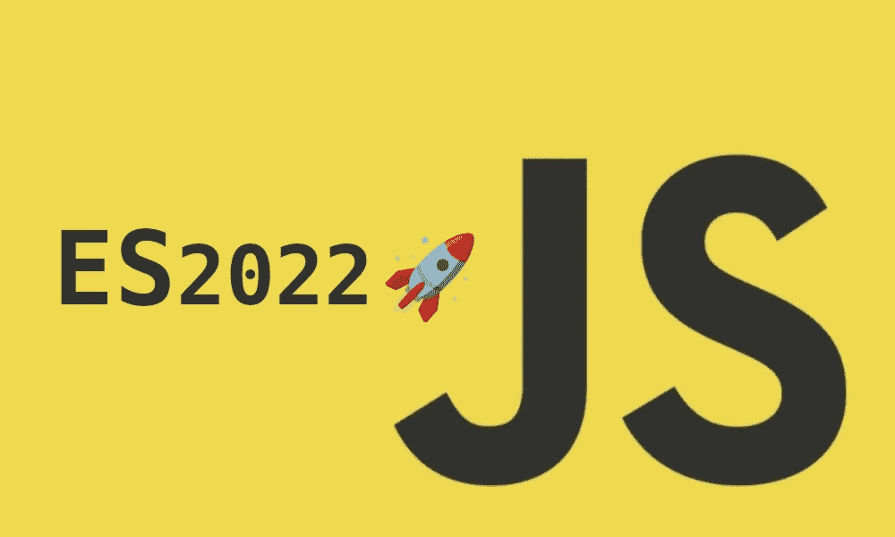

# ES2022 有什么新功能？4 个最新的 JavaScript 特性

> 原文：<https://betterprogramming.pub/es2022-features-javascript-a9f8f5dcba5a>

## 新 ES13 规格概述

图片由作者提供。

新的 ES13 规格终于发布了。规格？JavaScript 确实不是开源语言。这是一种遵循 ECMAScript 标准规范编写的语言。TC39 委员会负责讨论和批准新特性。他们是谁？

> *“ECMA International 的 TC39 是一个由 JavaScript 开发人员、实现人员、学者等组成的团体，他们与社区合作来维护和发展 JavaScript 的定义。”—*[*tc39 . es*](https://tc39.es/)

他们的释放过程由五个阶段组成。自 2015 年以来，他们一直在进行年度发布。它们通常发生在春天。

有两种方法可以引用任何 ECMAScript 版本:

*   按年份:这个新版本将是 ES2022。
*   根据它的迭代编号:这个新版本将是第 13 次迭代，所以它可以被称为 ES13。

那么这个版本中有什么新内容呢？哪些功能可以让我们感到兴奋？

# 正则表达式匹配索引

目前，在 JavaScript 中使用 JavaScript Regex API 时，只返回匹配的`start index`。但是，对于一些特殊的高级场景，这还不够。

作为这些规格的一部分，添加了一个特殊的标志`d`。通过使用它，regex API 将返回一个二维数组作为名为`indices`的键。它包含每场比赛的`start`和`end`指数。如果在正则表达式中捕获了任何命名的组，它将在`indices.groups`对象中返回它们的开始/结束索引。命名的组名将是它的关键字。

见原提案[此处](https://github.com/tc39/proposal-regexp-match-indices)。

# 顶级`await`

在这个提议之前，不接受有`top level awaits`。有一些变通办法来模拟这种行为，但都有其缺点。

顶级的 await 特性让我们依靠模块来处理这些承诺。这是一个可以使用的直观特性。但是，请注意，这可能会改变模块的执行顺序。如果一个模块依赖于另一个具有顶级 await 调用的模块，那么该模块的执行将被暂停，直到承诺被履行。

让我们看一个例子:

在上面的例子中，引擎将在执行`usage.js`模块上的代码之前等待`users`完成。

总之，这是一个很好的直观特性，需要小心使用。我们不想滥用它。

此处见原提案[。](https://github.com/tc39/proposal-top-level-await)

# 。在()

长期以来，人们一直要求 JavaScript 提供一个类似于`Python`的数组负索引访问器。而不是简单地做`array[array.length-1]`去做`array[-1]`。这是不可能的，因为 JavaScript 中的对象也使用了`[]`符号。

被接受的建议采取了更实际的方法。`Array`对象现在将拥有一个模仿上述行为的方法`at`。

见原提案[此处](https://github.com/tc39/proposal-relative-indexing-method)。

Btw，现在我们在讨论数组，你知道你可以解构数组位置吗？👌

# 可访问的`Object.prototype.hasOwnProperty`

以下只是一个很好的简化。已经有了`hasOwnProperty`。然而，它需要在我们想要执行的查找的实例中被调用。因此，许多开发人员最终都会这样做:

有了这些新的规范，一个`hasOwn`方法被添加到了`Object`原型中。现在，我们可以简单地做:

见原提案[此处](https://github.com/tc39/proposal-accessible-object-hasownproperty)。

# 错误原因

错误帮助我们识别应用程序的意外行为并做出反应。然而，理解深层嵌套错误的根本原因甚至正确处理它们会变得具有挑战性。在捕获和重新抛出它们时，我们会丢失堆栈跟踪信息。

在如何处理这个问题上没有明确的一致意见。对于任何错误处理，我们至少有 3 种选择:

作为这些新规范的一部分，我们可以构造一个新的错误，并保留被捕获错误的引用。怎么会？只需将对象`{cause: err}`传递给`Error`构造函数。

这一切变得更加简单、标准，并且易于理解深层嵌套的错误。让我们看一个例子:

你可以在这里找到更多关于提案的信息。

# 类别字段

在这个版本之前，没有合适的方法来创建私有字段。有一些方法可以绕过提升，但这不是一个合适的私人领域。现在很简单了。我们只需要在变量声明前添加`#`字符。

拥有私有字段意味着我们有一个强大的封装边界。不可能从外部访问类变量。这表明`class`关键字不再仅仅是糖语法。

我们还可以创建私有方法:

该功能与我们将在下面看到的`Class Static Block`和`Ergonomic checks for Private Classes`相关。

你可以在这里找到关于提案[的更多信息。](https://github.com/tc39/proposal-class-fields)

# 类静态块

作为新规格的一部分，我们现在可以在任何`Class`中包含`static blocks`。它们将只运行一次，是修饰或执行类的静态端的某些按字段初始化的好方法。

我们不局限于使用一个块，我们需要多少就有多少。

他们有丰厚的奖金。他们有特权进入`private fields`。你可以用它们来做一些有趣的图案。

如果我们试图从实例对象的外部访问私有变量，我们将得到`Cannot read private member #privateField from an object whose class did not declare it`。

你可以在这里找到关于提案[的更多信息。](https://github.com/tc39/proposal-class-static-block)

# 针对私人领域的人体工程学品牌检查

新的`private`字段是一个很棒的特性。然而，在某些`static`方法中检查一个字段是否是`private`可能会变得很方便。

试图在类范围之外调用这个`in`会导致我们之前看到的同样的错误。

你可以在这里找到更多关于提案的信息。

# 最后的想法

这是一个有趣的版本，提供了许多小而有用的特性，如`at`、`private fields`和`error cause`。当然`error cause`会给我们日常的 bug 跟踪任务带来很多清晰性。

一些高级功能，如`top-level await`，需要在使用前充分理解。它们可能会在您代码执行中产生不必要的副作用

我希望这篇文章能让你像我一样对新的 ES2022 规格感到兴奋。