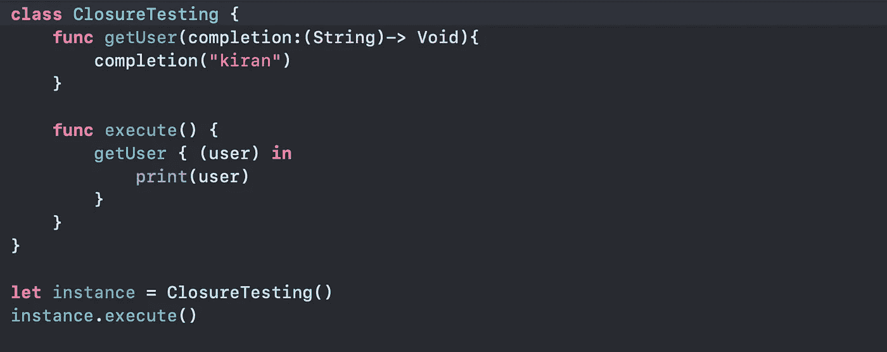
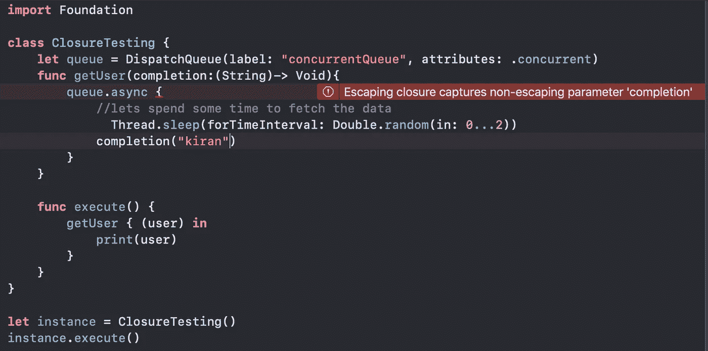
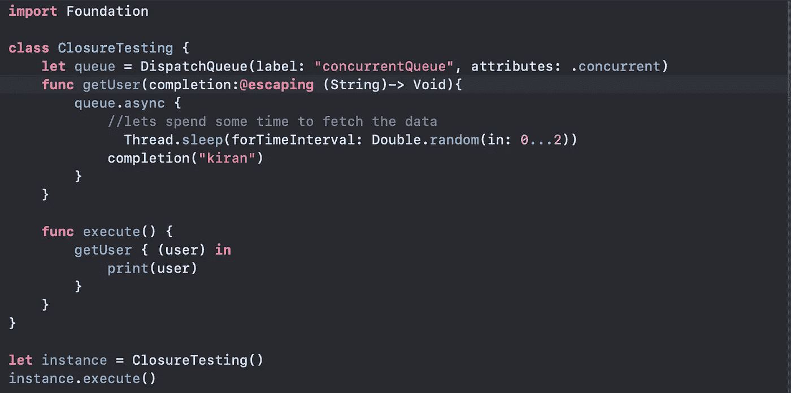
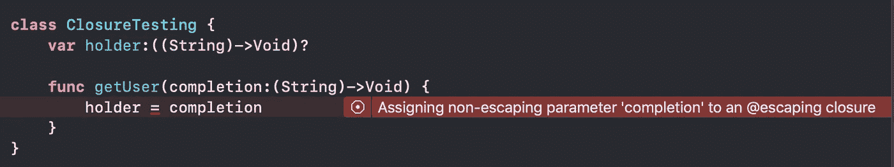
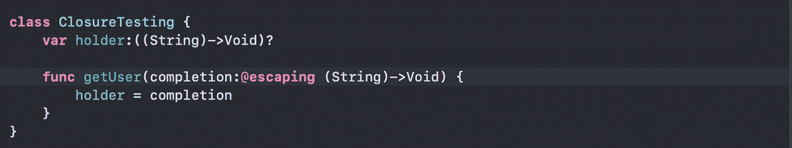
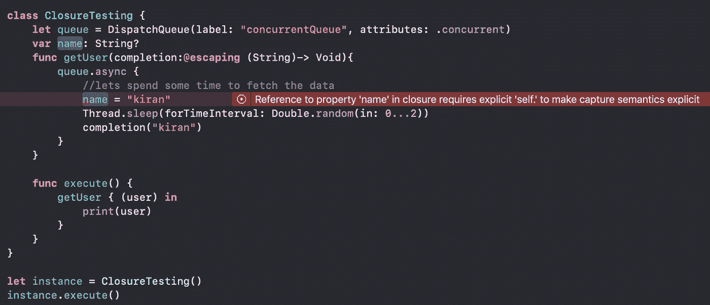
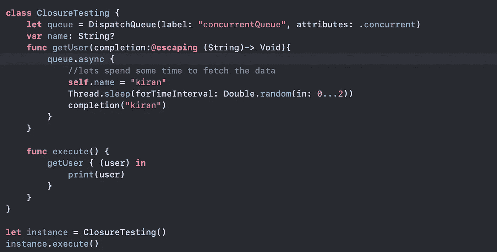

# Swift 中的转义和非转义闭包

> 原文：<https://betterprogramming.pub/escaping-and-non-escaping-closures-in-swift-fe2866309599>

## 有什么区别？

照片由 Y [uiizaa](https://unsplash.com/@yuiizaa) 在 [Unsplash](https://unsplash.com/?utm_source=medium&utm_medium=referral) 上拍摄

闭包是 iOS 开发的基石。任何在 Swift 中编写过异步网络获取请求的人一定都使用过用`@escaping`表示的转义闭包，但是我们为什么要使用它呢？它是做什么的？如果不用会怎么样？这个就详细说一下吧。

# 什么是转义闭包？

这就是 [Swift 文档](https://docs.swift.org/swift-book/LanguageGuide/Closures.html)所述:

> 当闭包作为参数传递给函数，但在函数返回后被调用时，闭包被称为对函数进行转义

为了成为一个转义闭包，闭包传递给的函数必须在闭包执行之前返回。

好的，听起来不错。这什么时候会发生？如果我们能发现这一点，我们就能明白为什么需要逃避。我们开始挖吧。

在我们深入探讨之前，让我解释一下闭包是如何工作的，以使我们的基础知识变得清晰。看看下面的代码。

类`ClosureTesting`有一个函数`getUser`。`getUser`接受一个参数`completion`，它是一个闭包，接受一个`String`并返回`Void`。在`getUser`函数中，我们只是执行传入的闭包。

然后我们有了`execute`函数，它用闭包调用`getUser`函数，闭包打印传递给闭包的字符串。

我们来看看执行的流程。我们在`ClosureTesting`类实例上调用`execute`函数。`execute`函数将依次调用带有闭包的`getUser`函数。`getUser`函数通过调用`completion("kiran")`和执行闭包，一旦闭包执行完成，函数返回。

这是一个非转义闭包，因为函数`getUser`在闭包执行后返回。我们怎样才能让它逃脱？函数返回后，一段代码如何执行？想一想…

# 1.多线程

实现它的一种方法是多线程。我们可以使用并发队列，让闭包在不同的线程上执行。这样，执行函数的线程将闭包的执行委托给另一个线程，函数返回。(如果你想刷新一下你的并发和线程知识，看看这篇[文章](https://medium.com/better-programming/queues-and-concurrency-in-ios-for-dummies-4089da2365f8)。)

让我们修改上面的代码来使用多线程。

我们创建了一个名为`queue`的新并发队列，并使用该队列异步执行闭包。这样，函数在执行闭包之前返回。上面的例子是我们应用程序中一个典型的网络呼叫场景。我们进行异步调用从服务器获取用户，一旦收到响应，我们就执行完成闭包。编译器在这里抛出一个错误。上面写着`escaping closure captures non-escaping parameter 'completion`。这是什么意思？

让我们问一下 Swift 文档。

> 当你声明一个将闭包作为其参数之一的函数时，你可以在参数的类型前写`*@escaping*`来表示闭包是允许转义的

它说为了转义闭包，参数前面必须有`@escaping` 。在我们的例子中，由于我们没有提供它，闭包将无法转义，我们会得到一个编译错误。让我们修理它。

太好了！这是固定的，现在我们的闭包可以从函数中逸出，以后再运行。

# 2.在函数外存储闭包

如果在函数外部存储闭包会发生什么？这个闭包可以在应用生命周期的任何时候运行。本质上，闭包是从函数范围中逸出的。看看下面的例子。

这里我们将闭包存储在变量`holder`中，稍后我们可以使用它并执行闭包。所以我们必须设置闭包参数`@escaping`来消除编译器错误。

# 大局

在内部，上述两种逃避闭包的方法是相同的。让我借助我们上面写的代码来解释一下。

在这种情况下，正在转义的闭包就是闭包`queue.asyc{}`。通常，闭包会捕获它需要的常量和变量，并可以从其主体内部修改这些常量和变量的值，即使定义常量和变量的原始作用域已经不存在。在这种情况下，它试图捕获`completion`，这是一个非转义参数。*非转义参数*表示该参数不能存在于函数范围之外。为了让闭包`queue.asyc{}`逸出，我们应该让完成参数可逸出。这是我们在添加`@escaping` 的时候做的，这样它就可以离开函数了。

同样的事情也发生在这里。如果您将闭包赋给一个范围外的变量，那么闭包本质上是转义的。我们必须添加`@escaping`，这样闭包才能离开函数范围。

# 摆脱封闭需要“自我”

用`@escaping`标记闭包意味着您必须在闭包内显式引用`self`。

既然我们的闭包不再是函数作用域的一部分，如果我们想要使用任何 class/struct 变量，我们必须使用`self`来引用它们。让我们看看如果我们不使用它会发生什么。

当我们试图从闭包内部引用类变量`name`时，我们会得到一个错误。为了解决它，我们必须使用显式`self`，如下所示。

`self`的使用是对引用(也称为*捕获*)闭包中的构造(类/结构/枚举)的显式确认，这意味着在所述闭包被释放之前`self`不会被释放。因此，当在闭包内使用`self`时，你应该非常小心，否则你会以保留循环结束。

# 结束注释

这就是我这篇文章的全部内容。关注我的推特了解更多更新。提供一些掌声，如果你喜欢这个职位，因为这将鼓励我写更多(你可以放弃多达 50)不要担心书生气。如果你认为我可以在文章中做些改进，请告诉我。