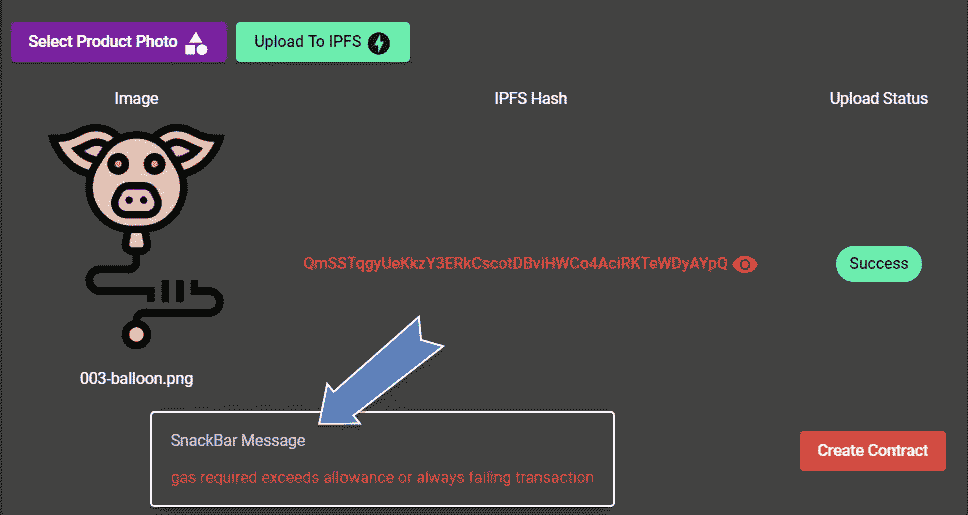
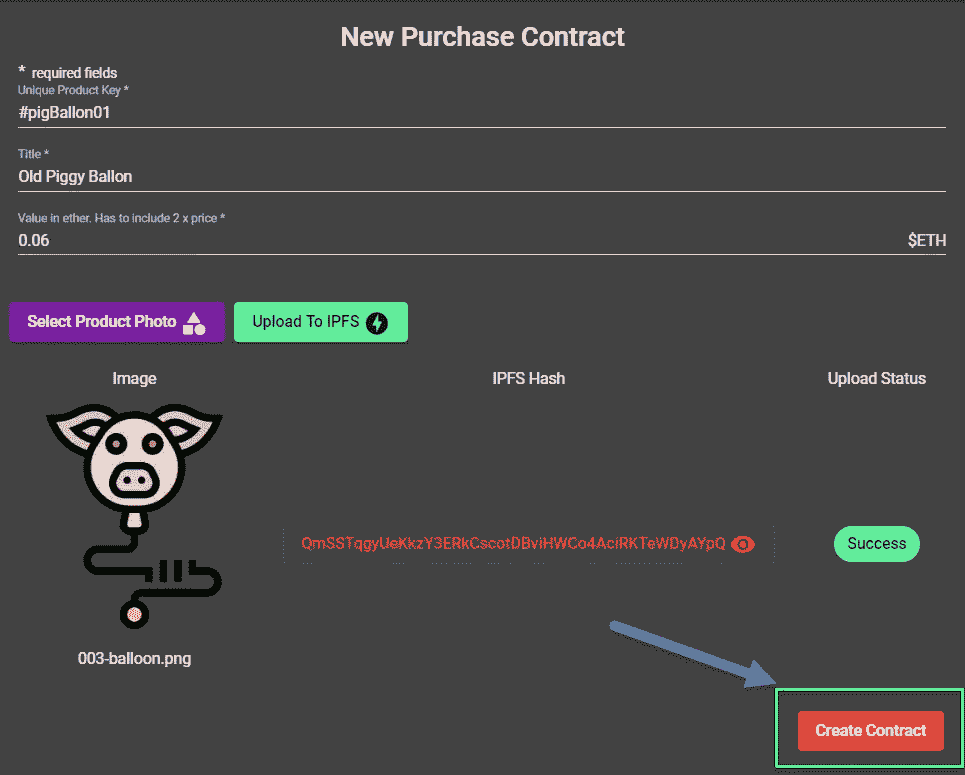
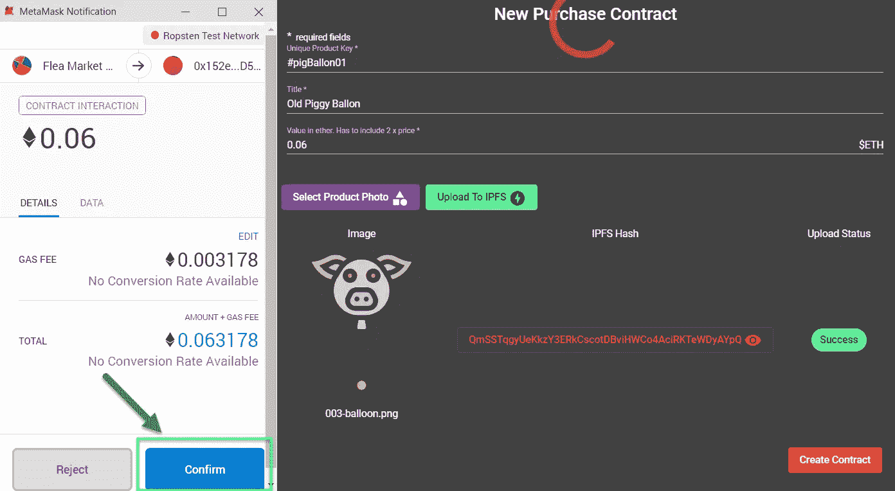
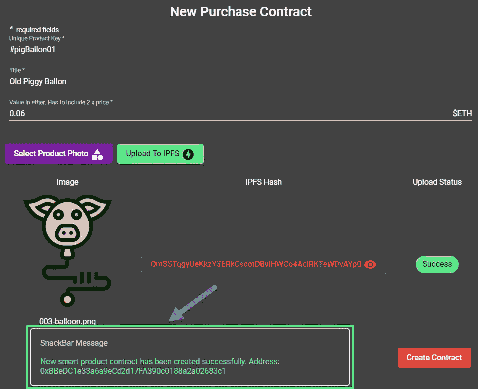
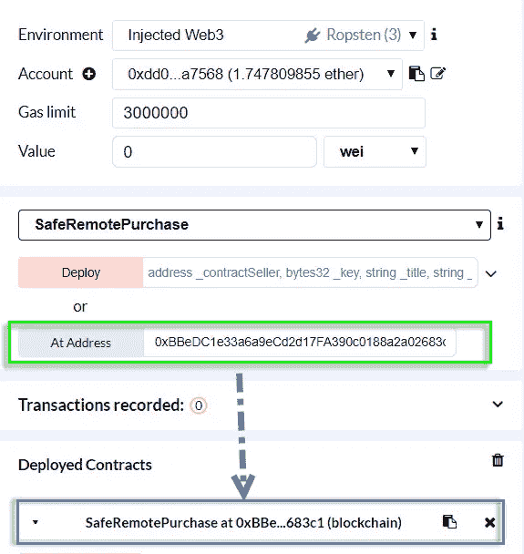

# 使用 Angular NgRx v8 使用 Ethers.js 创建采购合同

> 原文：<https://betterprogramming.pub/escrow-dapp-with-ethers-js-using-angular-ngrx-v8-creating-purchase-contract-b26228a22ca7>

## 本系列的第四部分展示了我们如何为 FleaMarket 托管智能合约构建 NgRx 驱动的 DApp


图片由来自 [Pixabay](https://pixabay.com/?utm_source=link-attribution&utm_medium=referral&utm_campaign=image&utm_content=4340432) 的[斯蒂芬·凯勒](https://pixabay.com/users/KELLEPICS-4893063/?utm_source=link-attribution&utm_medium=referral&utm_campaign=image&utm_content=4340432)拍摄

在之前的[文章](https://medium.com/better-programming/manage-the-ipfs-image-uploading-with-angular-ngrx-v8-61aaaf0be0d5)中，我们讨论了如何使用 **IPFS** 来存储卖家的产品图片。在这一部分中，我们将关注于通过利用 NgRx 实体状态适配器来创建购买合同实例。

# 享受物质小吃吧的乐趣

当我们处理 DApps 时，通常需要一段时间让事务从以太坊区块链的状态改变操作中返回。从用户体验的角度来看，我们应该对这些操作的结果给出一些可见的指示。在第一部分中，我们已经实现了加载和错误状态，这是 NgRx 全局存储的一部分。在这一节中，我们还将了解如何添加 snackbar 通知状态。

我们首先定义一个可以接收通知数据的自定义 snackbar 组件。

snackbar 状态是通过将以下操作分派给存储来管理的:

```
export const open = createAction('[SnackBar] Open', props<{ payload: SnackBarInterface }>());
```

此操作正由效果处理:

全局管理 snackbar 状态的直接好处是，我们可以从组件或直接从副作用触发 snackbar 通知。例如，在误差效应的情况下:

结果可能如下所示:



# **播种特征模块**

我们计划使用 NgRx 实体状态库 *@ngrx/entity* 来管理采购合同实体的集合。让我们将所有相关的功能打包到一个名为`P2pBazaarModule`的独立的延迟加载特性模块中。

# 构建智能合同服务

第一个服务负责与`FleaMarket` 智能契约的通信。首先定义可注入的契约令牌:

这里我们将已部署的`FleaMarket` 契约的地址存储在`environment`对象中。我们也在利用`ethers.js`图书馆的[人类可读 ABI](https://blog.ricmoo.com/human-readable-contract-abis-in-ethers-js-141902f4d917) 。我们只需指定将要使用的函数和事件签名。有了契约地址和 ABI 定义，我们就可以在`Ethereum` 区块链上识别我们的智能契约了。

既然我们有了可注入的契约令牌，我们就可以定义`FleaMarketContract` 服务了。

服务方法`createPurchaseContract`负责创建`SafeRemotePurchase` 智能合同中定义的`FleaMarket.sol` 智能合同实体。`ethers.js`的一个特性是，我们发送到一个节点的事务甚至在被挖掘之前就对我们可用了。在等待事务被挖掘时，我们可能会选择实现一些其他副作用，比如将一些事务细节存储在外部数据库中。一旦创建和挖掘了一个新的契约，我们应该收到事务收据，`txReceipt,`，其中包含了最后发出的事件，`logNewPurchaseContract(address contractAddress)`。我们可以使用这个事件对象来检索作为参数传递给它的契约地址值:`txEvent.args[‘contractAddress’]`。

另一方面，为了避免循环依赖警告，对于契约令牌和契约服务，我们将`providedIn`依赖注入指定给一个惰性伪模块`P2pBazaarAnchorModule` 而不是模块`P2pBazaarModule.`

# 定义实体状态

我们使用以下实体状态适配器管理购买合同实体的集合:

实体模型被定义为

```
export interface PurchaseWidgetModel {
  productKey: string;
  contractAddress: string;
}
```

我们还指定了实体的唯一标识符和默认的实体排序顺序。然后，我们将实体状态与购买合同功能状态联系起来:

# 在活动中创建新的采购合同

为了连接新的采购合同逻辑，我们需要将合同细节输入到 angular material reactive 表单中:



我们输入两倍价值的 ETH 数量，因为我们希望购买价格为 0.03 ETH。我们还选择了产品映像，并将其添加到 IPFS 文件系统中，并收到了相应的哈希代码。

一旦我们满足了反应式表单验证需求，标记为*"*Create Contract*"*的按钮将变为活动状态，我们可以触发 store 动作，该动作在其有效负载中携带反应式表单字段值。

```
export const createPurchaseContract = createAction('[PurchaseContract/API] Create Purchase Contract', props<{ payload: any }>());
```

动作被分派到商店效果`createProduct$`:

我们使用`exhaustMap`操作符来检索动作有效负载数据对象。使用这个映射操作符的优点是，当当前请求仍在进行时，它将忽略顺序请求。然后，我们将有效负载作为参数传递给`createPurchaseContract`服务方法。因为我们正试图改变`FleaMarket` 智能合约的状态，它将在以太坊区块链上创建一个交易，我们必须以以太网支付其燃气费。此时，元掩码将弹出，要求确认交易:



一旦我们批准交易，我们正在等待一个成功的采购合同的执行。方法`createPurchaseContract`被新的`PurchaseWidgetModel` 实体解析。我们通过管道将该值传递给`switchMap` 操作符，并将`createPurchaseContractSuccess` 操作分派给商店。

```
export const createPurchaseContractSuccess = createAction('[PurchaseContract/Command] Create Purchase Contract Success', props<{ product: PurchaseWidgetModel}>());
```

我们还调度了`getBalance` 动作来更新工具栏上显示的当前账户余额。

携带新购买小部件模型的动作继续在功能商店中的旅程，并被商店效果`showSnackbar$`选中:

它将向用户弹出成功通知消息。



为了确认新的采购合同已经成功部署到区块链，我们打开 Remix IDE，连接到 Robsten 网络，并在“添加地址”字段中输入合同地址:



# 参考

*   [建筑以太坊用有角的、有角的材料和 NgRx](https://www.amazon.com/dp/B085B918LG) ，*可在*[*http://www.amazon.co.uk/kindlestore*](http://www.amazon.co.uk/kindlestore)*2020 年 3 月 5 日*由[亚历克斯·叶夫谢维奇](https://medium.com/u/4f27e57aa12a?source=post_page-----b26228a22ca7--------------------------------)

*由* [*桉树*](https://www.flaticon.com/authors/eucalyp) *由*[*www.flaticon.com*](https://www.flaticon.com/)*由* [*CC 3.0 由*](http://creativecommons.org/licenses/by/3.0/) *由*[*Freepik*](http://www.freepik.com/)*由*[*www.flaticon.com*](https://www.flaticon.com/)*由 CC 授权*

特别感谢我的儿子丹尼尔·叶夫谢维奇审阅了这篇文章。